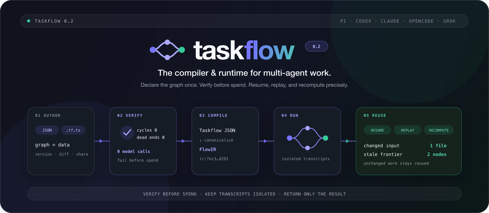
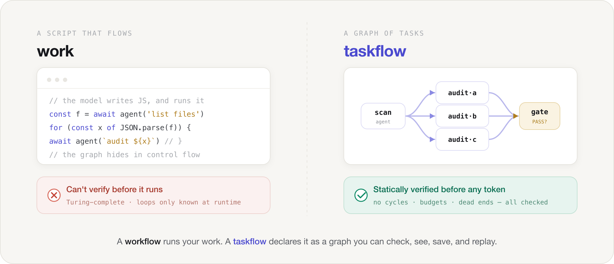
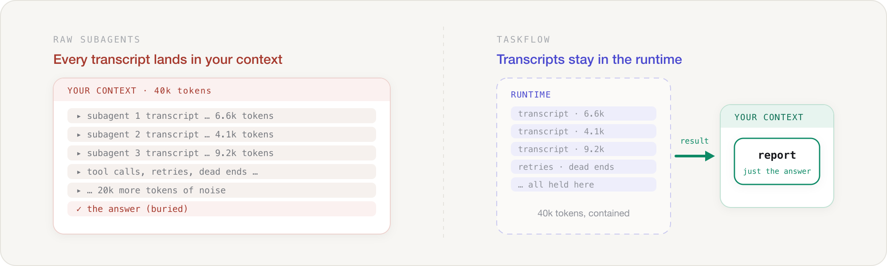
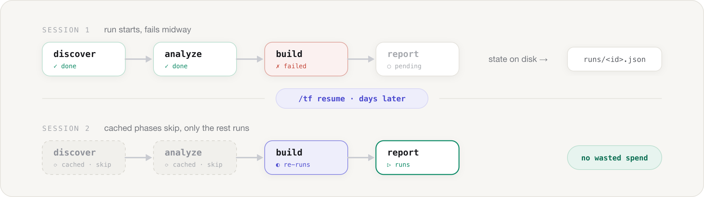

<div align="center">



<p>
  <a href="https://www.npmjs.com/package/pi-taskflow"></a>
  <a href="https://www.npmjs.com/package/pi-taskflow"></a>
  <a href="./LICENSE"></a>
  <a href="#whats-inside"></a>
  <a href="https://github.com/heggria/taskflow/actions/workflows/ci.yml"></a>
  <a href="#whats-inside"></a>
  <a href="#whats-inside"></a>
  <a href="#run-it-on-your-agent"></a>
</p>

<p align="center">
  <b>English</b> ·
  <a href="./README.zh-CN.md">简体中文</a>
</p>

<p><strong>A declarative, verifiable <em>graph of tasks</em> for coding-agent subagents.</strong><br/>
Not a workflow you script — a DAG you declare. Fan out · gate · loop · tournament · resume · save as a command — intermediate results stay out of your context.<br/>
Runs on the <a href="https://pi.dev">Pi</a> coding agent and on <a href="https://github.com/openai/codex">OpenAI Codex</a>.</p>

```bash
# Pi
pi install npm:pi-taskflow

# Codex
codex plugin marketplace add heggria/taskflow
codex plugin add taskflow@taskflow
```

</div>

---

**A `workflow` flows. A `taskflow` is a *graph*.** Other orchestrators let the model *script* the work — imperative code that flows step by step, with the graph hidden inside control flow. `taskflow` does the opposite: you **declare** the work as a graph of discrete, named **task** nodes connected by `dependsOn` edges — and the runtime *verifies that graph before it spends a single token.*

You already know your agent's built-in subagent shorthand — `task` / `tasks` / `chain`. `taskflow` speaks the *same* shorthand — so your existing delegations instantly become **tracked, resumable, and saveable by name** (on Pi, a saved flow becomes a one-word `/tf:<name>` command; on Codex you run it by name through `taskflow_run`). When you outgrow the shorthand, the full DSL gives you a real DAG: dynamic fan-out over dozens of items, conditional routing, quality gates, human approvals, retries, loops, tournaments, and a hard spend ceiling.

And the whole time, **only the final phase reaches your conversation.** Every intermediate transcript stays in the runtime, never your context window.

## Why "taskflow" and not "workflow"?

The name is the thesis. In engineering, a **task** is a *discrete, declared unit of work* — the node of a task graph (the same `task` a build system, scheduler, or compiler wires into a DAG). **Work**, by contrast, is *fluid and unbounded* — the continuous, imperative act of doing.

That distinction is exactly the design split playing out across coding-agent ecosystems:

<div align="center">

</div>

- A **`workflow`** (the dynamic, code-mode kind) is the model writing an **imperative script** that *flows*: `await agent(...)`, an `if`, a `for`, another `await`. Expressive — it's Turing-complete — but the graph only exists *as the code runs*. You can't see it, diff it, or prove it terminates before you pay for it.
- A **`taskflow`** moves the plan **out of code and into a declarative graph of `task` nodes.** Because the graph is *data*, the runtime can do what an imperative script structurally cannot: **statically verify it** (no cycles, no dead ends, no budget overflow, no dangling refs) before a single subagent spawns, **render it** (the live progress *is* the DAG), **resume it** phase-by-phase, and **save it** as a one-word command.

> **The trade we make on purpose:** we give up the raw expressivity of arbitrary code to gain something an imperative script can't have — a graph that is **verifiable, observable, replayable, and safe to generate with an LLM.** When a job needs twelve steps with branching fan-out and a review gate, you want a graph you can *check* — not a script you *hope* runs right.

## Why this exists

Here's the wall you hit with raw subagents: you describe a multi-step plan in prose, the model re-derives it every single run, the intermediate transcripts flood your context, and the moment one model call fails you start over from zero. There's no reuse, no recovery, no structure — and no way to *check* the plan before it burns tokens.

`taskflow` moves the plan **out of the prompt and into a declarative graph of task nodes.** The runtime owns the DAG, the loops, the retries, and the intermediate state. You declare a pipeline once and run it a hundred times — by name. Because the plan is data, not prose and not code, it can be **validated, visualized, and replayed.**

<div align="center">

</div>

> Twelve steps, branching fan-out, a review gate, a spend cap — that's a graph, and you want to *see and check* it, not re-prompt it every run.

| | subagent (built-in) | **taskflow** |
|---|---|---|
| **Who drives** | the model, turn by turn | the runtime, from a definition |
| **Topology** | chain / flat parallel | **DAG with layered concurrency + routing** |
| **Intermediate results** | in your context window | **in the runtime — not your context** |
| **Scale** | a handful of tasks | **dynamic `map` fan-out over dozens of items** |
| **Reusable** | re-described every time | **saved by name (`/tf:<name>` on Pi; `taskflow_run` by name on Codex)** |
| **Resumable** | ✗ | **✓ cross-session — cached phases auto-skip** |
| **Quality gates** | ✗ | **`gate` phases that halt on `VERDICT: BLOCK`** |
| **Conditional routing** | ✗ | **`when` guards + `join: any` OR-joins** |
| **Fault tolerance** | ✗ | **per-phase `retry` + auto-retry on transient errors** |
| **Human-in-the-loop** | ✗ | **`approval` phases (approve / reject / edit)** |
| **Cost control** | ✗ | **run-wide `budget` (USD / token caps)** |
| **Composition** | ✗ | **`flow` phases run saved *or runtime-generated* sub-flows** |
| **Iterative loops** | ✗ | **`loop` phases — repeat until condition, convergence, or cap** |
| **Competitive selection** | ✗ | **`tournament` phases — N variants + judge** |
| **Live progress** | opaque while running | **live DAG render with timing + cost (Pi `/tf`); one streaming tool call on Codex** |
| **Ergonomics** | inline JSON each time | **shorthand (`task`/`tasks`/`chain`) *or* DSL** |

It doesn't replace the subagent tool. It gives your subagents a **graph**, a memory, and a name.

## Declarative graph vs. imperative script

The closest thing to `taskflow` in spirit is the **dynamic / code-mode workflow** — where the model writes a JavaScript orchestration script. It's powerful and genuinely expressive. But it sits at the *opposite* end of one fundamental axis: **expressivity vs. verifiability.**

| | dynamic `workflow` (code-mode) | **`taskflow`** (declarative graph) |
|---|---|---|
| **The plan is** | imperative JS the model writes & runs | **declarative JSON data the runtime executes** |
| **The graph** | implicit — hidden in `if`/`for`/`await` control flow | **explicit — `phases[]` + `dependsOn` edges, a first-class object** |
| **Verify before running** | ✗ Turing-complete; can't prove it terminates | **✓ static checks: no cycles, dead-ends, budget overflow, dangling refs** |
| **See it** | ✗ the graph only exists as the code runs | **✓ the live progress render *is* the DAG** |
| **Resume** | coarse (call-cache dedup) | **✓ phase-by-phase input-hash resume, cross-session** |
| **Safe to LLM-generate** | risky — it's executable code | **✓ it's just data — no JavaScript `eval`; and a runtime-generated sub-flow is *structurally validated* (cycles / dangling refs / duplicate ids) before it runs** |
| **Expressivity ceiling** | **higher** — arbitrary control flow | bounded by the DSL, but `map`/`when`/`loop`/`gate`/`tournament` — plus **runtime-generated sub-flows (`flow {def}`)** for plan-then-execute and iterative replanning — cover most jobs |

We chose the **verifiable** side on purpose. The expressivity you give up is real; what you get back — a plan you can check, watch, replay, and safely let a model author — is what turns one-off prompting into durable orchestration.

## Compared to other Pi extensions

> This section is **Pi-specific** — it maps `pi-taskflow` against other packages in the Pi ecosystem. If you're on Codex, skip to [Phase types](#phase-types); the engine and DSL are identical.

The Pi ecosystem now has **20+ delegation, workflow, and orchestration extensions** — each great at what it's for. Here's an honest map of where `pi-taskflow` sits (verified against each package's latest npm release, June 2026). For the full breakdown — every package, strengths *and* weaknesses — see [`docs/internal/PI-ECOSYSTEM.md`](./docs/internal/PI-ECOSYSTEM.md). For the broader, non-Pi landscape (LangGraph, Temporal, CrewAI, Mastra…) see [`docs/internal/COMPETITORS.md`](./docs/internal/COMPETITORS.md).

| Extension | Model | Custom DSL | DAG | Dynamic fan-out | Cross-session resume | Quality gate | Human approval | Save as command | Zero deps |
|---|---|:---:|:---:|:---:|:---:|:---:|:---:|:---:|:---:|
| **taskflow** | **declarative multi-phase taskflows** | **✓** | **✓** | **✓ `map`** | **✓ phase-hash** | **✓** | **✓** | **✓ `/tf:<name>`** | **✓** |
| [`@pi-agents/orchid`](https://www.npmjs.com/package/@pi-agents/orchid) | opinionated 9-phase pipeline + Ralph loop | fixed | ✓ | ✓ | ✓ | ✓ | ✓ | ✓ | ✕ (2) |
| [`pi-crew`](https://www.npmjs.com/package/pi-crew) | role teams + git worktrees + async | partial | ✓ | ✓ | ✓ | ✓ | ✓ | – | ✕ (7) |
| [`ultimate-pi`](https://www.npmjs.com/package/ultimate-pi) | governed plan→execute→review harness | YAML contracts | ✓ (plan-time) | ✕ | ✓ | ✓ (3-tier) | ✓ | ✓ | ✕ (16) |
| [`@zhushanwen/pi-workflow`](https://www.npmjs.com/package/@zhushanwen/pi-workflow) | JS scripts (`agent`/`parallel`/`pipeline`) | yes (JS) | ✕ (linear) | ✓ | ✓ | ✕ | ✕ | ✓ (call cache) | ✓ |
| [`@fiale-plus/pi-rogue-orchestration`](https://www.npmjs.com/package/@fiale-plus/pi-rogue-orchestration) | timer loop + goal resolution | ✕ | ✕ | ✕ | ✓ | ✓ (goal-check) | ✕ | ✕ | ✓ |
| [`pi-subagents`](https://www.npmjs.com/package/pi-subagents) | single / parallel / chain delegation | ✕ | ✕ | static | – | ✕ | clarify | named workflows | ✕ (3) |
| [`@gotgenes/pi-subagents`](https://www.npmjs.com/package/@gotgenes/pi-subagents) | Claude-Code-style subagents + worktrees | ✕ | ✕ | ✕ | ✓ (by id) | ✕ | per-agent | ✕ | ✕ (1) |
| [`pi-pipeline`](https://www.npmjs.com/package/pi-pipeline) | fixed SPEC→PLAN→TASKS→VERIFY | ✕ | fixed | ✕ | session planning | ✓ | clarify | ✕ | ✕ (2) |
| [`pi-agent-flow`](https://www.npmjs.com/package/pi-agent-flow) | one-shot parallel specialist `fork` | yes | ✕ | ✕ | – | ✕ | ✕ | – | ✕ (2) |

*(Representative slice of the 20+ — see [`docs/internal/PI-ECOSYSTEM.md`](./docs/internal/PI-ECOSYSTEM.md) for all of them, plus `@0xkobold/pi-orchestration`, `@melihmucuk/pi-crew`, `@mediadatafusion/pi-workflow-suite`, `gentle-pi`, `@dreki-gg/pi-subagent`, and more.)*

**How to choose:**

- **`@pi-agents/orchid`** is the most feature-complete orchestrator in the ecosystem (DAG + worktrees + Ralph loop + agent mailbox) — but its DSL is a *fixed* 9-phase pipeline, it carries runtime deps + jiti, and it's beta. Reach for `taskflow` when you want to **define your own graph** (not adopt an opinionated one) with **zero dependencies** and a one-command install.
- **`pi-crew` / `ultimate-pi`** go heavier — worktree isolation, durable async teams, multi-tier governance. If you want lightweight, declarative, and zero-dependency, that's this project.
- **`@zhushanwen/pi-workflow`** is the closest in spirit and also zero-dep, but it's the **imperative** side of the split above: you author workflows as **JavaScript scripts** the model writes and runs. `taskflow`'s **declarative JSON DAG** is the verifiable side — statically checkable, visualizable, safe to LLM-generate, and resumable at phase granularity rather than call-cache dedup.
- **`@fiale-plus/pi-rogue-orchestration`** has a real **loop-until-done** (goal-driven iteration). `taskflow` now ships its own `loop` phase (v0.0.13+) plus `tournament` for competitive selection — and unlike rogue-orchestration, `taskflow` has a full DAG with gates, compositional sub-flows, and cross-session resume. For raw "keep going until the goal is met" with minimal structure, rogue-orchestration is still lighter; for structured, branching pipelines, `taskflow` covers the same ground and more.
- **`pi-subagents` / `@gotgenes/pi-subagents`** are the mature picks for ad-hoc "use reviewer on this diff" delegation and background jobs. `taskflow` is for when those delegations need to become a *repeatable, resumable pipeline*.
- **`pi-pipeline` / `pi-agent-flow`** ship *opinionated, fixed* flows. `taskflow` ships an *empty canvas*: you (or the model) declare the graph that fits the job.

> The honest one-liner: **`pi-taskflow` is the only Pi extension that gives you a *declarative, verifiable, resumable* DAG of task nodes — saved as a one-word `/tf:<name>` command, with zero runtime dependencies and context isolation by design** (and the same engine runs on Codex via the `taskflow_*` MCP tools). Where code-mode workflows let the model *script* the work, `taskflow` lets it *declare a graph the runtime can prove correct before running.* Recently shipped from the roadmap: the Shared Context Tree (blackboard + supervision) and worktree isolation (see [`docs/internal/STRATEGY.md`](./docs/internal/STRATEGY.md)).

## 30-second start

### On Pi

**1. Install** — one command:

```bash
pi install npm:pi-taskflow
```

> **Optional:** run `/tf init` once to map the 18 built-in agents' model roles
> (`fast`, `strong`, `thinker`, …) to your own models — an interactive picker.
> Skip it and agents just use Pi's default model. See [Model roles](#model-roles).

**2. Run** — just ask the model in a Pi session:

> *Run a chain: first explore the auth flow, then summarize the findings.*

The model calls the `taskflow` tool automatically. You get live progress, per-step timing, token cost, and a saved run record — **same effort as the built-in tool, now tracked and resumable.**

**3. Save** — say *"save it"* and you have `/tf:<name>` forever.

That's it. You can be running your first workflow before your coffee cools — without writing a single phase definition.

<a id="run-it-on-your-agent"></a>
### On Codex

taskflow ships as a Codex **plugin** — install it once and the `taskflow_*` MCP tools plus a routing skill light up automatically, no manual `mcp add` and no config editing:

```bash
codex plugin marketplace add heggria/taskflow
codex plugin add taskflow@taskflow
```

The plugin's MCP server runs via `npx` (a version-pinned `codex-taskflow`), so there's nothing else to install globally and the plugin version binds the exact code that runs. Then just ask Codex to run a multi-phase or fan-out job and it calls the tools. See the [Codex guide](./docs/codex-mcp.md).

### The shorthand (same shape as the built-in tool)

```jsonc
// Single — one agent, one job
{ "task": "Summarize the architecture of src/", "agent": "explorer" }

// Parallel — fire several at once, outputs merge
{ "tasks": [
  { "task": "Audit auth in src/api",             "agent": "analyst" },
  { "task": "Audit input validation in src/api", "agent": "analyst" }
] }

// Chain — sequential; each step sees the previous output
{ "chain": [
  { "task": "List the public API of src/lib", "agent": "scout" },
  { "task": "Write docs for:\n{previous.output}", "agent": "writer" }
] }
```

`agent` is optional (defaults to the first discovered agent). Add a `name` to label the run and unlock saving it as a command.

Shorthand modes also support per-step **context pre-reading** — pass `context` (file paths) and optionally `contextLimit` (max chars per file, default 8000) at the step level:

```jsonc
// Chain with context files injected into each step
{ "chain": [
  { "task": "List the public API", "agent": "scout", "context": ["src/lib/**/*.ts"] },
  { "task": "Write docs for:\n{previous.output}", "agent": "writer" }
] }
```

## Watch it run

This is not a mockup. **This is stdout from a real run** (the Pi TUI) — the `self-improve` flow that writes and verifies its own test suites, caught mid-flight by a quality gate:

```
⊗ taskflow self-improve  6/7 · blocked · $0.095
    ✓ discover            agent   deepseek-v4-flash  10t ↑38k ↓6.7k $0.011
  ┌ ✓ write-runner-tests  agent   claude-sonnet-4-6  10t ↑13 ↓6.6k $0.020
  ├ ✓ write-store-tests   agent   claude-sonnet-4-6  10t ↑11 ↓10k $0.018
  ├ ✓ write-agents-tests  agent   claude-sonnet-4-6  10t ↑28 ↓13k $0.030
  └ ✓ fix-stability       agent   claude-sonnet-4-6  10t ↑13 ↓3.9k $0.012
    ✓ verify              gate    BLOCK 3 type errors in test files  deepseek-v4-flash
    ⊘ report              reduce  skipped · Gate blocked  ↳ fix-stability
```

**The layout *is* the DAG.** No dashboard, no logs to grep — you read the progress bar and you understand the whole pipeline:

- **Header** — `⊗` = blocked (a gate halted it); `6/7` phases processed; aggregate cost `$0.095`.
- **Status icons** — `✓` done · `◐` running · `✗` failed · `⊘` skipped · `○` pending.
- **Rail `┌ ├ └`** — phases in the same DAG layer, running concurrently. The four `write-*`/`fix-stability` tasks fan out from `discover`. A blank gutter = a single-phase layer.
- **`↳`** — a long, layer-skipping dependency. `report` depends on the adjacent `verify` *and* on `fix-stability` two layers back, so only that skip edge is annotated.
- **Gate** — `verify` emitted `VERDICT: BLOCK`, so the runtime skipped `report` and ended the run as `blocked`, surfacing the reason inline.
- **Detail** — per phase: model, token counts (`↑`in `↓`out), cost, timing. Fan-out phases also show sub-task progress (`3/15 2✗ 8▸`).

## Go declarative

The shorthand is your onramp. The DSL is where `taskflow` earns its keep — dynamic fan-out, structured routing, and quality gates.

### Fan out and reduce

```jsonc
{
  "name": "summarize-files",
  "description": "Discover files, summarize each, produce one report",
  "args": { "dir": { "default": "." } },
  "concurrency": 8,
  "phases": [
    { "id": "discover", "type": "agent", "agent": "scout",
      "task": "List source files under {args.dir} (non-recursive).\nOutput ONLY a JSON array [{\"file\":\"\"}]. No prose.",
      "output": "json" },
    { "id": "summarize", "type": "map",
      "over": "{steps.discover.json}", "as": "item", "agent": "scout",
      "task": "Read {item.file} and give a one-sentence summary.",
      "dependsOn": ["discover"] },
    { "id": "report", "type": "reduce", "from": ["summarize"], "agent": "writer",
      "task": "Combine into a short overview:\n{steps.summarize.output}",
      "dependsOn": ["summarize"], "final": true }
  ]
}
```

1. **`discover`** lists every file and emits a JSON array.
2. **`summarize`** is a `map` — it fans out one subagent per file, throttled to 8 concurrent, with `{item.file}` bound to each path.
3. **`report`** is a `reduce` — it merges every summary into one clean overview.

The intermediate summaries never enter your context. The runtime owns them; you get the report. **Save it once → `/tf:summarize-files dir=src` forever.**

### Route, gate, retry, approve, and cap the spend

```jsonc
{
  "name": "triage-and-fix",
  "budget": { "maxUSD": 1.5 },
  "phases": [
    { "id": "triage", "type": "agent", "agent": "analyst", "output": "json",
      "task": "Classify the bug. Output ONLY {\"severity\":\"high\"} or {\"severity\":\"low\"}." },
    { "id": "deep",  "when": "{steps.triage.json.severity} == high", "dependsOn": ["triage"],
      "agent": "executor-code", "task": "Root-cause and patch it.",
      "retry": { "max": 2, "backoffMs": 500 } },
    { "id": "quick", "when": "{steps.triage.json.severity} == low",  "dependsOn": ["triage"],
      "agent": "executor-fast", "task": "Apply the quick fix." },
    { "id": "approve", "type": "approval", "join": "any", "dependsOn": ["deep", "quick"],
      "task": "Review the fix before it ships." },
    { "id": "ship", "type": "agent", "dependsOn": ["approve"],
      "task": "Open a PR with the change.", "final": true }
  ]
}
```

- **`when`** routes to `deep` *or* `quick` from the triage JSON — the other branch is skipped.
- **`join: "any"`** lets `approve` fire the moment whichever branch ran completes (an OR-join).
- **`retry`** re-runs a flaky patch with backoff; **`budget`** halts the whole run if it gets too expensive.
- **`approval`** pauses for a human (approve / reject / edit) before the final `ship`.

No scripting. No JavaScript `eval`. Just data the runtime executes — safe enough to run LLM-generated definitions directly.

### Loop until done

Some work is inherently iterative — refine a draft until a reviewer is satisfied, retry-and-improve until tests pass, converge on an answer:

```jsonc
{
  "id": "refine",
  "type": "loop",
  "task": "Improve this draft (iteration {loop.iteration}). Previous attempt:\n{loop.lastOutput}\n\nReturn JSON {\"draft\":\"…\",\"done\":true|false}.",
  "until": "{steps.refine.json.done} == true",
  "output": "json",
  "maxIterations": 6,
  "convergence": true
}
```

See [Loop phases](#loop-until-done-loop) for the full reference.

### Plan, then execute (runtime sub-flows)

A planner decides *at runtime* what work to spawn — each iteration's plan depends on the previous result:

```jsonc
{
  "name": "iterative-replan",
  "phases": [
    { "id": "plan", "type": "agent", "agent": "planner",
      "task": "Given the current state, output a JSON taskflow definition (with phases[]).",
      "output": "json" },
    { "id": "execute", "type": "flow", "def": "{steps.plan.json}",
      "dependsOn": ["plan"] }
  ]
}
```

The generated sub-flow is **validated** (no cycles, no dangling refs, no duplicate IDs) before a single token is spent. See [`examples/dynamic-plan-execute.json`](./examples/dynamic-plan-execute.json) and [`examples/iterative-replan.json`](./examples/iterative-replan.json).

### Tournament (compete and judge)

For open-ended creative or subjective work, spawn several competing variants and let a judge pick the best:

```jsonc
{
  "id": "headline",
  "type": "tournament",
  "task": "Write a punchy headline for this launch post.",
  "variants": 4,
  "judge": "Pick the headline with the strongest hook and clearest promise.",
  "mode": "best"
}
```

See [Tournament phases](#tournament-tournament) for the full reference.

## Phase types

| type | what it does | required fields |
|------|--------------|-----------------|
| `agent` | one subagent runs a single task | `task` |
| `parallel` | run `branches[]` concurrently | `branches` (array of `{task, agent?}`) |
| `map` | **fan out** over an array — one subagent per item, `{item}` bound | `over`, `task` |
| `gate` | quality/review step that can **halt the flow** | `task` |
| `reduce` | aggregate `from[]` phase outputs into one | `from`, `task` |
| `approval` | **human-in-the-loop** pause — approve / reject / edit | — |
| `flow` | run a **sub-flow** as one phase — a **saved** flow (`use`) or a **runtime-generated** one (`def`) | `use` \| `def` |
| `loop` | **iterate a task until done** — re-run a body until a condition, convergence, or a cap | `task`, `until` |
| `tournament` | **N variants compete**, a judge picks the best (or aggregates) | `task` \| `branches` |
| `script` | run a **shell command** — no LLM, zero tokens — capturing stdout as the phase output | `run` |

### Common phase fields

Every phase needs a unique `id` and a `type` (defaults to `agent`). On top of the per-type fields:

| Field | Meaning |
|---|---|
| `agent` | Agent to run (defaults to the first discovered agent) |
| `dependsOn` | Phase ids this phase waits for — builds the DAG |
| `join` | `"all"` (default) waits for every dep; `"any"` is an OR-join |
| `when` | Conditional guard — skip unless the expression is truthy |
| `retry` | `{ max, backoffMs?, factor? }` — retry a failing subagent |
| `output` | `"text"` (default) or `"json"` (exposes `{steps.ID.json}`) |
| `model` / `thinking` / `tools` | Per-phase overrides for the subagent |
| `cwd` | Working directory for the subagent. A literal path, or a reserved keyword for **workspace isolation** — `"temp"` (ephemeral dir, removed after), `"dedicated"` (persistent dir under the run state, kept), `"worktree"` (a git worktree on a throwaway branch, removed after). Fail-open; rejected in LLM-authored sub-flows. |
| `context` | File paths to pre-read and inject into the agent prompt |
| `contextLimit` | Max chars per context file (default 8000) |
| `concurrency` | Fan-out cap for `map` / `parallel` (overrides the flow default) |
| `final` | Marks the result-bearing phase (else the last phase wins) |
| `optional` | A failure here does **not** abort the run |
| `shareContext` | Opt this phase's subagent into the **Shared Context Tree** (see below). Set `contextSharing: true` at the flow level to enable it for every phase |
| `cache` | `{ scope, ttl?, fingerprint? }` — cross-run memoization (see below) |
| `onBlock` | `"halt"` (default) or `"retry"` — what happens when a gate blocks |
| `eval` | Zero-token machine-checkable criteria that run *before* the LLM gate |

Flow-level keys: `name`, `description`, `args`, `concurrency` (default 8), `agentScope`, `contextSharing`, `strictInterpolation`, and `budget: { maxUSD?, maxTokens? }`.

### Shared Context Tree (blackboard + supervision)

By default subagents are fully isolated — they share nothing and only return a
final string. Opt a phase in with `shareContext: true` (or `contextSharing: true`
flow-wide) to give its subagent four extra tools backed by a per-run, file-based
blackboard:

| tool | direction | use |
|------|-----------|-----|
| `ctx_write(key, value)` | horizontal | publish a finding so siblings/descendants reuse it (stop re-reading the same files) |
| `ctx_read(key?)` | horizontal | read findings visible to this node: its own + ancestors' + **completed** others' |
| `ctx_report(summary, structured?)` | vertical ↑ | report a result up to the parent |
| `ctx_spawn(assignments[])` | vertical ↓ | delegate child work at runtime; each assignment is a flat `{task}` **or** a `{subflow}` (a dependency-bearing DAG the runtime validates and runs nested). Child reports fold back into this phase's output |

The first two are a **horizontal blackboard** (siblings reuse expensive context);
the last two are a **vertical supervision tree** (a node delegates work and its
children report up). Everything is opt-in, fail-open, depth-capped (5 levels), size-bounded
(256KB per value, 256 keys per node, 16 spawn assignments max), and cleaned up
with the run — flows that don't opt in behave exactly as before.

```jsonc
{ "id": "survey", "type": "agent", "agent": "scout", "shareContext": true,
  "task": "Map the API surface. ctx_write key 'endpoints' so the auditors don't re-scan." },
{ "id": "audit", "type": "map", "over": "{steps.survey.json}", "shareContext": true,
  "dependsOn": ["survey"], "agent": "analyst",
  "task": "ctx_read 'endpoints' for shared context, then audit {item} for missing auth." }
```

### Control flow & reliability

- **`when`** — skip a phase unless an expression is truthy. Supports `{refs}`, `== != < > <= >=`, `&& || !`, parentheses, and quoted strings/numbers. Pair with `join: "any"` on the merge phase for real if/else routing. Parse errors **fail open** (the phase runs — never silently dropped).
- **`join: "any"`** — an OR-join: the phase runs as soon as *one* dependency completes (default `"all"` waits for all).
- **`retry`** — `{ "max": 2, "backoffMs": 500, "factor": 2 }` retries a failing subagent with fixed or exponential backoff; usage is summed and the attempt count shows as `↻N` in the TUI. Transient provider errors (rate-limit / 5xx / timeout) **auto-retry even without an explicit policy**; hard errors don't.
- **`onBlock`** — `"halt"` (default) stops the run when a gate blocks. `"retry"` retries upstream phases when a gate blocks, instead of halting — a self-healing rework loop with budget and idle-watchdog guards and a nested recursion depth cap.
- **`eval`** — zero-token machine-checkable criteria that run *before* the LLM gate. If the eval check fails, the gate blocks without spawning an agent.
- **`score`** — graded, composable quality gates: deterministic scorers (`exact-match`, `contains`, `regex`, `json-schema`, `length-range`, `code-compiles`) run against a target string at **zero tokens** and combine via `all`/`any`/`weighted` against a `threshold`. Deterministic pass → auto-PASS with no LLM call **when the judge cannot veto** — no judge configured, or `weighted` where the deterministic score is a *lower bound* already clearing the threshold. With `all`/`any` + a judge, the judge always runs (its verdict is authoritative — it may check what scorers cannot, e.g. factuality). Deterministic fail → the optional LLM `judge` decides (fail-open on unparseable output), or the gate `task` runs with the scorer report appended, or — with no fallback — the gate **blocks explicitly**. The structured result is the gate's `.json` (`{steps.<gate>.json.combined}`, `.json.results`), so downstream phases can route on quality, not just pass/fail. LLM-generated dynamic sub-flows may not use `code-compiles` (compiler execution) or `regex` (ReDoS) scorers — same hardening class as the `script` block.
- **`idempotent: false`** — side-effect classification for phases with **irreversible effects** (webhook POSTs, deploys, DB writes): the implicit transient auto-retry is suppressed (an explicit `retry{}` is still honored — it's the author's declaration that repeats are acceptable) and the result is **never cached** in any scope (within-run resume, cross-run, `incremental`) — the phase re-runs every time. The phase state records `sideEffect: true` (rendered as ⚡). Default `true` — existing flows are unchanged.
- **`approval`** — pause for a human (Approve / Reject / Edit). Reject halts the flow; Edit injects the typed note as the phase output for downstream steps. Non-interactive runs (detached / CI) **auto-reject** (safety: approval gates are never bypassed).
- **`flow`** — `{ "type": "flow", "use": "deep-research", "with": { "topic": "{item}" } }` runs a **saved** flow as a phase (recursion is detected and rejected). Or **generate the sub-flow at runtime**: `{ "type": "flow", "def": "{steps.plan.json}" }` resolves an upstream phase's JSON output into a sub-flow, **validates it (cycles / dangling refs / duplicate ids / dead-ends), then runs it** — the number and shape of the generated phases is decided at runtime, not authored in advance. A malformed plan fails *open* (the phase is skipped with a `defError`, the run continues). This is how a planner decides *at runtime* what work to spawn — the declarative answer to a code-mode `for` loop, with each generated plan checked before it spends a token. Security hardening for LLM-generated sub-flows: breadth caps (100 phases, 200 map items, 16 concurrency), `cwd` containment, budget clamped to `min(child, parent)`, nesting cap (5 levels), and prototype-pollution defense (deep-cloned, `__proto__`/`constructor`/`prototype` stripped). Pair it with `loop` for **data-dependent iterative replanning** (round N's plan depends on round N-1's result). See [`examples/dynamic-plan-execute.json`](./examples/dynamic-plan-execute.json) and [`examples/iterative-replan.json`](./examples/iterative-replan.json).

### Loop-until-done (`loop`)

Some work is inherently iterative — refine a draft until a reviewer is satisfied, retry-and-improve until tests pass, converge on an answer. A `loop` phase re-runs one task body until a stop condition holds:

```jsonc
{
  "id": "refine",
  "type": "loop",
  "task": "Improve this draft (iteration {loop.iteration}). Previous attempt:\n{loop.lastOutput}\n\nReturn JSON {\"draft\":\"…\",\"done\":true|false}.",
  "until": "{steps.refine.json.done} == true",   // the iteration's own output is exposed here
  "output": "json",
  "maxIterations": 6,        // default 10, hard cap 100 — the loop ALWAYS terminates
  "convergence": true        // default: stop early if an iteration's output is identical to the last
}
```

- **Body locals** — the task can read `{loop.iteration}` (1-based), `{loop.lastOutput}` (the prior iteration's output), and `{loop.maxIterations}` to build on its own previous work; all three are also available to the `until` condition.
- **`until`** — evaluated after each iteration with the iteration's output exposed as `{steps.<thisId>.output}` / `.json`. Same operators as `when`. The loop stops the moment it's truthy.
- **Always terminates.** Four independent stops: `until` truthy, **convergence** (a fixed point — output identical to the previous iteration), **`maxIterations`** (hard-capped at 100), or a **failing iteration** (the phase fails with the partial output preserved). A malformed `until` **stops** the loop rather than spinning forever (fail-safe) and surfaces a warning on the phase.
- **Reflexion memory (`reflexion: true`)** — by default each iteration only sees the prior *output*; the **reason** it wasn't good enough (an `expect` contract violation, an error, the unmet `until`) is discarded, so models repeat mistakes. With `reflexion: true` every iteration after the first receives a structured failure summary of the prior one via the `{reflexion}` placeholder (auto-appended when absent, capped at 2000 chars): contract diagnostics like `$.done: required key is missing`, the error message, or the unmet stop condition, plus a truncated output snippet. Semantics shift to enable self-correction: **body failures become feedback instead of terminating the loop** — timeout/abort still hard-stop, and exhausting `maxIterations` on a failure still fails the phase (reflexion defers failure, never erases it). The last injected summary is persisted on the phase state for audit.
- The TUI shows `↻N` with the stop reason (`done` / `converged` / `max` / `failed`); usage is summed across iterations. Like `gate`/`approval`, `loop` is **excluded from `cross-run` cache** (each run must iterate fresh).

### Tournament (`tournament`)

For open-ended work, the best result often comes from generating several candidates and picking the strongest — best-of-N with a judge, in one declarative phase:

```jsonc
{
  "id": "headline",
  "type": "tournament",
  "task": "Write a punchy headline for this launch post.",
  "variants": 4,                    // spawn 4 competitors of the SAME task (default 3, max 20)
  "judge": "Pick the headline with the strongest hook and clearest promise.",
  "judgeAgent": "reviewer",          // optional; defaults to the phase agent
  "mode": "best"                     // "best" (default) | "aggregate"
}
```

- **Competitors** — either `variants: N` copies of one `task` (diversity comes from model nondeterminism), or distinct `branches: [{task, agent?}, …]` when you want to pit *different approaches* against each other.
- **Judge** — after the fan-out, one judge agent sees every variant (numbered) plus your `judge` rubric and picks a winner via a `WINNER: <n>` line or `{"winner": n}`. An unreadable verdict **fails open** to variant 1; a failed judge falls back too — the work is never lost.
- **`mode`** — `best` returns the winning variant **verbatim**; `aggregate` returns the judge's **synthesized** answer combining the strongest parts.
- **Short-circuits:** if only one competitor survives, it wins with no judge call; if all fail, the phase fails. The TUI shows `⚑ N→#k`; usage sums variants + judge. Like `gate`, it's **excluded from `cross-run` cache**.

### Shell steps (`script`)

Not every step needs a model. A `script` phase runs a **shell command** directly — zero tokens, no subagent — and captures its stdout as the phase output. Use it to glue LLM work to real tools: run a build or test suite, a formatter, `git`, `curl` a webhook, or pipe a previous phase's output through a script.

```jsonc
{
  "id": "build",
  "type": "script",
  "run": "npm run build",              // string → runs in a shell
  "timeout": 120000                     // optional ms cap (1000–300000, default 60000)
},
{
  "id": "score",
  "type": "script",
  "run": ["python", "score.py"],        // array → direct exec, no shell (injection-safe)
  "input": "{steps.analyze.output}",    // optional — piped to stdin (interpolation-enabled)
  "dependsOn": ["analyze"]
}
```

- **`run`** — the command. A **string** runs through a shell (`sh -c` / `cmd`); an **array** is spawned directly (execvp-style, no shell). Prefer the array form for anything containing interpolated values: a string `run` that contains an interpolation placeholder is **rejected at validation** (a shell-injection guard) — pass dynamic values via the array form or `input` instead.
- **`input`** — optional text piped to the command's stdin; supports interpolation (`{steps.X.output}`, `{args.X}`). If omitted, stdin is closed.
- **`timeout`** — optional millisecond cap (1000–300000, default 60000). On timeout the child gets `SIGTERM`, then `SIGKILL` after a grace period, and the phase fails.
- A non-zero exit **fails** the phase (stderr is captured); stdout is capped at 1 MB. `script` phases spend **zero tokens**, do not support `retry` or `output: "json"`, and are **excluded from `cross-run` cache** (a shell step may have side effects). The `compile` diagram renders them as `⚡ script`.

### Cross-run memoization (`cache`)

Every phase is already content-addressed: within a single run's **resume**, a phase whose resolved inputs are unchanged is skipped. `cache` extends that reuse **across independent runs** — if any prior run computed a phase with an identical input hash, its result is reused for **$0.00**.

```jsonc
{
  "id": "analyze-auth",
  "task": "Summarize how the auth module works.",
  "context": ["src/auth/**/*.ts"],
  "cache": {
    "scope": "cross-run",                 // "run-only" (default) | "cross-run" | "off"
    "ttl": "6h",                          // optional max age before a hit is treated as a miss
    "fingerprint": ["git:HEAD", "glob:src/auth/**/*.ts"]  // fold world-state into the key
  }
}
```

- **`scope`** — `"run-only"` (default) is exactly the historical behavior (within-run resume only). `"cross-run"` opts the phase into the persistent store. `"off"` disables reuse entirely (even within a run), for debugging.
- **Freshness is the whole game.** The cache key already includes the prompt, the `over` items, and any `context` files (pre-read into the task). `fingerprint` folds *implicit* inputs into the key so "the world changed" becomes a cache miss: `git:HEAD`, `glob:<pat>` (size+mtime), `glob!:<pat>` (content hash), `file:<path>`, `env:<NAME>`. `ttl` (`30m`/`6h`/`7d`) is a time backstop.
- **Honest limit:** a subagent that reads a file it didn't declare in `context`/`fingerprint` can still serve a stale `cross-run` hit. That's why the default is `run-only` and why `gate`/`approval` phases are **forbidden** from `cross-run` (they must produce a fresh result each run). Opt in only for phases whose output is a function of declared inputs.
- Cache lives in `.pi/taskflows/cache/` (gitignored). Clear it with `action: "cache-clear"` on the tool. Full rationale: [`docs/internal/rfc-cross-run-memoization.md`](./docs/internal/rfc-cross-run-memoization.md).

### Gate phases (quality control)

A `gate` runs an agent to review upstream output and can **block the rest of the workflow.** End the gate task by asking for a verdict the runtime can read:

- a final line `VERDICT: PASS` or `VERDICT: BLOCK` (also accepts `OK`, `FAIL`, `STOP`, `REJECT`, `HALT` — last occurrence wins), or
- JSON like `{"continue": false, "reason": "missing auth checks"}` / `{"verdict": "block", "reason": "..."}`.

On **BLOCK**, downstream phases skip and the run ends as `blocked` with the reason surfaced. **Ambiguous output fails open** (treated as PASS) — a gate never halts your flow by accident.

```
Review the audit below. If any endpoint is missing auth, end with
"VERDICT: BLOCK" and a one-line reason; otherwise end with "VERDICT: PASS".

{steps.audit.output}
```

## Interpolation & expressions

| placeholder | resolves to |
|---|---|
| `{args.X}` | invocation argument |
| `{steps.ID.output}` | a prior phase's text output |
| `{steps.ID.json}` | prior output parsed as JSON (or `{steps.ID.json.field}`) |
| `{item}` / `{item.field}` | current item inside a `map` phase |
| `{previous.output}` | the immediately-upstream phase output |
| `{loop.iteration}` | current iteration number inside a `loop` phase |
| `{loop.lastOutput}` | previous iteration's output inside a `loop` phase |
| `{loop.maxIterations}` | the iteration cap inside a `loop` phase |

Condition grammar (for `when`): `== != < > <= >=`, `&& || !`, parentheses, quoted strings/numbers, and any `{...}` reference — e.g. `"when": "{steps.triage.json.route} == deep && {args.force} != true"`.

> Referencing `{steps.X}` that isn't declared in `dependsOn` is a **hard validation error** — the runtime catches the most common pipeline bug before a single agent runs.

> Unresolved interpolation refs (e.g. `{args.typo}` or a missing `dependsOn`) are surfaced as **phase warnings** (`PhaseState.warnings`) in the run record and `/tf runs` — no more silent intact placeholders.

## Commands

Saved flows become CLI shortcuts. **These `/tf` commands are Pi-only** (they run in the Pi session). On Codex, use the `taskflow_*` MCP tools instead — `taskflow_list` / `taskflow_show` / `taskflow_run` (by `name`) / `taskflow_verify` / `taskflow_compile`.

| Command | What it does |
|---|---|
| `/tf list` | List all saved flows |
| `/tf run <name> [args]` | Run a saved flow (e.g. `/tf run summarize-files dir=src`) |
| `/tf show <name>` | Print a flow's definition |
| `/tf compile <name> [lr\|td]` | **Render the flow as a Mermaid diagram + verification overlay** — 0 tokens, no LLM; paste into a README/issue/PR |
| `/tf runs` | Browse recent run history (interactive TUI — **live auto-refreshes** while any run is active) |
| `/tf resume <runId>` | Continue a paused/failed run — cached phases skip automatically |
| `/tf init` | **Interactively map model roles** to your enabled models (writes `~/.pi/agent/settings.json`) |
| `/tf:<name> [args]` | Shortcut — runs the flow in one tap |

Tool actions (used by the model on Pi): `run` (inline `define` or saved `name`), `save`, `resume`, `list`, `agents`, `init`, `verify`, `compile`, `ir`, `provenance`, `why-stale`, `recompute`, `cache-clear`. On Codex the exposed MCP tools are `taskflow_run` / `taskflow_list` / `taskflow_show` / `taskflow_verify` / `taskflow_compile`.

## Background (detached) execution

Pass `detach: true` to run a taskflow in a detached child process — the tool returns immediately with the `runId` and the flow continues running even if the host session exits:

```jsonc
{
  "action": "run",
  "name": "nightly-audit",
  "detach": true
}
```

- The child process reads serialized context, calls the orchestration engine, and persists terminal state to the store.
- Status is polled via `/tf runs` (which now **auto-refreshes live** when any run is running) or `action: "resume"`.
- Stale PID detection via signal-0 probe; the idle watchdog kills stalled children.
- **Approval phases auto-reject** in detached mode — human gates are never silently bypassed.
- `resume` works normally after a detached run completes or fails.

## Resume across sessions

A taskflow run isn't tied to your session. Every completed phase is written to disk, so a run that fails (or that you stop) can be continued later with `/tf resume <runId>` — **cached phases skip automatically** and only the remaining work spends tokens.

<div align="center">

</div>

Resume is keyed on each phase's input hash — if an upstream output changed, dependent phases re-run; if nothing changed, they're reused. No competing Pi extension does this across sessions.

## Storage

```
.pi/taskflows/<name>.json              # project-scope definitions (commit to share)
~/.pi/agent/taskflows/<name>.json      # user-scope definitions
.pi/taskflows/runs/<flowName>/<runId>.json  # run state for resume (gitignore this)
.pi/taskflows/cache/                   # cross-run memoization cache (gitignored)
```

> Commit `.pi/taskflows/` and your whole team shares the pipelines — no config sync, no onboarding doc. Run state is written atomically via `writeFileAtomic()` (temp file + `renameSync`) and guarded by a zero-dependency file lock (`O_CREAT|O_EXCL` with stale-lock steal via atomic rename), so concurrent runs never corrupt the index.

Agent discovery scope (via `agentScope` in the flow definition):

| value | discovers agents from |
|---|---|
| `"user"` (default) | `~/.pi/agent/agents/*.md` |
| `"project"` | `.pi/agents/*.md` (walks up the tree) |
| `"both"` | user + project; project wins on name collision |

Run cleanup is configurable via `maxKeptRuns` and `maxRunAgeDays` in settings.

## Agents

Taskflow ships **18 built-in agents** — each a `.md` file with a tuned system prompt, thinking level, and tool set. You can reference them by `name` in any phase or shorthand, right after install. No setup required.

### Built-in agent roster

| Agent | Role | Thinking | Default role |
|---|---|---:|---|
| `executor` | Implement planned code changes | high | `{{fast}}` |
| `executor-fast` | Trivial fixes (≤2 files, ≤50 lines) | off | `{{fast}}` |
| `executor-code` | Complex multi-file implementation | high | `{{strong}}` |
| `executor-ui` | Frontend / styling / visual changes | high | `{{vision}}` |
| `scout` | Fast codebase recon & file mapping | off | `{{fast}}` |
| `planner` | Implementation plan creation | high | `{{strong}}` |
| `analyst` | Requirements analysis, ambiguity detection | high | `{{thinker}}` |
| `critic` | Inline self-doubt during reasoning | xhigh | `{{thinker}}` |
| `reviewer` | General code / architecture review | high | `{{strong}}` |
| `risk-reviewer` | Backend / infra / DB / API risk | high | `{{reasoner}}` |
| `security-reviewer` | Security vulns, auth/crypto | xhigh | `{{reasoner}}` |
| `plan-arbiter` | Plan quality gate (complex tasks) | high | `{{arbiter}}` |
| `final-arbiter` | Tiebreaker when critics disagree | xhigh | `{{arbiter}}` |
| `test-engineer` | Design & implement tests | high | `{{fast}}` |
| `doc-writer` | Documentation authoring | off | `{{fast}}` |
| `recover` | Session recovery after compaction | low | `{{fast}}` |
| `verifier` | Run tests, validate outcomes | off | `{{fast}}` |
| `visual-explorer` | Figma design metadata analysis | high | `{{vision}}` |

Agents are layered: **built-in → user (`~/.pi/agent/agents/`) → project (`.pi/agents/`)**. A user or project agent with the same `name` overrides the built-in — so you can customize any agent without touching the package.

### Model roles

Each built-in agent's `model` field uses a **role placeholder** (e.g. `{{fast}}`) instead of a hardcoded provider string. This decouples *intent* from *implementation* — you map roles to models once, and every agent adapts.

| Role | Intent | Typical model |
|---|---|---|
| `{{fast}}` | Cheap & quick — high-volume, low-stakes | DeepSeek V4 Flash |
| `{{strong}}` | Balanced — planning, review, moderate complexity | MiMo v2.5 Pro |
| `{{thinker}}` | Deep analysis — requirements, critique | DeepSeek V4 Pro |
| `{{arbiter}}` | Final judgment — tiebreak, plan quality gates | Qwen 3.7 Max |
| `{{vision}}` | Multimodal — UI work, design reading | MiniMax M3 |
| `{{reasoner}}` | Cautious reasoning — security, risk | GLM 5.1 |

Without configuration, agents fall back to Pi's default model. To map roles to real models, run the interactive setup:

```bash
/tf init
```

`/tf init` starts with an **action menu**. First-time users get a 2-option shortcut ("Use recommended defaults" / "Configure each role"). Returning users see the full 5-option menu:

```
? What do you want to do with model roles?
  ❯ Use recommended defaults
    Configure each role
    Edit one role
    Show current roles
    Cancel
```

The picker shows model **display names** with capability flags and current/recommended markers:

```
? Model for 'vision' — Multimodal (executor-ui, visual-explorer)
  Current: openrouter/anthropic/claude-sonnet-4-6
  Recommended: minimax/MiniMax-M3
  ───────────────
  ❯ MiniMax M3 (minimax/MiniMax-M3) · image ✓ · reasoning ✓ · (recommended)
    Claude Sonnet 4.6 (openrouter/anthropic/...) · image ✓ · reasoning ✓ · (current)
    GPT-5 (openrouter/openai/gpt-5) · image ✓
    DeepSeek V4 Flash (openrouter/deepseek/v4-flash)
    ───────────────
    Custom (type your own)
    Keep current
    Back to action menu
```

Before saving, a **preview screen** shows the diff of your changes:

```
? Review changes:
  fast       openrouter/deepseek/deepseek-v4-flash   (unchanged)
  strong     openrouter/xiaomi/mimo-v2.5-pro         (unchanged)
  thinker    openrouter/qwen/qwen3.7-max             (changed ← was: openrouter/deepseek/v4-pro)
  arbiter    openrouter/qwen/qwen3.7-max             (unchanged)
  vision     minimax/MiniMax-M3                      (unchanged)
  reasoner   z-ai/glm-5.1                            (unchanged)
  ───────────────
  ❯ Save these changes
    Edit a role
    Cancel
```

Your choices are written to `~/.pi/agent/settings.json`:

```json
{
  "modelRoles": {
    "fast":     "openrouter/deepseek/deepseek-v4-flash",
    "strong":   "openrouter/xiaomi/mimo-v2.5-pro",
    "thinker":  "openrouter/deepseek/deepseek-v4-pro",
    "arbiter":  "openrouter/qwen/qwen3.7-max",
    "vision":   "minimax/MiniMax-M3",
    "reasoner": "z-ai/glm-5.1"
  }
}
```

Edit the values manually any time, or just re-run `/tf init`.

To customize a specific agent's model or thinking without changing `modelRoles`, create an agent file at `~/.pi/agent/agents/<name>.md` with the desired overrides in the YAML frontmatter.

### Tool path (`action="init"`)

The model can also configure roles via the `taskflow` tool:

| Mode | Behavior |
|---|---|
| `mode: "show"` (default) | Read-only report of current `modelRoles`. Never overwrites. |
| `mode: "apply-defaults"` + `force: true` | Writes `RECOMMENDED_DEFAULTS` to `settings.json`, preserving stale keys. |
| `mode: "interactive"` | Launches the full action menu + picker flow (requires a UI session). |


### Custom agents

Drop a `.md` file into `~/.pi/agent/agents/` (user-level) or `.pi/agents/` (project-level, commit it) to add your own:

```markdown
---
name: my-linter

description: Run ESLint and report violations

tools: read, bash

model: "{{fast}}"

thinking: off
---

You are a linting agent. Run `npx eslint --format json` on the
provided files. Report violations grouped by file. No fixes.
```

Then reference it in any phase: `{ "agent": "my-linter", "task": "Lint src/" }`.

## Examples

Ready-to-read definitions in [`examples/`](./examples):

| File | Demonstrates |
|---|---|
| [`summarize-files.json`](./examples/summarize-files.json) | discover → `map` fan-out → `reduce` |
| [`conditional-research.json`](./examples/conditional-research.json) | `when` routing + `join: any` + `gate` + `budget` |
| [`guarded-refactor.json`](./examples/guarded-refactor.json) | `approval` (human-in-the-loop) + `retry` + `gate` |
| [`dynamic-plan-execute.json`](./examples/dynamic-plan-execute.json) | `flow { def }` — plan then execute at runtime |
| [`iterative-replan.json`](./examples/iterative-replan.json) | `loop` + `flow { def }` — iterative replanning |

Copy one into `.pi/taskflows/<name>.json` (or `~/.pi/agent/taskflows/`) and it registers as `/tf:<name>` — or just point the model at it.

## What's inside

<div align="center">

**0 runtime dependencies** · **918 tests** · **10 phase types** · **shared context tree** · **cross-session resume** · **cross-run memoization** · **per-item map caching** · **incremental recompute** · **FlowIR compile seam** · **detached execution** · **`compile` Mermaid renderer** · **~9k LOC runtime**

</div>

- **Zero runtime dependencies.** No `dependencies` field — the runtime is built entirely on Node built-ins (`fs` / `path` / `os` / `child_process` / `crypto`). The file lock is `fs.openSync("wx")`, not a third-party library.
- **918 tests across 52 test files** covering concurrency, atomic file locking (8-process race regressions), path-traversal hardening, cross-session resume, cross-run cache freshness (flow/thinking/tools key isolation, fingerprint invalidation, TTL/LRU eviction), backward-compatible cache-key migration (4-tier legacy fallback), per-phase structural sub-fingerprint (v3:phasefp — editing one phase invalidates only it and its dependents), per-item map caching (one changed item re-executes, N−1 cache hits), the `incremental` flag (run-wide cross-run default), reuse reporting, the FlowIR compile seam (determinism, declared-plane synthesis), incremental recompute (early-cutoff propagation, partial cascade strictly < full, observed ∪ declared union frontier), gate verdicts, budget caps, retry/backoff, approval flows, loop termination, tournament judging, sub-flow composition, the shared context tree (blackboard reuse, supervision spawn, subflow validation/nesting), workspace isolation (temp/dedicated/worktree lifecycle, fail-open degrade, dynamic-flow rejection), dynamic sub-flow security hardening, detached execution (PID persistence, stale detection, crash→failed, resume after failure), live run-history refresh, callback isolation, the idle watchdog, model-role init config, parseModelFromLabel with parenthesized-model-name regression, and multi-fence `safeParse` recovery, plus the `compile` Mermaid renderer (id-collision disambiguation, markdown-injection hardening, and full verify-overlay category coverage).
- **Hardened by design.** Path-traversal defense (lexical + `realpath` containment check), runId validation, HTML/error sanitization, atomic writes, stale-lock stealing via `rename`, and an idle watchdog that kills wedged subagents (SIGTERM → SIGKILL after 5 minutes of silence). Dynamic sub-flows additionally get breadth caps, `cwd` containment, budget clamping, nesting depth caps, and prototype-pollution defense.
- **Dogfooded.** Every new feature has to survive the project's own `self-improve` taskflow before it ships.

## 🍽️ We eat our own dog food

Every feature in `taskflow` ships **through `taskflow`.**

Our `self-improve` flow is a 10-phase DAG — it audits the codebase, patches defects, verifies correctness, gates on quality, and surfaces the report — all declaratively. We run it (as a user-scope `/tf:self-improve` flow) before releases. No other agent orchestrator in the Pi ecosystem builds itself with itself.

| Campaign | Scale | Phases | Outcome |
|----------|-------|--------|---------|
| [v0.0.8 dogfood](./docs/internal/dogfooding-v0.0.8-report.md) | Full codebase audit → triage → fix → verify | 10 phases, 234 tests | 13 fixes, all pass |
| [v0.0.6 self-audit](./docs/internal/self-audit-report.md) | inventory → map audit → gate → approval → map fix → reduce | 9 phases | 11 critical defects fixed |
| [Cross-run cache dogfood](./docs/internal/rfc-cross-run-memoization.md) | Real runtime + on-disk store | Dedicated test harness | Cache correctness under adversarial fingerprints |
| [Adversarial cross-review](./docs/internal/brainstorm-adversarial-review-report.md) | Multi-agent adversarial review | `tournament` + `gate` | P0 cache-key fix shipped |
| [Init redesign review](./docs/internal/issue-necessity-review-report.md) | Necessity audit → parallel checks → verdict | 7 phases | Full redesign plan validated |
| [Round 2 adversarial audit](./docs/internal/dogfooding-report.md) | Integration layer + cross-module — 12 findings across runner/runtime/interpolate/verify | 14 phases | 10 fixes applied, 0 regressions |
| [Round 3 adversarial audit](./docs/internal/dogfooding-report.md) | Integration layer + cross-module — 10 findings across index/agents/cache/render/runs-view | 9 phases | 10 fixes applied, 0 regressions |
| [v0.0.23 Shared Context Tree](./docs/internal/dogfooding-report.md) | End-to-end validation: org-tree spawn, 5-way audit via loop+gate | 6 e2e runs | Spawn-drain bug fixed, 50 new tests |

> **Meta:** we used `taskflow`'s `map` fan-out, `gate` verdicts, `approval` human-in-the-loop, `tournament` best-of-N, `loop` until-done, and `cross-run` cache — to build `taskflow`.

## Status & limits

**v0.1.3** — the current release. See [CHANGELOG](./CHANGELOG.md) for the full history (incl. the v0.1.1 execution fix for issue #3). This release adds the Codex MCP `taskflow_compile` SVG diagram and a full malformed-input hardening pass across `validate`/`verify`/`compile`. Baseline: **multi-host monorepo** — the engine is split into the host-neutral `taskflow-core` plus `pi-taskflow` (Pi adapter) and `codex-taskflow` (Codex runner + MCP server + plug-and-play Codex plugin). **Shared Context Tree**: opt-in (`shareContext` / `contextSharing`) blackboard + supervision tools (`ctx_read`/`ctx_write` horizontal reuse, `ctx_report`/`ctx_spawn` vertical supervision); `ctx_spawn` accepts a flat task **or** a dependency-bearing `subflow` (a runtime-validated nested DAG), depth-capped on a unified nesting counter with budget accounting. **Workspace isolation**: a phase's `cwd` accepts reserved keywords `temp`/`dedicated`/`worktree` — the runtime allocates an isolated dir (or a git worktree on a throwaway branch) and tears it down after the phase, fail-open, rejected in LLM-authored sub-flows. **Detached execution**: runs can execute in the background, detached from the Pi session. Prior: loop-until-done (`loop`), tournament (best-of-N with a judge), cross-run memoization (content-addressed cache with git/file/glob/env fingerprints and TTL), interactive `/tf init`, configurable built-in agents, 18 built-in agents with 6 model roles. Full control-flow & reliability layer (`when` guards, `join: any`, `retry`/backoff, `approval`, `flow` composition, `budget` caps, `onBlock: "retry"`, `eval` machine gates, idle watchdog) on top of the DSL + DAG runtime (`agent`/`parallel`/`map`/`gate`/`reduce`). Inline + saved flows, cross-session resume, live progress, and isolated context. A run executes as one streaming tool call.

Known boundaries (tracked, bounded — no surprises mid-flow):

- **Shared context is opt-in.** Subagents share nothing unless a phase sets `shareContext` (or the flow sets `contextSharing`). The blackboard is per-run, file-based, size-bounded, and cleaned up with the run. Spawn nesting is capped at `MAX_DYNAMIC_NESTING` (5). A spawned flat task is not individually checkpointed — on crash it re-runs on resume (spawned *subflows* resume their completed inner phases via the cache).
- **Workspace isolation is fail-open.** `cwd: "worktree"` requires the base cwd to be a git work tree; otherwise it degrades to a `temp` dir (with a warning). `temp`/`worktree` dirs are removed when the phase ends — a hard crash mid-phase may leave a stray dir (cleaned on the next run for `dedicated`; `temp`/`worktree` are under the OS tmpdir). The reserved keywords are honoured only in author-written flows.
- **No `output: "file"`.** Outputs are text/JSON only — write files via an agent's `write` tool call.
- **`map` fans out over a JSON array from a string `over`.** The `over` field is a string that either interpolates to a JSON array (e.g. `{steps.ID.json}`) or is a literal JSON-array string. Wrap a plain text list in a single-agent `output: "json"` phase first, or pass `JSON.stringify([...])` for a fixed list. (A raw literal array is rejected — emit it from a phase and reference that.)
- **The DAG must be acyclic.** Cycles are rejected at validation.
- **Cross-run cache excludes `gate`, `approval`, `loop`, `tournament`, and `script`.** These must produce a fresh result each run (a `script` phase may also have side effects).
- **Approval auto-rejects in detached mode.** This is a safety invariant — approval gates are never silently bypassed.

## Development

`taskflow` is an npm-workspaces monorepo of three published packages:

| Package | Role |
|---------|------|
| [`taskflow-core`](./packages/taskflow-core) | Host-neutral orchestration engine (zero host-SDK deps; only `typebox`) |
| [`pi-taskflow`](./packages/pi-taskflow) | Pi extension adapter — `taskflow` tool + `/tf` commands (what `pi install npm:pi-taskflow` gives you) |
| [`codex-taskflow`](./packages/codex-taskflow) | Codex subagent runner + a dependency-free MCP server, plus the [Codex plugin](./packages/codex-taskflow/plugin) ([guide](./docs/codex-mcp.md)) |

```bash
npm install
npm run typecheck     # tsc --noEmit across all packages (no build needed)
npm test              # unit tests — no network, no process spawning
npm run test:core     # engine tests only  (also: test:pi, test:codex)
npm run build         # emit dist/*.js + .d.ts for all three packages
npm run test:e2e-codex      # codex executor e2e (needs `codex` + model access)
npm run test:e2e-codex-mcp  # codex MCP server e2e
```

The pi end-to-end suites spawn live `pi` subagents and are run directly (they use
the `.mts` extension so the unit-test glob skips them), e.g.:

```bash
node --conditions=development --experimental-strip-types packages/pi-taskflow/test/e2e.mts
# others: e2e-team, e2e-context, e2e-context-value, e2e-spawn-subflow,
#         e2e-flowir, e2e-incremental-suite, dogfood-cache
```

Engine code lives in `packages/taskflow-core/src/`, the Pi adapter in `packages/pi-taskflow/src/`, tests in each package's `test/`, and runnable examples in `examples/`. Published packages ship compiled `dist/`; dev resolves the TypeScript sources directly via a `development` export condition — no build step needed to typecheck or test.

## Contributing

Contributions welcome — this is a young, fast-moving project. Open an issue or PR on [GitHub](https://github.com/heggria/taskflow). Good first contributions: new example flows, phase-type ideas, and TUI polish. See [`CONTRIBUTING.md`](./CONTRIBUTING.md) and [`AGENTS.md`](./AGENTS.md) for coding conventions and common task recipes.

## License

MIT
