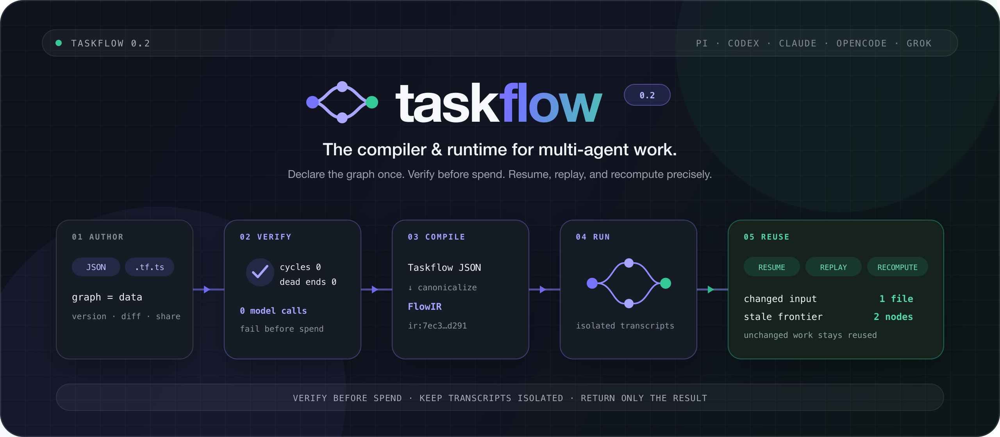

<div align="center">



<br />

[](https://www.npmjs.com/package/pi-taskflow)
[](https://github.com/heggria/taskflow/actions/workflows/ci.yml)
[](https://nodejs.org)
[](./LICENSE)
[](#install-on-your-host)
[](#built-to-survive-real-work)

**English** · [简体中文](./README.zh-CN.md)

[Install](#install-on-your-host) · [Quickstart](#60-second-start) · [What's new in 0.2.10](#0210-organized-portable-saved-flows) · [0.2 compiler turn](#02-is-the-compiler-turn) · [Docs](https://heggria.github.io/taskflow/en/docs) · [Examples](./examples)

</div>

---

# Build multi-agent systems you can inspect before they run.

**taskflow turns agent plans into compiled task graphs**: declared once, verified before model spend, executed in isolated subagents, resumed across sessions, replayed without tokens, and recomputed from the smallest stale frontier.

It runs on the coding agent you already use:

**Pi · Codex · Claude Code · OpenCode · Grok Build · Hermes Agent**

```text
JSON or .tf.ts
      │
      ▼
 validate ──► Taskflow JSON ──► FlowIR + content hash
                                      │
                                      ▼
                           isolated DAG runtime
                                      │
                         ┌────────────┼────────────┐
                         ▼            ▼            ▼
                      resume        replay      recompute
```

> Your host receives the final result. Intermediate transcripts stay inside the runtime unless you explicitly inspect them.

## Why taskflow?

Built-in subagent tools are excellent for one turn. The moment the work branches, retries, crosses sessions, or needs a quality gate, the plan becomes infrastructure.

| | Ad-hoc agents / scripts | **taskflow** |
|---|---|---|
| **Plan** | Re-derived from prose or hidden in a script | **An explicit, versionable DAG** |
| **Before execution** | Discover mistakes while spending | **Verify structure at zero model calls** |
| **Intermediate output** | Floods the host context | **Stays isolated in the runtime** |
| **Failure** | Start over or reconstruct state | **Resume from persisted phase state** |
| **Changed input** | Re-run broadly | **Explain staleness and re-run the affected frontier** |
| **Portability** | Coupled to one agent | **One JSON contract across six hosts** |

The trade is deliberate: less arbitrary orchestration code, more **verifiability, observability, recovery, and reuse**.

## 60-second start

Install taskflow on [Pi](https://pi.dev):

```bash
pi install npm:pi-taskflow
```

Then ask naturally:

> Use taskflow to audit `src/api` in parallel and return one prioritized report.

The routing skill uses the same familiar `task` / `tasks` / `chain` shape:

```json
{
  "chain": [
    { "agent": "scout", "task": "Map the public API under src/api." },
    {
      "agent": "security-reviewer",
      "task": "Audit this surface for missing auth and unsafe input boundaries:\n{previous.output}"
    },
    {
      "agent": "reviewer",
      "task": "Turn these findings into one prioritized report:\n{previous.output}"
    }
  ]
}
```

That already gives you an isolated, tracked run. When the job needs real topology, declare the graph:

```json
{
  "name": "audit-api",
  "args": { "dir": { "default": "src/api" } },
  "concurrency": 4,
  "phases": [
    {
      "id": "discover",
      "type": "agent",
      "agent": "scout",
      "task": "List source files under {args.dir}. Output ONLY a JSON array of {\"path\":\"...\"} objects.",
      "output": "json"
    },
    {
      "id": "audit-each",
      "type": "map",
      "over": "{steps.discover.json}",
      "as": "file",
      "agent": "security-reviewer",
      "task": "Audit {file.path}. Cite evidence and assign severity.",
      "dependsOn": ["discover"]
    },
    {
      "id": "report",
      "type": "reduce",
      "from": ["audit-each"],
      "agent": "reviewer",
      "task": "Synthesize one prioritized report:\n{steps.audit-each.output}",
      "dependsOn": ["audit-each"],
      "final": true
    }
  ]
}
```

Save it as `.pi/taskflows/audit-api.json`, then run:

```text
/tf:audit-api dir=src/api
```

On Codex, Claude Code, OpenCode, Grok Build, and Hermes Agent, run the same saved definition by name through `taskflow_run`. For long DAGs, use `mode: "background"`, then manage the durable run with `taskflow_runs` (`list` / `status` / `wait` / `cancel`); list output reports active concurrency and can filter `running` or `terminal` runs.

Large projects may organize saved definitions recursively below `.pi/taskflows/flows/`, for example `.pi/taskflows/flows/release/audit-api.json`. Legacy `.pi/taskflows/*.json` files remain discoverable and win same-scope name collisions; nested duplicates use locale-independent Unicode-scalar path order. Saving an already-discovered nested flow updates that file and its adjacent metadata in place; new flows still use the legacy top-level location. Discovery uses one shared user/project budget and fails closed if it exceeds 1,000 flows, 10,000 visited entries, 512 directories, 8 MiB of definition data, 1 MiB per definition, or 16 levels. It rejects symlinks below the trusted storage boundary through definition leaves and skips dot paths, metadata (`*.meta.json`), and compiled IR (`*.flowir.json`). The configured agent-directory boundary itself may be a symlink for compatible home-directory relocation. New-flow saves enforce the same storage-boundary policy and revalidate the physical target directory inside the write lock.

A file-backed flow can opt script phases into definition-relative execution:

```json
{
  "name": "release",
  "scriptCwd": "flow",
  "phases": [
    { "id": "prepare", "type": "script", "run": ["./scripts/prepare.sh"], "final": true }
  ]
}
```

Here `./scripts/prepare.sh` resolves from the directory containing the saved flow or `defineFile`. The default remains `"invocation"`, and an explicit phase `cwd` still takes precedence. Inline definitions have no trusted file source and therefore fail closed if they request `scriptCwd: "flow"`. If execution inherits a cwd-bridge boundary, the resolved flow source directory must remain inside that boundary.

[Follow the full quickstart →](https://heggria.github.io/taskflow/en/docs/getting-started)

## See the graph run

This is real output from a Pi run—not a mock dashboard:

```text
⊗ taskflow self-improve  6/7 · blocked · $0.095
    ✓ discover            agent   deepseek-v4-flash  10t ↑38k ↓6.7k $0.011
  ┌ ✓ write-runner-tests  agent   claude-sonnet-4-6  10t ↑13 ↓6.6k $0.020
  ├ ✓ write-store-tests   agent   claude-sonnet-4-6  10t ↑11 ↓10k $0.018
  ├ ✓ write-agents-tests  agent   claude-sonnet-4-6  10t ↑28 ↓13k $0.030
  └ ✓ fix-stability       agent   claude-sonnet-4-6  10t ↑13 ↓3.9k $0.012
    ✓ verify              gate    BLOCK 3 type errors in test files
    ⊘ report              reduce  skipped · Gate blocked  ↳ fix-stability
```

The layout **is** the DAG. Parallel rails expose concurrency; long edges expose dependencies; the gate explains why downstream work stopped. No separate control plane is required to understand the run.

## 0.2.10: organized, portable saved flows

Saved flows can now be organized below the bounded `.pi/taskflows/flows/**` convention while legacy top-level flows keep their existing precedence and behavior. A file-backed flow may opt into `scriptCwd: "flow"`, making adjacent scripts, templates, and fixtures portable as one reviewable directory bundle.

Discovery, provenance, and persistence remain fail-closed: recursion has shared file/entry/directory/byte/depth budgets, symlinked descendants are excluded, source identity survives foreground/background/resume/subflow paths, and nested definition/sidecar writes revalidate the physical parent through atomic promotion. [Full 0.2.10 notes →](./CHANGELOG.md#0210--2026-08-12)

## 0.2.9: Hermes Agent + verify parity

Taskflow now ships on **Hermes Agent** as `hermes-taskflow`, bringing the same MCP control plane to a sixth host. Hermes children run with an ephemeral home, explicit toolsets, cwd-confined local reads, provider-only credential material, and an explicit opt-in for mutating `--yolo` phases.

Pi's advertised `/tf verify <name>` command now matches the tool surface, including saved flow names containing spaces. Project discovery also stops at canonical home/temp boundaries, so ambient `/tmp/.pi` state cannot become a project by accident. [Full 0.2.9 notes →](./CHANGELOG.md#029--2026-08-11)

## 0.2.8: review, then confirm

Pi approvals now separate **selection** from **commit**. Choose Reject, Edit guidance, or Approve with `R` / `E` / `A`, arrows, or Tab; press Enter to confirm. The safe default is Reject, and Escape or Ctrl-C still rejects immediately.

Long proposals start collapsed. Press `V` to open an inline scrollable preview while the decision footer stays visible; short proposals remain open by default. Full notes: [CHANGELOG 0.2.8](./CHANGELOG.md#028--2026-08-10).

## 0.2.7: plan before spend · close the loop

The 0.2 line made graphs **compiled and inspectable**. **0.2.7** makes the day-to-day loop feel finished: you can see the plan *before* any model call, and you can hear about the run *after* it finishes — without stuffing transcripts into the host.

| Before spend | After spend |
|---|---|
| **`taskflow_plan` / `/tf plan`** — bind typed args, project phase order, mark dynamic refs, worst-case agent-call bound | **`hooks.onComplete` / `onFail` / `onBlocked`** — webhook, file, or argv-only command; summary payload only (`taskflow.hook.v1`) |
| **`verify` / `lint`** still free | **`approval.timeoutMs` + `onExpire`** — HITL no longer waits forever |
| **`recompute` savings line** — `reused N · rerun M · cutoff K · saved ~P%` | **`taskflow_analytics`** — last-N status, duration, fail/cache rates (read-only) |

```bash
# Zero tokens: see what would run and how expensive the worst case looks
# MCP: taskflow_plan  ·  Pi: /tf plan my-flow '{"dir":"src"}'
```

```jsonc
// Optional: fire-and-forget when a background run finishes
{
  "hooks": {
    "onComplete": [{ "type": "file", "path": ".taskflow/hooks/last-complete.json" }]
  }
}
```

MCP hosts now expose **19 tools** (added `taskflow_plan` and `taskflow_analytics`). Starter templates: [`examples/templates/`](./examples/templates/). Full notes: [CHANGELOG 0.2.7](./CHANGELOG.md#027--2026-08-06).

## 0.2 is the compiler turn

Before 0.2, taskflow executed declarative graphs. Now the graph also has a compile-time frontend, a canonical intermediate representation, an append-only decision trace, offline replay, and incremental recompute.

### Author in JSON or TypeScript

JSON remains the portable runtime contract. For larger flows, `taskflow-dsl` adds a compile-time TypeScript authoring layer:

```ts
import { agent, flow, json, map, reduce } from "taskflow-dsl";

export default flow("audit", (ctx) => {
  ctx.budget({ maxUSD: 2 });

  const files = agent("List files under {args.dir}", {
    agent: "scout",
    output: json<{ path: string }[]>(),
  });

  const audits = map(files, (file) =>
    agent(`Audit ${file.path}`, { agent: "security-reviewer" }),
  );

  return reduce(
    [audits],
    (parts) => agent(`Write one report:\n${parts.audits.output}`),
    { final: true },
  );
});
```

```bash
pnpm add -D taskflow-dsl
taskflow-dsl check audit.tf.ts
taskflow-dsl build audit.tf.ts --emit both
# → audit.taskflow.json + audit.flowir.json
```

`.tf.ts` is **compile-time only**. Hosts execute the emitted Taskflow JSON; they never interpret TypeScript.

### Compile to a contract you can reason about

FlowIR canonicalizes the graph and gives it a content hash. That compiled identity makes provenance and stale analysis inspectable, while the runtime adds content-addressed caching and deterministic tools:

| Operation | What it answers | Model calls |
|---|---|---:|
| **`plan`** | What will run, which args bind, worst-case agent calls? | **0** |
| `verify` / `compile` / `lint` | Is the graph structurally safe / lint-clean? | **0** |
| `ir` | What is the canonical graph and content hash? | **0** |
| `resume` | What unfinished work remains? (forks a new run; original untouched) | Only unfinished phases |
| `trace` | What calls and runtime decisions actually happened? | **0** to inspect |
| `replay` | What if thresholds or budgets had been different? | **0** |
| `why-stale` | What changed, and what depends on it? | **0** |
| `recompute` | What is the smallest observable affected frontier? (+ savings line) | Only affected phases |
| `analytics` | How have recent runs of this flow behaved? | **0** |

[Explore the compiler and runtime →](https://heggria.github.io/taskflow/en/docs/compiler-runtime/)

## One runtime, 12 phase types

| Family | Phases | Use them for |
|---|---|---|
| **Work** | `agent` · `parallel` · `map` · `reduce` · `script` | Single tasks, static fan-out, dynamic fan-out, aggregation, zero-token shell steps |
| **Control** | `gate` · `approval` · `flow` · `loop` | Quality decisions, human checkpoints, composition, iterative refinement |
| **Selection** | `tournament` · `race` | Best-of-N quality or first-success latency |
| **Dynamic graph** | `expand` | Validate and execute a runtime-produced fragment, nested or grafted |

Across those phase types, the DSL provides dependencies, conditions, retries, timeouts, output contracts, budgets, workspace isolation, and explicit final-output selection. Each kind accepts only the fields that are safe and meaningful for it; freshness-sensitive phases are excluded from cross-run caching.

[Read the phase reference →](https://heggria.github.io/taskflow/en/docs/syntax/phase-types)

## Runtime guarantees, not prompt conventions

### Verify before spend

Cycles, dangling dependencies, invalid references, impossible joins, unsafe dynamic fragments, and configuration hazards are rejected or surfaced before the expensive work starts.

### Keep intermediate work out of the host context

Agent-running phases execute in isolated subagent processes; control and script phases stay inside the runtime. Upstream outputs are wired into downstream inputs internally. Only `finalOutput` returns to the host unless you explicitly use `peek` or `trace`.

### Survive sessions and failures

Phase state is persisted atomically. Resume skips unchanged completed work; detached Pi runs can outlive the initiating session; an idle watchdog terminates stalled subagents.

### Reuse work honestly

Within-run resume is content-addressed. Cross-run caching is opt-in and can fingerprint Git commits, files, globs, environment variables, and TTLs. Change one declared input and only its dependents become stale.

### Bound the blast radius

Budgets, concurrency caps, retries, timeouts, nesting limits, dynamic-graph breadth caps, path containment, non-idempotent phase classification, and fail-closed approval behavior are runtime semantics—not suggestions in a prompt.

### 0.2.1: safe dynamic cwd and Pi terminal reaping

An invocation argument declared as `type: "relative-path"` may select a phase
working directory with the exact form `cwd: "{args.package}"`. The bridge is
default-off, requires host `resolve-only` authorization, and confines the
canonical directory to the invocation root. Absolute paths, concatenation, and
`{steps.*}` remain rejected; this compatibility bridge is not an OS sandbox.
Resolve-only writer phases within one invocation are serialized before durable
lease acquisition, so fan-out cannot self-timeout while separate processes
remain protected by cross-process leases.

Pi child agents no longer inherit ambient extensions by default. Trusted host
settings can use an explicit extension allowlist or opt back into legacy
inheritance. If a Pi child produces a validated final answer and terminal event
but an extension keeps the process alive, Taskflow waits a bounded grace window,
reaps the process group, and records `completionSource: "terminal-reap"` instead
of reporting a false timeout.

```json
{
  "taskflow": {
    "piChild": {
      "resourceProfile": "isolated",
      "extensions": [],
      "terminalGraceMs": 1500
    }
  }
}
```

`allowlist` accepts explicit trusted extension files; `inherit` restores ambient
Pi extension discovery as a compatibility mode. Flows cannot widen this host
authority.

[Read the core concepts →](https://heggria.github.io/taskflow/en/docs/concepts/)

## Install on your host

All packages require **Node.js ≥ 22.19.0**.

### Pi

```bash
pi install npm:pi-taskflow
```

Pi provides the richest local experience: the `taskflow` tool, `/tf` commands, live DAG rendering, interactive approvals, background runs, and model-role setup.

[Pi guide →](https://heggria.github.io/taskflow/en/docs/guides/pi)

### OpenAI Codex

```bash
codex plugin marketplace add heggria/taskflow
codex plugin add taskflow@taskflow
```

[Codex guide →](https://heggria.github.io/taskflow/en/docs/guides/codex)

### Claude Code

```bash
claude plugin marketplace add heggria/taskflow
claude plugin install claude-taskflow@taskflow
```

[Claude Code guide →](https://heggria.github.io/taskflow/en/docs/guides/claude-code)

### OpenCode

```bash
opencode mcp add taskflow -- \
  npx -y -p opencode-taskflow@0.2.10 opencode-taskflow-mcp
```

[OpenCode guide →](https://heggria.github.io/taskflow/en/docs/guides/opencode)

### Grok Build

```bash
grok mcp add taskflow -- \
  npx -y -p grok-taskflow@0.2.10 grok-taskflow-mcp
```

Grok Build support is new in 0.2. Its CLI stream does not report token/cost usage, so budget-declaring flows are rejected rather than silently running without enforcement.

[Grok Build guide →](https://heggria.github.io/taskflow/en/docs/guides/grok-build)

### Hermes Agent

```bash
hermes mcp add taskflow --command npx --args -y -p hermes-taskflow@0.2.10 hermes-taskflow-mcp
# Prefer env in config.yaml (not CLI --env after args — can be stuffed into argv):
#   mcp_servers.taskflow.env.PI_TASKFLOW_HERMES_UNSAFE_YOLO: "1"   # mutating only
```

Hermes quiet mode does not report token/cost usage, so budget-declaring flows are rejected rather than silently running without enforcement. Child agents use an ephemeral HERMES_HOME with only non-secret model/fallback routing, a routed-provider-only inference `auth.json`, and provider-allowlisted dotenv keys; parent MCP, skills, memory, sessions, and rules are not inherited. RO local-read → `taskflow_readonly_files`; else `taskflow_model_only` (never omit `-t`).

[Hermes guide →](./docs/hermes-mcp.md)


## Built to survive real work

<div align="center">

**10 packages** · **6 hosts** · **12 phase types** · **18 built-in agents** · **1,500+ tests** · **MIT**

</div>

```text
                              taskflow-core
                 ┌──────────────┼───────────────┐
                 │              │               │
           taskflow-dsl   pi-taskflow   taskflow-mcp-core ─┐
                                       taskflow-hosts ─────┼─ codex-taskflow
                                                          ├─ claude-taskflow
                                                          ├─ opencode-taskflow
                                                          └─ grok-taskflow / hermes-taskflow
```

`taskflow-core` is host-neutral and imports no host SDK. `taskflow-mcp-core` implements stdio JSON-RPC without an MCP SDK dependency; `taskflow-hosts` owns the shared host process runners. The five MCP delivery packages bind both layers (and core), while Pi keeps its native adapter.

The test suite covers orchestration semantics, persistence and file-lock races, cache freshness, path traversal, dynamic graph hardening, cancellation, budgets, all 12 phase kinds, FlowIR/replay/recompute, TypeScript DSL erasure, host argv contracts, MCP servers, and packed consumer imports.

## Documentation

| Start here | When you need |
|---|---|
| [Getting Started](https://heggria.github.io/taskflow/en/docs/getting-started) | Your first successful run |
| [Concepts](https://heggria.github.io/taskflow/en/docs/concepts/) | DAGs, isolation, verification, resume, shared context |
| [Syntax](https://heggria.github.io/taskflow/en/docs/syntax/) | Phase fields, control flow, budgets, caching, scorers |
| [Compiler & Runtime](https://heggria.github.io/taskflow/en/docs/compiler-runtime/) | TypeScript DSL, FlowIR, replay, recompute, background runs |
| [Host Guides](https://heggria.github.io/taskflow/en/docs/guides/) | Pi, Codex, Claude Code, OpenCode, Grok, and Hermes setup |
| [Reference](https://heggria.github.io/taskflow/en/docs/reference/) | Commands, shorthand, and exact tool surfaces |
| [Showcase](https://heggria.github.io/taskflow/en/docs/showcase/) | Real flows and case studies |
| [0.2.0 Frontier Assessment](./docs/taskflow-0.2.0-frontier-assessment.zh-CN.md) | Independent, evidence-based technical assessment (Chinese) |

Also see [`examples/`](./examples), the [changelog](./CHANGELOG.md), and the [release guide](./RELEASE.md).

## Contributing

```bash
pnpm install
pnpm run typecheck
pnpm test
pnpm run build
pnpm run test:pack
```

Contributions are welcome. Start with [`CONTRIBUTING.md`](./CONTRIBUTING.md) for the workflow and [`AGENTS.md`](./AGENTS.md) for architecture and coding conventions.

## License

[MIT](./LICENSE) © [heggria](https://github.com/heggria)

<div align="center">

**Declare once. Verify first. Recompute only what changed.**

[Read the docs](https://heggria.github.io/taskflow/en/docs) · [Try an example](./examples) · [View releases](https://github.com/heggria/taskflow/releases)

</div>
