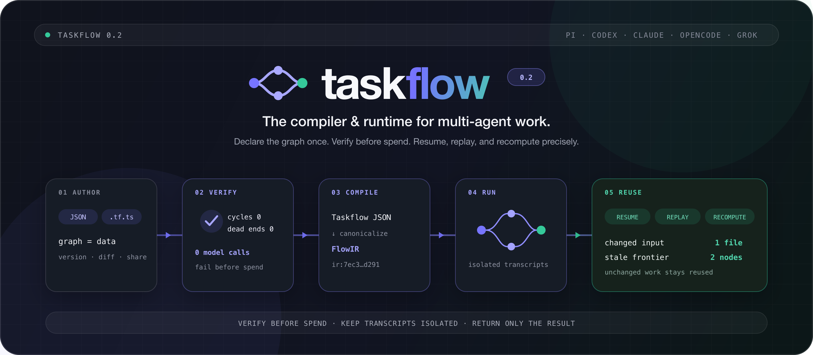

<div align="center">



<br />

[](https://github.com/heggria/taskflow/actions/workflows/ci.yml)
[](https://nodejs.org)
[](./LICENSE)
[](#host-adapters)

**English** · [简体中文](./README.zh-CN.md)

[1.0 overview](#taskflow-10-declarative-coding-agent-workflows) · [Quickstart](#quickstart) · [Docs](https://heggria.github.io/taskflow/en/docs) · [Examples](./examples) · [Changelog](./CHANGELOG.md)

</div>

---

# taskflow 1.0: declarative coding-agent workflows

**taskflow is a declarative runtime for coding-agent workflows.** It turns a graph into a verifiable execution contract, runs phases in isolation, and keeps intermediate work out of the host conversation. In Taskflow 1.0, the contract also describes the effects a phase is allowed to propose.

> **Status: 1.0.0 development candidate — unreleased.** Latest published prerelease: `v0.3.0-beta.1.2`. Draft PR [#142](https://github.com/heggria/taskflow/pull/142) targets `main`; its head `rc/0.3.0-beta.2` retains the historical branch name, while 1.0.0 supersedes the beta.2 release target. The complete approved Control Plane, including WebUI, remains required before 1.0 publication; its current private workspace status is not a waiver. See the [release plan](./docs/internal/1.0.0-release-plan.md) and [acceptance scoreboard](./docs/internal/1.0.0-ga-scoreboard.md).

## The declared-effect contract

An agent can propose content. It should not become the mutation authority merely because it can run a command.

For admitted, declared filesystem-write targets, taskflow 1.0 makes the path explicit and routes the final mutation through the resources transaction:

```text
flow / .tf.ts
       │
       ▼
  validate + verify ──► EffectIR + FlowIR hash
       │                         │
       │                         ▼
       │                 admit declared targets
       │                         │
       ▼                         ▼
  isolated phase ───────► stage → commit | restore + reject
                                      │
                                      ▼
                          ledger-backed why-effect
```

This is **not** an OS sandbox. Resolve-only hosts cannot prevent every write to an undeclared path. Secret and service references are typed and fail closed in this cut; they do not imply a vault or network backend.

## The 1.0 target and current implementation

| Layer | What it does | Support boundary |
|---|---|---|
| **Taskflow runtime** | Declarative DAGs, 12 phase types, budgets, retries, approvals, isolation, resume, replay, trace, and recompute | Stable runtime contract |
| **Trusted Effects** | Closed `EffectIR`, `PathRef` / `SecretRef` / `ServiceRef`, confidentiality/integrity labels, effect validation, overlap checks, and ledger-backed `why-*` explainers | Declared-target contract |
| **Resource transaction** | Snapshot → lease → durable intent/permit → stage → commit, or restore and reject | Declared-target contract |
| **Host adapters** | Pi, Codex, Claude Code, OpenCode, Grok Build, and Hermes Agent use the same flow contract | Existing host surface; support remains host-specific |
| **Control Plane** | Authenticated multi-project admission, global concurrency, durable replay, approvals/CAS, Receipts and operator CLI/MCP | Bundled in public `taskflow-mcp-core`; Unix UDS, Windows pipes non-GA |
| **WebUI** | Runs, approval edits, Receipts and evidence browsing | Local token login, live authorization and project isolation |

The [1.0 release plan](./docs/internal/1.0.0-release-plan.md) defines the stable scope and acceptance gates. The filesystem-transaction details are in [`docs/internal/0.3.0-trusted-effects-mvp.md`](./docs/internal/0.3.0-trusted-effects-mvp.md). The 0.3-C Control Plane plan is [`docs/internal/0.3-c-control-plane-plan.md`](./docs/internal/0.3-c-control-plane-plan.md).

## Quickstart

Use Node.js **≥ 22.19.0**. To run from the 1.0 source checkout:

```bash
git clone https://github.com/heggria/taskflow.git
cd taskflow
git checkout --track origin/rc/0.3.0-beta.2
pnpm install
pnpm run typecheck
pnpm test
```

**The following installation commands apply only after 1.0.0 is published; use the candidate source checkout above today.**

```bash
npm install --global pi-taskflow@1.0.0
npm install --global codex-taskflow@1.0.0
```

The host-specific plugin and MCP commands remain in the [host guides](https://heggria.github.io/taskflow/en/docs/guides/).

Run the no-LLM Trusted Effects vertical-slice fixture:

```bash
pnpm exec node --conditions=development --experimental-strip-types --test \
  packages/taskflow-core/test/effects-e2e-fixture.test.ts
```

This exercises the checked-in `examples/trusted-effects-write.json` path without a live LLM. For an interactive run, use the host guide for the adapter you already run. The [release guide](./RELEASE.md) covers packed-consumer validation and release gates.

## Declare an effect

Effects are part of the flow contract, not a free-form prompt promise:

```json
{
  "name": "trusted-effects-write",
  "phases": [
    {
      "id": "write-report",
      "type": "script",
      "run": ["node", "scripts/render-report.mjs"],
      "effects": [
        {
          "id": "report",
          "kind": "fs.write",
          "purpose": "write final report",
          "target": {
            "kind": "path",
            "path": {
              "workspace": "project",
              "subpath": { "literalPath": "out/report.md" },
              "intent": "create-file"
            }
          },
          "confidentiality": "internal",
          "integrity": "project"
        }
      ],
      "final": true
    }
  ]
}
```

The declaration is not authorization by itself. The runtime resolves the `PathRef`, checks labels and overlaps, records the resource intent, and only then permits the transaction to stage and finalize the declared target. `taskflow_why_effect` explains the resulting authorization and ledger state without model calls.

## The runtime contract

The 0.2 runtime remains the foundation. A flow can be authored as portable JSON or compiled from TypeScript DSL to FlowIR:

```text
JSON / .tf.ts
      │
      ▼
validate → Taskflow JSON → FlowIR + content hash
                                  │
                                  ▼
                         isolated DAG runtime
                                  │
                   resume · replay · recompute · trace
                                  │
                                  ▼
                         finalOutput to the host
```

## One runtime, 12 phase types

| Family | Phases | Use them for |
|---|---|---|
| **Work** | `agent` · `parallel` · `map` · `reduce` · `script` | Single tasks, static concurrency, dynamic fan-out, aggregation, and zero-token shell steps |
| **Control** | `gate` · `approval` · `flow` · `loop` | Quality decisions, human checkpoints, composition, and iterative refinement |
| **Selection** | `tournament` · `race` | Best-of-N quality or first-success latency |
| **Dynamic graph** | `expand` | Validate and execute a runtime-produced nested or grafted fragment |

Across those phase types, the runtime provides shared behavior: dependencies, conditions, retries, timeouts, output contracts, budgets, workspace isolation, explicit final-output selection, and persistence for resume. Each phase kind accepts only the fields that are safe and meaningful for it.

Useful zero-token operations include:

| Operation | Question it answers |
|---|---|
| `taskflow_plan` | What will run, what arguments bind, and what is the worst-case agent-call bound? |
| `taskflow_verify` / `taskflow_compile` | Is the graph structurally valid and what is its canonical form? |
| `taskflow_trace` / `taskflow_replay` | What happened, or what would a zero-token what-if replay decide? |
| `taskflow_why_stale` / `taskflow_recompute` | What changed and what is the smallest affected frontier? |
| `taskflow_why_effect` | Why was a declared effect allowed, staged, committed, rejected, or left unknown? |
| `taskflow_analytics` | How have recent runs behaved? |

The MCP surface currently exposes **20 tools**. Intermediate transcripts remain inside the runtime unless you explicitly inspect them with `peek` or `trace`; the host normally receives only `finalOutput`.

## Host adapters

The same flow contract can be delivered through six coding-agent hosts:

- **Pi** — native extension, `/tf` commands, live run views, and interactive approvals.
- **Codex** — plugin and stdio MCP server.
- **Claude Code** — plugin and stdio MCP server.
- **OpenCode** — MCP configuration and generated skill.
- **Grok Build** — MCP configuration and generated skill.
- **Hermes Agent** — MCP delivery with explicit child toolsets and isolation policy.

Host support is not a blanket security guarantee. Read the [host support baseline](./conformance/workspace/host-support-baseline.json) and the [Trusted Effects documentation](./docs/internal/0.3.0-trusted-effects-mvp.md) before enabling mutating phases.

## Security boundaries we state plainly

- `effects[]` is a declaration and validation surface; it is not ambient authority.
- The resources layer is the only finalizer for admitted declared filesystem effects.
- Direct writes to declared targets are detected and restored by the MVP path.
- Writes to undeclared paths remain host-policy dependent under resolve-only execution.
- `SecretRef` and `ServiceRef` are typed handles only; no vault or live service adapter ships in this cut.
- There is no FileBroker or full OS sandbox claim in 0.3 MVP.
- Control Plane admission, authorized replay, durable approvals, Receipts, global coordination and WebUI are implemented. Public `taskflow-mcp-core` provides the control binaries; operator actions require an explicitly provisioned separate credential. Request audit fields never grant authority.

## Development

```bash
pnpm install
pnpm run typecheck
pnpm test
pnpm run build
pnpm run build:website
pnpm run test:pack
```

The monorepo contains the host-neutral `taskflow-core`, Trusted Effects and resources code, the `taskflow-control` 0.3-C contract package, the TypeScript DSL, MCP/host adapters, examples, and the website. See [`AGENTS.md`](./AGENTS.md) for architecture and coding conventions.

## Documentation

| Start here | Use it for |
|---|---|
| [1.0 overview](https://heggria.github.io/taskflow/en/docs) | 1.0 scope, support, and the security boundary |
| [Getting Started](https://heggria.github.io/taskflow/en/docs/getting-started) | First flow and host setup |
| [Core Concepts](https://heggria.github.io/taskflow/en/docs/concepts/) | DAGs, isolation, verification, resume, and evidence |
| [Compiler & Runtime](https://heggria.github.io/taskflow/en/docs/compiler-runtime/) | JSON, TypeScript DSL, FlowIR, replay, and recompute |
| [Host Guides](https://heggria.github.io/taskflow/en/docs/guides/) | Pi, Codex, Claude Code, OpenCode, Grok, and Hermes |
| [Examples](./examples) | Runnable flow definitions, including Trusted Effects |
| [Changelog](./CHANGELOG.md) | Release history and version notes |

## License

[MIT](./LICENSE) © [heggria](https://github.com/heggria)

<div align="center">

**Declare the effect. Verify the path. Commit through one authority.**

[Read the docs](https://heggria.github.io/taskflow/en/docs) · [Install Taskflow 1.0](#quickstart) · [View releases](https://github.com/heggria/taskflow/releases)

</div>
