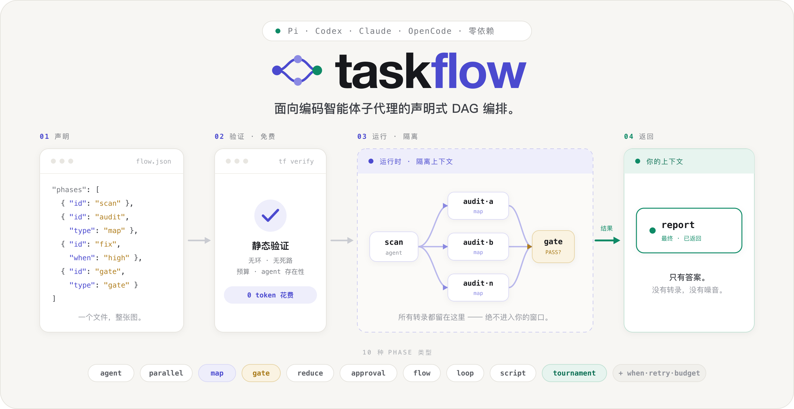

<div align="center">



<br />

[](https://www.npmjs.com/package/pi-taskflow)
[](https://github.com/heggria/taskflow/actions/workflows/ci.yml)
[](https://nodejs.org)
[](./LICENSE)
[](#安装到你的宿主)
[](#为真实工作而生)

[English](./README.md) · **简体中文**

[安装](#安装到你的宿主) · [快速开始](#60-秒开始) · [0.2 新能力](#02-是编译器转身) · [文档](https://heggria.github.io/taskflow/zh-cn/docs) · [示例](./examples)

</div>

---

# 构建那些在运行前就能看清楚的多智能体系统。

**taskflow 把智能体计划变成可编译的任务图**：只声明一次，在模型花费前验证，通过隔离子智能体执行，跨会话续跑，零 token 重放，并从最小陈旧前沿开始重算。

它运行在你已经使用的编程智能体上：

**Pi · Codex · Claude Code · OpenCode · Grok Build**

```text
JSON 或 .tf.ts
      │
      ▼
  验证 ──► Taskflow JSON ──► FlowIR + 内容哈希
                                      │
                                      ▼
                              隔离 DAG 运行时
                                      │
                         ┌────────────┼────────────┐
                         ▼            ▼            ▼
                        续跑          重放          重算
```

> 宿主收到的是最终结果。中间转录留在运行时里，除非你明确要求查看。

## 为什么是 taskflow？

内置 subagent 工具非常适合单轮委派。但一旦工作开始分支、重试、跨会话，或需要质量门控，计划本身就成了基础设施。

| | 即席 agent / 脚本 | **taskflow** |
|---|---|---|
| **计划** | 每次从 prose 重推，或藏在脚本里 | **显式、可版本化的 DAG** |
| **执行前** | 边花钱边发现错误 | **零模型调用验证结构** |
| **中间输出** | 涌入宿主上下文 | **隔离在运行时里** |
| **失败后** | 从头开始或手工恢复状态 | **从持久化阶段状态续跑** |
| **输入变化** | 大范围重跑 | **解释过期原因，只重跑受影响前沿** |
| **可移植性** | 绑定单一智能体 | **同一份 JSON 合同跨五个宿主** |

这是一项有意的取舍：少一点任意编排代码，换来更多的**可验证性、可观测性、恢复能力与复用**。

## 60 秒开始

在 [Pi](https://pi.dev) 上安装 taskflow：

```bash
pi install npm:pi-taskflow
```

然后自然地提出需求：

> 用 taskflow 并行审计 `src/api`，最后只返回一份按优先级排列的报告。

路由 skill 使用你已经熟悉的 `task` / `tasks` / `chain` 形式：

```json
{
  "chain": [
    { "agent": "scout", "task": "Map the public API under src/api." },
    {
      "agent": "security-reviewer",
      "task": "Audit this surface for missing auth and unsafe input boundaries:\n{previous.output}"
    },
    {
      "agent": "reviewer",
      "task": "Turn these findings into one prioritized report:\n{previous.output}"
    }
  ]
}
```

这样就已经得到一次隔离、可追踪的运行。当任务需要真正的拓扑结构时，声明整张图：

```json
{
  "name": "audit-api",
  "args": { "dir": { "default": "src/api" } },
  "concurrency": 4,
  "phases": [
    {
      "id": "discover",
      "type": "agent",
      "agent": "scout",
      "task": "List source files under {args.dir}. Output ONLY a JSON array of {\"path\":\"...\"} objects.",
      "output": "json"
    },
    {
      "id": "audit-each",
      "type": "map",
      "over": "{steps.discover.json}",
      "as": "file",
      "agent": "security-reviewer",
      "task": "Audit {file.path}. Cite evidence and assign severity.",
      "dependsOn": ["discover"]
    },
    {
      "id": "report",
      "type": "reduce",
      "from": ["audit-each"],
      "agent": "reviewer",
      "task": "Synthesize one prioritized report:\n{steps.audit-each.output}",
      "dependsOn": ["audit-each"],
      "final": true
    }
  ]
}
```

保存为 `.pi/taskflows/audit-api.json`，然后运行：

```text
/tf:audit-api dir=src/api
```

在 Codex、Claude Code、OpenCode 和 Grok Build 上，通过 `taskflow_run` 按名称运行同一份保存定义。长任务可使用 `mode: "background"`，再用 `taskflow_runs` 执行 `list` / `status` / `wait` / `cancel`，无需担心单次 MCP 调用超时；列表会显示当前并发数，并可筛选 `running` 或 `terminal` 运行。

[查看完整快速开始 →](https://heggria.github.io/taskflow/zh-cn/docs/getting-started)

## 看见整张图运行

下面是真实的 Pi 运行输出，不是模拟的 dashboard：

```text
⊗ taskflow self-improve  6/7 · blocked · $0.095
    ✓ discover            agent   deepseek-v4-flash  10t ↑38k ↓6.7k $0.011
  ┌ ✓ write-runner-tests  agent   claude-sonnet-4-6  10t ↑13 ↓6.6k $0.020
  ├ ✓ write-store-tests   agent   claude-sonnet-4-6  10t ↑11 ↓10k $0.018
  ├ ✓ write-agents-tests  agent   claude-sonnet-4-6  10t ↑28 ↓13k $0.030
  └ ✓ fix-stability       agent   claude-sonnet-4-6  10t ↑13 ↓3.9k $0.012
    ✓ verify              gate    BLOCK 3 type errors in test files
    ⊘ report              reduce  skipped · Gate blocked  ↳ fix-stability
```

布局**本身就是 DAG**。并行轨道暴露并发，长边暴露依赖，gate 解释下游为什么停止。你不需要另一套控制平面才能看懂运行状态。

## 0.2 是编译器转身

0.2 之前，taskflow 负责执行声明式图。现在，这张图还拥有编译期前端、规范化中间表示、append-only 决策 trace、离线重放，以及增量重算。

### 用 JSON 或 TypeScript 编写

JSON 仍是可移植的运行时合同。面对更大的 flow，`taskflow-dsl` 提供编译期 TypeScript 编写层：

```ts
import { agent, flow, json, map, reduce } from "taskflow-dsl";

export default flow("audit", (ctx) => {
  ctx.budget({ maxUSD: 2 });

  const files = agent("List files under {args.dir}", {
    agent: "scout",
    output: json<{ path: string }[]>(),
  });

  const audits = map(files, (file) =>
    agent(`Audit ${file.path}`, { agent: "security-reviewer" }),
  );

  return reduce(
    [audits],
    (parts) => agent(`Write one report:\n${parts.audits.output}`),
    { final: true },
  );
});
```

```bash
pnpm add -D taskflow-dsl
taskflow-dsl check audit.tf.ts
taskflow-dsl build audit.tf.ts --emit both
# → audit.taskflow.json + audit.flowir.json
```

`.tf.ts` **只存在于编译期**。宿主执行生成的 Taskflow JSON，绝不会解释执行 TypeScript。

### 编译成一份可以推理的合同

FlowIR 规范化整张图，并赋予它内容哈希。这个编译身份让 provenance 与过期分析变得可检查，而运行时在其上提供内容寻址缓存与确定性工具：

| 操作 | 它回答什么 | 模型调用 |
|---|---|---:|
| `verify` / `compile` | 这张图在结构上可以安全运行吗？ | **0** |
| `ir` | 规范化图和内容哈希是什么？ | **0** |
| `resume` | 还有哪些未完成工作？（派生新运行，原运行不变） | 仅未完成阶段 |
| `trace` | 实际发生了哪些调用和运行时决策？ | 查看时 **0** |
| `replay` | 如果阈值或预算不同，结果会怎样？ | **0** |
| `why-stale` | 什么变了，哪些节点依赖它？ | **0** |
| `recompute` | 最小可观测受影响前沿是什么？ | 仅受影响阶段 |

[探索编译器与运行时 →](https://heggria.github.io/taskflow/zh-cn/docs/compiler-runtime/)

## 一套运行时，12 种阶段

| 家族 | 阶段 | 用途 |
|---|---|---|
| **工作** | `agent` · `parallel` · `map` · `reduce` · `script` | 单任务、静态并发、动态 fan-out、聚合、零 token shell 步骤 |
| **控制** | `gate` · `approval` · `flow` · `loop` | 质量决策、人工检查点、组合、迭代改进 |
| **选择** | `tournament` · `race` | best-of-N 质量或 first-success 延迟 |
| **动态图** | `expand` | 校验并执行运行时产出的片段，可嵌套或提升 |

在这些阶段类型之上，DSL 提供依赖、条件、重试、超时、输出合同、预算、工作区隔离和明确的最终输出选择。每种类型只接受对它安全且有意义的字段；对新鲜度敏感的阶段不会进入跨运行缓存。

[阅读阶段参考 →](https://heggria.github.io/taskflow/zh-cn/docs/syntax/phase-types)

## 运行时保证，而不是 prompt 约定

### 花费前先验证

环路、悬空依赖、无效引用、不可能的 join、不安全的动态片段与配置风险，会在昂贵工作开始前被拒绝或明确暴露。

### 中间工作不进入宿主上下文

负责 agent 工作的阶段运行在隔离的 subagent 进程中；控制阶段和 script 阶段留在运行时内部。上游输出由运行时在内部接入下游输入。除非明确使用 `peek` 或 `trace`，否则只有 `finalOutput` 返回宿主。

### 穿越会话与失败

阶段状态以原子方式持久化。续跑会跳过未变化的已完成工作；Pi 的 detached 运行可以活过发起会话；idle watchdog 会终止卡死的 subagent。

### 诚实地复用工作

运行内续跑基于内容寻址。跨运行缓存需显式开启，并可把 Git commit、文件、glob、环境变量和 TTL 纳入指纹。改变一个已声明输入，只有其依赖项会变为陈旧。

### 限制爆炸半径

预算、并发上限、重试、超时、嵌套深度、动态图宽度、路径包含检查、非幂等阶段分类，以及审批 fail-closed 都是运行时语义，不是写在 prompt 里的建议。

### 0.2.1：安全动态 cwd 与 Pi 终态回收

声明为 `type: "relative-path"` 的调用参数，可以通过严格完整的
`cwd: "{args.package}"` 选择 phase 工作目录。该桥默认关闭，需要 Host 显式
授权 `resolve-only`，并把 canonical 目录限制在 invocation root 内。绝对路径、
字符串拼接和 `{steps.*}` 仍会被拒绝；这个兼容桥不是 OS sandbox。
同一次 invocation 内的 resolve-only 写阶段会在获取持久 lease 前串行化，避免
fan-out 自己等待自己超时，同时仍以跨进程 lease 保护其他 Taskflow 进程。

Pi 子 agent 默认不再继承 ambient extensions。可信 Host 可以配置明确的扩展
白名单，或显式恢复旧版继承行为。如果 Pi 子进程已经产出经过验证的最终答案和
终态事件，却因扩展遗留 handle 而不退出，Taskflow 会等待有限 grace 窗口、回收
整个进程组，并记录 `completionSource: "terminal-reap"`，而不是误报 timeout。

```json
{
  "taskflow": {
    "piChild": {
      "resourceProfile": "isolated",
      "extensions": [],
      "terminalGraceMs": 1500
    }
  }
}
```

`allowlist` 接受显式可信扩展文件；`inherit` 仅作为兼容模式恢复 Pi ambient
extension discovery。Flow 无权扩大这项 Host 权限。

[阅读核心概念 →](https://heggria.github.io/taskflow/zh-cn/docs/concepts/)

## 安装到你的宿主

所有包都要求 **Node.js ≥ 22.19.0**。

### Pi

```bash
pi install npm:pi-taskflow
```

Pi 提供最完整的本地体验：`taskflow` 工具、`/tf` 命令、实时 DAG 渲染、交互审批、后台运行与模型角色配置。

[Pi 指南 →](https://heggria.github.io/taskflow/zh-cn/docs/guides/pi)

### OpenAI Codex

```bash
codex plugin marketplace add heggria/taskflow
codex plugin add taskflow@taskflow
```

[Codex 指南 →](https://heggria.github.io/taskflow/zh-cn/docs/guides/codex)

### Claude Code

```bash
claude plugin marketplace add heggria/taskflow
claude plugin install claude-taskflow@taskflow
```

[Claude Code 指南 →](https://heggria.github.io/taskflow/zh-cn/docs/guides/claude-code)

### OpenCode

```bash
opencode mcp add taskflow -- \
  npx -y -p opencode-taskflow@0.2.2 opencode-taskflow-mcp
```

[OpenCode 指南 →](https://heggria.github.io/taskflow/zh-cn/docs/guides/opencode)

### Grok Build

```bash
grok mcp add taskflow -- \
  npx -y -p grok-taskflow@0.2.2 grok-taskflow-mcp
```

Grok Build 支持在 0.2 首次加入。其 CLI stream 不返回 token/cost 用量，因此声明了预算的 flow 会被拒绝，而不是在无法执行预算约束时静默运行。

[Grok Build 指南 →](https://heggria.github.io/taskflow/zh-cn/docs/guides/grok-build)

## 为真实工作而生

<div align="center">

**9 个包** · **5 个宿主** · **12 种阶段** · **18 个内置 agent** · **1,500+ 测试** · **MIT**

</div>

```text
                              taskflow-core
                 ┌──────────────┼───────────────┐
                 │              │               │
           taskflow-dsl   pi-taskflow   taskflow-mcp-core ─┐
                                       taskflow-hosts ─────┼─ codex-taskflow
                                                          ├─ claude-taskflow
                                                          ├─ opencode-taskflow
                                                          └─ grok-taskflow
```

`taskflow-core` 保持宿主无关，不导入任何宿主 SDK。`taskflow-mcp-core` 在不依赖 MCP SDK 的情况下实现 stdio JSON-RPC；`taskflow-hosts` 负责共享宿主进程 runner。四个 MCP 交付包绑定这两层（以及 core），而 Pi 保留原生适配器。

测试套件覆盖编排语义、持久化与文件锁竞态、缓存新鲜度、路径穿越、动态图加固、取消、预算、全部 12 种阶段、FlowIR/replay/recompute、TypeScript DSL 擦除、宿主 argv 合同、MCP server，以及打包后的 consumer imports。

## 文档

| 从这里开始 | 当你需要 |
|---|---|
| [快速开始](https://heggria.github.io/taskflow/zh-cn/docs/getting-started) | 第一次成功运行 |
| [核心概念](https://heggria.github.io/taskflow/zh-cn/docs/concepts/) | DAG、隔离、验证、续跑、共享上下文 |
| [语法](https://heggria.github.io/taskflow/zh-cn/docs/syntax/) | 阶段字段、控制流、预算、缓存、scorer |
| [编译器与运行时](https://heggria.github.io/taskflow/zh-cn/docs/compiler-runtime/) | TypeScript DSL、FlowIR、重放、重算、后台运行 |
| [宿主指南](https://heggria.github.io/taskflow/zh-cn/docs/guides/) | Pi、Codex、Claude Code、OpenCode、Grok 配置 |
| [参考](https://heggria.github.io/taskflow/zh-cn/docs/reference/) | 命令、简写与精确工具接口 |
| [Showcase](https://heggria.github.io/taskflow/zh-cn/docs/showcase/) | 真实 flow 与案例研究 |

另见 [`examples/`](./examples)、[变更日志](./CHANGELOG.md)和[发版指南](./RELEASE.md)。

## 贡献

```bash
pnpm install
pnpm run typecheck
pnpm test
pnpm run build
pnpm run test:pack
```

欢迎贡献。请先阅读 [`CONTRIBUTING.md`](./CONTRIBUTING.md) 了解工作流，以及 [`AGENTS.md`](./AGENTS.md) 了解架构与编码规范。

## 许可

[MIT](./LICENSE) © [heggria](https://github.com/heggria)

<div align="center">

**只声明一次。花费前验证。只重算变化部分。**

[阅读文档](https://heggria.github.io/taskflow/zh-cn/docs) · [运行示例](./examples) · [查看版本](https://github.com/heggria/taskflow/releases)

</div>
