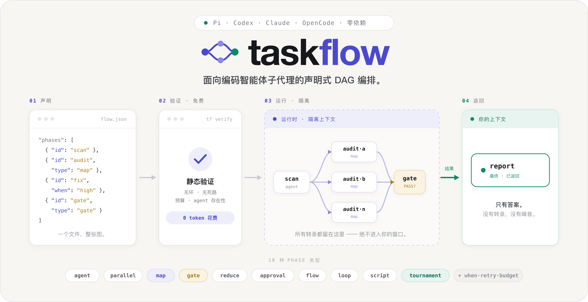

<div align="center">



<br />

[](https://github.com/heggria/taskflow/actions/workflows/ci.yml)
[](https://nodejs.org)
[](./LICENSE)
[](#宿主适配器)

[English](./README.md) · **简体中文**

[1.0 总览](#taskflow-10声明式-coding-agent-工作流) · [快速开始](#快速开始) · [文档](https://heggria.github.io/taskflow/zh-cn/docs) · [示例](./examples) · [变更记录](./CHANGELOG.md)

</div>

---

# taskflow 1.0：声明式 coding-agent 工作流

**taskflow 是面向 coding-agent 工作流的声明式运行时。** 它把任务图变成可验证的执行合同，让阶段隔离运行，并把中间过程留在宿主对话之外。在 Taskflow 1.0 中，这份合同还可以描述每个阶段被允许提出的副作用。

> **Taskflow 1.0 公开合同。** 十个公开包的稳定范围是已有 DAG runtime、DSL、六个宿主适配器和已准入声明文件目标的 resource transaction。Pi 支持交互审批；MCP/headless 审批自动拒绝。`taskflow-control` 是 private workspace 实验，wire 合同仍为 proposed；CharterArc 保留独立 experimental 发布线。[1.0 发布计划](./docs/internal/1.0.0-release-plan.md)列出验证闸门。实际发布状态见 [GitHub Releases](https://github.com/heggria/taskflow/releases) 与 [npm registry](https://www.npmjs.com/package/pi-taskflow)。

## 声明文件副作用合同

智能体可以提出内容，但不应该因为能执行命令，就自动成为文件修改的最终权威。

对于已准入、已声明的文件写入目标，taskflow 1.0 把路径写进合同，并让最终修改经过 resources transaction：

```text
flow / .tf.ts
       │
       ▼
  validate + verify ──► EffectIR + FlowIR hash
       │                         │
       │                         ▼
       │                 准入已声明目标
       │                         │
       ▼                         ▼
  隔离阶段 ─────────────► stage → commit | restore + reject
                                      │
                                      ▼
                         ledger-backed why-effect
```

这**不是 OS sandbox**。在 resolve-only 宿主上，taskflow 不能阻止所有对未声明路径的写入。Secret 和 service reference 在这一版只是类型化、失败关闭的句柄，并不代表已经有 vault 或网络后端。

## 1.0 公开合同

| 层 | 作用 | 支持边界 |
|---|---|---|
| **Taskflow runtime** | 声明式 DAG、12 种阶段、预算、重试、审批、隔离、续跑、replay、trace 与 recompute | 稳定 runtime 合同 |
| **Trusted Effects** | 封闭的 `EffectIR`、`PathRef` / `SecretRef` / `ServiceRef`、机密性/完整性标签、effect 校验、重叠检查与 ledger-backed `why-*` | 声明目标合同 |
| **Resource transaction** | snapshot → lease → durable intent/permit → stage → commit，或 restore and reject | 声明目标合同 |
| **宿主适配器** | Pi、Codex、Claude Code、OpenCode、Grok Build、Hermes Agent 共用同一 flow 合同 | 已有宿主表面；能力仍按宿主区分 |
| **Control Plane** | Unix UDS singleton/fencing、files-only store 与拟议 wire contract；admission、parked 审批、receipt 和全局协调尚未完成 | private workspace 实验，不属于稳定 API |
| **WebUI** | runs、审批、receipts 与 evidence 浏览 | 计划中，不属于稳定 API |

[1.0 发布计划](./docs/internal/1.0.0-release-plan.md)定义稳定范围与验收闸门。文件事务细节见 [`docs/internal/0.3.0-trusted-effects-mvp.md`](./docs/internal/0.3.0-trusted-effects-mvp.md)。0.3-C Control Plane 计划见 [`docs/internal/0.3-c-control-plane-plan.md`](./docs/internal/0.3-c-control-plane-plan.md)。

## 快速开始

准备 Node.js **≥ 22.19.0**。从 1.0 源码 checkout 运行：

```bash
git clone https://github.com/heggria/taskflow.git
cd taskflow
git checkout v1.0.0
pnpm install
pnpm run typecheck
pnpm test
```

使用精确 1.0 版本安装宿主适配器：

```bash
npm install --global pi-taskflow@1.0.0
npm install --global codex-taskflow@1.0.0
```

各宿主的 plugin 与 MCP 命令见[宿主指南](https://heggria.github.io/taskflow/zh-cn/docs/guides/)。也可从源码 checkout 运行。

运行不需要 LLM 的 Trusted Effects vertical-slice fixture：

```bash
pnpm exec node --conditions=development --experimental-strip-types --test \
  packages/taskflow-core/test/effects-e2e-fixture.test.ts
```

它会在没有 live LLM 的情况下执行仓库内的 `examples/trusted-effects-write.json` 路径。要交互式运行，请按当前使用的宿主查看对应指南。[发布指南](./RELEASE.md)说明打包消费验证和正式发布闸门。

## 声明一个 effect

Effect 是 flow 合同的一部分，不是 prompt 里的自由文本承诺：

```json
{
  "name": "trusted-effects-write",
  "phases": [
    {
      "id": "write-report",
      "type": "script",
      "run": ["node", "scripts/render-report.mjs"],
      "effects": [
        {
          "id": "report",
          "kind": "fs.write",
          "purpose": "write final report",
          "target": {
            "kind": "path",
            "path": {
              "workspace": "project",
              "subpath": { "literalPath": "out/report.md" },
              "intent": "create-file"
            }
          },
          "confidentiality": "internal",
          "integrity": "project"
        }
      ],
      "final": true
    }
  ]
}
```

声明本身并不等于授权。运行时会解析 `PathRef`、检查标签与路径重叠、记录 resource intent，然后才允许 transaction 对已声明目标执行 stage 与最终提交。`taskflow_why_effect` 可以在不调用模型的情况下解释授权结果与 ledger 状态。

## 运行时合同

0.2 运行时仍是基础层。Flow 可以用可移植 JSON 编写，也可以从 TypeScript DSL 编译到 FlowIR：

```text
JSON / .tf.ts
      │
      ▼
validate → Taskflow JSON → FlowIR + content hash
                                  │
                                  ▼
                         隔离 DAG 运行时
                                  │
                   resume · replay · recompute · trace
                                  │
                                  ▼
                         finalOutput 回到宿主
```

## 一套运行时，12 种阶段

| 家族 | 阶段 | 用途 |
|---|---|---|
| **工作** | `agent` · `parallel` · `map` · `reduce` · `script` | 单任务、静态并发、动态 fan-out、聚合与零 token shell 步骤 |
| **控制** | `gate` · `approval` · `flow` · `loop` | 质量决策、人工检查点、组合与迭代改进 |
| **选择** | `tournament` · `race` | best-of-N 质量或 first-success 延迟 |
| **动态图** | `expand` | 校验并执行运行时产出的嵌套或提升片段 |

在这些阶段类型之上，运行时提供依赖、条件、重试、超时、输出合同、预算、工作区隔离、明确的最终输出选择，以及支持 resume 的持久化。每种阶段只接受对它安全且有意义的字段。

常用的零 token 操作：

| 操作 | 它回答什么 |
|---|---|
| `taskflow_plan` | 会运行什么、参数如何绑定、最坏会调用多少 agent？ |
| `taskflow_verify` / `taskflow_compile` | 图在结构上是否有效，规范化形式是什么？ |
| `taskflow_trace` / `taskflow_replay` | 实际发生了什么，或零 token 的 what-if replay 会怎样？ |
| `taskflow_why_stale` / `taskflow_recompute` | 什么变了，最小受影响前沿是什么？ |
| `taskflow_why_effect` | 为什么一个声明的 effect 被允许、stage、commit、reject，或仍是 unknown？ |
| `taskflow_analytics` | 最近的运行表现如何？ |

当前 MCP 表面暴露 **20 个工具**。除非明确使用 `peek` 或 `trace`，中间 transcript 会留在运行时，宿主通常只收到 `finalOutput`。

## 宿主适配器

同一份 flow 合同可以通过六个 coding-agent 宿主交付：

- **Pi**：原生扩展、`/tf` 命令、实时运行视图与交互式审批。
- **Codex**：plugin 与 stdio MCP server。
- **Claude Code**：plugin 与 stdio MCP server。
- **OpenCode**：MCP 配置与生成的 skill。
- **Grok Build**：MCP 配置与生成的 skill。
- **Hermes Agent**：带显式子代理 toolset 与隔离策略的 MCP 交付。

宿主支持不是一揽子安全保证。启用 mutating phase 前，请阅读[宿主支持基线](./conformance/workspace/host-support-baseline.json)与 [Trusted Effects 定义](./docs/internal/0.3.0-trusted-effects-mvp.md)。

## 我们明确声明的安全边界

- `effects[]` 是声明与校验表面，不是 ambient authority。
- resources 层是已准入、已声明文件 effect 的唯一最终提交者。
- MVP 路径会检测并恢复对已声明目标的直接写入。
- 在 resolve-only 执行下，未声明路径的写入仍取决于宿主策略。
- `SecretRef` 与 `ServiceRef` 只是类型化句柄；这一版没有 vault 或 live service adapter。
- 0.3 MVP 不声称提供 FileBroker 或完整 OS sandbox。
- Control Plane admission、经授权的命令结果重放、parked 审批、receipt、全局协调与 WebUI 尚未完成；1.0 发布等待已接受 spec 的实现与验收闭环。可信调用者身份与实时披露授权就绪前，重复控制命令会被拒绝；请求中的审计字段不能授予访问权限。

## 开发

```bash
pnpm install
pnpm run typecheck
pnpm test
pnpm run build
pnpm run build:website
pnpm run test:pack
```

这个 monorepo 包含 host-neutral 的 `taskflow-core`、Trusted Effects 与 resources 代码、0.3-C 合同 package `taskflow-control`、TypeScript DSL、MCP/宿主适配器、示例与网站。架构和编码约定见 [`AGENTS.md`](./AGENTS.md)。

## 文档

| 从这里开始 | 适用场景 |
|---|---|
| [1.0 总览](https://heggria.github.io/taskflow/zh-cn/docs) | 1.0 范围、支持与安全边界 |
| [快速开始](https://heggria.github.io/taskflow/zh-cn/docs/getting-started) | 第一个 flow 与宿主配置 |
| [核心概念](https://heggria.github.io/taskflow/zh-cn/docs/concepts/) | DAG、隔离、验证、续跑与 evidence |
| [编译器与运行时](https://heggria.github.io/taskflow/zh-cn/docs/compiler-runtime/) | JSON、TypeScript DSL、FlowIR、replay 与 recompute |
| [宿主指南](https://heggria.github.io/taskflow/zh-cn/docs/guides/) | Pi、Codex、Claude Code、OpenCode、Grok 与 Hermes |
| [示例](./examples) | 可运行的 flow 定义，包括 Trusted Effects |
| [变更记录](./CHANGELOG.md) | 发布历史与版本说明 |

## 许可证

[MIT](./LICENSE) © [heggria](https://github.com/heggria)

<div align="center">

**声明 effect。验证路径。让一个 authority 负责提交。**

[阅读文档](https://heggria.github.io/taskflow/zh-cn/docs) · [安装 Taskflow 1.0](#快速开始) · [查看 releases](https://github.com/heggria/taskflow/releases)

</div>
