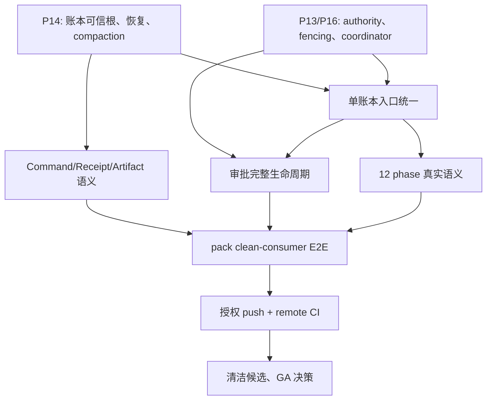

# 0.3.0 NOT-GA 持续闭环目标

**状态：ACTIVE / NOT GA。**
**起点：** `feat/0.3.0`，基线提交 `e11b82109e04f69e56a37aceb3f78934f822ad14`。
**权威矩阵：** [`0.3.0-ga-traceability-matrix.md`](./0.3.0-ga-traceability-matrix.md)。
**证据根：** implementer 的 `{SCRATCH}/ga-evidence-report.md` 与同目录日志/哈希清单。

> **P14 supersession notice (2026-07-27):** 本文较早 Round 中所有“先取得
> external witness / non-rollbackable trust root / externally authenticated
> repair 才能继续”的指令均已被产品范围决定取代。0.3 明确不保证检测或修复
> “每一份本地 authority byte 被一起恢复到同一旧有效快照”；该事件不得再作为
> GA blocker。局部/混合回滚、损坏、丢失、half-commit、crash、stale authority、
> fencing、path replacement、compaction 与 recovery race 仍全部在范围内。

这不是“让测试变绿”的目标。它的唯一完成条件是：对一个干净、可复现、可发布的候选提交，能够诚实地证明 Taskflow 0.3.0 的控制面形成了闭环，并且没有把本地单路径测试、模拟提供方、已知恢复缺口或未统一的入口包装成 GA。

## 1. 不可谈判的目标与边界

### 最终目标

在授权的远端 CI、干净候选提交和已打包的干净消费者环境中，证明以下陈述为真：

> 任一支持的公开入口对同一项目域的运行、等待、取消、审批、恢复、容量和 Receipt 都经过同一个受围栏保护的控制面；每个可见终态均有可验证的账本、提供方和授权依据；崩溃、竞争、重试、丢失派生文件、容量耗尽和恢复不会重复副作用、不会伪造成功，也不会静默越过未知状态。

### 在完成前绝不做的事

- 不打 tag、不 publish、不把 `0.3.0` 称为 GA，也不把预发/本地成功描述为 GA。
- 未获授权不推送分支、不触发远端 CI、不创建 release/MR。
- 不以 `--no-verify`、删测试、放宽断言、把 `unknown` 改成 `completed`、或把 `PARTIAL` 改名为 `PASS` 来获得表面绿灯。
- 不以“一个入口通过”“一个 mock 通过”“一次全量绿”替代跨入口、真实提供方边界、故障注入和重复性证据。
- 不改变现有 0.2 行为或公开协议来回避兼容性测试；若必须改 wire，先做明确 ADR、迁移、回滚和 golden 更新。

## 2. 已知事实、不是推测

| 事实 | 当前证据 | 对 GA 的含义 |
|---|---|---|
| 本地控制面已有 journal、BoundPlan、Continuation、Coordinator、daemon/UDS 与 CLI 路径 | 矩阵与 control/daemon/CLI 测试 | 是可继续硬化的基础，不是单一控制面已完成的证明 |
| native script `approval` 有窄正向路径 | `approval-continuation.test.ts` | 可证明 restart/CAS/容量重试的一个子路径；不能外推到 edit、所有提供方、所有 phase 或所有入口 |
| MCP background 和 Pi 仍存在 0.2/非 ControlStore 路径 | dual-path inventory 与入口源码 | 单账本不成立，单独这一项已阻止 GA |
| ControlHost scheduler 没有逐一实现 12 种 phase 的真实控制语义 | `phase-scheduler.ts` 与矩阵 D2/D9/D21 | 不能把“把 phase 微程序交给 LLM”当作 map/loop/race/expand 等的运行时语义 |
| 新鲜 ControlStore 的项目根 anchor 能拒绝仅 `.taskflow/` 子树丢失，但 legacy store、整项目根 rollback 和并发替换仍不可辨 | `store-recovery` root-anchor 测试、Round 39 whole-root snapshot counterexample 与 P14 矩阵行 | Round 39 已实测：恢复旧 `.taskflow/` 加匹配 root anchor 后，store 正常 reopen 且丢失后续 event；2026-07-27 产品决定仅把“所有本地 authority bytes 一起 coherent rollback”排除出 0.3 GA，不得把该排除扩张到局部损坏、crash、fencing 或并发替换 |
| P13/P16 仍有 stale-authority、provider-held 异步围栏、coordinator 根丢失/修复和跨存储 crash window 缺口 | P13/P16 矩阵行；Round-29 pre-submit marker/UDS tests | 已经缩小“intent 后立刻 submit”的窗口，但 host 侧最后一次检查不是原子 fencing；写者与容量的“至多一次”不能宣称闭环 |
| 本地全量成功不等于远端候选成功 | `{SCRATCH}` 日志 | remote CI、pack/clean consumer 和 clean SHA 是独立门禁 |

## 3. 可判定的 Definition of Done

任何一项缺失都使结果保持 **NOT GA**。`PARTIAL`、`FAIL` 不能用叙述抵消；`DEFER` 仅能在产品明确确认“非 0.3.0 MUST”后改为带批准证据的 `N/A`，否则也是阻断项。

| 门禁 | 必须可观察的真相 | 最低可接受证据 |
|---|---|---|
| 全矩阵 | §23、D1–D38、P1–P16 全部为 `PASS` 或有明确批准和证据的 `N/A` | 每一行有测试/运行证明、日志路径、哈希；无孤立“实现已存在”声明 |
| 单控制面 | MCP foreground/background、Pi、CLI standalone/attach、daemon 的 run/status/wait/cancel/approve/edit/reject/expire/reconcile 都命中同一项目账本与同一 writer authority | 跨入口 E2E：同一 `runId`、同一事件序列/Receipt、无 `.pi` 旁路；关闭旧路径或显式 fail-closed |
| phase 语义 | 12 种支持的 phase 各有真实、可测试的控制语义；不能靠“LLM 会理解 DSL” | 每种 phase 的成功、失败、取消、retry、timeout、resume、依赖、预算和 Receipt 断言；未交付种类必须在公开入口 fail-closed，不能静默降级 |
| 审批生命周期 | approve/edit/reject/expire/cancel 的状态机、命令幂等、容量、恢复和 Receipt 全部真实 | 每个决策的并发、重启、容量满、每个 dispatch 边界崩溃、提供方 unknown/terminal、跨入口案例；Receipt 仅在终态且事件 manifest 完整时出现 |
| P14 账本 | 写入、恢复、compaction、派生索引、语义校验和受支持 filesystem 行为有明确可信模型；所有本地 authority bytes 的 coherent rollback 明确不在 0.3 保证内 | 故障注入矩阵；每个持久化原子点的 crash/reopen；局部 root/anchor/segment 丢失、损坏和并发替换证明；P14 ADR 的冻结范围及发布说明 |
| P13/P16 authority/capacity | 旧 epoch 不能写、崩溃 writer 的恢复可证明、安全；容量不会丢占用或双发 | 32 进程 × 100 轮 stale/restart、PID 重用/锁替换、异步 provider 回调、coordinator state/anchor/root 丢失和授权 repair 的端到端证明 |
| Command/Receipt/Artifact | 同一 command 在竞争和重试时收敛；Receipt 是不可伪造的终态凭据；Artifact/Secret 授权正确 | same-command 多进程、跨 principal、缺失派生索引、manifest 篡改、ArtifactRef/SecretRef 攻击测试 |
| 发布候选 | 无未审计改动，构建产物可安装，远端 CI 与 clean consumer 均绿 | commit SHA、push/CI URL、打包 hash、临时 clean dir/E2E 日志、最终 `git status --porcelain` 为空 |

## 4. 依赖顺序：先修“真相边界”，再扩产品面



并行工作只允许在边界清楚时进行：P14 与 P13/P16 可并行；入口统一、完整审批和公开 phase 语义不能在账本/authority 仍会产生双写或未知副作用时被标为完成。

## 5. 工作流 A：P14 ControlStore 作为可恢复真相源

### 目标

在 P14 ADR 冻结的 trusted-local-disk 范围内，定义并实现可审计的本地
完整性与恢复协议，使“journal 能打开”不等于“journal 在当前支持范围内可被信任”。

### 必须交付

1. **威胁模型与设计决策**
   - 精确区分首次初始化、单文件丢失、父目录丢失、整棵控制根回滚、磁盘快照回滚、拷贝/clone、symlink 替换、网络/hostile filesystem。
   - 已有项目根 anchor 只能覆盖“新鲜 store 的 `.taskflow/` 子树丢失”。必须明确 legacy header-only store 的迁移策略；所有本地 authority bytes 被一起恢复为旧 coherent snapshot 已由 2026-07-27 P14 决策排除，不要求外部 freshness witness，但绝不能据此宣称 anti-rollback。
   - 对范围内无法由当前本地证据判定的局部/混合故障，必须 fail-closed
     并给出显式 operator repair/quarantine；禁止把“看起来像新安装”当作安全恢复。
     被冻结排除的 coherent whole-authority restore 只做负能力披露，不要求
     外部锚或 authenticated repair，也不得宣称已检测。
   - 明确旧 schema/v1 的迁移、可逆性、失败时读写行为和支持窗口。
2. **写入与恢复原子性**
   - 枚举每次提交的所有落盘点：segment、anchor、seq、run/command/receipt index、BoundPlan、Continuation、approval、fsync、rename。
   - 在每个点注入 crash，重新打开后只允许：完整旧状态、完整新状态、或 fail-closed；绝不允许未验证的混合成功。
   - 所有派生文件只能由已验证 journal 重建；attach/read-only 永不偷偷修复。
3. **compaction 与 retention**
   - 在物理删除前写入 journal-bound、可验证、可恢复的 compaction checkpoint。
   - cursor、Receipt manifest、旧 run 查询、保留策略和恢复职责必须一起测试。
4. **语义验证**
   - 每个 event/run/command/receipt 的 domain、streamSeq、commitSeq、causation、manifest、BoundPlan/Continuation 引用在 reopen 时验证。

### 完成判据

- 故障注入表中的每个状态点均有红/绿测试和日志。
- 范围内的局部替换、损坏、半提交、seq/journal 回拨和并发恢复不能产生 `completed` 或新的 Receipt；错误为稳定 `TF_*` 且带 recoveryAction。
- P14 从 `FAIL` 变为 `PASS` 前，独立 review 必须明确核对 trusted-local-disk 假设、被排除的 coherent whole-root rollback，以及其余每个范围内 durability cell；不能只列出哈希链。

### Round 39：whole-root rollback 的可证明下界

已加入永久 counterexample：先提交 event A，复制 `.taskflow/` 与
`.taskflow-control.anchor.json`，再提交 event B；随后在同一项目路径恢复 A
时的控制树和 anchor。当前 `openProjectControlStore()` 正常接受该历史，并只
返回 A。它明确排除了“当前 hash chain / root anchor 已经检测 rollback”的任何
说法。

下界是严格的：若 opener 的所有输入都来自可被同一 restorer 回滚的项目根，
那么“合法旧状态”与“被还原的旧状态”的字节观察完全相同；任何纯本地比较都
无法在一边 accept、另一边 reject。2026-07-27 产品责任人已选择缩小为
trusted-local-disk 部署语义：所有本地 authority bytes 一起被恢复到旧 coherent
snapshot 不属于 0.3 GA 保证，因此 0.3 不引入 external witness 或 authenticated
repair 服务，也不得宣称 anti-rollback。counterexample 永久保留，用于阻止未来
错误扩大保证。局部 anchor/root/segment 丢失、非 coherent 回拨、损坏、clone/
worktree、crash 和并发替换仍在范围内。

已有 `identityPolicy: "new-identity"` / `"rebind"` 不是 anchor 缺失时的 repair
捷径：只要 header 已存在而 root anchor 缺失，normal、read-only 与这些显式
identity policy 都必须 fail-closed，直到有独立批准的 migration protocol；否则
删除证据会被伪装成一次无审计的新身份迁移。

### Round 40：P11 cursor checkpoint 的窄安全边界

Round 40 先关闭一个不能等待物理 compaction 才发现的局部反例：旧
`compaction.json` 是独立可删缓存，删除后会把已经 `TF_CURSOR_EXPIRED` 的
cursor 恢复成可用。现在 cursor floor 只能从 hash-linked journal 中的
`CompactionCheckpoint { throughCommitSeq }` 推导；checkpoint 在同一
`commit.lock`/mutation fence 下写入，必须单调、使用保留 stream，且不能跨过
当前 tail。删除或伪造一个 loose legacy pathname 不再影响结果，锚存在但
ControlStore 子树缺失时 cursor read 也 fail-closed。

这不是 P14 的信任根解法，也不是 physical compaction：checkpoint 自身作为新
tail 留在完整历史中，所有旧 segment 仍被保留，`deleteCompactedJournalFiles()`
仍只报告、绝不删除。2026-07-27 scope decision 已排除 coherent whole-root
freshness，因此不再要求外部 witness / authenticated repair；但不能以此跳过
retained-prefix handoff、Receipt reachability、crash/power-loss、legacy 和
范围内 filesystem 故障矩阵。P11 继续 PARTIAL，P14 继续 FAIL。

## 6. 工作流 B：P13/P16 authority、fencing 与 Coordinator

### 目标

让“只有一个 writer”和“一个 slot 不会被双用”成为跨进程、跨重启、跨异步回调的事实。

### 当前已覆盖、但绝不等于完成的切片（Round 29–35）

- `DispatchIntentRecorded` 之后、每次新的 `ExecutionProvider.submit()` 之前，scheduler 会重新询问 host 的 mutation authority。普通 admit 与 native approval continuation 都有真实 `ScriptExecutionProvider` marker 测试：若这一次检查已失权，则不启动脚本、不签 Receipt、Run 保持 `running/executing`、reservation 不释放，且 journal 保留 `activeAttempt.state=intent-recorded`。
- 对 ScriptExecutionProvider，ControlHost 还会交付一个同步 submission fence；provider 在该 fence 内完成 idempotency reserve、真实 OS spawn 与 provider-job acknowledgement。新增 red/green test 让 host pre-check 通过后才撤销 durable fence：旧实现会先 spawn、随后在 `DispatchAcknowledged` 持久化时失败；当前实现必须在 reserve/spawn 前返回 `TF_AUTHORITY_REVOKED`，无 marker、无 Receipt，并保留同一 intent/reservation。
- 若 Script provider 已经 spawn、但旧 epoch 在 ControlStore `DispatchAcknowledged` 前失权，scheduler 现在必须保留原始 `intent-recorded` checkpoint，而不是把未持久的 handle 写回或伪造终态。普通与 native approval 的真实 marker 测试证明此时 marker **可以**存在；返回必须是 `TF_AUTHORITY_REVOKED`、`sideEffects:possible`、`recoveryAction:reconcile`、无 Receipt、reservation 不释放。它是 containment，不是 recovery。
- UDS 对真实 ControlHost durable mutation fence 抛出的 `SingletonAuthorityError` 保留 `TF_AUTHORITY_REVOKED`，不再把该错误压成 `TF_COMMAND_FAILED`。这个 wire 测试只证明 error classification；现有 rpc-error 尚没有承载完整 `commandId` / `sideEffects` / `recoveryAction` 的协议字段。
- 新增 `lookupByIdempotency` 后，Script provider 只能用完整 `(runId, idempotencyKey, micro-program, cwd)` 形状找回当前磁盘 job acknowledgement；缺少 job、prepared-only job、旧 cache、形状不匹配均为 `ambiguous/rejected`，不能重放。`ControlHost.reconcilePendingDispatch` 只在 lookup 返回同一 handle 时原子写回 acknowledgement，再对该 handle 做一次 reconcile 观察；它明确保持 `unknown/reconciling + needsOperator`、不继续下游、不签 Receipt。
- 真实 auto-singleton 跨进程 fixture 仍覆盖两段 crash window，但 Round 33 更正了它的 authority 结论：旧 writer 在 host pre-check 后或真实 spawn 后死亡时，正常 auto bootstrap 都必须保留死 owner pathname、返回 `TF_DURABILITY_FAILED`，而不是宣称新 epoch。测试随后仅用显式 `skipSingleton` 的测试授权 actor 调用 lookup/reconcile：pre-fence 路径不 submit，post-spawn 路径只 reconcile 原 handle，marker 上界仍为 1。没有 lookup 的 opaque provider 被拒绝自动恢复；这不是生产接管接口。
- **严格下界：** 这只是 Script 的窄 recovery owner，不是完整 restart scheduler。generic/remote provider 仍可缺少 credentialed fence/lookup/reconcile；该方法还未穿过 daemon/UDS/CLI/MCP/Pi，也不能安全 resume/terminalize 全部 phase 或签 Receipt。generic provider 也没有统一 fencing token、唯一 resume owner 或全部 callback/cancel 协议。因此这不能标记为 P13 PASS，也不能将任何“可能已 submit”的 intent 自动重放。
- **Round 34 attach 绑定：** 红测构造“活着但无关 PID + canonical pathname 上的伪 UDS + 与 singleton record 不同 epoch”。旧 CLI 会把伪造 RPC 成功当 attach 成功；现在 `SingletonLockInfo.endpoint` 必须等于 canonical UDS path，CLI probe 和每一次 `controlClientRpc` 都同时校验 protocol/role/fencingEpoch，故该具体伪造返回 `TF_BOOTSTRAP_FAILED` 且不会发 RPC。这个事实只证明**声明不一致会被拒绝**，不证明 responder 是 holder：锁文件和 hello 都携带公开 epoch，恶意/错误 endpoint 若能复现相同 epoch，当前协议没有 OS 凭据、出生身份或不可伪造的 holder 证明。

- **Round 35 cancel 纠正：** 真实 Script provider 的 stale-version 红/绿测试已经证明：`expectedRunVersion` 过期时返回 `TF_STALE_VERSION`，不会触达 provider，真实 job 继续存活。匹配的 cancel command 现在先在同一 project CAS 中持久化 `cancelRequest(requested)` 和 command，再持久化 `signalling`，之后才允许 provider 调用；同一 command 在 `signalling/ambiguous` 后重试只能返回 reconcile，不能再发 signal。这个切片同时暴露并修正了自己的过度宣称：初版把 Unix process group 退出当成 tree quiescence；真实 fixture 让 child 以 `detached:true` 脱离 group，旧路径仍返回 `cancelled`，随后逃逸 child 写出 marker。现在 raw Script provider 即使杀掉普通 inherited group，也只回报 `ambiguous`，ControlHost 保持 `unknown/reconciling`、reservation 和无 Receipt。普通 inherited child（marker 不出现）与 detached child（marker 出现）都已成为永久测试，证明这个保守结果不是偶然。
- **严格下界：** Round 35 是去除假终态，不是“已能取消”。`child_process`/PID/process group 无法证明没有 `setsid`、double-fork、container 边界或其它 job-control 逃逸后代；没有 containment-backed tree identity，Script 不得返回可释放 slot 的 `cancelled`。当前也没有 cancel restart owner、operator repair、generic-provider proof contract、UDS/CLI/MCP/Pi 生命周期或 Windows 语义。因此此切片不能提升 P13/P15，也不能把“provider 收到 signal”写成“Run 已取消”。

### Round 34 历史反例与 Round 35 当前边界（必须保留）

Round 34 的源码审计发现 `ControlHost.cancel()` 在 CAS/intent 前先调 `provider.cancel()`；Round 35 的真实 red test 已复现并消除这个顺序错误。它不是终点：在 `signalling` journal commit、provider 自身的 durable signal intent、真实 signal、provider observation、ControlStore terminal settlement 之间仍有多个 crash/authority-loss 窗口。并且 Unix group 的退出并不等于 tree 静默：Round 35 的 detached-grandchild fixture 已经实测过“旧实现返回 `cancelled`，逃逸后代仍写 marker”。因此任何以后出现的 `cancelled` 都必须证明三个彼此独立的事实：**唯一 cancel command 已被账本接受、该 provider/containment 对象已被观察为终态、该 observation 覆盖整个可执行树而非一个 PID/group**。

### Round 41：UDS hello principal 的连接绑定（窄安全）

新的真实 daemon/UDS red test 在 hello 声称 `alice`，随后在同一连接的 `admit` RPC 声称 `mallory` 并携带真实 Script marker。旧 transport 会接受这个 per-RPC 覆盖，使 command 的 principal 与连接建立时身份不一致。现在 RPC 若带 `principal`，必须是字符串且与 hello label 完全相等；省略该字段时也只使用 hello label。否则在 host lookup/provider 调用前返回 `TF_POLICY_DENIED`，marker 不得出现。

**严格下界：** 这只禁止同一连接内的 principal-switch；hello label 本身仍由客户端声明。它不是 OS peer credential、adapter credential、MCP/Pi identity 或授权策略，D15/P13 仍是 PARTIAL。下一步不能把 label 重新命名成“authenticated”：必须选择并实测 Unix peer credential/平台等价物或由宿主验证的 adapter credential，再把 identity、grant、re-auth 和审计贯穿公开入口。

### Round 42：UDS 未终止 frame 的有界拒绝（窄安全）

另一个真实 daemon/UDS red test 写入 1 MiB + 1 byte、故意不带换行。旧 server 持续累积这个连接的字符串，直到客户端超时；它既不拒绝也没有上界。现在输入按 raw byte 累积，完整或未终止 line 只要超过 1 MiB 就回复 `TF_PROTOCOL_INCOMPATIBLE` 并关闭该 socket。永久绿测随后在新连接成功 `admit` 一个真实 Script flow，证明恶意连接不会杀死 writer。

**严格下界：** 这是单 line 的内存上界，不是完整 transport admission control。仍必须补上并发/排队 RPC、累计 bytes、速率、malformed object-field/request-schema、超时和公平性测试；还必须把 OS/adapter principal、holder authentication、grant/re-auth、MCP/Pi entrypoint 与审计闭环。P13/D15 继续 PARTIAL。

### Round 43：UDS JSON 根形状与核心 envelope 拒绝（窄安全）

新的真实 daemon/UDS red test 发送 `null\n`。旧代码的 `JSON.parse` 会成功返回 `null`，随后在 parse catch 之外读取 `msg.type`，导致未处理 `TypeError`；这不是一个可审计的协议拒绝。现在 handler 先要求非数组 JSON object，才读取任何字段：所有合法但非 object 的 JSON 根值、缺失/非字符串/未知 `type`、非字符串 hello principal、非字符串或空 RPC method、以及非 object RPC `params` 都在 host lookup 或 provider dispatch 前返回 typed error。永久测试逐一发送 `null`、boolean、number、string、array 以及 malformed core envelope；另有真实 hello/RPC field 测试断言 Script marker 不出现，随后新连接能正常 admit。

**严格下界：** 这只关闭 JSON 根形状和少数 core field 的崩溃/静默忽略路径，不是完整 wire schema、资源准入或认证协议。任意 method 的参数 schema、unknown-field policy、速率/排队/累计 budget、timeout/公平性、peer credential、holder authentication 和所有公开入口 identity 仍需分别定义、实测、审计。P13/D15 继续 PARTIAL，且 P14 的 trusted-root/rollback FAIL 不受影响。

### Round 44：UDS 重复 hello 不可重绑 principal（窄安全）

Round 41 原本只验证 RPC 参数不能覆盖 hello label，却遗漏了同一 socket 可以再次发送有效 hello。红测按真实 wire 顺序发送 `hello(alice) → hello(mallory) → admit(principal=mallory)`；旧实现回第二个 `hello-ok`，将 `conn.principal` 改为 `mallory`，使后续 RPC 的比较形同虚设，并能启动 Script marker。现在 first successful hello 后，任何第二个 hello 都回 `hello-error/TF_PROTOCOL_INCOMPATIBLE`，不修改连接 state；同一测试继续发送 `principal=mallory` 的 admit，必须得到 `TF_POLICY_DENIED`、无 marker，fresh connection 仍可正常 admit。

**严格下界：** 这是 connection state-machine 完整性，不是身份认证。第一个 hello label 仍是同 UID 客户端可声明的字符串；没有 peer credential、adapter credential、holder proof、grant/re-auth、MCP/Pi identity、rate/queue/resource control 或全量 wire schema。P13/D15 继续 PARTIAL，P14 trusted-root/rollback 仍是更高优先级的 FAIL。

### Round 45：UDS open-peer cap（窄安全）

真实 daemon/UDS red test 先保持 `64` 个已建立但不发送 hello 的本地 peer，再建立第 `65` 个连接。旧 server 不限制 connection 数，额外 peer 没有响应、一直占用到测试超时。现在 daemon 只为至多 `64` 个 accepted peer 分配 parser/connection state；超额 peer 立即得到 `error/TF_CAPACITY_EXCEEDED` 并关闭。每个 accepted peer 的 close 释放 slot；socket error listener 覆盖 server 正在写拒绝时对端 reset 的 EventEmitter 错误，避免该 peer 终止 daemon。永久测试保持全部 slot、验证拒绝、reset 一个 denied peer，释放 held peers 后在新连接真实 admit Script flow。

**严格下界：** 这是 open-peer 上界，不是 authenticated admission 或完整 DoS 防护。Round 46 后每个 pre-hello peer 只有五秒绝对期限；仍必须补 frame-rate/queued-RPC/cumulative byte budget、公平性、完整 request schema、OS/adapter credential、holder identity、grant/re-auth 和 MCP/Pi 生命周期。P13/D15 继续 PARTIAL；P14 trusted-root/rollback FAIL 不变。

### Round 46：UDS pre-hello 五秒绝对期限（窄安全）

真实 daemon/UDS red test 建立一个 idle local peer、完全不发送 bytes，并等待 `UDS_HELLO_DEADLINE_MS + 1500ms`。旧实现没有响应，说明该 peer 可以一直占住一个已接受的 admission slot。现在每个 accepted peer 都从 accept 时刻开始五秒**绝对**计时；若第一个成功 hello 尚未完成，server 返回 `error/TF_PROTOCOL_INCOMPATIBLE` 后仅关闭该 socket。成功 hello 会清除计时器，peer close 同时清除计时器并释放 slot。永久绿测等待 deadline response 后，使用 fresh connection 真实 `admit` Script flow，证明该拒绝不杀死 writer。

**严格下界：** 这只限制了一个没有完成认证前 handshake 的 idle socket；它不是身份认证，也不是完整 DoS/transport admission。没有 byte-rate、queued-RPC、cumulative budget、公平调度、全量 request schema、OS/adapter credential、holder identity、grant/re-auth 或 MCP/Pi lifecycle 证明。P13/D15 继续 PARTIAL，P14 trusted-root/rollback 仍为 FAIL；因此优先级不变，P14 的经批准 external witness / authenticated repair 选择仍必须先于任何 GA 宣称。

### Round 47：P14 repair authority 决策审查（未实现切片）

当前真实 `store-recovery` counterexample 仍以通过的**负向证明**存在：它先持久化事件 A，复制 `.taskflow/` 与根 anchor，再持久化 B，随后恢复 A 的自洽 pair；reopen 合法地读到 A，说明当前 local-only opener 不能发现 whole-root rollback。该“通过”不是可接受 rollback 行为，更不是 P14 的绿证。

独立 ADR 审查发现“经认证 repair”若没有说明 authority 所在位置，容易被错误实现为项目根内的一条 signed/journaled repair record；该 record 与 A 一起被回滚后仍无 freshness。现在 ADR 明确：repair/rebind 只有在其 authorization/checkpoint 依赖攻击者不能与项目根一起回滚的 external/OS authority 时才可能成为 GA 路径；没有此 authority 时，normal execution/reopen 不得仅凭 local bytes 继续，产品只能选择 non-GA/local-only scope。

在任何 witness、RPC、repair command 或新持久化字段前，责任人必须填写并批准 ADR 的决策记录：trust authority、受保护 tuple、fresh-install/clone/rebind、可用性、repair credential/quorum/expiry/replay、key lifecycle、privacy/retention、legacy migration、审计 owner 和独立 review。随后才写真实 open/mutate/reopen 的 rollback、authority-unavailable、CAS、crash、repair-replay、credential-rotation 和四入口 E2E 红/绿测试。此轮没有选择模型、没有实现协议，P14 继续 **FAIL**，优先级仍为第一。

### Round 48：existing header 丢失 root anchor 必须 fail-closed（窄安全）

新的真实 `store-recovery` red test 初始化 ControlStore、保留 `.taskflow/control/header.json`，只删除 `.taskflow-control.anchor.json` 后重开。旧 mutable open 会接受 header 并继续，等价于把已知 identity evidence 删除误认为安全 legacy state。修复后，所有 existing-header 路径在解析 identity policy 前共享 `requireProjectRootAnchor`：mutable open、read-only attach、`rebind` 与 `new-identity` 都稳定 `TF_DURABILITY_FAILED`，header bytes 不变，不会补写 anchor 或 mint 新 identity。额外 P1 identity-policy 绿测证明 anchor 完整时的显式 clone `new-identity` 与 path-move `rebind` 仍可工作。

**严格下界：** 这只是“header 还在而 anchor 被删”的证据丢失格；它故意拒绝没有 anchor 的 legacy header，直到有独立批准的 migration protocol，绝不把 `new-identity` 当作无审计 repair。攻击者若回滚**整棵**项目根并恢复匹配 header/anchor，观察仍与合法旧状态完全相同；该 P14 FAIL 只能由外部/OS non-rollbackable authority 或明确 non-GA scope 处理。compaction、crash/power-loss、no-follow race、provider/approval/四入口覆盖仍全部未闭环。

### Round 53：P14 atomic temporary-path symlink（窄安全）

Unix 真实红测固定 `Date.now()` 并预先种下旧格式
`<target>.<pid>.<millisecond>.tmp → external-root/sentinel` symlink。旧
`writeFileAtomic()` 用可预测临时名和 `"w"` 打开，实际改写 external sentinel，并把 target
发布成 symlink。当前实现改为 UUID 临时名 + `"wx"` exclusive create（`0600`），再 fsync/rename；
永久测试断言 legacy symlink 与外部 sentinel 不变、target 是含预期 bytes 的 regular file。第二个
受控 current-name collision 测试在新 UUID pathname 的 `openSync` 前种 symlink，证明 `wx` 得到
`EEXIST` 后重试而不跟随；write+close、fsync+close、close-only 与 rename fault 测试则证明保留首个
因果错误并清理 temp。这些是 helper error/cleanup 行为，不是断电或真实盘错误覆盖。

另一个永久**负向证明**在 exclusive open 成功后、`renameSync` 前替换同一 UUID source entry 为
symlink；现实现返回成功并把该 symlink 发布为 target。它说明 parent、temp source、target 的
post-open replacement 都仍属于同一个 no-follow TOCTOU 缺口。通过该 test 记录当前不安全行为，绝不
可作为安全 PASS；只有 directory-FD/fd-to-publish 的平台原语和实际平台证明才能替换它。

**严格下界：** 这只阻断预先存在的可预测临时 pathname；它不是 `openat`/directory-FD no-follow
协议，也没有证明 parent/source/target 在 open 后不被并发替换、跨 OS/filesystem 行为，或
`fsyncDirectory()` 把真实 directory I/O 错误与“不支持”能力降级区分开来；whole-root rollback
freshness、repair authority、physical compaction 与四入口 gate 也完全未闭环。P14 保持 **FAIL**，下一项
仍是经批准的 external witness / authenticated repair 决策；不得把本地 UUID、`lstat` 或更多路径检查
升级为 GA trust root。

### Round 36：C3 的真实崩溃边界已覆盖；下一条必须先写 C1

Round 36 已把 Round 35 指定的 `signalling` crash-window 变成永久真实 subprocess 测试：helper 以显式测试授权的 `skipSingleton` ControlHost 进入真实 `ScriptExecutionProvider.cancel()`，只在 provider 已持久化 `cancelRequestedAt`、且刚要调用实际负 process-group `SIGKILL` 时拦截 `process.kill` 并写 barrier。父进程先断言 durable provider job 仍是 `running`、`cancelRequestedAt` 已存在、真实 Script 仍存活，再 `SIGKILL` helper。随后另一个显式测试授权的 fresh actor 以**相同** command 重开：它必须零 provider cancel 调用、返回 `TF_RECONCILE_REQUIRED` / `sideEffects:possible`，Run 保持 `unknown/reconciling`，`cancelRequest.state=signalling`，reservation 未释放、无 Receipt，且 Script 仍存活。这个 test-only fresh actor 不是 production stale-owner handover，也没有授权普通 auto bootstrap 接管。

**严格下界：** C3 只证明“已知 durable signal intent、未知 OS signal”的安全停留不会被同一 command 盲目重发信号或伪造终态；它没有证明 signal 曾发生、没有恢复/repair owner、没有 containment-backed tree quiescence，也不覆盖 generic/remote provider、daemon/UDS/CLI/MCP/Pi 或 Windows。因此 C3 只能标为窄安全 PASS，P13/P15 仍是 PARTIAL，任何 GA/取消完成宣称仍被禁止。

### Round 37：C1 同 command 竞争已覆盖；C2 规范（历史）

Round 37 的两个真实 Script subprocess 都先通过实际 `store.getCommand(commandId)` 读到空 command，再由 parent 精确交错：owner 先持久化 `requested → signalling` 并在真实负 process-group `SIGKILL` 前停住，loser 才以旧 `expectedRunVersion` 发起自己的 CAS。红测证明旧代码把 loser 直接映射为 `TF_STALE_VERSION`；修复后，**仅当** CAS 失败后读回的 command 与 `(requestHash, kind=cancel, principal, runId)` 全部精确匹配时，才重用同一 idempotency resolver。`requested` 的既有 command 也只能返回 reconcile，绝不让后来的 caller 取得 signal owner 身份。

永久测试要求：两个 contender 都返回 `TF_RECONCILE_REQUIRED / sideEffects:possible / recoveryAction:reconcile`，真实 OS group signal 恰好一次，final Run 仍 `unknown/reconciling`、reservation 未释放、无 Receipt，journal 只有一条目标 command 因果链；不同 principal 的重试得到 `TF_CROSS_PRINCIPAL_COMMAND` 而没有 Run/snapshot 或第二个 signal。测试使用 `skipSingleton` 仅为了在没有 production stale-takeover authority 的前提下构造两个存储客户端；它不是 daemon/UDS/MCP/Pi 生产并发证明。

**严格下界：** C1 只关闭“同一 command 在这个固定 stale-read 交错中的不二次 signal / 不误报 stale”的窄安全格。它不证明崩溃恢复、`requested` owner 的存活性、normal auto handover、generic provider、跨公开入口或 32×100 压测；更不能证明树静默或取消终态。因此 P13/P15 仍是 PARTIAL，P14 仍是总优先级第一的 FAIL。

**Round 37 的下一刀 C2（现已由 Round 38 完成）：** 在真实 Script provider 的 `CancelRequested` durable commit 已成功、但 `signalling` CAS 尚未发生时强杀原始 caller；随后 fresh **test-only** actor 用同 command reopen。必须断言 OS signal/marker 上界为 **0**、provider `cancel` 调用为 **0**、Run 保持 `unknown/reconciling + cancelRequest.state=requested`、reservation 和 Receipt absence 不变，并稳定返回 `TF_RECONCILE_REQUIRED / sideEffects:unknown`。不得为恢复 liveness 猜测重发；C2 只指取消支线，不提升到 §11 P14 信任根总优先级之前。接着再写两个配套红测，且在实现前不能改状态为 `cancelled`：

1. **逃逸后代/containment 测试。** Round 35 已有 Unix `detached:true` 逃逸 fixture；将它扩展为 `setsid`/double-fork（平台允许时）、shell wrapper、timeout 和 restart 组合。没有 cgroup / Linux pidfd+cgroup、macOS 可审计 job-control primitive、Windows Job Object 或同等 containment 的设计与实测前，raw Script 只能 `ambiguous`；“group pid 不存在”不是充分证据。
2. **provider 合约反例。** 注入一个忽略 `cancellationFence`、返回 `cancelled` 但无法证明 tree/job ownership 的 provider；ControlHost 必须拒绝把它变成 terminal。为以后允许 terminal cancel，provider contract 必须携带不可伪造的 containment/job identity、fencing epoch、取消请求 id、终态 observation 序号和明确的 `treeQuiescent` 证明，而不是一个裸字符串 `kind: "cancelled"`。

### Round 38：C2 `requested` / `signalling` 间崩溃已覆盖；不得误升格

Round 38 的 helper 使用真实 `ControlHost.cancel()` 和真实 Script provider，但只在测试进程的 Store 方法上设置一次性 barrier：原始 `compareAndCommit` 已返回成功、`Run.cancelRequest.state=requested` 已被写入 project journal、而 `cancel()` 尚未执行下一次 `signalling` CAS 或 provider 调用。父测试必须先读取该 barrier 和原始 journal segment，确认只有一个目标 command、同一 Run 是 `unknown/reconciling + requested`；还必须读到 durable Script job `running` 且 `cancelRequestedAt` 缺失、Script 仍 live，随后才 `SIGKILL` 原 caller。

fresh **test-only** actor 以相同 command reopen 时，永久断言为：`TF_RECONCILE_REQUIRED / sideEffects:unknown / recoveryAction:reconcile`，provider `cancel` 调用 **0**，durable `requested` 不被推进，reservation 未释放，无 Receipt，无 provider signal intent，Script 仍 live。它证明“新的 caller 不可猜测自己拥有 first signal”，而不是“系统已经恢复取消”。证据是 Round-38 focused C2、完整 Script-provider 文件、root/control/daemon/CLI 全量本地门禁、typecheck、diff-check 和自校验 manifest。

**严格下界：** `skipSingleton` 仅使这个已知 crash window 在测试中可重开；它不授予 normal auto bootstrap stale-owner replacement 权，不证明原 owner 永远不会恢复、没有唯一 cancel repair owner、没有 OS signal/containment tree observation，也没有 generic/remote provider、UDS/CLI/MCP/Pi、Windows 或压力证据。因此 C2 只能标为**窄安全 PASS**；P13/P15 继续 PARTIAL，P14 继续 FAIL，任何 `cancelled`/slot release/Receipt/GA 宣称继续禁止。

### Round 49：C4 cancellation authority / observation containment（窄安全）

Round49 先写八个 adversarial red case。旧实现会在三个关键点把 `SingletonAuthorityError` 直接抛出或错误压成 `TF_RECONCILE_REQUIRED`：第一笔 `CancelRequested` CAS、`requested → signalling` 的 CAS、以及 provider 返回后写 `ambiguous` 或 `cancelled` 的 CAS。真实 Script 取消后，provider `isLive` 或 ControlStore 读取抛错也会在可能已经发出 signal 的情况下绕过 journaled ambiguity。

现在 C4-0/C4a/C4b/C4c/C4c-ambiguous/C4c-observe/C4c-observe-store/C4d 逐格断言：失权发生在 request 前时，不发布 command、不触 provider，返回 `TF_AUTHORITY_REVOKED / sideEffects:none / retry-same-command`；request 已落盘后的失权保持已知 run/cancel state 并返回 `TF_AUTHORITY_REVOKED / reconcile`；真实 Script fence 内 signal 后、provider/ControlStore observation 失败、或 terminal settlement 前失权时，旧 epoch 均不能写 terminal、发 Receipt 或 release slot，最终保持 `signalling` 或 `ambiguous`。无法证明 quiescence 的观察错误会进入 `unknown/reconciling + ambiguous` 与 `TF_RECONCILE_REQUIRED / sideEffects:possible`。

**严格下界：** 这些都是 `skipSingleton` 下的 injected mutation-fence 和少量 adversarial provider 测试；它们证明这个 `ControlHost.cancel()` 状态机不把已知失权伪装成成功，不是生产 stale-writer replacement、cancel recovery owner、UDS 完整 error envelope、generic provider capability、containment-backed terminal observation、跨入口 lifecycle 或 32×100 压测。当前没有公开的 cancel-reconcile API 能安全接管 `requested/signalling/ambiguous`，因此 `reconcile` 仍是诚实的阻断而非闭环。P13/P15 继续 PARTIAL，P14 继续 FAIL。

### Round 50：C7 provider cancellation / dispatch containment（局部修补，仍为硬阻断）

Round 50 的永久本地测试先把三个**不能再伪装成终态**的路径收紧：generic provider 的裸
`cancelled`（direct cancel、`reconcile`、`poll`、`collect`）只会进入
`unknown/reconciling`，保留 reservation 且不发 Receipt；晚到的 scheduler completion
不能覆盖已接受的 cancel；cancel 赢得 park race 时不得落下 orphan approval 或释放 slot。
terminal observation 的 `collect()` transport failure 也不再向调用者抛内部异常，而是转入
可审计的 reconcile 状态。普通 admit 与 native approval continuation 都新增了真实
`DispatchIntentRecorded → cancel → submit` barrier：在 cancel 已先持久化的那个微任务交错中，
Script spawn / generic `submit()` 必须为零；scheduler 的 pre-dispatch raw mutation race 也必须
返回结构化 `TF_RECONCILE_REQUIRED`，而不是泄漏 `ControlStoreDurabilityError`。无竞争的真实
durability error 则必须保留 `TF_DURABILITY_FAILED`，不能被错报成 cancel race。

这仍然不是 C7 PASS。独立复核给出了两个必须保留的反例：

1. **C 与 S 没有共同线性化点。** 令 `C` 是 cancel 的 durable CAS，`S` 是真实 provider
   reserve/spawn/submit。当前 lease 在 `S` 前读取“无 cancel”，并在 optional submission fence
   内再次读取；仍存在 `read(no C) → C → S`。在 standalone/`skipSingleton` 及任何不共享同一
   provider-enforced fence 的路径，provider 可以在最后一次 read 后同步触发 `cancel()`，随后仍
   产生 marker/副作用。增加更多 check、sleep 或 retry 无法消除这个交错。Script 的充分解必须让
   **同一** per-run/project linearization primitive 覆盖：重读精确 lease、拒绝 cancel/版本变化、
   idempotency reserve、OS spawn 与 durable provider acknowledgement；cancel 的 CAS 必须使用同一
   primitive。remote/generic provider 的异步操作不能靠本地 lock 跨 `await` 保证，必须提供
   provider-side 不可伪造 fencing/idempotency/recovery contract；否则公开入口必须 fail-closed，
   并保持 non-GA。
2. **持久化 provider identity 没有被消费。** 当前 cancellation/quiescence 仍把
   `scriptProvider` 当作默认 provider，而 scheduler 可把 agent phase 交给 `llmProvider`。已复现：
   `providerName=llm-test` 的 live handle 会被送给 script provider；更严重的是 script 的
   `isLive=false` 可让 `parkForApproval` 在实际 LLM 仍 live 时 park 并 release reservation。
   这既不是“取消不生效”的小问题，也是 D38 capacity safety breach。后续实现必须从 durable
   `(providerName, runId, continuationId/version, attemptId, phaseId, handle)` 解析 provider，
   对 identity/handle mismatch、未知 provider、缺少 load/reconcile capability 一律不调用任意
   provider、不宣称 quiescent、也不 release。

因此 C7 的下一轮不是继续加裸 enum 分支，而是先写 submission/cancel ownership ADR 与 red tests：

| 子项 | 先写的红测 | 实现约束 | 绿灯条件 |
|---|---|---|---|
| C7-A shared C/S fence | Script marker：在 provider fence 内、最后 lease read 后同步完成 cancel；旧实现 marker=true | 暴露/设计可重入或明确不可重入的 per-run linearization API；cancel CAS 与 synchronous Script reserve/spawn/ack 共用它 | cancel 先线性化时 marker=0；submit 先线性化时 cancel 读到同一 durable attempt/handle 并只进入 possible-side-effect reconcile |
| C7-B durable provider resolver / handle admission | script+LLM 不同 provider、相同/冲突 opaque handle、close/reopen 后 cancel/isLive/reconcile/park；以及 provider `submit()` 返回 foreign handle、`loadHandle()` 指向另一 Run、`poll()` 伪造 completed | resolver 必须验证 providerName、attempt identity、runId 和 handle；在首次 `DispatchAcknowledged` **之前**及一次进入 terminal observation 前验证 provider-owned record；cancel/reconcile/quiescence 也必须验证；无 fallback by handle/name | 静态错 provider 调用=0；foreign handle 的 poll/collect=0、Run=`unknown/reconciling`、Receipt=0、slot 不 release；live LLM 时 park/release=0；reopen 结果相同。record rebind-after-check 仍明确属于 C7-C |
| C7-C remote capability contract | provider 返回 matching record 两次、随后在 `poll` 前重绑定 opaque handle；remote 忽略 local fence、晚 ack、lookup/collect/cancel 抛错、同 idempotency key 重放 | capability negotiation 必须要求 provider-side submit/cancel/observe capability，绑定 run/attempt/idempotency/immutable incarnation，且由 provider 原子检查；未满足则 admit/dispatch fail-closed | 当前永久反例必须先被能力合同消除；之后 wire/schema、negative fixture 与 capability downgrade 都可审计且无 foreign side effect/Receipt/slot release |
| C7-D durable-state migration | 旧 SCRATCH store 含已废弃 cancel state、缺失 active attempt/providerName | 明确 schema bump + migration/quarantine policy；不能静默当成 fresh/current state | migration/reopen/retry/rollback fixture；失败稳定为 TF_* 且无 dispatch |
| C7-E public lifecycle | daemon/UDS/CLI/MCP/Pi 在 C/S 两侧重启、same command retry、timeout | 只允许一个 control owner；所有入口返回同一 run/event/error envelope | same runId/attempt/command、slot/Receipt absence 与 recovery ownership 都可复现 |

**下一刀的排序：** 总体下一轮仍先做 §11 的 P14 trusted-root/rollback/compaction 红项。Round 52 已把 C7-B foreign-handle dispatch/ack/poll 反例固化为永久 red/green；若继续取消支线，下一条必须失败的真实边界是 C7-C provider capability（record check-to-use / incarnation / remote async fence），其后才是 C7-D migration、C7-E public lifecycle、C6 `setsid`/double-fork 和 public cancel-reconcile owner/UDS error contract，随后才谈 restart/32×100。它们都不得以新 `cancelled` 状态为实现捷径。

取消协议 ADR 之后才可逐步实现：`CancelRequested`（含 commandId、expected version、fencing epoch、provider handle、request hash）、`CancelSignalIntent`、`CancelObserved` 和 `CancelSettled` 必须有可重放的 journal 语义；每个外部边界均定义 crash owner。只有同一 authority 下的唯一 command、provider 的 containment-backed terminal observation、ControlStore 终态 commit 三者同时成立时，才可写 `cancelled/terminal` 并释放 slot；`already-terminal` 也必须通过该 observation 重新分类，不能直接相信。`ambiguous`、失权、超时、树未静默、callback 丢失、无法验证的重启或缺 handle 必须保留 `unknown/reconciling`、reservation 和 recoveryAction。重复同一 cancel command 必须读到同一 intent/result，不得二次发 signal；不同 command/stale version 必须零外部副作用。随后才把该协议穿过 daemon/UDS/CLI/MCP/Pi，并添加异步失权、崩溃重启和 32-process 竞争验证。

#### 取消闭环故障矩阵（agent 按顺序逐格关闭）

| 格 | 真实边界 / 红测 | 必须保持的不变量 | 当前状态 | 允许把格标绿的最低证据 |
|---|---|---|---|---|
| C0 | stale `expectedRunVersion` 对真实 Script job | provider call=0；marker/job/Run/reservation 不变；稳定 `TF_STALE_VERSION` | **已覆盖，窄 PASS** | 当前永久 real-provider test + owning/full suite + manifest |
| C1 | 同 command 两客户端 / 两进程在空 command 读后竞争 `requested` | 最多一个 `signalling` owner；总 signal≤1；两个客户端收敛到同一 intent/result，不泄露跨 principal 状态 | **已覆盖，窄安全 PASS** — real Script owner/loser stale-read barrier；loser 重读同 command 而非报 stale，且零第二 signal | permanent two-process helper + exact CAS interleave + fresh reopen/journal/reservation/Receipt/cross-principal assertions + owning/full suite + manifest；仍非 public-entrypoint 或 stress proof |
| C2 | `CancelRequested` commit 后、`signalling` 前崩溃 | 不 signal；新 owner 不可猜测重发；Run/recoveryAction 可解释 | **已覆盖，窄安全 PASS** — real Script helper 在实际 ControlStore `requested` commit 后、`signalling` CAS/provider 调用前停住；fresh test-only actor 零 re-signal | permanent helper + raw journal entry (`requested`) + durable job `running`/no `cancelRequestedAt` + SIGKILL/reopen + reservation/Receipt/live Script assertions + owning/full suite + manifest；仍非 production recovery/entrypoint/containment proof |
| C3 | provider durable signal intent 后、OS signal 前崩溃 | 不 terminal、不 release、不得盲发第二 signal；明确 operator/reconcile 或可证明的唯一恢复 | **已覆盖，窄安全 PASS** — real Script subprocess 在实际 `process.kill(-pgid, SIGKILL)` 前崩溃；fresh **test-only** actor 同 command 零 re-signal、nonterminal、保留 reservation | permanent helper + durable-job/barrier/reopen/slot/Receipt assertions + owning/full suite + manifest；仍不等于 production recovery 或 containment proof |
| C4 | authority 在 request/signal 前、signal 中、signal 后、ambiguity/terminal commit 前丢失 | 无记录 signal 不得发生；可能副作用保持 `unknown`；旧 epoch 无 terminal/release 权 | **已覆盖，窄安全 PASS** — Round49 的 8 个 C4-0/C4a/C4b/C4c/C4c-ambiguous/C4c-observe/C4c-observe-store/C4d 测试在 injected mutation fence 下覆盖 request、signal、real Script fence、observation、ambiguity 和 settlement 边界 | permanent focused suite + owning/full local gates + manifest；仍不是真实 singleton replacement、UDS error contract、cancel recovery owner 或 restart proof |
| C5 | 普通 inherited child | group signal 可消灭该 child，但仍不得把这一局部事实升级为 whole-tree terminal | **已覆盖，非终态** | permanent test: marker 不出现 + `unknown/reconciling` + same command no re-signal |
| C6 | `detached` / `setsid` / double-fork child | 逃逸 marker 可出现时绝不能 `cancelled`/release/Receipt | `detached` 已覆盖；其余待覆盖 | platform-specific fixture + explicit unsupported-platform fail-closed behavior |
| C7 | generic/remote provider 忽略 fence 或谎报 `cancelled`；cancel 与 submit 竞争；多 provider 路由 | host 不得因为裸 provider enum terminalize；无 capability/proof 即 reject/ambiguous；C/S 必须有共同线性化点；仅按 durable identity 路由 provider | **PARTIAL / GA blocker** — Round 52 在 submit acknowledgement 与一次进入 terminal observation 前要求 `loadHandle` 精确匹配 `(providerName, handle, runId:phase)`；foreign 或缺 record 不被 acknowledge/poll/collect/terminalize，而是 `unknown/reconciling`、无 Receipt、slot 保留。另有永久 C7-C 反例：provider 在第二次成功 check 后重绑定 handle，当前仍可 poll foreign output、terminalize、签 Receipt 并 release slot。此为本地 C7-B 窄静态安全 PASS，不是 provider capability closure：仍无 stable provider incarnation、check-to-use/remote TOCTOU 线性化、generic/remote provider-side fence、跨进程 submit/ack handoff、schema migration/quarantine、reconcile/repair owner 或四入口 lifecycle 证明 | C7-B 保持窄静态 PASS；下一步 C7-C provider capability/wire contract，再做 C7-D migration、C7-E 真实四入口 lifecycle；在全部完成前不得标 PASS |
| C8 | cancel 期间 daemon/UDS/CLI/MCP/Pi 重启、超时、重试 | 同 `runId`/command/event stream；无 0.2 旁路；恢复 owner 唯一 | 未覆盖 | public entry E2E，含 same command retry 与 receipt absence |
| C9 | 32 进程 × 100 轮 cancel/replace/repair | 总 signal/terminal/slot release 各至多一次，所有错误可审计 | 未覆盖 | 机器可复现 stress log、每轮 manifest、失败可诊断 |

### Round 51：C7-A/B 的窄收敛，不能误升为 C7 closure

Round 51 保留了 Round 50 的两个反例作为历史事实，但把其中两个**可局部验证**的
边界收紧了：

1. **C7-B durable provider resolver（仅 cancel/park/recovery 使用点）。** `providerName` 不再只是显示字段。
   cancel 和 `parkForApproval` 从 Run、Continuation、active attempt、cursor、phase 和
   handle 推导同一完整 route；cancel 请求也持久化该 snapshot。LLM/Script 使用不同
   handle namespace 的 reopen fixture 证明：live LLM 的 quiescence 不会被 Script 的
   `isLive=false` 伪造，LLM cancel 不会送入 Script，缺失的持久 provider 不能按 handle
   猜测 fallback。新增同名 provider foreign-record 测试还证明 cancel 和 pending-dispatch
   recovery 不会 signal/reconcile 属于另一 Run 的 handle。缺少 route/record/provider 时唯一允许的
   结果仍是非终态 reconcile。
2. **C7-A synchronous in-process submission fence。** Store 新增只接受同步 callback 的
   `withProviderSubmissionFence`，在既有 mutation fence 与 `commit.lock` 内执行；host
   还记录同一进程的 pending fence，使 provider 在 fence 内同步调用 `host.cancel()` 时，
   cancel 不会在受保护 side effect 前落盘。Script 的 reserve/spawn/provider-job ack 以及
   host-LLM 的同步 `runTask` 启动都消费该 fence。永久 red/green test 正是在 provider
   fence 内发起 cancel，断言 side effect 前没有 durable cancel。

3. **Round 51 发现的 C7-B handle-admission 漏洞（历史反例）。** 当时 `ExecutionProvider.submit()` 返回的
   handle 会被 scheduler 直接交给 `onDispatchAcknowledged`，随后直接 `poll/collect`；host 的
   acknowledgement callback 会把该 handle 写入 Run/Continuation，却没有在这个边界调用
   `loadHandle` 验证 owner。现行只读复现令同名 provider 返回 `foreign-handle`，令
   `loadHandle(foreign-handle)` 指向 `other-run:other-phase`、`poll()` 返回 completed：实际得到
   `pollCalls=1`、Run `completed/terminal`、`finalOutput=foreign-job-output`、Receipt 已签发且 slot
   已 release。故前述 cancel/recovery guard 只能阻止后续错误 signal/reconcile，不能阻止 foreign
   job 更早被当作本 Run 的成功。这个反例必须先成为永久红/绿 test；在首次
   `DispatchAcknowledged` 前以及一次进入 terminal observation 前验证 exact provider record，失败一律
   `unknown/reconciling`、无 Receipt、保留 reservation。

### Round 52：C7-B admission / terminal-observation ownership 的窄安全 PASS

Round 52 先将上述反例写成永久 red test：同名 provider 的 `submit()` 返回 foreign
handle，`loadHandle()` 明确归属 `other-run:other-phase`，而 `poll()` 谎报 completed。红态中
host 会 poll 并错误发 Receipt；实现后，公共 `providerHandleOwnershipFailure()` 在两处
调用：

1. `submit()` 返回 handle 后、`DispatchAcknowledged` 之前；没有 `loadHandle`、无 record、
   handle/providerName/runId 任一不匹配均拒绝，不把 foreign handle 写入 Run/Continuation。
2. 已有 historical acknowledgement 一次进入 `poll/collect` 之前；若 durable record 已缺失或改属
   另一 Run，保留历史 acknowledgement 作为证据，但绝不 observation 或 terminalize。

`ControlHost` 对这两种失败都持久化 `unknown/reconciling + needsOperator`、保留 reservation、
不签 Receipt，并以 `TF_RECONCILE_REQUIRED` 返回。永久测试覆盖 foreign accepted handle 的
end-to-end 路径、historical acknowledged foreign handle 的 scheduler path，以及没有
`loadHandle` 的 provider；都断言 `poll/collect=0`（适用处）、no Receipt、no normal release。

这是 **C7-B 的局部静态安全收敛，不是 C7 closure**。它只能证明本地读取时 provider record
精确匹配；它没有把这个读取和 remote provider 的 side effect/ack/terminal observation 合成
共同线性化点，也没有 stable provider incarnation/lease、可信 remote lookup、async fence、
restart/late-ack migration 或公开入口生命周期。Round 52 的永久 C7-C 下界测试已经让 provider
在两次成功读取后重绑定同一 opaque handle：当前仍会 `poll=1`、取到 foreign output、进入 terminal、
签 Receipt 并 release slot。下一条实现必须是 provider capability，而不是把一次或多次本地
`loadHandle` 读取误称为 remote fencing。

这些测试不证明更强的命题。跨进程 cancel 仍可能在 provider 自己的 durable
acknowledgement 与项目 `DispatchAcknowledged` 之间取得 project lock；generic/remote
provider 可以完全忽略本地 fence，或在 `await` 后才产生 side effect；host-LLM 的 job
状态也不是独立进程重启后可恢复的 provider ledger。任何一个窗口都不能用“再读一次
lease”关闭。C7 只能维持 **PARTIAL**，并要求下面的顺序：

| 子项 | 下一条必须先失败的真实边界 | 允许的最小实现 | 允许标为局部绿的证据 |
|---|---|---|---|
| C7-B dispatch-owned handle（Round 52 窄 PASS） | **已覆盖：** same-name provider `submit()` 返回 foreign handle 或 historical acknowledged handle 的 `loadHandle()` 属于另一 Run，`poll/collect()` 伪造 completed；**仍待失败：** provider restart/late-ack/handle reuse | 在首次 `DispatchAcknowledged` 前和一次进入 terminal observation 前验证 `(providerName, handle, runId:phase)`；失败走 durable reconcile，不写新的 foreign handle、不 poll、不 terminalize | 当前 permanent red/green：poll/collect=0、unknown/reconciling、Receipt=0、slot 保留；下一证据必须为 restart/late-ack 与 provider capability 合同 |
| C7-C provider capability（Round 52 下界已证） | provider 返回 matching record 两次、随后在 `poll` 前重绑定 opaque handle；provider 忽略/异步使用 local fence；same idempotency key 晚 ack/throw/reopen | 为公开 provider 定义不可伪造 provider-side submit/cancel/observe capability，绑定 run/attempt/idempotency/immutable incarnation，且由 provider 原子检查；缺一项则 admit/dispatch fail-closed | 当前永久反例证明本地 read-before-use 仍会 false-terminalize；未来真实或多进程 provider fixture 必须做到无 foreign output/Receipt/slot release，且 capability downgrade 持久可审计 |
| C7-D state migration | 旧 scratch journal 缺 route tuple、含旧 cancel state、或 active attempt 不完整 | 明确 schema bump、migration/read-only quarantine/rollback；不得把旧状态解释为 fresh/current | reopen/migrate/rollback/command-retry fixture，稳定 `TF_*`，零 dispatch |
| C7-E public lifecycle | daemon/UDS/CLI/MCP/Pi 在 C/S 两侧崩溃、重试、超时、reopen | 一个 writer、一个 Run/attempt/command/event stream；无 0.2/.pi 旁路 | 每入口同一 runId、同一 Receipt absence、marker/slot 上界与唯一 recovery owner |

**C7 的停止规则：** 在 C7-B dispatch-owned-handle 与 C7-C/D/E 全部满足前，任何 provider 的 `cancelled`、
`already-terminal`、`isLive=false`、或局部 lock 成功都不能使 Run 进入 terminal、发
Receipt 或 normal-release；未知 route、未知 provider、旧 schema、callback/ack loss、
跨进程竞争和 containment 不明一律保留 `unknown/reconciling` 与 reservation。

接着再处理 stale-writer replacement：先写独立的 threat-model/ADR，明确攻击者能力（同 UID 文件替换、PID reuse、socket replacement、Windows）；不得把“随机 secret 写进同 UID 可读锁文件”称为认证。协议必须以实际平台能力证明 holder/birth identity 或引入带 principal、审计和人工风险确认的 operator repair。未能证明 compare-and-replace 时保持当前 fail-closed；一旦允许替换，才用可控 barrier 覆盖 holder 观察、replacement、old writer fence、第三 contender 进入，外加 32 process × 100 rounds。

### 必须交付

1. **Singleton/stale takeover**
   - 定义崩溃 writer 的授权恢复状态机：何时能接管、谁证明旧 writer 不再有写权、如何处理 PID 重用与 pathname 复用。
   - 不得把 `kill(pid, 0)` 当作 holder 身份证明，也不得把“重读相同文件后 unlink”当作 compare-and-delete；需要可验证的 holder/出生身份与真正安全的接管原语，或在无法证明时明确 fail-closed 并给出授权恢复协议。
   - 所有同步 mutation、异步 provider callback、UDS handler、store/registry/coordinator 写入都检查同一 fencing authority。
   - provider submit/cancel 之前与之后都要有可恢复的 fenced intent/ack 语义：失权发生在 durable intent 与外部调用之间时，旧 writer 不得无记录地产生副作用；若副作用已经可能发生，新 writer 必须唯一 reconcile，不能直接重发。UDS 必须把中途失权稳定映射为 `TF_AUTHORITY_REVOKED`，携带 `commandId`、side-effect 评级与匹配的恢复规则（`none` 才可 `retry-same-command`；`possible/unknown` 必须 `reconcile` 或 `operator`），不能压扁成泛化 `TF_COMMAND_FAILED`。
   - **取消必须同等严格。** 任何 `expectedRunVersion`/command 幂等检查和 `CancelRequested` 落盘都先于 `provider.cancel`；不允许 stale caller 触发 signal。`cancelled` 终态必须由 durable cancel intent、provider 的 containment-backed terminal/quiescent observation 和 project journal 一起支撑。Script provider 仅凭 process group 不能证明 tree：已实测 detached descendant 可逃逸；在没有 cgroup/Job Object/等价 containment 前必须返回 `ambiguous` 并保留 slot。不能靠直属 PID `SIGKILL`、group `kill(-pgid, 0)` 或乐观状态字段宣称取消完成。
   - 加入 32 进程 × 100 轮 stale/restart 验证，记录每轮 winner、epoch、写入和错误；一个轮次出现双 writer 即失败。
2. **Coordinator**
   - 使 `reserved → committed/orphan-suspect → released` 与项目 admission 的 crash window 可恢复、可审计。
   - 处理 coordinator state/anchor/parent-root 删除或 rollback：检测、拒绝或走显式授权 repair；不能重建为“空容量”。
   - 为 repair/force-release 提供 command、principal、风险确认、前后状态、审计事件和回滚说明。
3. **跨存储事务边界**
   - 为 project journal 与 coordinator 之间每个窗口定义恢复 owner；证明重复 delivery 不能启动第二个 provider job。
   - 对未能原子化的操作，持久化足够的 intent/ack/fence，使 restart 能判定为 resume、reconcile 或 operator—not silent retry。
4. **原语与 hostile filesystem 下界**
   - `writeFileAtomic()` 的 UUID + `wx` 已阻断预先存在的 predictable-temp symlink，但不是 fd-to-publish 协议：永久反例仍能在 open 后替换 temp source 并发布 symlink。`fsyncDirectory()` 现在把 directory open/fsync/close 失败显式分类为 `TF_DURABILITY_FAILED`（包含 rename 后 directory sync），不能再静默降级；这仍不是断电、跨平台或 fd-to-publish 证明，必须在实际目标 filesystem 上验证。
   - 现有 `lstat` symlink inspection 只能检测检查时刻；它不是 `openat`/`O_NOFOLLOW` 的 no-follow race 证明。为每个 authority/journal/index/provider/approval/registry path 建路径清单，进行 barrier 注入的 parent/source/destination post-open replacement 测试；无法安全支持的平台必须在公开入口 fail-closed。

### 完成判据

- 所有 writer 竞争和容量竞争测试可重复，且每个副作用 marker 的上界为 1。
- P13/P16 不再依赖“暂不回收锁”或“operator 以后处理”来回避 liveness/repair 问题。

## 7. 工作流 C：单账本公开入口与 12-phase 语义

### 目标

消除控制面与 0.2 runtime 的双路径，不让入口决定真相来源或语义。

### 必须交付

1. **入口路由清单逐项关闭**
   - MCP foreground/background、Pi、CLI、daemon、MCP status/wait/cancel/approval、detached/recompute/resume 均标注目标 ControlHost/daemon 路径。
   - 每项先写“同一 runId、同一事件流、同一 Receipt”的跨入口 red test，再移除/阻断旧路径。
   - `TASKFLOW_CONTROL_PLANE=0` 若保留，必须被明确标为非-GA developer opt-out，且不能成为默认或公开生产路径。
2. **phase 运行时真语义**
   - 对 agent、parallel、map、gate、reduce、approval、flow、loop、tournament、script、race、expand，逐一实现或明确拒绝。
   - 正确处理 DAG dependency/join、动态 fan-out、retry/backoff、timeout、budget、when、resume、cache、cancel、failure propagation 和 final output。
   - 每种 phase 需要至少：成功、上游失败、重试/超时、重启或 resume、Receipt/无 Receipt 边界的测试。
3. **0.2 兼容性**
   - 对公开 wire、MCP tool roster、CLI 输出、Pi 行为保留 golden；任何有意差异走 ADR + migration + rollback。

### 完成判据

- dual-path inventory 全部 `PASS`/批准 `N/A`；不再有“background 是旧 store”或“Pi 仍 executeTaskflow”。
- D2/D9/D18/D21 的 PASS 由真实跨入口 E2E 支撑，不是静态 grep。

## 8. 工作流 D：完整审批协议与提供方事实

### 目标

把“人工点了按钮”与“运行已经安全完成”彻底分开，并覆盖完整生命周期。

### 状态机要求

```text
active → parked → {approved → queued → admitted → executing → terminal,
                   edited   → validated new continuation or blocked,
                   rejected → blocked,
                   expired  → blocked,
                   cancelled→ terminal/unknown}
```

每条边必须绑定：commandId/request hash/principal、expected version/fencing、Continuation、capacity reservation、provider attempt、事件、recovery action 和 Receipt 资格。

### 必须交付

- native 与 legacy 的行为明确：无法安全 resume 的 legacy run 必须保持 fail-closed，且公开入口一致。
- approve/edit/reject/expire/cancel 每种决策的双客户端竞争、同 command 重试、跨重启、容量满、provider still-running/ambiguous/failed、每个 journal/provider crash 边界。
- Script、LLM 和未来 provider 都必须实现可持久化的 idempotency/handle/reconcile 合约；无法证明的 provider 被拒绝而不是假设成功。
- Receipt 只在 provider 已知终态、journal continuity/manifest 通过、必要 artifact/provenance 条件被诚实记录后产生。

### 完成判据

- P15、D34、D38、§23.11 和“approval cannot complete unless provider completes”全为 PASS。
- 新的正向测试必须同时含 marker 上界和 restart/reopen 断言，不能只断言 API 返回 `ok:true`。

## 9. 工作流 E：Command、Receipt、Artifact 与安全审计

### 必须交付

- command claim、状态、最终响应/Receipt 引用和授权上下文均在可验证账本中；相同 command 并发时收敛，跨 principal 不泄露。
- Receipt manifest 覆盖所有相关事件并可离线验证；篡改、遗漏、重复、非终态和错误 domain 全部 fail-closed。
- ArtifactRef 和 SecretRef 的 digest、访问控制、路径/URI 规范化和跨域拒绝有攻击性测试。
- 把 `unknown`、`possible`、`none` 的 side-effect 评级用于实际 retry/repair policy，禁止把未知自动重放。

## 10. 每一轮执行协议（agent 必须遵守）

1. **重读事实。** 检查分支、HEAD、dirty state、矩阵、上一轮 manifest；不要从口头总结推断当前代码。
2. **选一个最小闭环缺口。** 写出：可观察状态、可控制行动、要保证的属性、反例、上界/下界。不能把多个独立风险混成一个“大重构”。
3. **先写失败测试。** 测试必须落在真实边界（多进程、重启、实际 ScriptExecutionProvider、journal reopen、MCP/CLI/daemon），不是只 mock 内部函数。
4. **最小实现。** 保存 fail-closed 原则；不能为了绿测试放宽不变量。
5. **分层验证。** 先聚焦测试 → owning suite → `pnpm test` → `pnpm run test:control` → `pnpm run test:daemon` → `pnpm run test:cli` → `pnpm run typecheck` → `git diff --check`。
6. **独立审查。** 审查语义、竞态、恢复窗口、API/compatibility；若发现 blocker，修复或把矩阵降级，不能忽略。
7. **更新真相。** 仅对真正覆盖的子项更新矩阵；记录仍未覆盖的维度。写 `{SCRATCH}` 日志、SHA-256 manifest、命令、测试计数、HEAD、dirty/remote 状态。
8. **重新判断。** 若仍有任何 MUST `FAIL/PARTIAL/未批准 DEFER`，明确写 `NOT GA`，选择下一个依赖最短的红项。

每轮报告格式固定为：

```text
变更：<精确代码/行为>
矩阵：<仅改变的行及 PASS/PARTIAL/FAIL 理由>
证据：<日志、sha256、测试计数>
本地：<命令和 exit>
HEAD/远端：<SHA、dirty、push/CI 是否发生>
阻断：<仍不能宣称什么，为什么>
下一刀：<一个可写 red test 的最小缺口>
```

## 11. 当前优先级（不得跳过的阻断链）

1. **P14 trusted-root/rollback/compaction 设计与故障矩阵。** Round 39 已把 whole-root rollback 变成永久反例：当前本地 anchor 会接受旧的自洽快照。Round 53 仅关闭了 pre-created predictable-temp symlink 写入格，并永久保留了 post-open source-entry swap → published symlink 的 no-follow 下界；它没有改变信息论 freshness 下界。下一步先取得/写入一个经批准的 external witness 或 authenticated repair 信任模型；没有这个选择，不得假装用更多 local hash、UUID、`lstat` 或路径检查解决。之后再跑该模型每个落盘点 crash/reopen。
2. **P13 取消 durable intent → containment-backed quiescence。** Round 36 已完成 C3（已知 signal intent 的 crash-window），Round 37 已完成 C1（同 command stale-read 竞争不会二次 signal 或误报 stale），Round 38 已完成 C2（`requested`-before-`signalling` crash 不可猜测重发），Round49 已完成 C4 的 injected-fence containment（不二次 signal、不假终态、不释放 slot），Round50 收紧了裸 provider terminal、late scheduler 覆盖和一部分 intent-before-submit 窗口，Round51 完成 C7-A 的**同进程、同步、provider 自愿消费 fence**切片及 C7-B cancel/park/recovery durable route slice。Round52 已把更早 `submit → DispatchAcknowledged → poll/collect` 的 foreign same-name handle 反例固化并修复为 C7-B 窄安全 PASS：foreign/缺 record 不能被 acknowledge、poll/collect 或 terminalize，必须进入 `unknown/reconciling` 且保留 slot/Receipt absence。总体仍先处理 P14；若继续取消支线，下一刀必须是 C7-C provider capability（stable incarnation、check-to-use/remote TOCTOU、provider-side async fencing/idempotency/containment），之后才是 C7-D migration、C7-E public lifecycle，不能跳到 C6 扩展、public cancel recovery owner 或压力测试。没有 provider-side 共同线性化、可恢复 ack 和正确 provider 身份，P15/Receipt/slot 结论都不可信。
3. **P13/P16 holder identity、授权 replacement 与跨存储恢复。** Round 34 只排除了不匹配 epoch 的 attach spoof；先定义谁能安全替换 dead writer、谁能 repair，再证明“崩溃后谁能写、谁占 slot”。
4. **MCP background + Pi 单账本迁移。** 在同一 ControlHost/daemon 语义下做 run/status/wait/cancel/approval E2E。
5. **12 phase 的真实控制语义和 fail-closed 支持边界。** 不可用 agent 微程序假装调度器。
6. **审批的 edit/reject/expire/cancel 与 provider/crash matrix。** 当前 native script approve/capacity retry 只是基础样本；取消工作流必须复用第 2 项的唯一真相。
7. **Command/Receipt/Artifact 完整性、pack clean-consumer、远端 CI。** 只有前六项已闭环时才值得请求 push 授权。

> **Round 54 状态校正：** `fsyncDirectory()` 的 directory open/fsync/close 失败现已 fail-closed 并在 UDS 保留 `TF_DURABILITY_FAILED`，但这只是本地错误分类，不是 physical durability 或 no-follow publication 证明。更关键的是，永久对抗测试已证明通用 pathname lock 的 release 在读取 owner token 后仍可删除被替换的 lock；P13 因此按 **FAIL** 处理，直到具备 OS-backed compare-and-delete/holder identity。P14 仍为 **FAIL**：whole-root rollback 与 post-open source/parent/destination race 都未解决。下一次实现切片必须先取得 P14 外部 witness/authorized repair 的产品信任决策，或经授权选择并实现能解决 P13 lock-replacement 下界的 OS primitive；不得用更多 `lstat`、UUID 或局部重试来宣称闭环。

## Round 55：P16 精确 NOT-GA 停止包与持续闭环子目标

### 本轮已经真实缩小的本地边界

`Coordinator` 现在在同一 `state.lock` 临界区内把下列**局部**不变量写实：

- 所有公开 mutation 在写入前校验 safe ID、数值、lease、binding、release context 与 command shape；候选 state 在 anchor/state 发布前再做完整语义校验，非法 JS/MCP 输入不能先把 JSON 写坏再在下次 reopen 才失败。
- unbound `reserved` TTL 被限制为不超过默认 60 秒；TTL 已过时，`commitReservation` 在 lock 内先持久化 `expired` 再拒绝 commit。`reserved` 只能走 unbound loser release，不能伪装成 D37 release。
- `CoordinatorCommandRecord` 是 `state.json` 的唯一 authority：删除未读取且早于 state-save 的 `cmd-*.json` sidecar；命令 ID 唯一、序号连续、payload 与 force-release reservation 一致；同 command/principal/hash 返回同一结果，跨 principal 或不同请求冲突失败。
- 落盘 command 的 `requestHash` 会从 payload 重算，最后的 capacity 必须能由最新 set-capacity command 解释；无 set-capacity command 的 v2 state 只能保留默认 genesis capacity。v1 的非默认 capacity 在迁移时会先具化为 hash-bound migration command，而不是以无来源值进入 v2。
- host 的 `forceReleaseReservation` 在进入 coordinator 前拒绝 unsafe `commandId`；因此旧的 sidecar traversal 面不再存在。

这组修补的 red/green 证据只说明“本地 coordinator 不再主动写出若干已知坏状态”。它**不**证明一个 slot 有全局唯一 owner、一个 release 有真实授权、或一次 admission 能跨两套 durable store 恢复。

### 已固化、必须阻止 GA 的反例

下列测试名称中的 `counterexample` 不是通过证书；它们是当前实现仍会复现的攻击/崩溃轨迹。未来只有在有新 ADR、迁移和更强证明时才能翻转其期望，而不能静默删除。

| 反例 | 可观察事实 | 不能用什么“修复”蒙混过关 | 必须由什么关闭 |
|---|---|---|---|
| `P16 counterexample: state rollback behind an unchanged anchor…` | 保存 pre-occupancy `state.json`，随后 commit 一个 slot，再恢复旧 state；静态 `coordinatorId` anchor 不变，reopen 显示 0 slot 并再次 reserve | 在同一可回滚目录里再加一个 hash、generation、签名或 marker；攻击者可一起恢复 | 项目/控制根外不可随快照回滚的 monotonic witness，或依赖该 witness 的认证 repair/rebind；明确 clone/离线/失联语义 |
| `P16 counterexample: deleting the coordinator parent control root…` | state 与 anchor 都在同一 parent control root；删 root 后被当作 first use，默认容量复活 | 只检查 coordinator 子目录、只重写 anchor、把 ENOENT 当空 state | 独立 trust root，或默认 fail-closed 且有不与 root 同回滚的授权恢复路径 |
| `P16 counterexample: … reserve below persisted lease epoch` | `coordinatorEpoch` 只是可写字段；未传 optional fence 的公开 store 可用旧 epoch reserve | 再加调用点约定、注释或仅 Host 内注入 callback | 不可伪造且**必需**的 authority capability；每次 coordinator mutation 原子验证 holder/epoch/capability |
| `P16 counterexample: capacity-full admission leaves … command without a Run` | `claimCommand` 已持久化 accepted command/runId，随后 reserve 失败；无 Run/event，释放容量后 same-command 无合法恢复状态 | 将返回文案改成 retry、等待 15 秒、删掉 command、或在 retry 随机新建 Run | 可恢复 admission saga：command intent、slot claim、project Run/`RunAdmitted`、coordinator commit 的状态机和唯一 recovery owner |
| 源码/审查：`normalRelease`、`forceRelease` | caller 可传 boolean “已静默/终态”与任意非空 principal，直接 release 已绑定 slot | 增加更多 boolean、日志字段或“operator 应诚实”说明 | 由 project lock/recovery owner 签发且绑定 reservation/project/run/attempt、terminal/parked event、provider containment observation 与认证 principal 的 capability |
| 审查：admission 绑定序号/两 store 窗口 | current `projectAdmitCommitSeq` 指向 `RunReceived` 前后的不一致窗口，而真正 `RunAdmitted` 在另一 write；任一点 crash 都可能分叉 | 仅交换两次写入顺序或包一层 try/catch | 有明确 intent/ack、幂等关联 ID、restart reconciler 和每个落盘点 crash test 的 saga/transaction protocol |
| 审查：无界 coordinator state + 全局 lock | 所有 reservation/command 永不保留策略、每 mutation 全量 parse/validate/stringify/fsync；global fence 内等待 state lock 可阻塞多项目 UDS | 静默 prune、缩短 timeout、删除 stale lock | 可审计 retention/compaction、size/in-flight/TTL/backpressure 上限、bounded-response contract 与 32×100 跨项目压力证据 |

**严格下界：** 若 freshness witness、repair authorization 和 state 都能由同一 local-root restorer 同时回滚，则“合法旧 state”与“恶意恢复的旧 state”对任何纯本地 opener 字节相同。不能以本地 hash 解决。若 release proof 来自调用者提供的 booleans，则 coordinator 无法区分真实 provider 已静默与伪造断言；不能以更多布尔字段解决。若 command claim、slot、Run/event 在独立原子边界，重排顺序只移动 crash window；必须保存可恢复的中间事实并分配唯一 owner。

### 后续 agent 的强制执行顺序

每一个子阶段都必须先写真实红测；只有该阶段的 acceptance criteria 全部满足，才可把对应子格由 FAIL 缩小为 PARTIAL。任何未列出的维度保持 FAIL。不要并行“顺手”扩大公开语义。

#### P16-0：先获得不可由代码猜测的信任/产品决策（阻塞外部权限）

1. 写 ADR：威胁者是否能 rollback `TASKFLOW_HOME`、project root、VM snapshot、container volume；部署是否允许 OS keychain/TPM/remote KMS/daemon-owned volume/central service；offline、clone、worktree、credential rotation、witness unavailable 的产品结果。
2. 选择且只选择一种：
   - 外部 monotonic witness（定义 witness key、generation、read/write ordering、断连时 fail-closed）；
   - externally authenticated operator repair（定义 principal、双人/风险确认、repair record 的外部存放、审计与 rollback）；
   - 明确 local-only/non-GA scope（那就不能把 P16 标 PASS，也不能发布 GA）。
3. 为既有 v1/v2 coordinator state 写 migration/quarantine/authorized-repair 方案：严格新校验拒绝历史状态时，必须保留原始 evidence、返回可区分错误，并由认证 owner 决定迁移或 repair；不得因为 legacy state 不可读而静默初始化新容量。若改变默认 capacity，必须 schema-version 或持久化创世 capacity，不能让旧的 command-free state 被新默认值静默重解释。
4. 对每种失败注入：witness write 前/后 crash、state/anchor rollback、witness rollback/缺失、repair 中断、跨 clone；只允许 old+deny/new+valid repair，绝不允许 silent empty capacity。
5. 没有此决策时，agent 不得创建“本地 state hash 即可解决 rollback”的实现；记录 `BLOCKED_BY_TRUST_MODEL_DECISION`，继续只做不依赖该决策的 P16-1。

#### P16-1：admission/slot 的可恢复 saga（下一条可实施红项）

目标不是把 `claimCommand` 和 `reserve` 交换位置，而是让所有观察者能对任意 crash 判断唯一行动。

最小协议设计必须有版本化 durable state（名称可调整，但语义不可省略）：

```text
AdmissionIntent(commandId, requestHash, principal, runId, admissionId, planHash)
  → SlotReserved(admissionId, reservationId, coordinatorEpoch/fence, expiry)
  → ProjectRunPrepared(admissionId, runId, event seq/hash)
  → SlotCommitted(admissionId, reservationId, project RunAdmitted evidence)
  → RunAdmitted(admissionId, runId, reservationId)
  → DispatchIntentRecorded(...)
```

- `admissionId` 必须由 same-command 绑定、不可重用，并出现在 project journal、coordinator record、provider idempotency key 和 recovery audit 中。
- capacity full 不能留下“accepted + no Run”的终态。要么 claim 尚未被 durable 接受；要么写明 `queued/no-slot`，同 command 有唯一、无 15 秒 busy wait 的 retry/recovery owner，容量释放后恰好产生一个 Run 和一次 provider submit。
- 项目与 coordinator 不是单事务时，saga 必须列出每一方向的 crash owner：claim 前后、reserve 前后、project prepare 前后、coordinator commit 前后、`RunAdmitted` 前后、dispatch intent 前后。未知一律 `unknown/reconciling` + retained slot，不能重发。
- `projectAdmitCommitSeq` 必须引用真正可验证的 admitted evidence（事件 ID/hash/commit seq），并在 project lock 内从已持久化 `RunAdmitted` record 重新解析/校验；不允许通过 `nextCommitSeq()-1` 或调用者传入的值猜测未来/过去事件。
- recovery 需要在 daemon restart、standalone restart、UDS attach 下只由一个 authority 执行；read-only attach 只能报告，不得 repair。

P16-1 必须新增的红/绿矩阵：

1. capacity full → release capacity → **同一** command 成功；断言一 command、一 run、一 reservation、一次 Script marker/submit。
2. crash 在每一个 saga transition 之后；fresh writer reopen 后只能 resume/reconcile/operator，且没有 second reserve/second marker/Receipt。
3. 两客户端/32 process 同 command 与不同 command混合；每个 `admissionId` 的 slot count ≤ max，event/command cross-link 一一对应。
4. coordinator committed、project missing；project prepared、coordinator expired；project admitted、coordinator missing；都必须进入预定义 repair/reconcile，不可直接释放/重发。
5. 旧 schema migration、rollback、same-command cross-principal、authority lost、provider returns before/after ack；所有错误有精确 `TF_*` / side-effect / recoveryAction。

#### P16-2：把 coordinator 从“公开可写 JSON helper”收敛为 capability boundary

- `openUserCoordinatorStore()` 的直接 mutation 不能再是任意调用者可拿到的 authority；拆出 read-only inspection 与仅由 host/daemon 以不可伪造 capability 创建的 writer。
- 每一 mutation 在同一 primitive 下验证 holder identity、current fencing epoch、scope（project/user）、admissionId；不能让 caller 传一个 numeric `coordinatorEpoch` 声称自己新鲜。
- capability 的取得、失效、转移、restart、daemon attach、test-only `skipSingleton` 都必须有显式类型/审计标记。测试 bypass 必须不能被生产公开入口触发。
- force release 改为认证 principal + immutable command + risk acknowledgement + external/authorized policy decision；normal release 只由验证 project event + provider observation 的 recovery owner 调用。原始 boolean `ReleaseContext` 不得作为生产 proof。
- host/UDS/MCP 对每个 coordinator command 错误必须保留精确 `TF_*` code、`commandId`、principal boundary、`recoveryAction` 与 `sideEffects`；不得把 `TF_CROSS_PRINCIPAL_COMMAND`、`TF_IDEMPOTENCY_CONFLICT`、`TF_INVALID_ARGUMENT` 或 durability failure 扁平化成 `TF_COMMAND_FAILED`。错误传播必须使用结构化/typed code，禁止以 `message.includes(...)` 推断安全语义后声称 `sideEffects:none`。
- 增加攻击测试：直接 store、旧 capability、同 epoch forged endpoint、跨 principal command、provider live/unknown、project run mismatch、attempt/handle mismatch；所有应保持 slot/unknown，无 Receipt。

#### P16-3：容量可用性、retention 与压力闭环

先写容量/审计保留 ADR，再实现任何 prune：

- 为 live reservations、expired/released tombstone、commands、repair history 定义保留期、upper bound、查询/审计迁移、hash-linked checkpoint；不得删除正在参与 idempotency/recovery 的记录。
- 定义 file bytes、entries、pending admissions、TTL、command body/reason、lock wait、RPC queue、per-principal admission 的硬上限；超过上限要返回稳定背压/`TF_*`，不得 OOM 或静默丢审计。
- 防止 global singleton fence 内同步等待 coordinator `state.lock` 把无关项目/UDS event loop 停 30 秒：要么证明锁顺序/异步排队/隔离，要么把结果定义为可观测 fail-closed 且有 bounded response。绝不引入 unsafe stale unlink。
- 运行至少 32 process × 100 rounds：normal、full capacity、same/different command、crash each saga point、failed inner lock、rollback witness/repair、multi-project mix。逐轮记录 winner/epoch/admissionId/slot count/state bytes/command-run link/p50-p95 lock wait/RSS/error code/marker count；任何 duplicate slot/marker、ghost command、silent retry、unbounded growth 或 deadline breach 均失败。

### Round 55 的不可升级验收与证据纪律

- 本轮仅可把“local coordinator input/command ledger self-corruption”标为局部修补；不得因 focused/full unit 绿把 P16、D30、D37、D16 或 D24 标 PASS。
- 每次后续改动必须在 `{SCRATCH}` 写入：基线 SHA、dirty file list、red command/result、green command/result、counterexample 是否仍存在或被哪种新 trust protocol 反转、测试数量、peak state bytes/latency（若运行压力）、独立审查结论、sha256 manifest。
- 本地门禁始终按：focused → owning suite → `pnpm test` → `pnpm run test:control` → `pnpm run test:daemon` → `pnpm run test:cli` → typecheck → build/pack clean consumer。它们全绿仍只是本地证据。
- 未获明确授权前，不 push/tag/publish。获得 push 授权也只产生 remote CI 证据；remote CI 绿不能覆盖本节的 trust/saga/capability/pressure缺口。

## Round 56：P16-1 admission saga 的精确 NOT-GA 停止包与下一轮目标

### 本轮事实与不允许的误读

当前工作树只关闭了一个窄 happy path：满容量时，`admitAndRun` 将同一 command 写成
`queued` `AdmissionIntent`，不发布 Run；手工释放容量后，fresh host 以**同一** command
重试，得到一条 Run、一条带相同 `admissionId` 的 reservation、一条
`DispatchIntentRecorded`，且新 provider idempotency key 以 `admissionId` 为前缀。这个测试
使用 `skipSingleton + standalone + mock provider`，只证明这个单一轨迹。

它不允许将 P16、D16、D24、D30、23.6 或 23.12 从 FAIL 升级为 PARTIAL，更不允许 GA。三个
独立只读审查和临时目录复现已给出下列确定性反例：

| ID | 可观察状态 | 可控制动作 | 当前结果 | 必须保证的结果 |
|---|---|---|---|---|
| A1 | r1 已 reserve，project 尚未/正在 prepare | 在 reserve→prepare 或 prepare→commit 把 r1 TTL 置为 elapsed | `prepareAdmission` 只检查 timestamp 为正，project durable `project-prepared`/Run 绑定 r1；commit 将 r1 写成 `expired` 后抛错；retry 新建 r2，又因 Run=r1 拒绝，命令永久楔住 | 只允许唯一 owner 把该 admission 归类为 resume、reconcile 或 operator；不得新建 r2 后静默重发/双占 slot |
| A2 | r1 为 saga reservation，尚未 project bind | 任意 direct caller 调用 `releaseUnboundReservation(r1)` | release 不把 `admissionId` 当绑定；project 仍可盲信旧快照 prepare，随后同 A1 楔住 | 公开 release 不得接触 admission reservation；只有 capability-bound recovery owner 才能改变它 |
| A3 | coordinator 已 commit，project 已 `SlotCommitted`，尚无 dispatch intent | 在 finalize 后、首个 `DispatchIntentRecorded` 前 crash | same-command retry 返回 `TF_RECONCILE_REQUIRED`，Run 停在 `running/admitted`；现有 reconcile API 要 active attempt，不能恢复 | fresh authoritative writer 从 immutable plan/continuation 恰好一次创建或恢复首个 dispatch intent；无权 writer 只能报告 |
| A4 | Run 已被写成 `executing`，无 active attempt | 在 status 写入后、scheduler 首次 intent 前 crash | restart early-disclosure 把 executing Run 当作已有结果返回 | `executing` 不是成功 disclosure；没有 intent/ack 的 Run 必须由 owner resume 或 fail-closed reconcile |
| A5 | project 记录 `RunAdmitted`，coordinator 尚未或已不一致 | crash、TTL、rollback 或 direct coordinator write | coordinator 只信任 caller 的 binding/seq；`RunAdmitted` 本身未携带 `admissionId`，且被写在 coordinator commit 前 | coordinator 只接受可验证的 immutable project-prepared evidence；真正 `RunAdmitted` 只能在 coordinator commitment 已验证后发生 |
| A6 | new journal 有 `queued`/AdmissionIntent/new events | old binary、mixed rollout、rollback/reopen | durable schema 仍为 1，没有 migration/quarantine/downgrade contract | schema/version migration 必须显式；未知/未来 state fail-closed，不得作为 fresh admission 继续 |

**下界。** 在两个独立 durable store 间，仅把写入顺序换一下不会消灭 crash window；若
reservation、project evidence、provider submit 的 owner 不可唯一确定，任何 retry 都可能造成
双 slot、双 side effect 或永久卡死。对已跨越不确定边界的状态，宁可
`unknown/reconciling + retained evidence`，不得靠 catch 后重试、新 reservation 或成功 disclosure
伪造闭环。

### P16-1R：下一实现周期的唯一目标

2026-07-27 P14 决策已把所有本地 authority bytes 的 coherent rollback 排除出
0.3 保证，因此 P16-1R 不再等待 external freshness/authorized-repair。它仍只能目标为
**版本化、单 recovery-owner 的 local admission saga**；局部损坏、one-sided crash、
stale owner 和跨存储 commitment 仍全部在范围内。它可缩小 local saga 缺口，不能声称
coordinator capacity/GA 已闭合。

先写 ADR，必须冻结以下协议再改代码：

```text
AdmissionIntentRecorded(admissionId, command hash/principal, runId, plan hash)
  -> ReservationObserved(admissionId, reservationId, lease epoch, expiry, coordinator evidence hash)
  -> ProjectRunPrepared(admissionId, runId, continuation, immutable prepared-event id/hash)
  -> CoordinatorCommitted(admissionId, reservationId, prepared-event id/hash, current fence)
  -> SlotCommitted(admissionId, reservationId, coordinator commitment evidence)
  -> RunAdmitted(admissionId, runId, reservationId)
  -> DispatchIntentRecorded(admissionId, attemptId, provider idempotency key)
  -> DispatchAcknowledged / reconcile / terminal
```

语义约束：

1. `ProjectRunPrepared` 是**未 admitted**的 prepare evidence；它不得复用 `RunAdmitted` 名称或
   事件。`RunAdmitted` 必须在 coordinator 的 conditional commit 被 authoritative readback 验证后，
   与 `SlotCommitted` 在同一 project journal batch 落盘，二者都带 `admissionId`、reservation ID 和
   immutable cross-store evidence。
2. Coordinator conditional commit 必须绑定 `(admissionId, reservationId, current fence/lease,
   projectId, domainId, runId, prepared-event id/hash)`，而不是调用者提供的裸 seq/boolean。它必须
   幂等地返回同一 commitment 或精确的 mismatch，不得信任任意 `coordinatorEpoch` 参数。
3. `prepare` 不得仅信任调用栈传来的 `ConcurrencyReservation` snapshot。它必须证明该
   reservation 仍由本次 writer 的 capability 持有、尚未 expired/released，且 reservation 与当前
   admission 一一对应；无法证明时不再 reserve 新 slot，进入定义好的 recovery state。
4. reservation 一旦含 `admissionId`，不再是可公开 `releaseUnboundReservation` 的对象。normal
   release、force release、TTL reclaim、operator repair 的权限、证据、审计和恢复 owner 必须分开。
5. 每个 transition 都有一个 durable owner token/fencing epoch 和一个 restart owner。attach/client
   只读；daemon/standalone 的生产 writer 只能二选一。owner 丢失后的外部 side effect 严禁由新的
   retry 猜测。
6. `admissionId` 必须贯穿 command, project events, coordinator record, provider idempotency key,
   provider durable record, Receipt/recovery audit。same command 只能绑定一个未 terminal admission；
   different principal/hash 必须零副作用失败。
7. schema 必须 bump（或提出等价、可审计的 version-gate 方案），并定义 old reader/new journal、new
   reader/old journal、partial upgrade、downgrade、rollback、quarantine 与 migration owner。不存在
   迁移证据时应 fail-closed，不得把 store 当 fresh。

### P16-1R 必须先写的失败测试矩阵

每条测试都使用真实 project/coordinator journal reopen；凡会到 provider 的边界，使用真实
`ScriptExecutionProvider` marker + durable provider job，而非仅 mock。测试名应明确写
`counterexample`（若目前预期证明缺陷）或 `P16 admission`（若已转为绿证）；不得删除负向证明。

1. **A1-TTL-before-prepare / A1-TTL-before-commit。** fake clock 或 fault barrier 在 r1 reserve
   后精确推进 expiry；分别在 project prepare 前、prepare 后/commit 前 crash。重启同 command：
   断言没有 r2、没有 marker、没有 Receipt、无二次 dispatch；状态必须是协议定义的唯一
   reconcile/operator outcome，而不是 throw 或卡死。
2. **A2-public-release race。** reserve 后让 direct release 与 prepare 竞争；生产 capability API 必须
   拒绝 direct release，测试 bypass 也必须显式标记为 non-production。任何失权结果保留 audit,
   slot ownership 与 precise `TF_*`。
3. **A3-finalize-before-intent。** 在 `SlotCommitted/RunAdmitted` batch 后杀掉真实 writer；fresh
   authoritative writer 必须只创建一个 active dispatch intent，marker ≤1；attach/retry client 不得
   dispatch。若 provider side effect 不能证明 none，则只能 reconcile，不能重发。
4. **A4-executing-without-intent。** 在状态转 executing 前后分别 crash。重启不得把 `running` 当
   success disclosure；断言 Run/continuation/attempt/receipt/reservation 的完整期望值。
5. **cross-store split matrix。** 人工构造且重开：coordinator committed/project missing；project
   prepared/coordinator expired；project admitted/coordinator missing；coordinator reservation owned by
   another admission；anchor rollback。每格规定 `resume | reconcile | operator`，绝不允许 silent
   reserve、release、submit 或 Receipt。
6. **same/different command competition。** 至少 32 processes 以 barrier 同时发 same command、不同
   command、满容量 retry，并在每 transition 注入 crash。每个 round 检查 command↔admission↔run↔
   reservation↔attempt one-to-one，slot count ≤ max，Script marker ≤1。
7. **entrypoint parity。** standalone restart、taskflowd/UDS attach、CLI、MCP、Pi（若 shipped）都要
   走同一 admission API/state machine。任何 `skipSingleton` 测试只能证明局部算法，不能作为生产
   recovery/GA 证据。
8. **migration matrix。** synthetic v1, v2-prepared, future-version, incomplete segment, old binary
   reopen/downgrade fixtures；检查无 fresh initialization、无 marker、错误稳定且 evidence 可导出。

### P16-1R 实现顺序与每轮停止线

1. 先提交 ADR + state/event schema + transition table；逐项列出 crash point、owner、read model、
   allowed action、side-effect rating、slot disposition、expected `TF_*`。若无法定义某格，停止在 ADR，
   不写“临时 retry”。
2. 先落 A1/A3 红测并保存其当前失败 output；这两个反例先关闭，才可改 event order 或 recovery code。
3. 实现最小 versioned saga，强制 coordinator readback/conditional binding，令 all new events immutable
   cross-linked；不要以 `nextCommitSeq()-1`、in-memory reservation 或 `message.includes` 推断安全。
4. 逐个将 red test 转绿。每转绿都重新运行对应 counterexample，说明它是否已从“负向通过”变成
   “安全绿证”，并由独立审查确认没有移走 crash window。
5. 再做 A2/A4/split/migration/real-marker/multiprocess。只要任何格仍是 unknown，P16 保持 FAIL；若
   local saga 全格绿但 P16-0/P16-2/P16-3 未完成，最多标记本地 saga PARTIAL。
6. 仅在上述范围内本地闭环后，再处理 P16-2 capability/release 与 P16-3 retention/pressure；P16-0
   external trust decision 仍是 GA 硬前置。不要用 remote CI、更多 unit 数量或成功 happy path 替代。

### P16-1R 的量化/证据验收

- 每一轮记录 HEAD、worktree dirty list、schema version、source/event transition table、红/绿命令与
  exit、真实 marker count、run/reservation/attempt IDs、所有 TF error/recoveryAction、journal hashes。
- 性能不得只报成功：记录 state/journal bytes、entry counts、pending admissions、lock wait p50/p95/max、
  admission latency p50/p95/max、RSS、deadline/timeout 数。没有上限/retention ADR 和 32×100 数据，
  P16-3 仍 FAIL。
- 代码审查至少覆盖 architecture（ownership/event order）、robustness（crash/TTL/migration）、
  performance（global lock/full-scan/backpressure）与独立 confidence score；发现 blocker 必须修复或
  写入矩阵/goal，不得因全绿 test 隐藏。
- 本轮以及后续未获得明确授权前：不 push、不 tag、不 publish。即使以后只获 push 授权，也只能
  推送 branch 取得 remote CI evidence；仍不得把 remote CI 当作 P16/GA 通过证据。

### Round 57：A1/A2 的局部 rebind 证据与下一停止线

本轮只能记录一个**局部、可回放的反例修补**，不能把它改写成 P16-1R 完成：真实
`ScriptExecutionProvider` 测试在 r1、r2 两次 `reserve → prepare → commit` 窗口内强制 TTL
过期。每次结果必须为 `TF_RECONCILE_REQUIRED`、`retry-same-command`、`sideEffects:none`，且
marker 不存在；第三个 fresh host 才可以用同一 command、同一 Run、第三条 reservation 完成一次
marker。project journal 必须有连续 `AdmissionReservationRebound` generation=1、2，而不是改写 r1
历史；同时 admission-bound reservation 不得再走 `releaseUnboundReservation`。

这只说明以下最小性质已被当前本地树覆盖：在**尚无任何 `AttemptPrepared` / dispatch / provider
handle / Receipt** 的 project-prepared 状态，两个已知 expired lease 不再把同一 command 楔死，也
不会导致第二个 Script side effect。它不证明 coordinator snapshot 是可信 capability，不证明 r3
在 project prepare 时仍 live，不改变 `RunAdmitted` 早于 coordinator commit 的顺序，也不提供旧
reader/new journal migration。所有 P16、D16、D24、D30、D37 和 §23.6/§23.7/§23.12 状态继续 **FAIL**。

本轮的 completed-Script 断言已改成物理计数：fixture 以 append 写入 `once\n`，故第二次**完成的**
Script 会留下 `once\nonce\n`，不能再被“覆盖写后的最终值相同”掩盖。它仍不能证明第二个 submit
在写 marker 前崩溃/失败没有发生，也不是并发 recovery owner 或 post-dispatch crash 证据。

### Round 57 独立审查新增阻断（必须作为下一 agent 输入）

两次独立只读审查确认 A1/A2 只是 generic path 的窄修补；以下反例均保持 P16/GA FAIL，且不是
把当前 catch/rebind 扩大成自动 retry 的授权：

| ID | 可复现的当前状态 | 为什么阻断 | 下一条必要边界 |
|---|---|---|---|
| A3 / P0 | durable `SlotCommitted` / `running, admitted` 后、首个 `DispatchIntentRecorded` 前崩溃；same-command retry 返回 `TF_RECONCILE_REQUIRED`，而现有 `reconcilePendingDispatch` 没有 active attempt | 已 commit slot 可永久停在 no-marker/no-intent | versioned first-dispatch owner + 真实 writer-crash/reopen；仅该 owner 可创建/恢复首个 intent |
| A4 / P0 | `executing` 存在但没有 active attempt；early retry/disclosure 把 running Run 当作 existing outcome | 可见 running 被误作可恢复执行，毫无 provider evidence | 分开定义 `admitted/no-intent`、`executing/no-intent`、`intent/no-ack`；attach 只报告，owner resume 或 fail-close |
| native approval bypass / P0 | approval reserve 未带 `admissionId`，先写 project `RunAdmitted` 再 coordinator commit；TTL expiry 后为 `running/admitted + expired reservation`，重试可 `ok:true` 却无 Script marker | generic admission guard 与 admission-bound unbound-release 禁令均不保护已发货 approval 路径，存在 false-success wedge | approval 必须进入同一 versioned saga，或在 project admission 前 fail-close；未完成同一 crash matrix 前不得作为 P16 正向证据 |
| stale r2→r3 retry / P1 | 旧 retry 在 r2 reserve 后暂停；新 retry rebound/finalize r3；旧调用恢复时 `prepareAdmission()` 位于 structured catch 外，可泄漏 raw durability error | locks 防住本次观测的双 Script，却没有稳定 retry contract | two-owner barrier red test；在 owner protocol 内把 stale observation 收敛为精确 no-side-effect/reconcile 结果 |
| pre-provider full capacity / P1 | r1 expired、project 仍 `project-prepared` 后被别的 Run 填满容量；same command 报 `TF_RECONCILE_REQUIRED/operator/unknown`，实则尚无 dispatch/marker | 对确定 no-side-effect/retry 状态误报 unknown | 在 transition table 定义容量满结果，跨 restart 保留，并测 full→free→same-command recovery |
| journal/schema / P1–P2 | rebound chain 有本地检查，但 `SlotReserved`、`ProjectRunPrepared`、`SlotCommitted`、`RunAdmitted` 与 run/admission 的 cross-binding 仍有漏检；格式仍 schema v1 | 伪造/错配 evidence 与 mixed-binary 行为可看似有效 | 先加 version gate/migration/quarantine，再加 adversarial cross-stream event reopen 测试 |

下一轮只允许先处理 A3/A4 的设计与红测，**并作出 native approval 的显式路由决定**；不得把当前
catch/rebind 扩展成通用自动重试：

1. 冻结 `SlotCommitted/RunAdmitted → DispatchIntentRecorded` 的唯一 owner、CAS/fence、crash
   read model 与 provider-side-effect 评级；先明确 `admitted`、`executing/no-intent`、`intent/no-ack`
   三种重启状态各是 resume、reconcile 还是 operator。
2. 写真实 Script marker 的 A3/A4 red test：在 finalize 后/首 intent 前、以及 executing 状态后/首
   intent 前杀掉 writer；再加 native approval TTL red test 与 r2→r3 two-owner barrier。fresh
   authoritative writer 必须只产生零或一条 marker，attach/same-command client 不得 dispatch，Receipt
   只能在已验证 provider terminal 后出现。
3. 实现前必须二选一：approval 路由到同一 versioned saga，或在 admission 前 fail-close；不得保留
   它自己的 reserve→project-admitted→commit 序列。只有在 cross-store evidence 带 `admissionId`、
   prepared-event identity、current fence 并由 coordinator conditional readback 验证后，才可实现任何
   A3/A4 恢复。若此协议不能在本地两个 store 中定义，保留 `unknown/reconciling` 与 slot，不得用
   `existing` 成功 disclosure、裸 `nextCommitSeq()` 或 message 字符串判断替代。
4. A3/A4 绿后仍须做 approval routing、split/migration/32×100/entrypoint 矩阵；P16-0、P16-2、P16-3 是独立硬门，
   不得因 A1/A2 绿、全量 unit 绿或 remote CI 绿而降级。

### Round 58：A4 与 native TTL 的“诚实停留”修正，不是恢复协议

Round 58 先把 Round 57 指定的三条真实 Script 反例固化为永久测试，并且只修正**错误
披露**，不尝试猜测一个崩溃 writer 是否仍活着：

| Cell | 实测前状态 | Round 58 后的最小安全结果 | 仍未解决的事实 |
|---|---|---|---|
| A4 | writer 在 durable `RunStatusChanged(executing)` 后、首个 `AttemptPrepared` / `DispatchIntentRecorded` 前被 `SIGKILL`；same-command retry 过去返回 `ok:true`；另一个 schema-valid `activeAttempt:prepared` 也不能证明 intent | retry 返回 `TF_RECONCILE_REQUIRED / operator / unknown`，零 marker、零 Receipt；只有 `intent-recorded`、`acknowledged`、`ambiguous` 可作为已有 dispatch 的局部证据 | 没有 first-dispatch lease/owner，不能知道旧 writer 是死了还是即将 submit；不能自动 resume |
| A3 | writer 在 durable `SlotCommitted` / `running,admitted` 后、首个 intent 前被 `SIGKILL` | 永久 counterexample 保持 `TF_RECONCILE_REQUIRED / operator / unknown`，零 intent/marker/Receipt | 没有 restart owner；`reconcilePendingDispatch` 仍要求 active attempt，因此不能修复此格 |
| native approval TTL | approval 先 project-admit、再 commit coordinator；强制 expiry 过去抛 raw error，之后同 command 可 `ok:true` | 首次与重试均为 `TF_RECONCILE_REQUIRED / operator / none`，零 downstream intent/marker/Receipt | native reserve 仍没有 `admissionId`，没有 rebind/owner，也未接入 generic versioned saga |

这里的 `sideEffects:none` 只针对 native approval 的**下游首 dispatch**：在该固定 fixture 中，
项目是 `admitted`、continuation 是 `approved` 且无 active attempt，coordinator reservation 已被其
own commit 原子写成 `expired`，所以代码尚不可能进入 `executing` / provider submit。此前已完成的
`prep` Script 不是对本次 `finish` admission 的未知副作用。其余 admitted/no-owner 状态必须保持
`unknown`，不得因为存在旧 provider handle 或“看起来没有 marker”擅自降级。

**这不是 A3 绿。** A3 测试是“反例正确暴露”的 green，而非“恢复已实现”的 green；它证明当前系统
仍会永久保留 committed slot，直到一个经过设计、具备授权的 owner 能安全处理它。Round 58 也没有
增加 schema version、migration/downgrade/quarantine、cross-store conditional readback、capacity
capability、retention/backpressure、公共入口路由或压力数据。因此 P15、P16、§23.6/§23.7/§23.11/
§23.12、D16/D24/D30/D34/D37/D38 必须继续 **FAIL**。

下一轮的强制顺序不可跳过：

1. **先写 ADR/state machine，再写恢复代码。** 引入 versioned `FirstDispatchOwner`（或明确拒绝恢复）的
   event/state，定义唯一 owner 身份、lease/fencing、claim/renew/abandon 条件、coordinator conditional
   readback、project/coordinator 交叉 binding、每个 crash point 的 side-effect 评级和 slot disposition。
   若不能在两个 durability domain 中定义该 authority，保持 A3 fail-close，不添加“retry once”。
2. **把 A3 从负向 counterexample 变为有界 recovery proof。** 用真实 writer crash + real Script
   marker 做至少：owner crash before intent、after intent/before submit、after submit/before ack、owner
   lease expiry、旧 owner late resume、两个 contender、attach client。每格必须指定是 zero submit、exact
   handle reconcile，还是 operator；任何自动 resubmit 都必须由 provider-side idempotency/handle lookup
   证明，而不是从 `Run.stage` 推断。
3. **作出 native approval 路由决定。** 要么令 approval 使用同一个 versioned admission/first-dispatch
   saga（带 `admissionId`、immutable cross-links、迁移与相同 crash matrix），要么在 project admission
   之前 fail-close。不得保留独立 reserve → project-admitted → coordinator-commit 序列，也不得把本轮
   structured stop 当成 P15 正向完成证据。
4. **之后才处理其余 P16-1R cell。** r2→r3 stale actor 必须收敛为稳定 typed result；prepared+full
   capacity 必须保持可证明的 no-side-effect retry contract；然后再做 schema migration/quarantine、external
   freshness/authorized repair、capability-bound release、retention/backpressure、32×100 pressure 和
   daemon/UDS/CLI/MCP/Pi 生命周期矩阵。

### Round 59：P16-1R 实施前草案与独立审查，尚未把反例改成恢复

本轮新增 [P16-1R versioned first-dispatch-owner saga](./p-adrs/P16-1R-versioned-first-dispatch-owner.md)，
把 A1--A6 从“下一 agent 可以自行猜测”的描述收敛为可审计的**草案**实施前置条件。它要求：

1. project schema 2 / coordinator schema 3、immutable prepared evidence、coordinator commitment 和
   FirstDispatchOwner 必须同时引入；不得继续用 schema 1 的 optional field、裸
   projectAdmitCommitSeq 或 caller-supplied coordinatorEpoch。
2. SlotCommitted、RunAdmitted、FirstDispatchOwnerClaimed 必须在 coordinator authoritative readback
   后同一 project batch 落盘；executing 只能和 current-owner 的 DispatchIntentRecorded 同 batch 出现。
3. SubmitStarted 是 provider side-effect ambiguity boundary。它之前只有 current fenced owner 可推进；
   它之后只能 exact lookup/reconcile，绝不能盲目 resubmit。
4. native approval 要复用同一 admission saga，或在把 parked Run 变成 queued/admitted 前
   TF_FEATURE_REQUIRED fail-close；不得保留裸 reserve → project-admitted → coordinator-commit 序列。
5. migration/downgrade/partial-upgrade/legacy ownerless states 一律显式 migration 或 quarantine；绝不
   当作 fresh store 或由 retry 自动补一个 owner。

首次独立审查提出的 first-attempt scope、immutable owner claim chain、approval P→C→P release、全局
C2→C3 migration、P14 freshness boundary、atomic provider contract、E2R authorization/capacity continuation
与 parent/child identity 均已写入 P16-1R。最终独立**文档**复审确认该快照没有剩余协议 blocker；因此它
现在是 **Proposed implementation gate**。这只说明下一轮可以按其 transition/migration/crash table 写
red test 和最小实现，不是 runtime 验收、不是矩阵升级，也不是 GA。

即使文档复审通过，它仍只是设计冻结，不是实现完成。这里所述的 `project schema 1 / coordinator schema
2` 和 admission 事实只对应 Round-58/59 记录的 dirty shared worktree，不能倒灌为 e11b8210 的
commit 事实；下一轮必须按自己的 checkout 重新 source-audit。P13 还没有生产可证明的
stale-writer replacement authority；P14 coherent-whole-root freshness 已按 2026-07-27 决策排除，
但范围内 durability/compaction/crash proof 仍未闭合；P16-2/P16-3、provider
capability、native approval route、入口 parity 和压力证据均未实现。因此 A3/A4 的现有 fail-closed
counterexample 继续有效，所有 P15/P16、D16/D24/D30/D34/D37/D38 与 §23.6/§23.7/§23.11/§23.12
保持 **FAIL**，不可因 ADR 存在改为 PARTIAL 或 GA。

下一 agent 必须先核对本轮最终复审和 content SHA，再按 ADR 第 10 节写真实 writer 红测和 version
gate；每一格的 source 修改、日志和 sha256 manifest 都必须重新取证。未获明确授权前，仍不得
push/tag/publish。

#### 可直接交给下一 agent 的连续闭环 Goal（Round 59）

**目标。** 在不篡改历史证据、不把 fail-closed 当作 recovery 成功、也不把本地绿测当作发布授权的前提下，
将 `feat/0.3.0` 从当前“完整矩阵仍有 FAIL/PARTIAL、不可闭环 GA”的状态，逐格推进到一个可审计的
GA candidate。GA candidate 的含义是：§23 16/16、D1--D38 38/38、P1--P16 16/16 的全部 GA MUST
均有当前行为证据且无未批准 FAIL/PARTIAL；它**不**自动授权 push、tag、publish 或对外 GA 宣称。

**已知起点与证据边界。** Git release baseline 是
`e11b82109e04f69e56a37aceb3f78934f822ad14`，但本轮 admission/source 行号来自 dirty shared
worktree；每次开始都必须分别记录 base SHA、HEAD、branch、porcelain dirty list、Node/pnpm、source
hash。不得把一个 checkout 的 `CONTROL_STORE_SCHEMA_VERSION=1`、`RunAdmitted` field 或
control-host 行号写成另一个 checkout 的事实。Round 59 的 P16-1R 只是已经独立文档复审通过的
**Proposed implementation gate**，不是已实现协议。

**不可跨越的硬停止线。**

1. 任何 `SlotCommitted → first intent`、`executing/no intent`、`intent/no SubmitStarted`、
   `SubmitStarted/no ack`、P/C split、approval release、migration 或 provider-handle 不确定格，只能
   `unknown/reconciling/quarantine + retained evidence`；没有该格的 owner/fence/provider contract 时不得
   catch 后 retry、补 reservation、补 owner、success disclosure、terminal/release 或 Receipt。
2. P13 holder-authenticated transfer、P14 non-rollbackable freshness/repair、P16-0 operator authority、
   P16-2 release capability、P16-3 retention/pressure 中任一外部前置尚未获批时，停止在 ADR/red test；
   不得用本地 clock、PID、caller epoch、boolean ReleaseContext、字符串 principal、sidecar JSON 或
   `skipSingleton` 伪造权限。
3. `pnpm test` 任意一次失败都必须保留**完整**原始 TAP 输出、test name、exit、环境、并发情况和
   sha256；后续绿跑不能删除/覆盖它。本轮已有一次 2276/2277 failure、随后 2277/2277 pass，故在
   failure 被定位并形成稳定 repeatability evidence 前，不得把全量 suite 写成可靠 GA 门禁。
4. 未得到新的明确授权前，不得 `git add`、commit、push、tag、publish、创建 release 或修改远端。
   只读检查、文档、局部测试和可逆本地实现可继续；将来即使只获 push 授权，也只执行 branch push
   以取得 remote-CI evidence，仍不 tag/publish。

**每个迭代的固定循环。** 只选择一个可观察的 crash/authority cell；先写清其 P/C/provider 可观察
状态、唯一可控制的 CAS/owner action、必须保证的 side-effect/slot/Receipt 上界和匹配的反例下界。
然后按下列顺序执行，任一步不成立就停留在该步：

1. 重新 source-audit，并把代码事实与产品/ADR inference 分开；确认该 cell 没有被其他 dirty change
   改写。
2. 先写真实 writer/process red test。跨 provider 边界必须使用 `ScriptExecutionProvider` append marker
   + durable provider job；跨存储必须 fresh-process reopen；不得只 mock。
3. 在 P16-1R schema/transition table 中为该 cell 列明 predecessor hash/revision、authority reference、
   同批事件、C readback、P CAS、typed error、sideEffects、slot disposition、successor action。
4. 只实现使该一个 red cell 变为安全绿证的最小代码；不顺手扩大 generic retry、release 或 scheduler。
5. 复跑原反例、focused test、owning suite、`pnpm test`、`pnpm run test:control`、
   `pnpm run test:daemon`、`pnpm run test:cli`；若改动相关则加 typecheck/build/clean-consumer。保留
   所有 exit 和原始输出。
6. 让独立审查覆盖 architecture（ownership/order）、robustness（crash/migration）、performance
   （lock/retention/pressure）。只有审查确认旧反例真的被新 authority 反转，才允许更新**对应一格**
   matrix wording；默认仍 FAIL。
7. 在 `{SCRATCH}` 写 manifest：SHA、dirty list、ADR content SHA、commands、raw IDs/hashes、
   marker/handle per `(admissionId,attemptId)`、counterexample disposition、review、remote boundary。

**实施依赖顺序（不得跳跃）。**

1. **G0：重复性与证据卫生。** 先稳定全量测试：至少三次串行 `pnpm test`，每次保存完整 TAP；任一
   失败先最小化到 owning file/repro，再决定修复或记录环境 blocker。确认 matrix 的 16/38/16 cardinality
   和每条 FAIL 的当前 source/evidence 链。此阶段不升级业务矩阵状态。
2. **G1：P16-1R schema/link gate。** 以 project schema 2 / coordinator schema 3 的 strict validator
   开始；E−1 必须在 P/C/provider 前拒绝 zero/multi-provider、non-provider-first、dynamic tuple 和缺少
   atomic `getOrCreate` 的 plan。E0 必须 immutable `DispatchAttemptPlanned`，并冻结
   `(admissionId, attemptId="first", phase, route, requestDigest, plannedAttemptHash)`。
3. **G2：pre-commit E1/E2/E2R。** 引入 immutable C reservation/expiry/rebound chain、initial/transfer
   `PreCommitAuthorizationRef`、`expired-awaiting-capacity`、P rebound observation 和所有 stale/full-capacity
   crash reopen；证明同一 command 只会得到协议定义的 r(g+1)，且无 provider marker/Receipt。它只处理
   no-dispatch 区域，不能声称 A3/A4 已恢复。
4. **G3：C commitment + P finalize。** 实现 broker independent P proof、C head/reservation CAS、exact
   commitment readback、P finalization batch 和 C revocation race stop。任何 C/P one-sided state 必须保留
   evidence；不得通过“下一次新 reservation”清理。
5. **G4：production first-owner。** 只有 P13 已提供 holder-authenticated transfer 后，才实现 OwnerClaim /
   OwnerSuperseded chain、E5/E6 fencing 和 A3/A4 real two-writer crash proof。`skipSingleton` 仅可验证
   local mechanics，绝不能作为 positive production handover 证据。
6. **G5：provider boundary。** 在 SubmitStarted 后只用 atomic `getOrCreate` exact tuple；same key/different
   payload conflict、created-before-ack、provider disappears、foreign handle 都必须 retain/quarantine。每个
   logical attempt 独立计数；P16-1R 以外的第二 provider attempt 必须被 link gate 拒绝，直到另一个
   per-attempt ADR 完成。
7. **G6：approval。** P15 当前 V1 仅历史描述。实现 P parked release intent → C immutable release → P
   observation → `ApprovalResumeAdmissionV2` child E0，覆盖每个 P/C crash window；P16-2 未完成前保持
   production fail-close，不得复用 parent reservation/owner/attempt。
8. **G7：全局 migration。** 只能在 P13/P16-0 global migration capability 下按 P16-1R M0--M5 执行：
   freeze all registered projects、P2 preparing、C3 pending、P2 active、C3 active。所有未列组合、old reader、
   partial crash、legacy active admission 必须 quarantine/stop；不能只迁一个 project 的 global C。
9. **G8：其余 GA hard gates。** 并行但不可互相掩盖地关闭 P14 范围内 local durability/compaction/
   crash proof 并复核 frozen no-anti-rollback disclosure、P16-2 release authority、P16-3
   retention/backpressure、D15 authenticated principal、D18/D21 public entrypoint parity、P13
   platform/stale-owner proof、P11 physical retention/compaction。每个都有单独 ADR、threat model 和
   negative test；不允许扩张 P14 排除项，也不允许因为 P16 local saga 绿而批量升级。
10. **G9：压力、候选和远端。** 仅在上述 local contracts 都有正向 production proof 后，运行 32 process ×
    100 rounds（same/different command、every saga crash point、full capacity、multi-project、approval、
    migration interruption）。记录 state bytes、entries、live/expired/released count、lock/admission p50/p95/max、
    RSS、deadline、typed error、slot occupancy、per-attempt handle/marker。之后才形成 clean candidate、
    pack/clean-consumer 和完整本地 gate；再单独请求 branch push 授权和 remote CI。remote CI 成功也不能替代
    external authority、provider、pressure 或 matrix proof。

**单格升级规则。** 只有同时满足“源码合约、真实 fault/reopen 行为、独立审查、SCRATCH hash、所有相关
入口”的 cell 才能从 FAIL → PARTIAL；只有该 matrix row 的所有 MUST evidence 完整才能 PARTIAL → PASS。
任何 unknown/possible side effect、未认证 owner、schema/migration 不确定、mock-only proof、flaky full suite、
未覆盖 entrypoint 或无远端 evidence 都维持原状态。更新 matrix 时必须写出：被替换的反例、哪一个新
authority/contract 消除了它、剩余下界、证据文件和 hash。

**完成定义。** 不是“测试很多”或“分支可 push”。只有在 clean candidate 上：完整 matrix 无 GA MUST
FAIL/PARTIAL、所有 local gates 可重复、P13/P14/P15/P16 及 D16/D24/D30/D34/D37/D38 有 production-grade
闭环证据、压力/retention/entrypoint/provider matrix 完整、clean-consumer 通过、SCRATCH manifest 可验证、
独立 review 无 blocker，才可以向用户请求 push。拿到远端 SHA 和 required CI success 后仍需复核远端
提交与候选一致，最后才可另行请求 tag/publish/GA 宣称授权。

## Round 60：可连续执行的 G0 收口与下一代理总 Goal

### 当前可相信的起点（只对本轮 dirty checkout 有效）

- 基线提交是 `e11b82109e04f69e56a37aceb3f78934f822ad14`，但本轮代码和文档来自 62-path
  shared dirty tree；不得把它说成该 commit 的已提交行为。
- G0 已把“旧 derived `Run` + 新 journal continuation”这一**局部观测错配**改为单一
  journal-authoritative tuple。writer 读在 `commit.lock` 内，attach 在 before/journal/after anchor
  不一致时 fail-close；intent/reconciling/ownerless-admitted 不得 `ok:true`。
- 本轮完整 raw TAP 正常并行与串行均为 2281/2281，但这只收紧了证据卫生和当前本地可重复性。历史
  incomplete failing-tail 仍是历史事实；任意新 checkout 必须重新执行，不得继承“已稳定”的结论。
- G0 没有实现 P16-1R、没有改变 P13/P14/P15/P16 或任何 §23/D/P row。全量 journal scan +
  mutable status `commit.lock` 仍是必须量化和淘汰/约束的 P16-3 debt。

### 可直接交给持续 agent 的唯一目标

> 在不丢失历史反例、不把 fail-close 误称为 recovery、也不越过未授权远端边界的前提下，把
> `feat/0.3.0` 从当前 NOT-GA dirty evidence state 推进到**可审计 GA candidate**。只有当 §23 16/16、
> D1--D38 38/38、P1--P16 16/16 的全部 GA MUST 都有当前源码、真实行为、独立复审和可验证 SCRATCH
> 证据，且 clean candidate、packed consumer、remote-CI 和授权链完整时，才可以建议下一步发布动作。

这不是“让更多测试变绿”的目标。每一轮只能消除一个已命名的 authority/crash/compatibility 下界；若
无法证明该下界被新的非伪造 authority 消除，就保留 FAIL/PARTIAL，并把新证据写回 matrix。

### 每次唤醒后的强制入口协议

1. **冻结事实。** 记录 cwd、branch、HEAD、upstream/ref 状态、porcelain 全文及 hash、Node/pnpm、
   relevant source/ADR hashes、上一轮 manifest 是否仍可验证。若 shared tree 已变化，旧 evidence 仅为
   历史资料，重新 source-audit 后才可继续。
2. **读取四个权威输入。** 通读 matrix、该 goal、P16-1R ADR、最新
   `ga-evidence-report.md`/`round60-*`。把“代码事实”“ADR 要求”“工程 inference”“未验证假设”分列；
   不得用 ADR 存在推断 runtime 已实现。
3. **选一个最小 cell。** 明确 predecessor durable records、谁有 authority、谁可并发、哪个 side effect
   已经可能发生、slot/Receipt 的安全上界、及可观察的成功/失败状态。没有这些字段就先写 ADR/table，
   不写恢复代码。
4. **先保存负证据。** 用真实 writer/fresh reopen/Script append marker 或等价 provider durable lookup
   写出红测。mock 可用于纯 parser/schema，但绝不能证明跨 process、跨 store 或 provider side effect。
5. **只做一个最小修补。** 禁止顺手扩大 retry、release、reconcile 或 success disclosure。新行为先是
   unknown/reconciling/quarantine；只有 owner、fence、version 和 provider contract 全部可验证时才允许
   自动推进。
6. **强制复审与证据。** 每轮做 ownership/order、crash/migration、安全和 performance 四类独立审查；
   保留 focused、owning suite、full parallel、full serial（若并发/锁相关）、typecheck/build、命令退出码和
   raw TAP。更新 matrix 只可更新本 cell，且要写明旧反例、消除它的 authority、残余下界和 SHA。
7. **停止而非猜测。** 一旦看见 unknown provider effect、旧 owner、partial migration、lost C/P link、
   unauthenticated release 或缺少 remote authorization，停止在安全状态，不伪造 Receipt/terminal/slot
   release，不把 local green 转换为 GA wording。

### 不可跳过的实现序列和每格验收

| Gate | 唯一可交付物 | 必须先有的红/绿证据 | 本格禁止的假升级 | 仅本格完成后的下一步 |
|---|---|---|---|---|
| G1 — P16-1R link/version | Project schema 2 + Coordinator schema 3 strict validators; immutable `DispatchAttemptPlanned` / first owner chain | E−1 invalid plan rejection; E0 persisted tuple; old reader/new writer/partial schema reopen must quarantine | schema-1 optional field、裸 `projectAdmitCommitSeq`、caller-supplied epoch | G2 |
| G2 — pre-commit E1/E2/E2R | Immutable reservation/rebound generation and `PreCommitAuthorizationRef` | reserve expiry, full capacity, two stale actors, restart before C commit; zero marker/Receipt bound | “retry once”、new reservation overwriting old proof、release to hide split state | G3 |
| G3 — C commitment/P finalization | Coordinator conditional readback + P/C cross-link and CAS-bound same-batch finalization | every one-sided P/C crash, revoke race, stale P finalize; retained evidence and typed result | inferring C success from a local sequence number or caller boolean | G4 only when P13 authority prerequisite exists |
| G4 — production first owner | Holder-authenticated owner claim/supersede/renew/abandon + fencing | A3/A4, owner crash pre-intent/post-intent/pre-submit/post-submit, expiry, late old owner, two contenders, attach client | `skipSingleton` as production handover proof; admitted/executing no-intent `ok:true` | G5 |
| G5 — provider boundary | Atomic `getOrCreate`/exact lookup contract over immutable tuple | same key/different payload, created/no-ack, foreign/rebound handle, provider loss; marker/handle count upper bound | blind resubmit after `SubmitStarted`, treating a handle reread as linearization | G6 |
| G6 — approval routing | `P parked release -> C release -> P observation -> ApprovalResumeAdmissionV2` or pre-admission `TF_FEATURE_REQUIRED` | approve/edit/reject/expire/cancel plus every P/C crash, native and non-script route | preserve legacy naked reserve -> project-admit -> coordinator-commit sequence | G7 |
| G7 — global migration | P2/C3 M0--M5 migration/quarantine and downgrade policy | all registered projects, partial upgrade/crash, old binary, active legacy owner, rollback | per-project-only C migration or silently treating legacy as new | G8 |
| G8 — independent GA authority gates | P13 replacement authority, P14 in-scope local durability plus frozen no-anti-rollback disclosure, P16-2 release capability, P16-3 retention/backpressure, D15/D18/D21 parity | threat model, adversarial test, operational owner, local corruption/crash/recovery proof and release-scope review for each | silently expanding P14's coherent-whole-root exclusion; using remote CI, hashes, or generic unit count as substitute | G9 |
| G9 — candidate/operations | pressure, clean candidate, pack/consumer, approved remote proof | 32×100 matrix with metrics and all entrypoints; clean tree; required CI | tag/publish/GA wording before explicit separate authorization | request push, then re-evaluate |

### P16-1R crash-cell contract (the first active work packet)

For every first-dispatch cell, the agent must emit a table row containing at
least `(admissionId, attemptId, ownerId, ownerEpoch/fence, P revision, C
revision, plannedAttemptHash, provider requestDigest, handle, marker count,
slot state, Receipt state)`. The following decisions are mandatory before a
line of recovery code:

1. `SlotCommitted/running+admitted` with no first intent (A3): only a current,
   fenced owner may create the first intent; an attach/same-command client only
   reports/reconciles. No owner means retained slot + nonterminal state.
2. `executing` without intent, or `AttemptPrepared` only (A4): neither proves
   a submit. It must remain unknown/reconciling unless the owner protocol has a
   precise pre-submit authority record.
3. `intent-recorded/no SubmitStarted`: determine whether provider has been
   contacted from durable provider evidence, not RunStage. If uncertain, no
   resubmit and no success disclosure.
4. `SubmitStarted/no acknowledgement`: exact tuple lookup/reconcile only. A
   missing/untrusted lookup keeps side effects possible and blocks Receipt/slot
   release.
5. `acknowledged/nonterminal`: only the matching provider record may be
   observed; foreign/unstable handles quarantine.
6. terminal: Receipt only after validated provider terminal evidence, immutable
   event manifest, and capability-bound release predicate.

Every row must have a matching lower-bound test: demonstrate why the old code
could double-submit, falsely succeed, lose a slot, or trust a forged/stale
record. A green test that merely returns `TF_RECONCILE_REQUIRED` is a safety
classification, not recovery completion, unless it proves the designated owner
can later make exactly the protocol-authorized transition.

### Evidence, review, and release stopping rules

- `{SCRATCH}` must contain a raw, complete TAP per full run; a summary tail is
  insufficient. Store command, exit, concurrency, SHA-256, source/ADR hash,
  dirty snapshot, test IDs, marker/handle tuple, and independent-review result.
- Retain failed raw logs forever. A later green run can add a causally explained
  correction, never erase the failed observation.
- Measure P16-3 on every state-changing admission slice: journal bytes/entries,
  projection size, lock wait p50/p95/max, admission latency p50/p95/max, RSS,
  pending/expired/committed/released slots, deadline count, and backpressure
  decision. No bounded retention and 32×100 data means no P16 promotion.
- No push, tag, publish, PR, release, or remote mutation without fresh explicit
  user authorization. A branch push, if later authorized, is only an input to
  remote-CI evidence; it never changes the local matrix or authorizes GA.
- Mark the persistent goal complete only after every GA MUST is PASS on a clean
  candidate with independently verifiable artifacts and required remote CI. If
  any authority, evidence, or authorization prerequisite is missing, continue
  the next eligible local work packet or report the precise stop; do not mark
  the goal complete or blocked merely because it is large.

### Round 61: G1 source-level handoff — do not promote the isolated E−1 spike

This is a **source audit and implementation stop**, not a matrix promotion. At
the current dirty `feat/0.3.0` checkout, the durable project header is still
schema 1, coordinator state is still schema 2, and the ordinary admission
front door remains the V1 sequence:

```text
linkProgram → AdmissionIntent(v1) + command → C.reserve → P.prepareAdmission
→ C.commit → P.finalizeAdmission → generic scheduler.submit
```

The current `ControlHost.admitAndRun`, `ProjectControlStore`, event union, and
`ExecutionProvider` therefore do **not** contain an active
`DispatchAttemptPlanned`, P2/C3 migration envelope, durable first-owner chain,
or atomic provider `getOrCreate` boundary. The experimental
`first-dispatch-plan` worktree spike is useful only as a pure E−1 shape/hash
test. It is not production evidence and must not be copied into the shared
tree as a substitute for the following packet:

1. **One real schema activation contract, not optional V1 fields.** Define P2
   header/event/command/admission records and C3 ledger records with strict
   exhaustive readers. A P1/C2 reader that sees P2/C3, an old reader after an
   envelope, a P2 `preparing` project, a C3 `pending-projects` coordinator, or
   any migration-id/head/project-set mismatch must return
   `TF_SCHEMA_UNSUPPORTED` or quarantine without initializing, reserving,
   dispatching, releasing, or issuing a Receipt. No test-only header rewrite,
   per-project C migration, or V1 optional `plannedEventId` is a legal
   activation path.
2. **E0 is one P batch.** Only a P2-active/C3-active admission authority may
   atomically write the command mapping, `AdmissionIntentRecordedV2`, and
   `DispatchAttemptPlanned`. The latter includes its own event id and the full
   immutable `(admissionId, continuationId/version, generationAtPlan,
   attemptId="first", phase, BoundPlan hash, provider route/version/digest,
   requestDigest, idempotencyKey, plannedAttemptHash)` tuple. Reopen derives
   it independently from the journal command/admission/BoundPlan/continuation
   records and the exact event envelope; a caller-supplied evidence object or
   a merely non-empty event id is insufficient.
3. **Provider authority is not structural JSON.** Link-time route selection
   must come from a host-private provider registry and bind the actual selected
   route to the BoundPlan. A public factory/WeakSet can reject deserialized
   lookalikes but cannot prove that arbitrary same-process callers are
   authorized, nor that their callable implements atomicity. The real
   provider contract must later implement exact-tuple `getOrCreate` and E7
   echo verification; V1 `submit` plus `lookupByIdempotency` is explicitly not
   an E−1/E7 replacement.
4. **The first green is a real no-side-effect cross-process red/green test.**
   It must verify that invalid/zero/multiple/dynamic/non-atomic routes fail
   before *all* P/C/provider effects; that the valid P2/C3 E0 restart returns
   the byte-identical planned event/tuple; and that malformed or coherently
   re-hashed event/command/continuation/route evidence reopens only into
   quarantine. Use a fresh writer/reopen and a Script marker/durable job where
   a provider boundary is reached. Pure parser tests are supplemental only.
5. **Do not wire the V2 scheduler early.** Before E4, there is no owner;
   before E6/E7, there is no provider call. A `SlotCommitted` or a generic
   V1 `executing` state cannot be reinterpreted as an owner. If P13 cannot
   provide the authority/fence required by a later transition, retain evidence
   and stop with a typed result instead of making a replacement reservation,
   owner, intent, submit, terminal state, release, or Receipt.

The exact source map for this packet is:

| Boundary | Current V1 location | Required V2 replacement / proof |
|---|---|---|
| Header and P journal validation | `taskflow-control/src/store/project-store.ts` | P2 header/envelope readers, event and command validators, lock-held reopen quarantine |
| Admission records and event union | `taskflow-control/src/types.ts` | immutable V2 admission/attempt/owner types; no lossy V1 union widening |
| E0 batch and idempotent command lookup | `taskflow-control/src/store/project-store.ts` | one `commitUnlocked` batch with exact replay/conflict behavior |
| Admission front door | `taskflow-control/src/control-host.ts` | P2/C3-only V2 dispatcher; V1 remains historical/non-GA until migration, never silently treated as V2 |
| Capacity ledger | `taskflow-control/src/store/coordinator.ts` | C3 immutable reservation/commitment/rebound ledger and exact readback, not caller epoch/sequence |
| Provider route | `taskflow-control/src/provider.ts`, `script-provider.ts` | private trusted registry plus atomic exact-tuple `getOrCreate` / echoed tuple proof |

**Round 61 stop condition:** do not start a schema-2 writer or claim E0 until
the first test can exercise a real P2/C3 activation/reopen boundary. Until
then, preserve the current A3/A4 counterexamples and leave G1, P16, P13, P14,
P15, D16, D24, D30, D34, D37, D38, and every affected §23 row unchanged.

### Round 62: review-proven old-reader quarantine packet — still not P2/C3

Three independent reviews of the isolated G1 worktree found that the original
“change only the numeric version and reopen” tests were insufficient. These
are **negative findings**, not evidence of a completed migration:

1. With a P1 project and a C3 coordinator, the old flow previously wrote a
   P1 command/admission before `reserve()` lazily read C3 and failed. Therefore
   “reserve rejects C3” did not imply I8's zero-P mutation rule.
2. A same-version `migrationId`, `migrationMode`, or other unknown durable
   field was accepted by the old header/C2 state reader and then persisted
   through later mutation. An open P1 handle could also overwrite a manually
   published P2 header using its cached V1 header.
3. The E−1 spike had added `BoundPlan.providerClass` to a schema-1 journal
   payload. A current root V1 reader then interpreted a normal isolated-writer
   store as generic corruption rather than stopping at an explicit migration
   boundary. This is exactly the prohibited “schema-1 optional field” path.
4. `ControlStoreSchemaUnsupportedError` was a subclass of the old durability
   error and several lifecycle catches flattened it to
   `TF_DURABILITY_FAILED`; a schema boundary must remain a typed
   `TF_SCHEMA_UNSUPPORTED / operator / unknown` outcome.

The only permitted local correction before a real migration is a **V1/C2
reader quarantine** slice:

- keep `providerClass` as an in-memory E−1 linker fact only; omit it from
  schema-1 `BoundPlanStored` bytes and reject an externally present field as a
  future-schema boundary;
- use sibling typed errors with a common store-error base so the existing
  durability error retains its literal public code and schema mismatch cannot
  be accidentally caught as generic durability;
- reject known forward versions (`P2+`, `C3+`) and unknown current-version
  fields as `TF_SCHEMA_UNSUPPORTED`; classify `0`, negative, non-integer and
  otherwise malformed versions as `TF_DURABILITY_FAILED`;
- validate the coordinator read-only before host/daemon authority publication,
  then again before `admitAndRun` or project mutation; a C3 transition after a
  host was opened must leave P journal/commands unchanged;
- under the existing project `commit.lock`, reread the header before every
  mutable operation. A live V1 handle that observes a changed schema must not
  write a journal segment, derived command, header, or provider callback.

The required permanent tests for this narrow packet are:

| Case | Required observation | Forbidden result |
|---|---|---|
| P1 + C3 before host/daemon start | typed schema stop; no singleton/UDS authority, P journal, command, C bytes, Receipt, or marker mutation | delayed first-admission failure after a P1 claim |
| C3 after host open | `admitAndRun` returns `TF_SCHEMA_UNSUPPORTED/operator/unknown`; P journal and command directory byte/list unchanged | raw throw or a queued P1 admission |
| V1 header/C2 state with unknown field | exact bytes preserved and typed schema stop | “optional” field retained through a mutation |
| P2/C3 numeric version versus `0`/negative version | forward version is schema quarantine; malformed version is durability failure | treating corruption as a migration or vice versa |
| old live P1 handle after P2 header publication | no journal/header/command mutation and no provider callback | header downgrade to V1 |
| native approval/retry/force-release/UDS | schema code survives the public boundary with operator/unknown semantics | flattening into generic durability/command failure |
| V1 `BoundPlanStored` | no `providerClass` wire key; a legacy plan is not E−1 eligible | new V1 durable route field |

This packet does **not** make any P2/C3 pair legal, does not validate a real
migration envelope, and does not close I8 globally: it has no global migration
capability, project-set/head-hash verification, C3 commitment ledger, full
versioned-record inventory, provider `getOrCreate`, or all-lifecycle/entrypoint
proof. Direct public coordinator mutations, approval-side files, and every
future V2 record must be audited under the later P13/P16-0 migration authority
rather than treated as covered by a header guard. Therefore this round may add
only its focused safety evidence; **G1, P13–P16 and all matrix statuses remain
unchanged and NOT GA.**

### Round 63: post-review V1/C2 quarantine handoff — isolated evidence only

The Round-62 negative findings were used to harden an **isolated dirty
worktree**, `/Users/beta/work/personal-projects/pi-taskflow-p16-g1-v2`, on
`codex/p16-g1-v2-admission` at base `e11b82109e04f69e56a37aceb3f78934f822ad14`.
They are not a clean candidate commit and must not be attributed to the base
commit or promoted into this matrix. The narrow source changes are limited to
the current V1/C2 reader/host boundary:

- split generic durability and recognized-schema failures into sibling typed
  errors; retain the literal `TF_DURABILITY_FAILED` contract and surface a
  future/mixed schema as `TF_SCHEMA_UNSUPPORTED`;
- make V1 header, C1/C2 state, coordinator nested records and schema-1
  `BoundPlanStored` exact-key readers; recognized positive forward versions and
  unknown same-version fields quarantine, while `0`, negative and malformed
  versions remain durability failures;
- validate the coordinator before host/daemon authority publication and before
  project mutation; reread the project header under `commit.lock` before each
  mutable operation so a live V1 handle cannot overwrite a published P2
  header; and keep E-1-only `providerClass` out of schema-1 durable bytes;
- add narrow regression cases for C3-before-host/daemon, C3-after-host,
  same-version unknown fields, malformed version classification, live
  P1-handle/P2-header, native approval/force release, and failed P2 daemon
  mount lock cleanup.

Current local checks in that isolated worktree (all exit 0) are:

| Command | Result |
|---|---|
| `pnpm run typecheck` | pass |
| `pnpm test` | 2321/2321 pass |
| `pnpm run test:control` | 256/256 pass |
| `pnpm run test:daemon` | 19/19 pass |
| `pnpm run test:cli` | 4/4 pass |
| `git diff --check` | pass |

This is **not yet a SCRATCH evidence packet**: no raw logs or SHA-256 manifest
for this isolated dirty change set have been bound to a clean candidate. The
historical `ga-evidence-report.md` records a separate earlier dirty-tree run and
may establish history, but cannot prove these source changes. Before any matrix
change, a future agent must capture complete raw logs, environment/tree/source
hashes and a non-self-referential manifest for the exact candidate it reviews.

The remaining boundary is still the one in Round 62: no global P2/C3 migration
envelope or capability, no project-set/head-hash pairing, no full durable-record
inventory, no C3 commitment ledger, no atomic provider `getOrCreate`, and no
all-lifecycle/entrypoint proof. Direct approval-side files and public
coordinator mutations remain outside a header-only guard. The next agent must
therefore first choose and test a real migration authority/protocol; it must not
grow a schema-2 writer or relabel this quarantine packet as E0, G1, P13, P14,
P15, P16, or GA progress.

### Round 64: M1/M2 envelope spike adversarial review — reject as a migration authority

**Decision:** `feat/0.3.0 @ e11b8210` remains a precise **NOT-GA** stop.
The isolated M1/M2 work described below is a useful strict-wire-parser and
early-reader-stop experiment, but it is neither a global write fence nor a
recoverable migration protocol. It must not be merged, called an activated
P2/C3 path, used to change a matrix cell, or represented as progress on P13,
P14, P16, D16, D24, D30, D34, D37, D38, or §23 closure without the successor
packet defined here.

The experiment lives only in the dirty isolated worktree
`/Users/beta/work/personal-projects/pi-taskflow-p16-g1-v2` on
`codex/p16-g1-v2-admission`, based on
`e11b82109e04f69e56a37aceb3f78934f822ad14`. Its local checks are useful
implementation feedback, not candidate evidence: focused migration contract
tests passed 7/7; `pnpm run typecheck`, `pnpm test` (2329/2329),
`pnpm run test:control` (263/263), `pnpm run test:daemon` (20/20), and
`pnpm run test:cli` (4/4) passed locally. There is still no clean commit,
complete raw `SCRATCH` log set, SHA-256
manifest, packed-consumer run, remote CI, or independently reproducible
candidate. Do not substitute any of those green counts for the negative
findings below.

#### 64.1 What the spike actually proves — and its strict limit

The experiment adds a pure, strict `migration-contract` parser/classifier for
an intended C2/P2/C3 wire shape, and current V1/C2 readers stop when they see
a syntactically valid local migration-envelope sidecar. It also demonstrates a
non-cyclic metadata convention: C3-pending binds the M2 *preparing* P envelope;
P2-active points to C3-pending and retains the preparing predecessor; C3-active
retains the C3-pending commitment. That is a useful design constraint, not a
durable history proof.

It proves only this narrow statement:

```text
given an already-open current reader, an already-written local sidecar, and
one covered call path, that call path can stop before its guarded mutation.
```

It does **not** prove that the sidecar was written by an authorized migration
holder, cannot be deleted/rolled back/replaced, is observed by every mutation,
is serialized with in-flight writers, binds an actual M0 snapshot, or permits a
future V2 reader to admit work. `assessMigrationPair()` must remain a pure
classifier until a real authority verifies the complete locked record chains.

#### 64.2 Review-proven blockers — mandatory red cases, not optional cleanup

Two independent read-only reviews and local adversarial reproductions found the
following. Every item is a release blocker. Preserve its red fixture and raw
bytes/side-effect observation before changing the production path.

| ID | Observed breach | Why the current spike is insufficient | Required successor proof |
|---|---|---|---|
| M64-B1 | With a valid global C2 M1 sidecar present, `advanceMinAvailable()` in `compaction.ts` can open a project store and advance the compaction checkpoint. A direct public project-store mutator has the same structural bypass. | A coordinator sidecar is not consulted by all P1 writers; M1 therefore does not freeze P1. | Exercise every public P/C mutation through the real API while M1 is durable. Each must return one typed quarantine result and preserve byte-identical P header/journal/seq/projection/commands/approvals, C state/anchor/registry, singleton/UDS state, provider marker/handle, slot, and Receipt. |
| M64-B2 | A valid P or C envelope can be deleted; an already-open V1/C2 handle then resumes ordinary mutation. | File absence is still interpreted as a normal legacy world, so the claimed migration marker is reversible. | An M0/M1 decision must be recorded in a non-rollbackable, lock-protected authority chain with an externally defined trust/repair root. Delete, truncate, replace, roll back, and half-write attempts must fail closed on fresh and live readers. |
| M64-B3 | A real host can park a run, then after a valid P envelope appears `reject()` changes `approvals/*.json` from `pending` to `rejected` before the later project-store call stops. `expireApproval()` has the same ordering class; `approval.ts` also exports direct writers. | The existing host test checks only P journal/commands for `admitAndRun`; it is not a global zero-write proof. | Every approval creation/decision/expiry/index write must use the same migration fence and a lock-held compatibility gate. Red tests must assert approval bytes, P/C bytes, provider effects, and Receipt state are unchanged across reject/expire/direct-API paths. |
| M64-B4 | The pure classifier is not called by the production runtime. It can label a constructed P2-active/C3-active pair `v2-runtime-required` even when predecessor bytes were never present; it accepts C2+P2-preparing owner/fence disagreement and accepts malformed legacy inputs through the fast path. | A parsed 64-hex string is not a verified historical record and pure metadata grants no authority. | The authority must load raw strict P2/C3 records from the locked durable chains, verify canonical bytes/hashes and every predecessor, and independently derive the M0 heads. It must reject owner/fence, identity, head, project-set, record-version, exact-key, and predecessor mismatches. |
| M64-B5 | Host singleton and daemon startup checks have publication races: an envelope can appear after an early check; one host error path can retain a published singleton, and daemon startup can publish UDS before a late M1 observation. | A preflight check alone cannot serialize migration with writer/UDS authority publication. | Use one shared migration fence/epoch around preflight, singleton acquisition, daemon mounting, listener publish, project opening, and every mutation. Multi-process barrier tests must cover publication between every check and write, with cleanup/zero authority publication on failure. |
| M64-B6 | The current M2 test writes a sidecar synchronously before `claimCommand`; it does not cover an old writer that passes a check, then a migration writer publishes, then the old writer appends a V1 segment. | Reader-side re-read without a writer-side shared fence leaves a TOCTOU window. | Use a deterministic two-process barrier at the exact check/commit boundary. The migration writer and all P/C writers must serialize on one fenced protocol; no resulting history may contain M1/M2 plus a later V1/C2 mutation. |
| M64-B7 | The fixed hashes in local fixtures are not derived from a real locked C2/P1 journal/ledger/registry snapshot. There is no M0 producer, no M1--M5 record writer, no C3 commitment ledger, no P2 reader/writer, and no downgrade/repair protocol. | The wire format is not migration evidence. | Capture and bind a real frozen source snapshot under authority; make every state transition durable, append-only or equivalently tamper-evident, crash-recoverable, and independently replayable. |

The direct reproduction for M64-B3 is especially important: a host was parked
for approval, a syntactically valid P migration envelope was written, and then
`host.reject()` returned a schema stop only *after* changing the approval file:

```json
{"beforeStatus":"pending","afterStatus":"rejected","errorCode":"TF_SCHEMA_UNSUPPORTED","changed":true}
```

This is a durable mutation after quarantine became observable. Treat it as a
hard I8 counterexample, retain it in the future `SCRATCH` package, and do not
weaken it into a unit-only implementation detail.

#### 64.3 Replacement objective: G1-MA, a real global migration authority

The next eligible implementation packet is **G1-MA — recoverable global
migration authority before any P2/C3 writer or E0 work**. It is deliberately
smaller than GA, but its completion criteria are binary and auditable.

**Goal statement for the next agent:**

> Build and prove a single holder-fenced migration authority that atomically
> freezes the complete registered P1/C2 world, makes every legacy and future
> mutation observe that freeze, records a recoverable M0--M5 transition chain,
> and fails closed for every mixed, deleted, rolled-back, malformed, or
> unauthorized state. It must make no provider call, schedule no work, release
> no slot, and issue no Receipt. It is a precondition for P2/C3 and E0, not an
> implementation of either.

The agent must first write an ADR subsection identifying exactly:

1. **Authority holder and capability.** Which durable identity owns migration,
   how its fence/epoch is minted, how an explicit operator authorization binds
   migration id + source snapshot + target versions, and how stale/dead/foreign
   holders are denied. A JSON file, process-local object, `skipSingleton`, or
   caller-provided epoch is not a capability.
2. **Single serialization domain.** The exact lock/fence ordering shared by
   project commit/recovery/read-open, coordinator ledger mutation/read-open,
   registry, approval sidecars, compaction, singleton, daemon/UDS lifecycle,
   provider submission/lookup/reconcile/cancel, and all direct public helpers.
   State whether the protocol is a new global lock, a per-project lock acquired
   in canonical order under a global holder, or an equivalent fenced journal;
   prove deadlock avoidance and recovery behavior.
3. **Durable non-rollbackable evidence.** The authority record must be
   atomically paired with a parent/root anchor or another explicitly stated
   trust root. Define first-use, crash-before/after-anchor, deletion, coherent
   old-snapshot rollback, rename, stale-lock, and operator-repair semantics.
   “The sidecar is missing, so this is legacy” is forbidden after M0 begins.
4. **Exact record grammar.** Every P2/C3 header/event/ledger/envelope/command
   record needs a schema version, exact key set, canonical serialization/hash,
   identity fields, predecessor reference, fence, and source/destination head.
   Unknown positive versions/quarantined keys stop with
   `TF_SCHEMA_UNSUPPORTED`; malformed/invalid values stop with the appropriate
   durability error. Do not smuggle a V2 field into any V1 record.
5. **Public error contract.** Every host, daemon, UDS, CLI, MCP, Pi, direct
   library, recovery, approval, and provider boundary must preserve a typed
   `TF_SCHEMA_UNSUPPORTED / operator / unknown` quarantine outcome rather than
   flattening it into generic durability, raw exception, or partial success.

#### 64.4 Required M0--M5 protocol, with no hidden authority transfer

Do not start implementation from a loose pair table. First specify, then make
the same code execute and recover the following transitions under the one
migration authority. `H` below is the current fenced migration holder.

| Step | Preconditions under lock | One durable action | Required postcondition / recovery rule |
|---|---|---|---|
| M0 — freeze source | `H` owns an unexpired fence; all registered projects can be enumerated canonically; each P1/C2 source head, identity, current authority/slot/approval/command state, and registry membership is readable. | Write an immutable source snapshot digest and per-project membership/head records to the authority chain before declaring freeze. | Any missing/duplicate/unreadable project, mismatched identity, active un-fenced legacy writer, or inconsistent source head quarantines all affected work. A crash leaves either no M0 record or a verifiable M0 record; never a guessed partial set. |
| M1 — global freeze | Verified M0; `H` holds the shared fence for authority publication. | Append the authoritative `migration-started` record, bind it to M0, holder/fence/operator authorization, target versions, and a state epoch visible to every mutator. | Every V1/C2 write/read-authority entrypoint is now migration-only or typed quarantine. M1 deletion/replacement/rollback cannot re-enable legacy mutation. |
| M2 — project prepare | M1 is current; project is in the frozen M0 set; its P1 head still matches M0. | In the project’s serialized durable chain, record P2-preparing plus immutable source head and M1 commitment; retain a verifiable predecessor. | V1 and V2 ordinary admissions are both forbidden for this project. Crash/reopen can determine exactly whether P2-preparing exists; no V1 segment may follow it. |
| M3 — coordinator pending | Every M0 project has a verified M2 record; C2 head still matches M0. | Append C3-pending ledger/commitment that binds the *M2 preparing* hashes in canonical project order. | This breaks the P-active/C-pending hash cycle without omitting history. Any absent, substituted, or foreign M2 hash quarantines. |
| M4 — project activate | C3-pending is durable and binds the project’s M2 predecessor. | For each project, append P2-active pointing to C3-pending and retaining the exact M2 predecessor; no normal work is admitted. | Partial activation remains migration-only. Crash/recovery can advance only the same `H`/authorized successor after exact chain verification; no downgrade or silent retry. |
| M5 — coordinator activate | All M0 projects have verified M4 records bound to the same C3-pending commitment. | Append C3-active retaining the C3-pending predecessor and complete project activation set. | The runtime still returns `v2-runtime-required` until a separately reviewed P2/C3 execution authority exists. Do not activate E0, provider submission, slot release, or Receipt here. |

The ADR must contain a complete pair/state table. At minimum it must classify
each row below as **legacy-only**, **migration-only**, **future-runtime-only**,
or **quarantine**; no unlisted pair is legal:

| P state | C state | Legal result before a V2 runtime exists |
|---|---|---|
| P1 with no migration record | C2 with no migration record | legacy-only, only before any M0/M1 exists |
| P1 frozen | C2 + M1 | migration-only; no P/C mutation except `H` migration records |
| P2-preparing | C2 + M1 | migration-only M2 |
| P2-preparing | C3-pending | migration-only M3/M4 boundary |
| P2-active | C3-pending | migration-only M4/M5 boundary |
| P2-active | C3-active | future-runtime-only; current runtime must stop typed |
| P1/P2 with missing or different M record | C2/C3 counterpart | quarantine |
| P1/P2 with stale/deleted/rolled-back M record | C2/C3 counterpart | quarantine |
| Any malformed/unknown/schema-incompatible durable record | any counterpart | quarantine/durability failure, never legacy fallback |

#### 64.5 Mandatory adversarial proof matrix for G1-MA

Before calling G1-MA complete, create permanent, deterministic red/green
tests. Each test must name exact source files and include a raw byte/hash
inventory taken before and after the attempted action. Do not use a sleep or
best-effort race; use a child-process barrier at the actual check/lock/commit
or provider boundary.

| Family | Minimum cases | Required invariant |
|---|---|---|
| Complete mutation inventory | P command/admission/CAS/recovery/compaction, C reserve/commit/release/registry, approvals create/approve/edit/reject/expire, singleton/daemon/UDS publish/attach, direct store APIs, CLI/MCP/Pi methods, provider submit/lookup/reconcile/cancel, Receipt issuance | Once M1 is committed, each non-`H` call returns the typed stop *before* every durable write and external effect. Enumerate actual exported/public functions; absence from the test table is a blocker. |
| In-flight old writers | Open P1 and C2 handles; block after their last compatibility read; publish M1/M2/M3/M4/M5 in another process; resume the old handle | No post-transition V1/C2 journal/state/sidecar/anchor write, header downgrade, provider callback, slot change, or Receipt. The fence order itself—not timing—must explain the result. |
| Sidecar/authority tamper | Delete, rename, truncate, half-write, replace with same-id different bytes, replay a coherent old snapshot, replace only one project record, alter owner/fence/project set/head/predecessor | Fresh reader, live handle, host, daemon, UDS client, CLI, MCP, and Pi all fail closed. None infer a new legacy world or repair/destructively overwrite evidence. |
| M0 truth | registry entry absent/duplicate, project root swapped, head changed after enumeration, unknown/active legacy owner, approval/slot/command divergence, one project unreachable | M0 cannot commit a digest until all members/heads are read under the stated fence. Failure preserves source bytes and makes no partial migration record. |
| M1--M5 crash cells | Kill `H` before/after every authority/root-anchor, P2/C3 record, pointer/index, and lock publication; restart with same holder, stale holder, and authorized successor | Exact committed prefix is independently readable. No step is guessed, replayed under a different fence, downgraded, or silently resumed. Recovery authority is explicit; otherwise retain quarantine. |
| Pair verifier | Every legal pair plus all cross-product illegal pairs; wrong id/authority/fence/operator auth/project identity/source head/registry digest/envelope bytes/predecessor; unknown nested keys/versions | Verifier reads raw chain bytes under lock and rejects all bad pairs. A fake 64-hex predecessor is never equivalent to a committed predecessor record. |
| Entry-point parity | Real daemon+UDS, CLI auto/attach, MCP foreground/background, Pi extension, direct library host, recovery/compaction workers | Same durable source produces the same typed state and zero-effect result everywhere; no background dual store or direct helper bypass exists. |
| Old/new binary compatibility | Fresh old binary on M1/P2/C3; fresh new binary on P1/C2; live old handle during migration; packed clean consumer later | Old code stops at a recognized boundary without rewrite; new code recognizes only exact supported transitions. Do not claim this from an in-worktree source import. |

For every row record: migration id; holder id/fence; operator authorization
digest; M0 project-set and source-head digests; P/C revisions; exact lock
acquisition sequence; command/admission/attempt ids; provider request digest
and handle/marker count; reservation/Receipt state; before/after hashes of all
affected durable roots; result code and side-effects classification. A test
that checks only an exception or only one directory is insufficient.

#### 64.6 Iteration loop and evidence discipline for the agent

The persistent agent should work in the following bounded loop, one authority
boundary at a time:

1. **Re-establish truth.** Record checkout, exact SHA, worktree status,
   source/ADR hashes, and existing `SCRATCH` evidence. Re-read this goal and
   the §23/D1--D38/P1--P16 matrix; identify the one row and invariant being
   changed. Never assume a previous dirty-run count applies to a new tree.
2. **Write the red test first.** Make the old code demonstrably violate a
   named invariant with an actual P/C/provider/approval/Receipt byte or marker
   observation. Retain the raw failed output and explain why it establishes a
   lower bound, not merely a test expectation.
3. **Make the smallest coherent change.** Do not add P2 output fields, E0,
   scheduler behavior, provider calls, or a status promotion while the shared
   authority/fence is incomplete. Keep all old-reader behavior explicitly
   quarantined.
4. **Run an independent read-only review.** Reviewer A checks durable
   authority/locking/recovery/rollback; reviewer B checks test coverage,
   direct exported bypasses, and entrypoint parity. Address every blocker or
   carry it forward verbatim as a FAIL. A green self-test does not override a
   review counterexample.
5. **Validate progressively.** Run focused tests first, then at least
   `pnpm run typecheck`, `pnpm test`, `pnpm run test:control`,
   `pnpm run test:daemon`, and `pnpm run test:cli`; add actual daemon/UDS,
   CLI, MCP, Pi, old/new process, and packed-consumer tests when the row
   requires them. Capture exit status, complete raw TAP, timing, environment,
   concurrency, hashes, and failure reruns.
6. **Write evidence, then decide status.** Bind raw logs and a
   non-self-referential SHA-256 manifest to the exact candidate. Update only
   the exact matrix rows proven by the complete required matrix; otherwise
   append the finding to this goal and leave the row FAIL/PARTIAL. Never erase
   a red log after a later green run.
7. **Stop honestly.** If an invariant cannot be proven or a new bypass is
   found, preserve the worktree and evidence, name the next smallest packet,
   and continue from it. Do not push, tag, publish, or use GA wording.

#### 64.7 G1-MA acceptance and explicit non-acceptance

G1-MA may be called **locally complete only** when all of the following are
independently reproducible on a clean candidate:

- one defined holder-fenced, recoverable migration authority covers every
  enumerated P/C/approval/registry/compaction/singleton/daemon/provider public
  mutation and lifecycle publication;
- M0--M5 records, exact raw-chain verification, source snapshot binding,
  rollback/deletion detection, and crash recovery meet the tables above;
- all live-old-writer, direct-API, approval, and entrypoint adversarial tests
  prove byte-identical zero mutation/effect outside `H`;
- P2-active/C3-active is still refused as `v2-runtime-required` by the current
  runtime; no E0, normal dispatch, provider effect, slot release, or Receipt
  is enabled merely because migration metadata is complete;
- the required local suite and complete evidence packet pass for the exact
  candidate, and independent reviewers find no unaccounted bypass.

Even then, it is **not GA**. The next packets remain: real P2/C3 E0 planning;
P13 owner/fence replacement and crash recovery; P14 in-scope local durability,
compaction, crash proof, and frozen no-anti-rollback release disclosure; atomic
provider `getOrCreate`/E7; approval routing; all entrypoint
parity; P16 retention/backpressure; 32×100 pressure evidence; packed clean
consumer; authorized remote CI; and only then separately authorized release
actions. No local migration result authorizes a push, tag, publish, or GA
claim.

#### Round 65: G1-MA authority correction — this supersedes conflicting Round 64 shortcuts

The two independent e11b source inventories found that the Round 64 objective
was directionally correct but still too weak to implement safely. In particular,
"all registered projects", a generic entrypoint sentence, a source
schemaVersion 2, an M0/M1 sidecar, and "old binary recognizes the boundary"
are not evidence. The clean isolated draft at
docs/internal/p-adrs/P16-0-global-migration-authority.md is the detailed
proposed prerequisite; this section is the binding execution contract for the
next agent until that draft is independently accepted and merged.

**The corrected goal statement is:**

> Do not implement P2/C3 or M1 first. First establish an authenticated,
> externally fresh authority root; an explicit finite project-universe and
> recoverable enrollment protocol; a strict zero-write e11 source audit; and a
> generated inventory showing that every in-domain mutator and execution
> ingress is either capability-gated, hard-rejected, read-only, retired, or
> explicitly outside the domain. Only then may a draining GMA produce M0/M1,
> and only then may one cross-root crash-state-machine slice be implemented.

The following corrections are mandatory:

1. **Correct source truth.** e11 ProjectStore and CoordinatorFile sources are
   both on-disk schemaVersion 1. C2 is a logical traceability label, not a
   source wire version. e11 has no coordinatorId, coordinator ledger anchor,
   or project journal-anchor. A future strict source codec may derive an audit
   digest from exact bytes, but must not fabricate historical fields.
2. **No registry completeness fiction.** registry.json is non-authoritative,
   wipeable discovery and cannot distinguish an empty universe from an omitted
   direct P1 project. M0 needs an operator/witness-signed finite
   AuthorityScopeAuthorization plus immutable enrollment/binding evidence for
   every member. A finite subset is scope-limited, not GA; unbound alternate
   roots, standalone projects, inaccessible members, wiped entries, and
   duplicates block M0.
3. **P13-R and P14-R are hard predecessors.** Current singleton/UDS behavior
   does not authenticate a holder or mint a monotonic fence, and current P14
   files-only recovery cannot detect coherent whole-root rollback. Before GMA
   code, accept and implement P13-R issuer/IPC identity/revocation/quiescence
   proof and P14-R external witness/root freshness/authenticated repair.
   A Date.now epoch, raw lock, caller principal, JSON flag, or local sidecar is
   never an authority capability.
4. **M0 needs a zero-write source-audit codec.** It may not call ordinary
   openProjectControlStore or openUserCoordinatorStore, because these can
   mkdir, initialize/rebind, rebuild, skip corruption, or convert damage to
   empty state. The codec must read a specified byte domain twice under the
   required fence and fail closed for missing/corrupt/gapped/reordered/unknown
   source evidence.
5. **Enrollment precedes M0.** A project root binding cannot first be written
   "during M0" when M0 is required to contain it. Use an E-minus-1 intent,
   local protected binding-prepared marker, immutable enrollment record, and
   witnessed binding-active state. Crash recovery can only complete the exact
   intent after readback or quarantine.
6. **Wire must be reconstructible.** Define one canonical byte/hash profile,
   signed root-bound authorization, immutable no-replace records, inline
   payload or content-addressed evidence references, active-pointer wire, and
   full-chain verifier. Mutable participant files cannot prove an empty permit
   set; permit open/close/provider/repair membership must reconstruct from the
   immutable chain. Delete/replace/rollback/missing evidence is quarantine.
7. **Drain before M0.** Atomically change ordinary to draining, reject new
   permits, allow existing holders only to close/reconcile, fence old writers,
   reconstruct permit membership, then audit M0. The holder cannot keep the
   transition lock while waiting for closes. A draining crash remains
   draining/quarantine until an authorized repair proves otherwise.
8. **Gate before the first effect.** The fence must precede mkdir, default
   state/header creation, rebind, recovery, projection rebuild, compaction
   write/unlink, approval sidecar write, socket publish/cleanup, job file,
   spawn, provider lookup/cancel, Receipt/terminalization, and every raw
   public helper. Guarding only commit is a failed design.
9. **Inventory is literal.** At minimum account for direct P/C/registry/
   approval/compaction APIs; noteCommitSeq and physical journal delete;
   host/bootstrap/singleton; direct daemon/UDS construction; scheduler/script/
   host-LLM provider boundaries; MCP foreground standalone plus skipSingleton;
   MCP background/resume/cancel 0.2 detached route; Pi direct runtime/store;
   taskflow-core public runtime/store/detached APIs; and taskflow-control raw
   re-exports. Each row has a source symbol, disposition, red/green test ID,
   owner, and evidence path; a missing row blocks M1.
10. **Cross-root writes have prefixes.** A local atomic rename cannot atomically
    update GMA pointer plus P header/journal or C state. E-minus-1 and M2--M5
    need Intent -> witnessed pointer -> local prepared marker -> target
    readback -> committed record, with every crash prefix enumerated. No
    deletion/retry/downgrade can infer a state; any mismatch quarantines.
11. **Old binary proof is fencing, not compatibility optimism.** Spawn a real
    old/direct writer. M0 must reject while it can write. Only P13-R physical
    or cryptographic fencing may let M1 proceed; unmodified old code is not
    assumed to observe M1.

**Required sequence, without skipping gates:**

1. Preserve the current approval-before-stop, fake-predecessor/owner,
   registry-subset, raw-open, MCP/Pi/core ingress, and old-writer
   counterexamples as permanent red evidence.
2. Freeze P13-R and P14-R decisions; implement and adversarially review them
   in isolated packets before a migration API exists.
3. Implement P16-1 strict source audit and the signed scope/E-minus-1
   enrollment protocol. Independently review the byte/hash domain and
   completeness claim.
4. Implement record/pointer/authorization/permit verification and the
   ordinary/draining/quarantine broker with **no public M1**.
5. Route or hard-stop the complete generated inventory, then pass zero-effect,
   forged-credential, drain-race, provider, and 32 processes x 100 pressure
   tests with raw hash manifests.
6. Implement and prove M0 then M1 only. A fresh independent reviewer must
   confirm no omitted ingress or nonzero post-M1 effect.
7. Implement E-minus-1/M2/M3/M4/M5 one crash-state-machine slice at a time;
   every kill boundary is red first and every uncertain state is quarantine.

The permanent evidence manifest for each slice must bind: exact baseline and
candidate SHA; isolated worktree; dirty/clean state; source inventory; red
reproduction; changed files; complete commands/exit codes/raw logs; SHA-256
before/after manifests; process barriers; reviewer result; residual risk; and
the next gate. Local green, full test green, packed proof green, or remote CI
green only proves the named slice. None promote P13--P16, section 23, D1--D38,
or GA without their complete stated matrices.

#### Round 66: G1-MA Gate 0 must be mechanically constructible before behavior work

The independent architecture review found that a prose “closed wire” is not
closed. Treat the following as a hard prerequisite packet, not as permission
to begin M0/M1 behavior:

1. **One source of wire truth.** Create one versioned TypeBox source, generated
   JSON Schema, generated enum/classification artifact, and language-neutral
   canonical corpus. Freeze literal EvidencePurposeV1, HashDomainV1, and
   EvidenceVerifierV1 values plus their purpose/domain/canonicalization/verifier
   compatibility matrix. The corpus must test every accepted row and every
   wrong enum/domain/verifier/canonicalization, unknown key/version, and
   duplicate/ordering error. A prose table or a generic string/EvidenceRef
   escape hatch fails this gate.
2. **Separate semantic evidence from structural links.** Define closed
   RootGenesisHashV1, RecordHashV1, PointerHashV1, and PayloadHashV1 positions.
   All other durable content, canonical root/project bytes, locator, credential
   boundary, authorization, source readback, marker, target, or proof must be a
   typed evidence reference. Add negative corpus cases for every structural
   hash used in a non-permitted field.
3. **Make every record payload literal.** For all RecordKindV1 variants,
   implement strict discriminated field schemas, not natural-language
   descriptions. Generate literal mutation/effect/repair/entrypoint/test IDs
   from a checked-in classification of the packed candidate. Unknown public
   symbol, wildcard/subpath/bin/wrapper/spawn entry, mutation class, or test
   mapping must fail generation.
4. **Make the two histories one chain.** Verify the cold-root initialization
   order (root anchor/receipt -> domain manifest -> root-init authorization ->
   initialization record -> first pointer/receipt) and pointer/record
   adjacency: the first pointer points to the only null-predecessor init
   record; every later pointer tip record names the predecessor pointer’s tip
   record. Corrupt each equality, root, generation, sequence, witness, and
   receipt ordering independently.
5. **Use a real E-minus-1 adapter.** EnrollmentIntent must include every
   generic intent field with step E-minus-1; LocalBindingPrepared must have
   the generic prepared-marker fields; AuthorityEnrollment must have the
   generic prepared payload; TargetPlanExpansion must bind intent, prepared
   marker, and prepared record; LocalBindingActive/EnrollmentCommitted must
   carry the generic target-written/committed fields. Define literal field
   equalities and source/authorization purpose constraints; a duplicate
   unchained enrollment object is quarantine.
6. **Authorize the first drain correctly.** Root initialization occurs before
   scope authorization; finite scope authorization occurs before
   EnrollmentDrainAuthorization; only that drain authorization may perform the
   first ordinary-to-draining transition and E-minus-1 record set. The later
   operator authorization binds the completed enrollment manifest and cannot
   be substituted backward.
7. **Complete the actual ingress list.** In addition to the Round 65 set,
   directly exercise and classify the taskflowd bin plus taskflow-daemon
   startDaemon and udsRpc; taskflow-core executeTaskflow, recomputeTaskflow,
   allocateWorkspace, reconcileResolveOnlyWorkspace, runCodeCompilesScorer,
   runEventKernel, stepScript, runtime/phases/script runScriptCommand,
   exec/step stepAgent/stepPhase, and every exported direct exec/step-kinds
   body helper. Scan every published wildcard subpath declared by package
   exports except explicit null exports, not merely source-barrel names. The M1 packed-consumer test calls
   each exact export or proves it de-exported/hard-stopped, and proves no
   worktree creation/deletion, spawn, refresh, cleanup, P/C/approval write,
   provider effect, receipt, or detached/.pi mutation.

**Gate 0 acceptance evidence:** exact commit and clean worktree; generated
artifact/schema/corpus SHA-256 manifest; source inventory diff; all
construction/rejection/cycle/adjacency/E-minus-1/drain-authorization tests;
two independent reviews (architecture and inventory); and an explicit record
of every unresolved domain classification. Any missing literal schema, raw
semantic digest, non-exhaustive inventory, old writer, or uncertain recovery
prefix returns to Gate 0. This is still **NOT GA** and does not authorize
staging, commit, push, tag, publish, or a release claim.

#### Round 67: G1-MA construction-cycle and scope-manifest closure

After the first Gate 0 correction, a second independent architecture pass found
four more ways a superficially “exact” design can still be unimplementable.
They are mandatory acceptance checks for the same Gate 0 packet:

1. **No record/pointer hash cycle.** A permit, effect-lease, provider, or drain
   payload may reference only the already witnessed predecessor pointer. The
   record is then hashed, and the later pointer names that record as its tip.
   The newly published pointer hash may exist only in a non-serializable live
   permit returned after witness readback; it must never be written into the
   payload that it itself commits. Add construction vectors for every
   open/close record and reject a current/future pointer reference.
2. **One discriminator convention.** Either every payload has literal
   schemaVersion/type matching its enclosing record kind, or the outer record
   is the sole discriminator. Choose one and apply it to enrollment, M0, and
   all operation payloads as well as ordinary/lease/provider/repair variants.
   The generated schemas and corpus must reject any mixed convention.
3. **Do not overload a pointer witness as discovery evidence.** Define a
   separate candidate-discovery receipt whose signed bytes bind the root,
   candidate-manifest ref, candidate-member ref, locator, witness identity,
   observation sequence, and time. Scope authorization must contain exactly
   one such receipt for every candidate member. A pointer/root
   WitnessReceipt cannot satisfy this requirement.
4. **Make scope completeness an actual wire.** Freeze literal
   CandidateManifest, CandidateManifestMember, CandidateExclusion,
   EnrollmentManifest, EnrollmentManifestMember, and
   AuthorityRootBindingManifest schemas. Define sorted/unique tuples, exact
   candidate-to-enrollment set equality, byte-identical authorized exclusions,
   one binding/readback/committed-record per enrolled member, and equality of
   the binding manifest, operator authorization, and M0 payload. A prose
   “contains all projects” claim is not a M0 precondition.

The new red corpus must attempt all former cycles and substitutions: payload
points at its own future pointer; outer kind/type mismatch; a pointer receipt
supplied as discovery proof; omitted/duplicated/moved candidate; forged or
newly added exclusion; binding-manifest subset/reorder; and an M0/operator
authorization that names a different enrollment/binding manifest. All must
quarantine before a directory, header, journal, sidecar, provider job, process,
or receipt changes. Record their hashes and independent review result before
any Gate D implementation begins.

#### Round 68: G1-MA authorization is a record-kind state machine, not a signed blob

The final independent wire review found one remaining Gate 0 ambiguity: a
signed OperatorMigrationAuthorization with a syntactically valid M0 reference
still did not say which outer record may consume it, whether its outer
authorization must equal its payload authorization, or how to avoid the
M0 -> authorization -> same-M0 construction cycle. Treat this as a hard
protocol stop, not a documentation polish item.

The agent must first implement one generated, exhaustive RecordKindV1-to-
authorization matrix. For every record kind it must state all of: whether
MigrationRecord.authorization is required or exactly null; the only allowed
EvidencePurpose; the exact payload or predecessor-intent field it must equal;
the authorized record-kind membership; root/genesis/migration/subject/fence
equalities; and whether the authorization can be replayed at another phase.
Full EvidenceRef tuples are compared, never only their hashes.

The required phase split is:

1. **authorize-m0** has expectedM0Snapshot exactly null and may authorize
   exactly M0Snapshot. The enclosing M0 record authorization must equal
   its payload operatorMigrationAuthorization. This permits the M0 record to
   be hashed before it exists, and forbids a self-reference.
2. **authorize-m1-m5** is issued only after an already witnessed, fully
   verified M0 record. It contains that exact M0 evidence reference and can
   authorize only M1Freeze and M2--M5 operation records. M1 must equal its
   payload M0 reference; M2--M5 intents must equal both the outer authorization
   and the same expected M0; prepared/target-written/committed records must
   resolve their unique intent and retain exactly those values. It cannot be
   reused for M0 or E-minus-1.
3. **E-minus-1/drain** uses only EnrollmentDrainAuthorization: DrainRequested
   equals payload drainAuthorization; DrainReconciled resolves and equals the
   original drain authorization; EnrollmentIntent equals originalAuthorization
   and has expectedM0Snapshot null; its later enrollment records resolve that
   same intent and authorization. The later operator authorization is never
   accepted here.
4. **Cold root, recovery, repair, and quarantine** also have no generic
   escape hatch: root initialization equals RootInitializationAuthorization;
   AuthorityTransferred equals its RecoveryAuthorization and the recovered
   intent's exact root/migration/source/target/participant/M0 binding;
   OperatorRepair and a persisted Quarantined record equal a P14
   RepairAuthorization whose literal permitted action covers the record.
   An unsigned detector may locally stop/read-only quarantine, but cannot
   append a durable Quarantined record.
5. **Ordinary permits/effects/providers** are the only rows where outer
   authorization is exactly null, and only in verified ordinary mode with a
   live non-serializable authenticated permit. Null is forbidden in draining,
   migration, and quarantine. No signed migration authorization may be
   reinterpreted as that live permit.

Before any behavior code, generate TypeBox/JSON Schema/canonical vectors that
construct and reject every illegal cross-product: wrong purpose, null/non-null
swap, wrong allowed kind, wrong payload equality, reuse of a drain
authorization for M0/M1, reuse of post-M0 authorization for M0, stale or
different M0, forged Recovery/P14 repair/quarantine authorization, and
M0-to-authorize-m0-to-same-M0 self-reference. The vector set must include a
successful acyclic order:

    root anchor -> root-init authorization -> init record/pointer ->
    scope/drain/enrollment -> final manifests -> authorize-m0 -> M0 ->
    authorize-m1-m5 -> M1/M2/M3/M4/M5

and prove no prior object requires a future hash. Add these rows to GMA-AUTH,
GMA-CYCLE, GMA-CHAIN, and the field-purpose registry. Independent review must
sign off on the generated source, JSON Schema, canonical corpus, complete
matrix, and SHA-256 manifest as one packet. A prose-only table, generic
EvidenceRef acceptance, circular M0 authorization, or an omitted record kind
returns work to Gate 0. It remains NOT GA and authorizes neither implementation
claims, staging, push, tag, publish, nor release.

#### Round 69: P16-1R envelope experiment and approval sidecars are a P0 zero-write stop

Read-only audit of the dirty P16-1R experiment found a concrete violation that
must be fixed before its M1 stop behavior is treated as safety evidence. The
observations belong to the dirty isolated source snapshot, not to the clean
e11b8210 candidate baseline; they are a red-test specification and an audit
stop, not a claim that an implementation has been accepted.

1. **Actual sidecar mutation before the project gate.** A host can park a
   legacy approval, then receive a syntactically valid project migration
   envelope. Calling reject first invokes the I/O form of decideApproval and
   writes approvals/<id>.json; only its subsequent ProjectControlStore
   compare-and-commit reaches the migration/schema guard. A direct temporary
   reproduction observed TF_SCHEMA_UNSUPPORTED after pending became rejected.
   The corresponding expire path writes expired, including its no-deadline
   forced-write branch, before the same guard; its reproduction observed
   pending becoming expired before TF_SCHEMA_UNSUPPORTED. Thus a failed call
   leaves sidecar truth split from parked Run/journal truth. This is a P0
   violation of zero-write quarantine, not merely an error mapping issue.
2. **The raw approval module is a public bypass.** The package root exports
   createApprovalRequest, decideApproval, and expireApprovalIfDue. Those
   functions accept a filesystem root, do not receive a ProjectControlStore
   capability, migration/schema guard, commit lock, journal batch, or fencing
   proof, and can create/change sidecars directly. An API that bypasses all
   authority checks cannot be declared an internal implementation detail merely
   because ControlHost normally calls another path.
3. **The envelope parser is not GMA.** Current ownerAuthorityId, ownerFence,
   operatorAuthorizationId, source heads, and predecessor hashes are
   caller-shaped scalar metadata. A 64-hex previousEnvelopeHash is only
   syntax-checked, not resolved to durable bytes. The classifier can therefore
   return an M2/M4/M5 migration-only state for a forged predecessor or
   unverified source/auth/root. That parser is an experimental shape checker;
   it must never mint authority, authorize M1, upgrade a matrix row, or turn
   current V1/C2 code into migration-capable runtime.
4. **A local stop check is not a first-effect gate.** Project/coordinator
   envelope checks currently occur after some open/lock machinery has begun;
   lock acquisition itself can mkdir/write owner state before its callback.
   A barrier that publishes M1 between the initial check and lock/header/recovery
   path can still produce a legacy effect. The correct proof surface includes
   directories, locks, temporary files, inodes, header, journal, projection,
   approval, Receipt, coordinator, registry, provider job, and process state;
   journal/command-only snapshots are insufficient.
5. **Capacity remains independently unsafe.** Coordinator anchor state does
   not bind a monotonic state head, and direct reserve accepts caller-shaped
   coordinatorEpoch without exact current-holder verification. Existing
   counterexamples preserve both an old-state rollback that reopens capacity
   and an epoch-6 direct mutation under an epoch-7 lease. This keeps
   23.6/23.7/23.12, D16/D24/D30/D37, and P16 FAIL regardless of any local
   migration-envelope test.

**The next agent's mandatory red-first packet is therefore ordered as follows:**

1. In a clean isolated worktree containing the exact intended runtime patch,
   create one parked legacy approval with a real provider fixture. Persist
   complete byte/inode manifests for approval files/index, header, journal,
   commands, projections, receipts, coordinator, registry, provider jobs,
   lock/temp paths, and marker before injecting a valid project and coordinator
   migration stop.
2. Invoke host reject and expire separately, including expiry with and without
   a deadline; inject header future-schema and malformed-envelope variants as
   well. Each must yield the typed stop, leave every manifest byte/inode
   unchanged, leave Run paused/parked, write no ApprovalDecided/terminal event,
   release no slot, spawn no provider work, and issue no Receipt. Exercise
   public raw approval exports too: either they are no longer importable from a
   packed consumer or they fail closed before any path creation/write.
3. Test edit under the same stop. It currently risks returning
   TF_FEATURE_REQUIRED from a read path rather than the stronger migration
   boundary; the required result is the boundary stop with zero effects.
   Preserve approve's existing journaled-native behavior as a separate slice:
   do not use its narrow positive path to excuse reject/expire or raw exports.
4. Do not fix this by adding an unlocked pre-check to approval.ts. That creates
   a check-to-use race and leaves commit-failure splitting. Make approval
   constructors/transitions pure; move every durable decision into one
   ProjectControlStore journal batch containing the Run/Command/approval
   record/decision/status change and only then expose derived sidecars, if they
   remain. Until this transaction and recovery protocol exist, legacy
   park/reject/expire must fail closed rather than retain a sidecar authority.
5. Separately add a barrier corpus that publishes M1 between every current
   preflight and first mkdir/lock/header/recovery/projection action. The
   required result is zero effect or quarantine. A future GMA must linearize
   that gate with M1 itself; moving a sidecar write inside the current CAS alone
   does not satisfy this condition.
6. Keep every parser result from the current P16-1R experiment quarantined or
   non-authoritative until a P13/P14/P16-0 authenticated, witnessed resolver
   verifies complete predecessor bytes, root/scope/enrollment/operator
   authorization, revocation, project universe, and mode/fence chain. Add
   absent/forged predecessor, forged source/root/auth, old e11 coordinator
   schema-1 source, and M1-insertion barrier vectors before an M0/M1 API exists.
7. In parallel, turn the coordinator rollback and stale-epoch counterexamples
   into hard failures: old state must not restore an empty slot, and stale
   reserve/commit/release/set-capacity callers must produce
   TF_AUTHORITY_REVOKED with no write. A local epoch number or mutable anchor
   is not an authority capability.

**Stop condition for this packet:** a focused test passing while raw approval
I/O remains exported, the M1 gate can appear after a first side effect, any
hash-shaped predecessor remains resolvable only by syntax, or state rollback
can reopen capacity is not a partial migration success. It is still NOT GA;
no matrix row moves to PASS, and no staging, commit, push, tag, publish, or
release is authorized from this packet.

#### Round 70: only a legacy-approval containment cut is green; it is not lifecycle closure

The first safe containment slice was exercised in the isolated dirty runtime
worktree `pi-taskflow-p16-g1-v2` on branch
`codex/p16-g1-v2-admission`, HEAD
`e11b82109e04f69e56a37aceb3f78934f822ad14` (57 pre-existing/ongoing dirty
paths; Node `v22.22.0`, pnpm `11.15.1`). It is explicitly **not** a candidate
commit and must not be cherry-picked, called an implementation completion, or
used to advance a GA matrix row without review.

The red reproduction was first made executable in
`packages/taskflow-control/test/migration-contract.test.ts`: it parks a
legacy sidecar approval using the test-only hanging mock provider, snapshots
all durable project-control bytes except the deliberately inserted
`migration-envelope.json`, publishes a syntactically valid P2 stop, and then
calls `reject` or `expireApproval`. Before the containment change, both calls
mutated the approval sidecar and then threw `TF_SCHEMA_UNSUPPORTED` from the
later CAS. The desired assertion is a returned typed schema stop, unchanged
envelope bytes, and identical approval/header/journal/command/projection/etc.
bytes. It is a useful **negative safety fixture**, not provider E2E evidence.

The local containment change is intentionally narrow:

1. `approvalContinuationUnavailable` now obtains a journal snapshot through
   the ProjectControlStore migration/commit boundary before consulting a legacy
   approval sidecar. A current-schema stop is converted to the typed
   `TF_SCHEMA_UNSUPPORTED` operator result rather than leaking an exception
   after a sidecar write.
2. Legacy `reject` and `expireApproval` no longer call the raw I/O mutators or
   terminalize the Run. They return `TF_FEATURE_REQUIRED`, leave the Run
   paused/parked, leave the sidecar pending, issue no Receipt, and make no
   approval/journal split. The old positive test was rewritten to prove that
   repeated reject/expiry remain no-side-effect denials.
3. This is deliberately a **fail-closed removal of unsafe legacy behavior**;
   it is not an implementation of native reject/expiry and does not satisfy
   P15's required human lifecycle. A future design must put the approval
   record transition, command/idempotency authority, Run status, continuation
   disposition, event(s), and recovery semantics in exactly one journal batch.

The following local commands exited zero in that dirty isolated worktree:

| Command | Current result | What it does **not** prove |
| --- | --- | --- |
| `pnpm run typecheck` | exit 0 | candidate cleanliness or wire compatibility |
| `pnpm run test:control` | 265/265, exit 0 | P13/P14/P16 closure; several passing tests intentionally document counterexamples |
| `pnpm run test:daemon` | 20/20, exit 0 | real remote/packed daemon authority proof |
| `pnpm run test:cli` | 4/4, exit 0 | cross-host same-ledger E2E |
| `pnpm test` | 2331/2331, exit 0 | GA, real provider semantics, clean-consumer build, or remote CI |

The matrix remains **NOT GA / no promotion** for at least these concrete
reasons:

- `createApprovalRequest`, `decideApproval`, and `expireApprovalIfDue` remain
  exported through the approval module/root and can still mutate sidecars
  outside the ControlStore; `parkForApproval` still invokes
  `createApprovalRequest` inside a CAS build. The public-bypass test must be
  added against a packed consumer before this can be considered contained.
- The read-before-sidecar containment is not a global first-effect proof. M1
  can still race any mkdir/lock/header/recovery/provider action outside a
  future authenticated migration authority. The full barrier/inode corpus from
  Round 69 remains required.
- Native approval currently has only the narrow journaled approve continuation;
  native reject, expiry, edit, cancellation races, command retry semantics,
  and sidecar removal/derivation are not closed-loop proven.
- The forged-envelope predecessor/authorization gap and coordinator rollback
  plus stale-epoch capacity counterexamples remain open. Passing a test named
  "counterexample" is evidence of the defect, not evidence that it is fixed.
- No clean candidate, build/test:pack, packed clean-consumer lifecycle,
  real-provider tree proof, MCP/Pi same-ledger E2E, log SHA-256 manifest, or
  remote CI exists for this dirty source snapshot.

**Next exact packet:** first make all approval mutators unavailable from a
packed public surface (or capability-bound and fail-closed), then replace the
legacy park/reject/expiry chain with a journal-native transaction and recovery
model. Run a real-provider P2/M1 barrier test for every public approval entry
point, including direct package imports. Only after those red tests pass with
full file/inode/process manifests may the agent ask for an independent review;
keep P15/P16 and the relevant D/§23 rows FAIL until then.

#### Round 71: journal-native reject/expiry is a local safety slice; the exact full suite is still red

This round continued only in the isolated dirty worktree
`/Users/beta/work/personal-projects/pi-taskflow-p16-g1-v2`, branch
`codex/p16-g1-v2-admission`, at
`e11b82109e04f69e56a37aceb3f78934f822ad14`. The worktree already contains a
large multi-slice experiment; no commit was made, no file was staged, and no
remote action was taken. The following is therefore source-worktree evidence,
not a clean candidate or a release artifact.

The raw-export/`TF_FEATURE_REQUIRED` statements in Round 70 describe the
pre-Round-71 containment state and are superseded only by the local source
slice below; they must not be read as a packed-surface result or a matrix
promotion.

**What the new red/green slice establishes locally**

1. `packages/taskflow-control/src/approval.ts` is now a pure transition module:
   it accepts no filesystem root and has no raw sidecar read/write functions.
   The former `createApprovalRequest`, `loadApprovalRequest`,
   `loadApprovalForRun`, `decideApproval`, and `expireApprovalIfDue` names are
   absent from both the source module and the source package root. This removes
   one direct source-level bypass; it is **not** packed-consumer proof.
2. `parkForApproval` stores the pending `ApprovalRequest` and
   `ApprovalParked` event in the same ProjectControlStore batch as the paused
   Run. `reject` and elapsed `expireApproval` now use one CAS/journal batch for
   the `CommandRecord`, updated `ApprovalRequestStored`, `ApprovalDecided`,
   blocked terminal Run, `RunStatusChanged`, and (where the native checkpoint
   exists) terminal `ContinuationStored`. They issue no Receipt and do not
   dispatch a provider.
3. New native real-Script tests prove, for both reject and expiry, that prep is
   not replayed, finish is never dispatched, the continuation becomes terminal,
   a restart recovers the blocked Run, and the same command is idempotent.
   The legacy-park fixture proves no `approvals/` sidecar directory is created
   and that reject/expiry resolve through journal state. These are narrow host
   methods, not MCP/Pi/packed public-entrypoint E2E.
4. A genuine recovery defect was demonstrated before the implementation:
   a hash-valid paused/parked Run with an `approvalRequestId` but no matching
   `ApprovalRequestStored` event reopened successfully if it had no parked
   continuation. Recovery now rejects **every** Run carrying an approval ID
   without a matching journal authority record. This is a fail-closed recovery
   invariant, not a migration proof or a defense against rollback of the whole
   trust root.

**Current test evidence (all from that dirty worktree):**

| Command | Result | Precise interpretation |
| --- | --- | --- |
| focused approval/recovery packet | 85/85, exit 0 | journal mutation and recovery slice only |
| `pnpm run typecheck` | exit 0 | source types only |
| `pnpm run test:control` | 268/268, exit 0 | local control suite; not GA/remote/packed evidence |
| `pnpm run test:daemon` | 20/20, exit 0 | daemon-local boundary tests only |
| `pnpm run test:cli` | 4/4, exit 0 | CLI-local tests only |
| `pnpm test` | **2330/2334, exit 1** | the required exact full-suite gate is currently red |

The full run failed four tests: the CLI subprocess double-launch timed out or
returned status 1 on its second launch, and all three first-dispatch crash
fixtures timed out waiting for their child-writer barrier files. Immediately
afterward, their isolated files passed (`cli.test.ts` 4/4 and
`admission-dispatch-boundary.test.ts` 3/3). That suggests global runner
resource/interleaving sensitivity, but it does **not** establish a harmless
flake: the exact required `pnpm test` command is red and must remain recorded
as a failed gate until an evidence-backed root cause and stable reruns exist.
Do not hide this by simply weakening the assertions, skipping the crash tests,
or relabeling isolated green runs as full-suite success.

**No matrix promotion:** P15 remains **FAIL**, as do the dependent §23.11,
§23.12, D24, D34, and D38 lifecycle claims. The improved reject/expiry safety
slice does not provide edit semantics, generic provider lifecycle proof,
admission-saga ownership, a capability-bound coordinator transaction,
public-host parity, a packed export check, real remote E2E, or a GA trust root.
P13/P14/P16's stale-owner, filesystem rollback/race, migration-authority, and
capacity/fencing counterexamples remain independently blocking.

**Next mandatory packet (red first, no status inflation):**

1. Reproduce the full-suite failure with per-child stdout/stderr, PID/exit,
   timeout, CPU/runner-concurrency, and durable-file evidence. Prove whether
   it is a test-harness scheduling defect or a real process/authority leak;
   then make the exact `pnpm test` pass repeatedly without disabling the
   first-dispatch or subprocess assertions.
2. Build and test a clean packed consumer. It must prove the old raw approval
   I/O names cannot be imported from the published export surface, and that no
   sidecar authority is recreated by package resolution or compatibility code.
3. Specify and implement edit as a real durable continuation transformation,
   or keep it explicitly fail-closed in every public host. Add reject/expiry
   races with cancel, restart, stale CAS, duplicate/cross-principal command,
   provider ambiguity, and every MCP/Pi/CLI/daemon route before claiming one
   lifecycle.
4. Run the M1 first-effect barrier corpus around all approval public entry
   points. A migration stop must occur before any lock/mkdir/header/journal/
   projection/provider action, with full byte/inode/process manifests; the
   current journal transaction alone does not provide this global authority.
5. Continue P13/P14/P16 separately: authenticated non-rollbackable authority,
   replacement-owner fencing, capability-bound coordinator mutations, and a
   recoverable cross-store admission/release saga. Do not trade any one of
   these blockers for a local approval PASS.

**Stop condition for Round 71:** no candidate may be created, staged, pushed,
tagged, published, or called GA from this evidence. A later agent may move a
matrix row only after the exact full gate is stable, packed/public and real
host lifecycle proofs are attached to the candidate SHA, all other MUST rows
are closed, and remote CI is authorized and successful.

#### Round 72: native `edit` semantic slice and C3 test-observation repair; still NOT GA

This round was performed only in the isolated dirty worktree
`/Users/beta/work/personal-projects/pi-taskflow-p16-g1-v2`, branch
`codex/p16-g1-v2-admission`, at base HEAD
`e11b82109e04f69e56a37aceb3f78934f822ad14`. It had 59 porcelain paths at
capture. Nothing was staged, committed, pushed, tagged, published, or sent to
remote CI. The observations below bind that dirty source tree, not a candidate
tree or release artifact.

**What was actually disproved and repaired locally**

1. The red test first established two real contract gaps: native approve stored
   `"approved"` instead of the public approval output `(approve)`, and native
   edit returned `TF_FEATURE_REQUIRED`. The targeted red command ended
   10/12 pass: one assertion saw `approved`, and the new edit case was denied.
2. For the scheduler-native, Script-only continuation path, approve now stores
   `(approve)` and edit stores the non-empty operator note as the durable
   approval phase output and `ApprovalDecided` decision. `input` is interpolated
   from the durable phase-output checkpoint, supplied to Script stdin, and
   included in the Script provider request shape/idempotency hash. A restarted
   downstream Script receives exactly the edit note; settled upstream Script
   work is not replayed and a Receipt is asserted only after downstream provider
   terminal state.
3. The first post-change full control run exposed an independently reproducible
   test-observation race: the C3 helper created its final barrier pathname and
   then wrote JSON to it, while its parent treated pathname existence as proof
   that JSON was readable. A parent could therefore parse a zero-byte file.
   The helper now writes a sibling temporary file and atomically renames it to
   the final barrier path. This repairs fixture visibility only; it is **not** a
   claim about ControlStore atomicity, writer fencing, or production recovery.

**Current local checks (same isolated dirty worktree):**

| Command | Result | Exact scope |
| --- | --- | --- |
| `pnpm run typecheck` | exit 0 | source types only |
| `node --conditions=development --experimental-strip-types --test packages/taskflow-control/test/approval-continuation.test.ts` | 12/12, exit 0 | native Script approve/edit/restart slice only |
| `pnpm run test:control` | 269/269, exit 0 | local control suite after the atomic C3 barrier repair |
| `pnpm run test:daemon` | 20/20, exit 0 | daemon-local tests only |
| `pnpm run test:cli` | 4/4, exit 0 | CLI-local tests only |
| exact `pnpm test` | 2335/2335, exit 0, 109.37 s | one current local full-suite run; not cross-machine or remote repeatability |
| `pnpm run test:pack` | exit 0 | builds 12 packages, then clean-consumer smoke: 28 explicit imports, 68 wildcard exports, bins |
| `git diff --check` | exit 0 | whitespace check only |

The packed smoke additionally proves that the current packed
`taskflow-control` root and `taskflow-control/approval` export surfaces do not
expose the former raw approval-sidecar functions, and that a packed daemon plus
CLI run/status pair share the daemon UDS ledger. It does **not** exercise an
approval decision over UDS, MCP, Pi, a non-Script provider, a clean committed
candidate, or a remote job.

**Evidence-integrity stop:** the existing implementer report remains an honest
NOT-GA report, but it is historical rather than a binding record for this
round. `shasum -a 256 -c .scratch/logs/round58-artifacts.manifest.sha256`
currently fails four entries (matrix, closure goal, `control-host.ts`, and
`approval-continuation.test.ts`); the Round-60 manifest also fails for the
later-edited closure goal. Its top-level scope metadata is older than its later
appendices. Do not overwrite either historical packet or manufacture hashes
from remembered console output. Before any later candidate claim, capture full
raw logs, environment, source/tree identity, complete manifest, and a
separately recorded report hash for the exact candidate commit; verify that
manifest from the documented repository root.

**No matrix promotion:** P15 remains **FAIL**, as do §23.11, §23.12, D24,
D34, and D38. P13/P14/P16 remain independent blockers. In particular:

1. This `edit` is phase-output guidance for one native Script continuation; it
   does not perform the RFC-required OutputContract validation or immutable
   BoundPlan re-link, and it does not prove all 12 phase kinds or non-Script
   providers.
2. Daemon UDS approval dispatch currently omits `commandId` when calling
   approve/edit/reject; the MCP bind's approval option types also omit it. Thus
   no durable same-command/cross-principal/restart proof exists at those public
   entrypoints. The packed daemon/CLI smoke covered only run/status.
3. Native approval still uses a distinct reserve -> project-admitted ->
   coordinator-commit path, without P16-1R admission binding, a versioned
   first-dispatch owner, or recoverable cross-store proof. The A3/A4
   counterexamples, coordinator rollback/stale-epoch callers, capability-bound
   release, and P14 external freshness/repair problem are untouched.
4. MCP background and Pi remain outside the one-ledger lifecycle, and no
   authorized remote CI, clean candidate commit, or real external-provider E2E
   exists.

**Mandatory continuation order:** preserve this result as a local safety slice,
then return to the foundational P14/P16 authority work rather than expanding
approval claims. First implement and red-test the P16-1R versioned
admission/first-dispatch owner through crash/reopen and rollback boundaries;
then route native approval through that saga or fail closed before admission.
After that, add public UDS/MCP/Pi command-identity and cross-principal lifecycle
tests, make edit's plan/contract semantics explicit, and only then construct a
fresh evidence packet for a clean candidate and request branch-push authority
for remote CI. No local green result authorizes any of those release actions.

#### Round 73: UDS approval command identity is now a narrow local proof; the P16 design remains unintegrated

This round was performed only in the isolated dirty worktree
`/Users/beta/work/personal-projects/pi-taskflow-p16-g1-v2`, branch
`codex/p16-g1-v2-admission`, at
`e11b82109e04f69e56a37aceb3f78934f822ad14`, with Node `v22.22.0` and pnpm
`11.15.1`. The worktree had substantial pre-existing/parallel changes. Nothing
was staged or committed; nothing was pushed, tagged, published, or sent to
remote CI. This is local source evidence only, not a candidate artifact.

**The concrete red-to-green repair.** The UDS server accepted an approval
`params.commandId` but discarded it before calling `ControlHost.approve`,
`edit`, or `reject`; the host consequently minted a different command identity.
A real daemon/UDS native-approval test was first red: the command selected by
the caller was absent from the shared journal. The transport now extracts a
string command ID once and forwards it unchanged for all three decisions.
`ControlToolHandlers` likewise admits `commandId` for `approve`, `edit`, and
`reject`, so the direct ControlHost bind has an explicit typed route instead of
quietly omitting the field.

The local positive proof is deliberately bounded:

1. A real daemon admits a native `approval → script` flow over UDS, approves
   it with `uds-approval-decision-command`, and finds that exact durable
   command as `kind: approve`, principal `test`. Replaying the exact original
   UDS approval request returns the same terminal Run and Receipt and appends
   no event.
2. `bindControlHostTools` has an equivalent real-Script native-approval test:
   its specified command ID and principal reach the journal, and an identical
   retry returns the existing Receipt without creating an event. This validates
   the thin control bind only.
3. It is **not an MCP server end-to-end test**. Inspection of
   `packages/taskflow-mcp-core/src/mcp/server.ts` finds the foreground
   `tryControlPlaneRun` route for `taskflow_run`, but no public
   `taskflow_approve`, `taskflow_edit`, or `taskflow_reject` tool. Thus calling
   the bind test “MCP lifecycle parity” would be false. Pi and MCP background
   remain separate/non-unified entrypoint problems.

**Current local validation:**

| Command | Result | What it proves, and what it does not |
| --- | --- | --- |
| focused UDS approval replay test | 1/1, exit 0 | exact native Script UDS command propagation/replay only |
| focused MCP-bind approval replay test | 1/1, exit 0 | direct TypeScript binding only; not the MCP stdio server |
| `pnpm run typecheck` | exit 0 | type compatibility only |
| `pnpm run test:control` | 270/270, exit 0 | local control suite; several P16 tests are intentional negative counterexamples |
| `pnpm run test:daemon` | 21/21, exit 0 | local daemon/UDS behavior only |
| `pnpm run test:cli` | 4/4, exit 0 | CLI-local behavior only |
| exact `pnpm test` | 2337/2337, exit 0, 144.23 s | one dirty local full-suite execution, not repeatability/remote proof |
| `pnpm run test:pack` | exit 0 | 12-package build and clean-consumer smoke: 28 explicit imports, 68 wildcard exports, bins; not an approval UDS/MCP/Pi lifecycle E2E |
| `git diff --check` | exit 0 | whitespace only; it does not make the worktree clean |

**P16 correction, independently of the UDS fix.** The focused
`first-dispatch-plan`, `migration-contract`, and
`admission-dispatch-boundary` packet had 40/40 passing cases, but this is not
the proposed P16-1R runtime. `first-dispatch-plan.ts` exports
`linkFirstDispatchPlan`; source search finds no production caller. The actual
native approval path still performs `coordinator.reserve` → project
`RunAdmitted` commit → `coordinator.commitReservation` → scheduler dispatch.
It does not persist/use a versioned `FirstDispatchOwner`, a provider
`getOrCreate` capability, or a holder-authenticated authority transfer. The
existing A3/A4 tests intentionally show that a SlotCommitted/ownerless or
prepared-only state must stop as recovery-owned rather than be falsely
disclosed as success. In addition, the direct public coordinator API still
admits caller-supplied epochs; the existing stale-epoch counterexample is a
passed proof of a defect, not a P16 PASS. Therefore P16, P13, P14, P15 and all
dependent §23/D rows remain non-GA regardless of the 40/40 pure-contract run.

**Additional architecture review, verified against the current source.** The
migration contract parser validates scalar shape and project-set consistency,
but a 64-hex `previousEnvelopeHash` is treated as a syntactic predecessor: it
is not resolved to witnessed predecessor bytes or a recursively verified
authorization chain. `ownerAuthorityId`, `ownerFence`, and
`operatorAuthorizationId` are likewise caller-shaped metadata, not a signature,
credential, revocation check, external witness, or holder capability. It is a
quarantine/parser prototype, not a migration authority. The current project
open path correctly checks an already-present migration envelope before it
creates the project control root, but a *live* mutation takes `commit.lock`
before its under-lock recheck; the coordinator similarly creates `state.lock`
before `load()` observes the global envelope. An M1 barrier test must prove
zero inode/tree side effects at each such boundary, or the protocol must move
the authenticated guard ahead of all lock publication. Finally, current
coordinator state anchors bind only `coordinatorId`: rolling state back behind
an unchanged anchor can reopen capacity, and `reserve()` persists a
caller-supplied `coordinatorEpoch` without comparing it to a holder authority.
These are observed P13/P14/P16 blockers, not theoretical risks.

**Evidence-integrity stop.** The historical implementer report and its old
SHA-256 manifests must remain historical. The Round-58 manifest no longer
matches the later-edited matrix, closure goal, `control-host.ts`, or approval
continuation test; the Round-60 manifest also predates the closure-goal edits.
Do not overwrite those files or construct a synthetic SCRATCH packet from
console recollection. A later candidate must capture new raw logs, a complete
manifest, manifest verification, environment, exact clean SHA, and report hash
in one immutable packet.

**Required next iteration contract (do not reorder by convenience):**

1. **P14 decision before more local hash work.** Obtain an accepted trust-root
   ADR: an external/non-rollbackable freshness witness or an authenticated
   repair authority that cannot be rolled back with the project root. State
   clone/worktree, unavailable witness, repair replay, key rotation, migration,
   audit, and failure behavior. Until then whole-root rollback remains an
   information-theoretic FAIL and normal reopen must not be presented as GA
   recovery.
2. **P13/P16 actual authority and admission ownership.** Replace raw,
   caller-supplied coordinator mutation inputs with a non-forgeable,
   holder-authenticated capability. After explicit ADR acceptance, implement the proposed versioned
   `FirstDispatchOwner` in the real admission path, not in a parser module:
   bind immutable plan/continuation/admission generation/provider route,
   establish its owner before any dispatchable state, make recovery validate
   exactly that owner, and make ownership transfer/release atomic or explicitly
   recovery-owned. First write crash/reopen/rollback/race red tests at every
   reserve, project commit, coordinator commit, owner publish, provider
   get-or-create, submit, acknowledgement, terminal, and release boundary.
   Include 32 processes × 100 rounds, stale authority, replacement owner, and
   coordinator-root loss/repair evidence.
   Before activating any migration path, also require exact predecessor/source
   bytes, recursive chain verification, scope/root binding, signer or
   holder-capability validation, revocation/freshness rules, and an M1 barrier
   corpus covering project open, live project mutation, coordinator mutation,
   daemon mount, and every lock/header/directory path. A 64-hex string or a
   scalar owner field is never authority evidence.
3. **One complete approval state machine.** Route approve/edit/reject/expiry/
   cancel through the same admission saga and durable command model. Edit must
   define immutable BoundPlan/OutputContract semantics; all decisions need
   stale-version, same-command, cross-principal, capacity-full, restart,
   provider-unknown, cancellation, and crash-boundary tests. Do not extend the
   native Script slice into a claim about non-Script providers or all 12 phase
   kinds until those paths have concrete semantics.
4. **Eliminate public dual paths.** Add actual MCP control tools (or fail them
   closed with a published migration contract), put foreground/background and
   Pi/CLI/daemon run/status/wait/cancel/approval on the same project journal and
   authority, and prove this using cross-process E2E with the same `runId`,
   command records, event sequence, and Receipt. The direct bind is not a
   substitute. Every new RPC field must have an adversarial type/schema,
   identity, idempotency, and no-side-effect-before-rejection test.
5. **Only then widen semantics and evidence.** For every supported 0.2.4
   phase/field, either implement true control-plane semantics with side-effect
   parity or fail closed before admission. Run focused tests first, then the
   exact required four local commands, typecheck, build, pack/clean-consumer,
   and repeated full suite. Create a fresh SHA-256-bound SCRATCH packet only
   from a clean candidate commit. Request permission to push `feat/0.3.0` only
   after those local gates are genuinely met; remote CI success is still not
   permission to tag or publish.

**Per-iteration reporting rule:** record the exact worktree/branch/HEAD/dirty
state and tool versions first; name the matrix rows changed or explicitly left
unchanged; preserve every red counterexample; list command, exit code, scope,
and raw-log path; distinguish local/packed/host/remote evidence; and end with
the smallest remaining blocker. A row may move to PASS only when its claimed
runtime path—not a pure helper, mock, or stale manifest—is bound to the clean
candidate SHA and independently reviewed. Until all MUST rows meet that bar,
the verdict remains **NOT closed-loop GA**.

#### Round 74: raw global coordinator mutation is denied under a live singleton writer; this is a P13 narrowing, not P13/P16/GA closure

This round was performed only in the isolated dirty worktree
`/Users/beta/work/personal-projects/pi-taskflow-p16-g1-v2`, branch
`codex/p16-g1-v2-admission`, at base/tip
`e11b82109e04f69e56a37aceb3f78934f822ad14`. It was not a clean candidate:
the worktree already contained substantial parallel changes and this round adds
one small P13 admission-authority slice. Nothing was staged or committed;
nothing was pushed, tagged, published, or sent to remote CI. This paragraph is
a local dirty-worktree record, not a new SHA-256 evidence packet.

**Observed red bypass.** Before this change, a process could open the global
`openUserCoordinatorStore(env)` directly while an ordinary auto-mode
`createControlHost` already held the singleton writer. The raw handle could
call `reserve` by providing a caller-shaped epoch and mutate the shared
capacity ledger without possessing the writer's actual process authority. A
new `stale-lock` test was first run against that behavior and failed because
the expected `TF_AUTHORITY_REVOKED` exception was absent. That is a real
default-path authority bypass; it is not repaired by merely comparing a
serialized epoch.

**Narrow repair and its precise boundary.** `acquireOrAttachSingleton` now
mints an opaque process-local writer capability and retains its exact durable
lock record in a private `WeakMap`. A global coordinator mutation supplied
with that capability rechecks the durable singleton owner while holding the
same transition lock used by acquire/release. A raw global mutation with no
capability also holds that transition lock, but may proceed only while no
singleton owner exists; when a writer exists it fails closed with
`TF_AUTHORITY_REVOKED`. This closes the check-then-acquire race as well: a
writer cannot publish between the raw no-owner check and its synchronous
mutation. **This no-owner behavior is historical and was removed by Round 78;
the current default raw global mutation is denied.** A JSON-shaped or otherwise forged object is not in the private
`WeakMap`, so it is rejected; the test verifies that both a raw and forged
attempt leave the durable coordinator `state.json` byte-for-byte unchanged.
The daemon now forwards the writer capability into its mounted hosts.

The intentionally explicit `skipSingleton`/embedded test route remains an
unfenced **non-GA** escape hatch. Project-local `controlMode: standalone` is
also outside the shared global coordinator path. This is not an in-process
hostile-code security boundary: code running with the same user/process can
still deliberately choose the documented non-GA option. At the time of this
round, the public coordinator protocol still accepted caller-supplied
`coordinatorEpoch` in reservation paths; Round 75 below removes that narrow
input, but does not introduce a versioned `FirstDispatchOwner`, C3 immutable
owner ledger, holder-authenticated transfer, external freshness witness, or
rollback-resistant repair authority. Therefore this change narrows one
accidental/default mutation bypass only.

**Current local validation after the repair:**

| Command / proof | Result | Bounded meaning |
| --- | --- | --- |
| pre-fix focused `stale-lock` run | red: expected `TF_AUTHORITY_REVOKED` was missing | preserves the concrete raw-global-writer bypass as the reason for the repair |
| focused `stale-lock.test.ts` after fix | 11/11, exit 0 | writer can mutate; raw and forged global handles cannot mutate its ledger |
| focused `admission-dispatch-boundary.test.ts` | 3/3, exit 0 | existing narrow admission boundary behavior still executes; not P16 integration |
| `pnpm run typecheck` | exit 0 | type compatibility only |
| `pnpm run test:control` | 271/271, exit 0 | local control suite, including intentional negative counterexamples |
| `pnpm run test:daemon` | 21/21, exit 0 | local daemon/UDS behavior only |
| `pnpm run test:cli` | 4/4, exit 0 | CLI-local behavior only |
| exact `pnpm test` | 2338/2338, exit 0, 146.147 s | one dirty local full-suite execution, not a clean/repeated/remote proof |
| `pnpm run test:pack` | exit 0 | build plus packed-consumer smoke: 12 packages, 28 explicit imports, 68 wildcard exports, bins |
| `git diff --check` | exit 0 | whitespace only; it does not make the worktree clean or evidence immutable |

**No matrix promotion.** Effective P13 remains **FAIL**, P14 remains **FAIL**,
and P15/P16 plus their dependent §23/D rows remain unchanged. This capability is
process-local and only guards the global coordinator's normal mutation entry;
it is not the proposed P16-1R owner chain and does not alter the existing
rollback, stale-caller, migration-authority, dual-entrypoint, approval-saga,
or external-provider counterexamples. In particular, a green test for a
private `WeakMap` capability must never be cited as proof that a fresh process
can distinguish a legitimate old state from a whole-root rollback. That is
the unresolved P14 trust-root question.

**Evidence-integrity stop remains in force.** The pre-existing
`.scratch/ga-evidence-report.md` and its Round-58/Round-60 SHA-256 manifests
are historical and no longer match later source/document edits. Do not update
them with remembered console output, do not generate a partial manifest from
this dirty worktree, and do not present the passing local commands above as a
candidate packet. A later clean candidate must independently retain raw logs,
environment/version record, clean commit SHA, complete manifest, manifest
verification output, and report hash.

**Smallest honest continuation, in order:** obtain the P14 trust-root/repair
decision; then replace the remaining caller-shaped coordinator and admission
ownership fields with an explicitly accepted P16-1R versioned first-dispatch owner wired
through the real reserve → project commit → coordinator commit → provider
get-or-create → submit/recover/release lifecycle. Write crash/reopen/rollback
and multi-process red tests before each integration step. Only after that
should approval, MCP foreground/background, Pi, CLI, and daemon paths be
unified on the same journal/authority and a fresh clean-candidate SCRATCH
packet be created. The authorized next external action remains only a branch
push for remote CI after those local gates; tag, publish, and GA declaration
remain separately forbidden.

#### Round 75: reservation epoch now derives from the held singleton capability; still not an owner or GA closure

This round was performed only in the same isolated dirty worktree
`/Users/beta/work/personal-projects/pi-taskflow-p16-g1-v2`, branch
`codex/p16-g1-v2-admission`, at
`e11b82109e04f69e56a37aceb3f78934f822ad14`, using Node `v22.22.0` and pnpm
`11.15.1`. The worktree already contained substantial parallel changes.
Nothing was staged or committed; no push, tag, publish, release, or remote CI
action occurred. This is a local dirty-worktree repair record, not a fresh
candidate SHA or SCRATCH evidence packet.

**Red observation retained.** After Round 74 had established the opaque
writer capability, a real singleton writer could still call
`reserve({ coordinatorEpoch: lockEpoch - 1 })`. The durable reservation then
recorded the caller's smaller number, not the epoch of the capability that
actually authorized the mutation. A raw no-owner coordinator caller could
also choose a nonzero `setLease(... fencingEpoch: 7)`. The first focused
`stale-lock` run made the reservation issue concrete: 11 tests passed and one
failed because the persisted epoch was the supplied `lockEpoch - 1`. This was
not merely type metadata: downstream code could mistake the durable value for
writer/fencing evidence.

**Narrow repair.** `UserCoordinatorStore.reserve` now admits only `ttlMs` and
`admissionId`; a legacy `coordinatorEpoch` property is rejected before any
write. Under a singleton writer, the coordinator derives the reservation
epoch while the opaque capability is checked against its durable lock and
while the mutation fence is held. `setLease` likewise rejects an epoch that
does not equal that derived authority. The actual native approval and generic
admission callers now invoke `reserve()` or `reserve({ admissionId })`, never
copy `singleton.lock.fencingEpoch` into request metadata. The multi-process
reserve helper was corrected as well after its old request shape caused the
first full control run to fail rather than silently exercising a stale path.

Project-local stores, a raw global caller while no singleton owner exists, and
the explicit `skipSingleton` escape persist epoch `0`, the explicit
**unauthoritative/non-GA** sentinel. This provides neither a holder-authenticated
cross-process protocol nor a safe authority replacement mechanism. In
particular, it does not make a caller-supplied admission binding authoritative,
does not atomically join project and coordinator commitment, and does not turn
the standalone path into capacity evidence.

**Final local checks after the helper correction:**

| Command / proof | Result | Bounded meaning |
| --- | --- | --- |
| pre-fix focused `stale-lock.test.ts` | red: 11/12; persisted `lockEpoch - 1` | preserves the actual caller-epoch defect |
| focused `stale-lock.test.ts` after repair | 12/12, exit 0 | legacy epoch rejected; persisted epoch equals the live capability epoch |
| focused `store-recovery.test.ts` | 54/54, exit 0 | raw caller cannot mint nonzero lease epoch; rollback/root counterexamples remain |
| focused `closed-loop.test.ts` | 20/20, exit 0 | repaired cross-process reserve helper and existing local saga behavior |
| `pnpm run typecheck` | exit 0 | static compatibility only |
| `pnpm run test:control` | 272/272, exit 0 | one local full control run after helper repair |
| `pnpm run test:daemon` | 21/21, exit 0 | local daemon/UDS behavior only |
| `pnpm run test:cli` | 4/4, exit 0 | CLI-local behavior only |
| exact `pnpm test` | 2339/2339, exit 0, 116.858 s | one dirty local full-suite run, not clean/repeated/remote proof |
| `pnpm run test:pack` | exit 0 | packed-consumer smoke: 12 packages, 28 explicit imports, 68 wildcard exports, bins |
| `git diff --check` | exit 0 | whitespace only; it does not make the worktree clean or evidence immutable |

The command output was observed in the session and was not captured as a new
immutable raw-log bundle. Therefore it must **not** be folded into
`.scratch/ga-evidence-report.md` or used to regenerate a manifest from memory.
The old Round-58/Round-60 manifests remain historical/stale. A later clean
candidate needs new raw logs, environment/version capture, a complete
SHA-256 manifest, successful manifest verification, an exact candidate commit
SHA, and report hash.

**No promotion.** Only the factual wording of §23.6, D24, D30, and P16 is
updated: caller-selected reservation epochs are gone. Their status remains
**FAIL**. Effective P13 remains **FAIL** because the replacement-owner lower
bound remains; P14 remains **FAIL** because whole-root rollback has no
non-rollbackable trust root; P15 remains **FAIL**; and P16 remains **FAIL**.
The proposed P16-1R versioned `FirstDispatchOwner` is still not wired into the
actual reserve → project commit → coordinator commit → provider
get-or-create → submit/recover/release lifecycle. A pure helper or an epoch
field cannot supply that owner.

**Smallest next blocker stays external first:** obtain the P14 trust-root and
authenticated repair decision. Then implement and red-test the P16-1R C3
owner in the real lifecycle before widening approval or entrypoint coverage.
Do not request the authorized branch push until the full MUST matrix is clean;
tag, publish, and a GA declaration remain separately forbidden.

### Round 76 — fresh-singleton stress record and exact non-promotion boundary

**Execution identity.** The following evidence was produced only in the
isolated, already-dirty implementation worktree
`/Users/beta/work/personal-projects/pi-taskflow-p16-g1-v2`, on
`codex/p16-g1-v2-admission` at
`e11b82109e04f69e56a37aceb3f78934f822ad14`, using Node 22.22.0 and pnpm
11.15.1. It is not a clean candidate checkout and must not be relabelled as
evidence for `feat/0.3.0` merely because that SHA is shared at the start of
the dirty work. No file was staged, committed, pushed, tagged, published, or
sent to remote CI.

**New bounded harness.** The target worktree adds the explicit local script
`pnpm run test:stress-singleton`, backed by
`packages/taskflow-control/test/singleton-stress.mts`. It fixes the experiment
at 100 rounds and 32 processes per round. Every round makes a new temporary
`TASKFLOW_HOME`; starts all children against the same fresh singleton barrier;
requires exactly one `writer` and 31 `attach` roles; requires all children to
report the same `holderId` and `fencingEpoch`; and, only after the writer
finishes, requires the singleton lock path to be absent. The bounded pass
record written at the end of the successful run was:

```json
{
  "result": "pass",
  "rounds": 100,
  "workersPerRound": 32,
  "acquisitions": 3200,
  "elapsedMs": 155317,
  "scope": "fresh-singleton exclusion only; no stale replacement proof"
}
```

**What the record proves, and what it cannot prove.** It is useful evidence
that the current fresh-home start path did not create two writers in 3,200
fixed concurrent acquisition attempts. It does **not** exercise stale-lock
takeover, a crashed writer, unlink/recreate or symlink/pathname replacement,
an attacker-controlled filesystem, Windows locking semantics, provider
submission fencing, approval/native-entrypoint parity, restart recovery, or
the P16 capacity protocol. Consequently it is not a 32×100 P13 closure test.
The effective P13 **FAIL** stays binding because the replacement-owner lower
bound is architectural: the present pathname protocol has no OS-backed
compare-and-delete operation tied to an unforgeable holder identity.

**Rechecked local command ledger.** The marked stress run passed in 155.317 s.
A temporary no-shell exit wrapper also recorded the following exact local exit
status after the harness addition:

| Command | Exit / observed scope | What it does not establish |
| --- | --- | --- |
| `pnpm run typecheck` | 0 | static compatibility only |
| `pnpm run test:stress-singleton` | 0; 100×32 = 3,200 fresh acquisitions; 155.317 s | no stale/replacement/platform/lifecycle proof |
| `pnpm run test:control` | 0; 71.037 s | one dirty local control run |
| `pnpm run test:daemon` | 0; 21/21; 20.026 s | local daemon/UDS behavior only |
| `pnpm run test:cli` | 0; 4/4; 10.932 s | CLI-local behavior only |
| `pnpm test` | 0; 113.912 s | one unclean full-suite execution, not repeated or remote proof |
| `pnpm run test:pack` | 0; 94.560 s | packed-consumer smoke only |
| `git diff --check` | 0 | whitespace check only; it does not clean, freeze, or authenticate the tree |

The result marker and exit records lived in a temporary session directory.
They are intentionally **not** added to `.scratch/ga-evidence-report.md` and
are not covered by a clean candidate SHA or a checked SHA-256 manifest. Do not
retrofit them into an existing historical manifest. A real candidate must start
from a clean immutable commit, capture every raw command log and environment
record, generate the manifest from those bytes, verify that manifest, and bind
both report and manifest hashes to the exact candidate SHA before any remote
CI claim.

**Independent approval boundary check.** The current implementation was also
read against the approval sidecar concern: approval mutations are presently
pure at the decision layer and the host records `ApprovalRequestStored` in the
project journal under its CAS path. Focused
`migration-contract.test.ts` plus `force-release-approval.test.ts` passed
20/20 locally. This is a narrow current-state check, not P15 closure: native
approval still bypasses the generic admission binding and does not supply a
durable C3/first-dispatch owner.

**Mandatory next iteration order.** Do not turn the fresh stress harness into
a claimed authority or capacity proof, and do not invent a local hash as a
substitute for a P14 trust root. First obtain and record one of the explicitly
authorized P14 decisions: (a) external monotonic witness, (b) externally
backed authenticated repair, or (c) an explicitly non-GA/local-only scope.
Only after that decision, make P16-1R concrete in the real lifecycle:

1. persist a versioned C3/`FirstDispatchOwner` with an authority-bound,
   recoverable identity before first provider dispatch;
2. wire that owner through reserve → project mutation → coordinator commitment
   → provider get-or-create/submit/recover/release, rather than leaving it in
   `first-dispatch-plan.ts` as a pure helper;
3. write a red crash/restart test for every boundary from `SlotCommitted`
   through first provider acknowledgement, then prove one and only one owner
   can retry/recover it across actual process restart;
4. close the native approval path by routing it through the same versioned
   admission saga or fail it closed before project admission; and
5. regenerate the affected §23/D/P matrix evidence only after those tests,
   clean-SHA logs, and the underlying protocol proof exist.

Until all of those gates are satisfied, preserve the effective statuses:
P13 **FAIL**, P14 **FAIL**, P15 **FAIL**, P16 **FAIL**; §23.2 remains
**PARTIAL**, and §23.6/§23.7/§23.11/§23.12 plus D16/D24/D30/D34/D37/D38 remain
**FAIL**. The release stop is therefore still exact: no GA assertion, no
wire-freeze approval, no push request on the strength of this local evidence,
and separately no tag or publish.

### Round 77 — serialized lock data is not a release or mutation capability

**Execution identity.** This repair was made only in the isolated dirty
worktree `/Users/beta/work/personal-projects/pi-taskflow-p16-g1-v2`, branch
`codex/p16-g1-v2-admission`, at the shared base
`e11b82109e04f69e56a37aceb3f78934f822ad14`, with Node 22.22.0 and pnpm
11.15.1. The tree already contained unrelated/parallel dirty changes. No
change was staged, committed, pushed, tagged, published, or sent to remote CI.

**Red attack contract.** Before this slice, a caller could read the current
public `singleton.lock`, `JSON.parse` its exact owner tuple, and pass that
serialized value to `releaseSingleton`. Because release accepted
`SingletonLockInfo`, the helper treated the copied data as authority and
unlinked the live writer lock. A related raw helper,
`withSingletonMutationFence`, was exported through both the package root and
the direct singleton module and accepted the same serializable record. A
fencing epoch inside a readable record is evidence to compare, not an
unforgeable capability. The focused red test failed exactly because the copied
record did not throw `TF_AUTHORITY_REVOKED`.

**Narrow repair.** The lock ownership record remains readable for attach and
diagnostic use, but it is no longer sufficient to mutate:

1. `releaseSingleton` now takes `SingletonMutationAuthority`, whose runtime
   validity comes from private WeakMap membership minted only for the winning
   process. It obtains the lock tuple internally and rejects a JSON-shaped
   substitute before it can acquire the release transition path.
2. `withSingletonMutationFence` is module-private. The exported
   `withSingletonMutationAuthority` is the only normal writer-fence API and
   resolves the private capability before checking the durable owner under the
   transition lock.
3. A normal `ControlHost` with a singleton writer but without that capability
   now has no fallback raw-record authority. `taskflowd` passes its one opaque
   capability to mounted hosts for mutation checks, durable fences, UDS writer
   observation, and shutdown release. Its embedded hosts cannot turn
   `singleton.lock` bytes back into authority.
4. The permanent regression verifies that a copied live JSON record throws
   `TF_AUTHORITY_REVOKED`, preserves the lock bytes, the actual capability can
   cleanly release its own lock, and neither the root nor direct singleton
   module exports a raw-record mutation fence.

**Review boundary.** This closes one API/in-process capability-forgery path;
it does not close the hostile-filesystem lower bound. Even a valid private
capability still performs a read of the pathname followed by `unlink`; an
external pathname replacement in that interval is not atomically bound to the
observed inode in portable Node/POSIX. The repair must therefore never be
described as an OS-backed compare-and-delete protocol, a stale-steal protocol,
or a P13 authority-transfer solution. It also leaves all explicit non-GA
`skipSingleton`/standalone paths, Windows semantics, P14 root freshness, and
P16 C3/first-dispatch ownership outside this slice.

**Verification ledger.** The two focused red tests were retained only as
session observations, then repaired to green. Post-repair checks were:

| Command / proof | Result | Bounded meaning |
| --- | --- | --- |
| focused `stale-lock.test.ts` | 14/14, exit 0 | copied lock cannot release; raw mutation fence not exported; existing local singleton checks |
| focused `daemon.test.ts` | 10/10, exit 0 | daemon's mounted-host and release callers use the opaque capability |
| `pnpm run typecheck` | exit 0 | source/type compatibility only |
| `pnpm run test:control` | exit 0 | one dirty local control-suite execution |
| `pnpm run test:daemon` | exit 0 | one dirty local daemon-suite execution |
| `pnpm run test:cli` | exit 0 | one dirty local CLI-suite execution |
| `pnpm test` | exit 0 | one dirty local full suite, not candidate/remote proof |
| `pnpm run build` | exit 0 | local package build only |
| `pnpm run test:pack` | exit 0 | packed local consumer smoke only |
| `git diff --check` | exit 0 | whitespace check only |

The explicit exits were recorded in a temporary session directory, not as raw
candidate logs. Do not add them retroactively to `.scratch`, generate a
manifest from this prose, or promote the existing historical report. A real GA
evidence packet still requires a clean candidate SHA, captured raw output,
environment record, SHA-256 manifest, manifest verification, and separately
the host/packed/remote evidence defined above.

**Status and next constraint.** This changes only the factual P13 narrative:
effective P13 remains **FAIL**, P14/P15/P16 remain **FAIL**, and §23.2 remains
**PARTIAL**. The next protocol-changing iteration is still gated on the P14
trust-root decision. Do not replace that decision with another local hash,
epoch, or capability object. After an authorized P14 model is selected,
implement the versioned P16 C3/`FirstDispatchOwner` in the real lifecycle and
red-test its crash/restart takeover boundaries before considering any matrix
promotion.

### Round 78 — deny implicit ownerless global coordinator writes

**Precise precondition and red proof.** A normal global coordinator is stored
under the user home and participates in user-wide capacity authority. Before
this slice, `openUserCoordinatorStore(env).reserve()` had a third implicit
mutation mode: it lacked a `SingletonMutationAuthority`, lacked a project-local
`baseDir`, and did not explicitly select non-GA mode, but it still entered
`withNoSingletonMutationAuthority`. That helper merely observed that no
singleton pathname existed at that moment and then let the caller create the
global `state.json`, its initialization anchor, and an epoch-`0` reservation.
It serialized with normal acquire, but a caller did not need to own a writer to
become the first global mutator. The new permanent `stale-lock` regression
used a fresh `TASKFLOW_HOME`; the old behavior failed the desired assertion
because `reserve()` succeeded rather than throwing `TF_AUTHORITY_REVOKED`.
The red run was **14 pass / 1 fail** and did not rely on a pre-existing live
writer.

**Narrow authority repair.** `UserCoordinatorStore.mutate()` now has exactly
three mutation modes, in precedence order:

1. A `baseDir` intended for project-local standalone storage persists the
   explicit unauthoritative epoch `0`. Round 79 below corrects the initially
   missed case where its resolved spelling names the canonical user-global
   coordinator.
2. A real `SingletonMutationAuthority` is verified through private WeakMap
   membership and is synchronously fenced against the durable singleton owner;
   its own immutable epoch is what is persisted.
3. `allowUnfencedMutationForExplicitNonGaMode: true` is a deliberately named
   embedded/test escape hatch and persists epoch `0`.

Every other user-global mutation throws `TF_AUTHORITY_REVOKED` before
`state.json` or its anchor is created. The raw
`withNoSingletonMutationAuthority` helper was removed altogether from the
direct singleton module and the package root. A direct JS caller cannot
replace this with a copied object: the opaque normal capability remains
process-local, and the remaining bypass is visible in the call itself.

**Test/evidence discipline.** Recovery, closed-loop, migration, force-release,
daemon fixture, and multi-process helper code that intentionally builds raw
global C2 state now selects the non-GA escape hatch at a suite/helper boundary.
That does not turn the tests into production proof; it makes their test-only
precondition auditable. The new regression additionally proves that a default
raw handle creates neither the state file nor anchor, while the explicit
non-GA route still visibly creates an epoch-`0` reservation. The repair was
made only in the same dirty isolated worktree at
`e11b82109e04f69e56a37aceb3f78934f822ad14`; no code change was staged or
transported to `feat/0.3.0`.

| Check | Result | Exact meaning |
| --- | --- | --- |
| focused `stale-lock.test.ts` | 15/15, exit 0 | default no-owner global `reserve` is denied; public no-owner bypass is absent |
| `pnpm run typecheck` | exit 0 | static source compatibility |
| `pnpm run test:control` | 275/275, exit 0 | one dirty local control execution |
| `pnpm run test:daemon` | 21/21, exit 0 | daemon fixture and mounted writer behavior regressions |
| `pnpm run test:cli` | 4/4, exit 0 | local CLI regression only |
| `pnpm test` | 2342/2342, exit 0 | one dirty local full suite, not a candidate proof |
| `pnpm run build` | exit 0 | local build only |
| `pnpm run test:pack` | exit 0 | local packed smoke: 12 packages, 28 explicit imports, 68 wildcard exports, bins |
| `git diff --check` | exit 0 | whitespace only; not a clean-tree or immutable-evidence guarantee |

**Strict lower bound and next gate.** This removes only the *implicit* local
API path. It does not give Node/POSIX an atomic holder-identity
compare-and-unlink operation, so P13's hostile pathname-replacement and
stale-takeover counterexample survives unchanged. It does not create P14's
non-rollbackable witness/authenticated repair decision; it does not route
native approval through a generic admission saga; and it does not persist a
P16 C3 `FirstDispatchOwner`. Therefore P13/P14/P15/P16 remain **FAIL** and
§23.2 remains **PARTIAL**. Do not synthesize a SCRATCH SHA-256 manifest from
these dirty-session claims. The next protocol-changing work remains blocked on
the authorized P14 trust-root choice; after that choice, wire the C3 owner into
the actual reserve → project commit → coordinator commit → provider dispatch
lifecycle and red-test every restart boundary.

### Round 79 — close the canonical `baseDir` route to the global epoch-0 ledger

**Why a new round was necessary.** Round 78 correctly denied the default
`openUserCoordinatorStore(env).reserve()` path, but its route classifier still
trusted that any supplied `baseDir` was project-local. That assumption was
false: in a fresh `TASKFLOW_HOME`, passing the canonical
`coordinatorDir(env)` as `baseDir` selected the standalone branch while
opening the same user-global ledger. The caller consequently obtained an
epoch-`0` reservation and created the global state/anchor without a
`SingletonMutationAuthority`. `baseDir` is therefore an authority-routing
input, not merely an I/O convenience option.

**Red contract.** The permanent `stale-lock` test now first proves that the
default raw global `reserve()` is denied and creates neither `state.json` nor
the coordinator anchor. It then calls
`openUserCoordinatorStore(env, { baseDir: coordinatorDir(env) }).reserve()`
against the same fresh environment. Before the repair this second assertion
did not throw `TF_AUTHORITY_REVOKED`; the focused result was **14 pass / 1
fail**. The test never relies on a live writer, so it captures initialization
authority rather than a later writer-fencing outcome.

**Exact repair and deliberately bounded scope.** Before selecting `dir`,
`openUserCoordinatorStore` computes the canonical global directory and rejects
a supplied `baseDir` when
`path.resolve(opts.baseDir) === coordinatorDir(env)`. The throw is the typed
`SingletonAuthorityError` / `TF_AUTHORITY_REVOKED`, before store construction,
lock acquisition, state creation, or anchor creation. A non-alias project-local
`baseDir` remains an explicit standalone epoch-`0` path; so does
`allowUnfencedMutationForExplicitNonGaMode: true` for named embedded/test
fixtures. This is intentionally only a lexical `path.resolve` equality guard.
It is not claimed to prove all filesystem aliases, case-folding behavior,
symlink/no-follow race safety, stale-takeover safety, holder-authenticated
UDS, or Windows semantics.

**Post-repair proof.** The same regression now proves the default and
canonical-`baseDir` forms both fail closed without creating global state, then
proves that the visible explicit non-GA route still makes an epoch-`0`
reservation. In the same isolated dirty worktree at
`e11b82109e04f69e56a37aceb3f78934f822ad14`, the local results were:

| Check | Result | Exact meaning |
| --- | --- | --- |
| focused `stale-lock.test.ts` | 15/15, exit 0 | default and canonical-`baseDir` raw global initialization are denied; explicit non-GA stays visible |
| `pnpm run typecheck` | exit 0 | source/type compatibility only |
| `pnpm run test:control` | 275/275, exit 0 | one dirty local control-suite execution |
| `pnpm run test:daemon` | 21/21, exit 0 | one dirty local daemon-suite execution |
| `pnpm run test:cli` | 4/4, exit 0 | one dirty local CLI-suite execution |
| `pnpm test` | 2342/2342, exit 0 | one dirty local full-suite execution, not candidate/remote proof |
| `pnpm run build` | exit 0 | local build only |
| `pnpm run test:pack` | exit 0 | local packed-consumer smoke: 12 packages, 28 explicit imports, 68 wildcard exports, bins |
| `git diff --check` | exit 0 in both dirty worktrees | whitespace only; neither worktree is a clean or immutable candidate |
| `shasum -a 256 -c .scratch/logs/round60-artifacts.manifest.sha256` | exit 1; exactly matrix and this goal mismatch | Round-60 manifest is historical, not a current evidence packet; its other 13 inputs matched |

No check above is a clean-SHA evidence packet: raw logs, environment capture,
a SHA-256 manifest and verification, a clean candidate commit, and remote CI
are still absent. The historical manifest was deliberately not rewritten to
cover later dirty documentation or code. No file was staged, committed,
pushed, tagged, published, or sent to remote CI.

**Status remains a stop.** The repair removes one concrete no-owner global
mutation route; it does not make a serializable or process-local capability a
P13 replacement-owner protocol. The pathname-replacement lower bound remains;
P14 still lacks a non-rollbackable trust root or externally backed
authenticated repair decision; P15 still has its native approval bypass; and
P16 still lacks the versioned C3/`FirstDispatchOwner` across reserve → project
commit → coordinator commit → provider dispatch/recovery/release. Effective
P13/P14/P15/P16 remain **FAIL** and §23.2 remains **PARTIAL**. The next
GA-promoting or P14-trust-root-dependent step is blocked on the authorized P14
trust-root choice; do not substitute another local capability, epoch, or hash.
Before that choice, an agent may only pursue the already-specified,
non-promoting P16-1R owner/crash-test slice and must preserve every remaining
FAIL rather than treating a local saga improvement as closure.

### Round 80 — provenance gate before any future code/evidence claim

**Observed fact, not an inference.** The Rounds 77–79 source work was carried
out in `/Users/beta/work/personal-projects/pi-taskflow-p16-g1-v2`, an isolated
dirty worktree on `codex/p16-g1-v2-admission`. The user-facing
`/Users/beta/work/personal-projects/pi-taskflow` worktree is separately dirty
on `feat/0.3.0`, though both start from
`e11b82109e04f69e56a37aceb3f78934f822ad14`. It still exposes the predecessor
API: `withSingletonMutationFence` is public, `releaseSingleton` accepts the
serializable lock record, and `openUserCoordinatorStore` permits a raw global
`reserve({ coordinatorEpoch })`.

**Two current counterexamples on the actual `feat/0.3.0` worktree.** Both use
a new temporary `TASKFLOW_HOME` and clean it in `finally`; they make no source
or SCRATCH mutation:

1. `openUserCoordinatorStore(env).reserve({ coordinatorEpoch: 0 })` exits 0,
   returns an epoch-`0` reservation, and creates the canonical global
   coordinator `state.json` without a singleton writer capability.
2. Acquire a singleton writer, parse its readable `singleton.lock`, then pass
   that copied record to `releaseSingleton`. The call exits 0 and removes the
   live lock.

These are direct behavioral counterexamples. Thus an isolated-worktree green
test cannot be named as a `feat/0.3.0` candidate check, and the historical
Round-60 SHA-256 packet cannot cover either tree's later dirty changes.

**Current main-worktree local ledger.** The required commands were run against
the actual dirty `feat/0.3.0` worktree, not the isolated source slice:

| Command | Result | Meaning |
| --- | --- | --- |
| first `pnpm run test:control` | **217/218**, exit 1 | observed full owning-suite failure; complete TAP diagnostic was not retained, so this is an evidence-preservation/repeatability stop |
| immediate `pnpm run test:control` rerun | 218/218, exit 0 | a later green rerun does not erase the prior failed exit |
| `pnpm run test:daemon` | 16/16, exit 0 | local daemon regression only |
| `pnpm run test:cli` | 5/5, exit 0 | local CLI regression only |
| `pnpm test` | 2281/2281, exit 0 | one dirty full-suite execution; it does not cover the public raw coordinator/release behavior above |

The repeatability contradiction is itself disqualifying for a GA evidence
claim. Future runs must preserve complete raw TAP before interpreting an exit,
and must not replace the first failing observation with a later green count.

**Mandatory integration protocol (do not mechanically copy a diff).** A future
agent must first choose one integration worktree and record its exact dirty
list. It must then semantically merge this all-or-nothing boundary:

1. Mint an opaque process-local singleton capability; make release and the
   normal mutation fence require it, while keeping the readable lock only as
   observation evidence.
2. Propagate that capability through `ControlHost`, bootstrap, and daemon
   mounted hosts; no callback, bare epoch, or copied lock tuple can substitute
   for it. Ensure shutdown release also uses the capability.
3. Make normal user-global coordinator mutation require that capability;
   explicitly mark test/embedded non-GA routes; reject a `baseDir` whose
   canonical `path.resolve` spelling names the global coordinator rather than
   treating it as project-local standalone storage.
4. Carry three permanent red/green contracts in the chosen tree: serialized
   lock cannot release, raw global initialization cannot write, and canonical
   `baseDir` alias cannot choose epoch `0`. Assert state/anchor/lock bytes or
   absence as appropriate; retain the explicit non-GA route as visibly
   unauthoritative rather than silently deleting tests.
5. Only then run focused tests, the owning suite, `pnpm test`, `pnpm run
   test:control`, `pnpm run test:daemon`, `pnpm run test:cli`, typecheck,
   build, packed-consumer smoke, and `git diff --check` **in that exact
   worktree**. Record complete raw logs, dirty list, and manifest only for a
   later clean candidate; never backfill an old manifest.

Even after this integration, effective P13 remains **FAIL** because pathname
replacement/stale takeover lacks an OS-backed holder-identity protocol; P14,
P15, and P16 stay independently **FAIL**. This is a provenance and API-boundary
gate, not permission to request push, tag, publish, release, or GA.

### Round 81 — complete the pure migration-pair evidence graph before treating any C3-active shape as future-only

**Why the existing contract was still unsafe even as a classifier.** The first
Round-81 red case was deliberately small: C3-pending carried a valid-looking
64-hex `previousEnvelopeHash`, but no predecessor bytes; the old pure
classifier returned `migration-only/M4` (**9/10** focused tests passed). The
first repair demanded an immediate predecessor, but review then exposed four
more independent false classifications (**12/16** passed): a non-array
coordinator history threw; an array-like project history was accepted; a
C3-active envelope changed the M2 reference set committed by its C3-pending
predecessor; and a two-project C3-active pair was labelled
`v2-runtime-required` after only the selected project supplied P2-active
evidence. A final residual-state red test was **17/18**: a C2/M2 pair could
ignore residual P2/C3 witness input and return migration-only. These are
contract-state-machine defects, not evidence that migration is running.

**Implemented pure verifier boundary.** In the dirty isolated
`/Users/beta/work/personal-projects/pi-taskflow-p16-g1-v2` worktree, the
classifier now:

1. accepts only strict-array witness containers and returns `quarantine`, not
   a `TypeError`, for malformed history;
2. rejects residual history/witness sets in legacy, C2, and C3-pending states,
   so deleted current pointers cannot silently regress to an earlier state;
3. parses, hashes, and recursively verifies C2 -> C3-pending -> C3-active
   predecessor bytes, stable migration/owner/fence/operator/source lineage,
   strict ordering, and the exact C3-active/C3-pending M2-ref equality;
4. verifies that every P2-active successor retains its exact P2-preparing
   predecessor and that predecessor's C2 commitment; and
5. requires C3-active input to carry a complete canonical-order
   `activeProjectEnvelopeWitnesses` set: every frozen project has a strict
   P2-active + P2-preparing chain, each binds the same C2/C3 lineage, and the
   selected pair's envelope hash exactly equals its aggregate witness.

The permanent focused suite is now **18/18**, including a complete two-project
positive path and negatives for an unwitnessed hash, malformed containers,
legacy/C2/C3 residuals, wrong C2 splice, truncated chain, M2-ref replacement,
missing second project, and a selected-pair/aggregate mismatch. The same
target worktree passed `pnpm run typecheck`, `pnpm run test:control`
**284/284**, `pnpm run test:daemon` **21/21**, `pnpm run test:cli` **4/4**,
`pnpm test` **2351/2351**, build, packed consumer smoke (12 packages, 28
explicit imports, 68 wildcard exports, bins), and `git diff --check`.

**What this does not claim.** `rg` finds no production caller of
`assessMigrationPair()` outside its own test/source. Its witnesses are still
caller-provided values; their internal SHA-256 consistency is not durable
provenance, authenticated authorization, freshness, external non-rollbackable
observation, a P14 repair decision, or a holder capability. There is no
append-only migration history/anchor, no M0 source snapshot, no M1 writer
barrier, no M2--M5 actual writer/recovery state machine, and no cross-process
or public-entrypoint migration E2E. The main `feat/0.3.0` worktree remains a
different dirty source tree with the Round-80 P13 counterexamples. Therefore
P13/P14/P15/P16 and all dependent rows remain **FAIL**; this round cannot
change wire-freeze, release, candidate, or GA status.

**Next mandatory work packet (after the separate P14 trust-root decision).**
Do not make a runtime caller merely pass arrays into this function. First
define a single authenticated migration authority that, under one durable
holder/fence, reads canonical P1/C2/P2/C3 raw chains, witnesses an M0 snapshot
against the chosen external/non-rollbackable root, and persists an append-only
or equivalently tamper-evident M1--M5 record chain. Then use this pure verifier
as a subordinate check and prove: all-project activation, every crash/reopen
prefix, authorized successor vs stale holder, old V1/C2 writer barriers,
sidecar/record deletion and rollback, real daemon/UDS/CLI/MCP/Pi/direct-library
entrypoints, and zero provider/slot/Receipt effect for all quarantined states.
Only an independently reproducible clean candidate with its own raw SCRATCH
logs and SHA-256 manifest may update the matrix.

### Round 82 — make the P13 integration decision evidence-led, not a false promotion from an isolated capability slice

**Observed split, rechecked.** The isolated
`codex/p16-g1-v2-admission` source tree now has an opaque
`SingletonMutationAuthority` chain: only a private `WeakMap`-minted object can
enter `withSingletonMutationAuthority`/`releaseSingleton`; daemon mounts pass
that same object through bootstrap and `ControlHost`; normal global
`openUserCoordinatorStore` mutation rejects a missing or forged object before
initializing the ledger; and the canonical global `baseDir` spelling cannot
select the standalone epoch-0 branch. A focused direct run of
`stale-lock.test.ts`, `modes-and-stress.test.ts`, and `daemon.test.ts` passed
**30/30** there. The non-test source-call inventory found only capability-based
release calls and a raw read-only `assertReadable()` coordinator open before
daemon acquisition.

That evidence is deliberately narrower than integration. A fresh temporary-home
probe on the actual dirty `feat/0.3.0` worktree read the exact singleton lock
path rather than guessing its filename, and still produced
`{"rawReserveEpoch":0,"copiedRelease":true}` after a raw global epoch-0
reserve plus copied-record release. Therefore the currently named branch is
not a candidate and its test result cannot inherit the isolated tree's API
boundary proof.

**Mandatory P13 work packet (only after the P14 decision and a chosen worktree).**

1. Record the selected worktree's branch, full SHA, dirty set, Node/pnpm, and
   ownership of every overlapping uncommitted file. Do not merge by copying
   patches across dirty trees.
2. Semantically integrate the capability boundary as one API change: minting
   and private membership; release; mutation fence; `ControlHost`; bootstrap;
   daemon mounts/startup/failure/stop; normal global coordinator; and public
   barrel/type surfaces. Audit every `releaseSingleton`,
   `openUserCoordinatorStore`, and mutation-fence call in all packages rather
   than assuming the listed target callers are exhaustive after merge.
3. Keep permanent behavior tests for (a) copied durable lock JSON cannot
   release, (b) raw/no-owner and forged-capability global reserve create neither
   state nor anchor, (c) the canonical global baseDir alias cannot select
   epoch-0, (d) a fenced old writer cannot mutate or delete a replacement, and
   (e) attach/read-only, daemon cleanup, and UDS errors do not become hidden
   mutators. Explicit standalone/embedded test routes must disclose their
   non-GA authority status instead of silently using them as product fallbacks.
4. Add real public-route checks for direct-library host, daemon/UDS, CLI, MCP,
   and Pi. For each, assert the durable coordinator epoch/command/run/Receipt
   outcome and the zero-effect result after authority loss; mocks, a successful
   hello, or a raw `200` are not enough.
5. Capture focused, owning, full, control, daemon, CLI, typecheck, build,
   packed-consumer, and `git diff --check` raw logs only after a clean candidate
   exists. Hash every retained log and input, make a new manifest, and verify
   it from a separate command; never overwrite or relabel the historical
   Round-60 manifest.

**Still-not-GA rule.** This packet can eliminate the two current public API
bypasses from a chosen implementation branch, but it cannot make P13 PASS.
An old owner can still face pathname replacement and cannot safely take over a
dead-looking owner without an OS-backed holder-identity/replacement protocol;
P14 additionally requires an approved non-rollbackable freshness/repair root.
Until those separate decisions and proofs exist, leave P13/P14/P15/P16 and all
dependent matrix rows FAIL, retain the no-push/no-tag/no-publish boundary, and
do not create a GA evidence report.

### Round 83 — eliminate the default MCP background fallback before attempting its real daemon-backed lifecycle

**Red fact.** `taskflow-mcp-core/src/mcp/server.ts` explicitly sent every
`mode:"background"` invocation to `launchMcpBackgroundRun` and its independent
`.pi` detached state, while foreground used `tryControlPlaneRun` by default.
The first isolated red test deleted `TASKFLOW_CONTROL_PLANE`, supplied an
instant detached runner, and observed a successful “started in background”
response. That is a product-default dual store even before considering
approval/restart semantics.

**Implemented isolated safety slice.** The target MCP source now checks
`controlPlaneEnabled()` before allocating a run state or spawning the detached
worker. Default-on control-plane mode receives a clear error with no `.pi`
write; the older detached suite deliberately sets
`TASKFLOW_CONTROL_PLANE=0`, making its emergency/non-GA status explicit. The
new default regression passed 1/1, legacy opt-out coverage 14/14, MCP owning
coverage 31/31, typecheck, full 2352/2352, control 284/284, daemon 21/21, CLI
4/4, build, pack, and diff check in the dirty isolated tree.

**Why this is not the requested background solution.** It removes a silent
fallback only. It does not admit a background run into ControlStore, provide a
shared `runId`/journal/Receipt, give daemon ownership, persist a provider
handle, or make status/wait/cancel/approval/restart cross-client. The current
`feat/0.3.0` worktree has not received this isolated source change. Separately,
Pi's manifest depends only on `taskflow-core`; its extension imports and calls
`executeTaskflow` with `saveRun` and a local UI approval callback, with no
`taskflow-control`/ControlHost/ControlStore source edge. Pi is therefore still
an independent 0.2 lifecycle, not a partial daemon client.

**Mandatory D18/D21 work packet.**

1. Freeze a single public `ControlClient`/daemon protocol for foreground and
   background `run`, `status`, `wait`, `cancel`, `approve`, `edit`, `reject`,
   and expiry. It must name the same project/domain/run/command/approval and
   durable provider handle, not translate `.pi` state after the effect.
2. Implement daemon-backed background admission under the singleton capability
   and P16 first-dispatch owner; an unavailable daemon, unreadable store,
   authority loss, malformed protocol, or stale epoch must return a stable
   typed stop
   before process spawn, capacity mutation, provider action, or Receipt.
3. Replace Pi's direct runtime path with that exact client contract or make the
   default Pi execution fail closed until it exists. Keep any legacy direct
   runtime only behind an explicit non-GA opt-out and ensure it cannot share a
   user-visible run identifier with the control path.
4. Add real process E2E: MCP stdio + Pi + CLI/UDS observe the same background
   Run; cross-client wait/cancel/approval carries command identity; restart
   preserves the provider handle; stale writer/client gives zero effect; and
   every quarantined/migrating state creates no `.pi` or provider side effect.
5. Only after the above, re-evaluate P15/P16/P13/P14 gates and create fresh
   clean-candidate SCRATCH evidence. The present tests are proof of a narrow
   default denial, not proof of that lifecycle.

### Round 84 — freeze the actual daemon/executor contract before writing an `admit-background` wrapper

**Observed execution split.** The current MCP foreground route is not a daemon
client: `tryControlPlaneRun` constructs a standalone, `skipSingleton` host and
injects an in-process host LLM provider whose runner is owned by the MCP
process. `taskflowd`, by contrast, mounts its own `ControlHost` instances and
does not receive that LLM provider. Its UDS server exposes `admit`, but that
handler awaits the entire `admitAndRun` saga; the saga mints the run identity
inside its admission intent and then awaits scheduling. The current UDS
`wait` path calls `ControlHost.wait`, which returns one snapshot immediately,
not a terminal wait or subscription. Pi is a third, direct 0.2 process-local
runner/store path.

This yields a hard design constraint: background cannot be made correct by
calling `void host.admitAndRun`, adding a `background:true` boolean, or
replying with a client-generated ID. Each shortcut either acknowledges before
the command/admission/run is durable, races the P16
`SlotCommitted → first DispatchIntent` owner boundary, or retains an
unrecoverable closure to an MCP/Pi process that may disappear while its
provider effect continues. A daemon cannot honestly claim to own an agent
phase when its only executor is an ephemeral host callback.

**Round-84 guardrails (permanent red cases).** Keep and extend tests that
prove all of the following fail closed before any provider effect or Receipt:

1. a background caller gets no success response before a fenced durable
   command, admission, run, continuation, and coordinator disposition exist;
2. a repeated `commandId` before/after that point discloses the same run or a
   typed recovery owner, never a second run/slot/submit;
3. daemon loss, UDS disconnect, stale epoch, unknown project, malformed
   program, unreadable journal, and unavailable executor leave no invented
   run ID, `.pi` record, provider effect, or Receipt;
4. a daemon cannot dispatch an `agent` phase merely because an MCP foreground
   process once supplied `llmProvider`; loss/restart/reconnect cannot silently
   substitute a new host runner or provider identity; and
5. `wait` is either a real cancellable terminal-wait/stream with versioned
   progress or is named/statused as a snapshot. It must not be sold as a
   cross-client lifecycle guarantee while it only reads once.

**Required implementation sequence.**

1. Specify a versioned ControlClient/UDS contract with separate `admit-start`,
   `status`, `wait`/subscribe, `cancel`, and approval methods. `admit-start`
   must reply only after the authoritative daemon atomically records the exact
   command/admission/run relation and should expose
   `projectId`, `controlDomainId`, `runId`, `commandId`, admission generation,
   `runVersion`, stage/status, and a typed recovery action. A return after
   `SlotCommitted` must also identify the durable first-dispatch owner; if that
   owner is not yet implemented, the method remains unavailable by default.
2. Choose one executor architecture and record it in an ADR before code:
   daemon-native durable providers for supported phase kinds, or an
   authenticated long-lived host-executor service. The latter must bind
   provider name, authenticated peer/tenant, run/continuation/attempt identity,
   handle, incarnation/fence, idempotency key, acknowledgement, reconcile,
   cancel/containment, disconnect, and restart ownership to the same journal.
   A serialized function, a one-shot UDS response, or a retained MCP callback
   is not an executor protocol.
3. Bind the daemon scheduler only to capabilities it can own and recover. For
   every public 0.2.4 phase/field, either deliver the same verified semantics
   or reject at admission before capacity/provider side effects. Do not route
   `map`, `loop`, `race`, `expand`, or an agent phase through a generic LLM
   micro-program and call the result parity.
4. Move MCP foreground/background and Pi only after this protocol exists. They
   must become thin clients that use the identical typed lifecycle and must not
   retain a parallel `.pi` `RunState`, local UI approval source of truth, or
   direct `executeTaskflow` default. Until then default execution must remain
   fail-closed and any 0.2 route must be an explicit non-GA opt-out.
5. Add real process E2E before any matrix promotion: start daemon, admit from
   MCP stdio/Pi, observe/cancel/approve from CLI/UDS and a different client,
   kill/restart daemon and executor at every admission/dispatch boundary,
   verify the same durable run/event/Receipt, and show a stale writer or
   disconnected executor cannot submit, terminalize, release capacity, or
   issue Receipt. Run the matrix's full 12-phase semantic and provider matrix
   on that route, then regenerate clean-candidate SCRATCH logs/hashes.

**Current classification.** The focused P16 migration-contract suite in the
isolated target passes 18/18 after strict witness/container/ref-set repairs,
but it is a pure caller-supplied classifier with no runtime authority caller;
it cannot provide the missing daemon executor, P14 trust root, P16 recovery
owner, or D18/D21 lifecycle. Treat it as a narrow parser hardening result only.
Do not merge it mechanically into the dirty main checkout, promote a matrix
row, create a GA evidence packet, or request any remote action on its basis.

### Round 85 — current main-tree evidence health is repaired only at the test boundary

The exact main worktree has now preserved the missing diagnostic from Round 80
instead of overwriting it with a later green count. The first Round-61
`pnpm run test:control` capture was **217/218**, exit 1: the P13 pre-fence
crash fixture waited ten seconds for its child barrier but did not retain child
exit/stdout/stderr. That full TAP is permanent evidence. The test harness now
waits thirty seconds and races the barrier with child close/error while retaining
child output. It does **not** alter any ControlHost, singleton, coordinator,
provider, admission, Receipt, or recovery behavior.

After that test-only change, the same dirty tree has focused recovery 3/3,
`test:control` 218/218, `test:daemon` 16/16, `test:cli` 5/5, and three serial
`pnpm test` executions at 2281/2281. Raw TAPs, the pre-change failure, complete
environment/status, and SHA-256 list are in `.scratch/logs/round61-*`; the
append-only evidence report records their scope. This improves **G0 evidence
hygiene**, not the production protocol. A future timing failure must retain raw
TAP plus child/process diagnostics before any rerun; no later green result may
delete or relabel it.

The same round reran two direct temporary-home public API probes on the actual
`feat/0.3.0` tree:

```text
openUserCoordinatorStore(env).reserve({ coordinatorEpoch: 0 })
  -> reservation and global coordinator state at epoch 0
releaseSingleton(JSON.parse(readFileSync(singletonLockPath(env))), env)
  -> active singleton lock removed
```

Those are current P13/P16 counterexamples. They prove that a visible lock JSON
and caller-selected numeric epoch still act as mutation authority on this
worktree. Accordingly, the next agent must not mistake the healthy local TAP
packet for permission to claim P13, P16, or GA.

**Next executable decision tree.**

1. Before changing the P13 public surface, select one integration worktree and
   obtain the P14 trust-root/authorized-repair product decision. The semantic
   integration must include opaque capability minting, release, mutation fence,
   coordinator global-route enforcement, bootstrap/ControlHost/daemon
   propagation, shutdown/error paths, and explicitly marked non-GA fixture
   routes. A copied diff, caller-supplied epoch, `baseDir` alias, or private
   test bypass is not an implementation of that decision.
2. Until that decision, retain the two direct counterexamples as permanent red
   contracts and do only non-promoting work: exact source/entrypoint inventory,
   P16-1R schema/transition red tests that default to quarantine, and test
   evidence hygiene. Never auto-retry A3/A4, mint a recovery owner from a
   clock/PID/lock JSON, or turn `TF_RECONCILE_REQUIRED` into successful
   disclosure.
3. Separately, do not start daemon-backed MCP/Pi background routing until the
   Round-84 executor/UDS contract is accepted. The required protocol must
   create the durable command/admission/run identity before returning, name a
   real daemon-owned executor/provider contract, and make `status`/`wait`/
   `cancel`/approval observe the same journal. A detached `.pi` process or
   retained host callback is not a substitute.
4. Even after each local slice is green, preserve P13/P14/P15/P16 and every
   dependent matrix row as FAIL until their independent authority, freshness,
   provider, migration, capacity, retention, public-entrypoint, clean-package,
   and remote-CI evidence gates close. Push remains a separate branch-CI-only
   authorization; tag/publish/release require later explicit authorization.

### Round 86 — keep default MCP denial as a stop condition, not a substitute for a background lifecycle

The current main tree now has a narrow but real safety change: default-on MCP
background requests fail before detached launch or `.pi` state creation, and
`taskflow_runs` plus `taskflow_resume` fail before reading, refreshing,
cancelling, or forking legacy history. Only the explicit emergency values
`TASKFLOW_CONTROL_PLANE=0|false|off|no` enter that old runtime. The permanent
adversarial tests preserve three facts: default background produces no `.pi`
tree; existing legacy bytes are unchanged by default lifecycle calls; and the
documented escape values are visibly legacy rather than implicit defaults.

This removes a default dual-store *effect*, not the missing capability. There
is still no successful default background call, no daemon-owned durable
`commandId → admission → Run → provider handle → Receipt` chain, no common
status/wait/cancel/approval journal, no executor survival/reconnect semantics,
and no P16 first-dispatch owner. MCP foreground remains standalone and Pi
remains direct 0.2. Therefore the result is deliberately non-promoting:
D18/D21 stay PARTIAL; the MCP lifecycle row stays FAIL; P13/P14/P15/P16 stay
FAIL. The retained four-failure pre-correction full TAP and the subsequent
2286/2286 green TAP are both evidence; never rewrite the former as if it had
not happened.

**Next executable step is still protocol, not routing.** Before enabling any
background success response, freeze and test the Round-84 `admit-start`
contract: a real authoritative daemon must durably bind project/domain,
command, admission generation, run/version, dispatch owner, and a recoverable
provider/executor identity before acknowledging. `status`, cancellable wait,
cancel, approve/edit/reject/expiry, restart, and stale-writer behavior must all
read the same journal. Until then, preserve the denial test as the public
default and use legacy mode only as explicit non-GA compatibility evidence.

### Round 87 — Pi default denial closes an ingress safety hole; continuous closure goal remains daemon protocol first

**Current fact.** Pi had a second independently reachable 0.2 lifecycle:
`runFlow()` allocated `RunState`, persisted `.pi`, invoked `executeTaskflow`,
and used Pi-local agent/UI approval semantics; `resume`, live `recompute`,
detached run, `/tf`, saved-flow shortcut, and run-history affordances could all
arrive there. The main tree now rejects every executable/default affordance
before those operations when `TASKFLOW_CONTROL_PLANE` is enabled. Only values
whose lowercase form is `0|false|off|no` remain an explicit emergency
compatibility route. This is a
truthful denial boundary; it does **not** turn Pi into a ControlClient.

**Permanent Pi ingress invariants.** Future iterations must keep these tests
green unless and until the corresponding route is replaced by the real client
protocol below:

1. Default `action=run` and `detach` create no `.pi` RunState, no provider
   effect, no temporary detached launch context, and no success/run ID.
2. Default `action=resume` and live `action=recompute` do not read, fork,
   persist, or mutate an old legacy RunState; existing legacy bytes remain
   byte-identical.
3. `/tf run`, `/tf resume`, `/tf recompute --apply`, dynamic/static saved
   shortcuts, and run-history resume neither prompt the model toward a rejected
   action nor silently choose the legacy runtime.
4. `dryRun`/trace/replay-style legacy observation is never represented as a
   shared lifecycle, a live recompute, or a GA client proof.
5. The four documented case-insensitive opt-out values remain visibly non-GA. They must never
   share a returned run ID, status source, Receipt, or approval authority with
   the control path.

**Continuous closed-loop goal for the next agents (ordered; do not skip a
failed predecessor).**

| Gate | Required deliverable and boundary | Minimum red/green evidence before moving on | Explicit non-goal / stop condition |
|---|---|---|---|
| G0 evidence discipline | Preserve every first failure, stdout/stderr/exit and SHA-256; record exact worktree/HEAD, env, dirty state, and no-remote boundary. | Raw TAP/log plus independently checked manifest; failed reruns remain in the packet. | A later green rerun never erases a failure; local green is not GA. |
| G1 P14 scope freeze | **Decided 2026-07-27:** 0.3 uses a trusted-local-disk contract and excludes only coherent rollback of every locally consulted authority byte to one older valid snapshot. Preserve the whole-root counterexample and disclose that no anti-rollback guarantee is made for this event. | Decision record plus permanent negative counterexample; local corruption/loss, half-commit, crash, stale authority, fencing, path replacement, compaction, and recovery races remain mandatory. | Do not invent a local hash, epoch, lock JSON, or caller-supplied witness as external freshness authority. Do not expand this exclusion to any partial or inconsistent failure. |
| G2 P13/P16 durable first-dispatch owner | First resolve the still-proposed P16-1R contract: explicit acceptance must record owner, date, revision, schema/wire freeze boundary, compatibility, and rollback/quarantine policy. Only then implement its versioned `FirstDispatchOwner` through reserve → project commit → coordinator commit → provider get-or-create/submit/ack/recover/release under one capability/fence. | Acceptance record plus crash/reopen tests at every transition; stale/old writer zero effect; exact provider idempotency/handle recovery; no Receipt/slot release on ambiguity. | Do not call the proposed ADR accepted or implement it as normative wire before the decision. A helper, numeric epoch, or test-only `skipSingleton` is not a production owner. Preserve the main-tree raw epoch-0/copied-lock counterexamples until actually eliminated. |
| G3 daemon contract | Freeze a versioned ControlClient/UDS protocol: `admit-start`, status, terminal wait/subscribe, cancel, approve/edit/reject/expire. `admit-start` may reply only after the authoritative command/admission/run/version/owner relation is durable. | Wire schema/golden/error matrix; duplicate command and malformed/unknown/stale/unavailable daemon cases; no invented run ID or provider effect. | Do not use `void admitAndRun`, a client-generated ID, snapshot-only `wait`, or an in-process callback as a background protocol. |
| G4 durable executor | Choose daemon-native providers or an authenticated long-lived executor service. Bind principal, provider, run/continuation/attempt, idempotency, immutable incarnation/fence, handle, ack, observation, cancel/containment, disconnect, and restart to one journal. | Kill/restart/disconnect tests around submit/ack/observe/cancel; foreign/rebound handle and stale executor tests; no terminal/Receipt/release without durable ownership. | A Pi/MCP function closure or process-local UI approval callback is not an executor capability. Unsupported phase/provider semantics must reject before side effects. |
| G5 client migration | Replace MCP foreground/background and Pi default execution with thin clients of G3/G4. Remove default direct `executeTaskflow`, local `.pi` lifecycle, local approval authority, and divergent status/wait/cancel semantics. | Real process MCP stdio + Pi + CLI/UDS tests observe one command/run/version/event/Receipt; cross-client wait/cancel/approval and same-command retry work after reconnect. | Keep all legacy branches explicitly opt-out/non-GA and quarantined from IDs/Receipts; default denial remains until migration is complete. |
| G6 phase and approval parity | For every public 0.2.4 phase/field and approval action, implement verified daemon semantics or reject at admission. Cover map/loop/race/expand, agent/provider behavior, approval edit/reject/expire/cancel, and all partial/error states. | Per-kind semantic matrix plus crash/reopen/fence/provider tests; public goldens and typed errors match one shared lifecycle. | Do not route arbitrary DSL to a generic LLM micro-program and call it parity. A script-only happy path cannot promote D21/P15. |
| G7 migration, retention, pressure | Add authenticated schema migration/quarantine, legacy ID isolation, retained-journal/Receipt reachability, compaction/power-loss, capacity/recovery ownership, and reproducible pressure tests. | Fresh/legacy/mixed rollback/migration fixtures, delete/replace failures, multi-process stress, resource/retention evidence. | No silent legacy import, best-effort repair, pressure inference from a unit suite, or unsupported-platform equivalence claim. |
| G8 candidate and release | Only after every MUST row is actually PASS: make a clean candidate commit, build/pack clean consumer, run complete local matrix twice with raw hashes, then obtain explicit authorization to push branch for remote CI. | Local SHA = pushed SHA; required remote CI success; cross-check package artifacts; separate explicit tag/publish authorization. | No tag, publish, release, or GA language from a dirty tree, an unpushed branch, a unit suite, or HTTP success. |

**Agent loop/termination rule.** At each gate, first write the one smallest
counterexample that would falsify its claimed invariant. Implement only enough
to make that counterexample fail safely, then run the owning suite, the four
required local commands, raw-log SHA verification, and `git diff --check`.
Update the matrix row only when its own positive and adversarial proof is
complete; otherwise record the precise remaining owner/authority/evidence gap
and advance only to a logically independent safety slice. G1 is now frozen;
future agents must not reopen it as a 0.3 external-witness requirement or use
it to waive any in-scope local durability cell. Stop and ask only when a later
gate introduces a genuinely new external-authority or product boundary. This
goal is satisfied only when G0–G8 are complete and the separate remote/release
conditions are met—not when the current default-denial tests are green.

### Round 88 — P14 scope freeze and P13/P16 mutation-authority correction

**Frozen product boundary.** The 2026-07-27 instruction “这个情况不管了”
applies only to a coherent restore of every locally consulted authority byte,
including the project ControlStore, project-root anchor, and user-global
coordinator authority, to one older internally valid snapshot. 0.3 is a
trusted-local-disk design and makes no freshness/anti-rollback guarantee for
that event. An external monotonic witness or externally authenticated repair
service is therefore not required for 0.3. The existing whole-root
counterexample remains permanent negative evidence and release documentation
must state this exclusion.

This decision does not remove partial root/anchor/segment loss, corrupt or
mixed generations, half-commit, crash/power-loss, stale-owner and old-writer
effects, singleton/coordinator fencing, pathname replacement, concurrent
recovery, compaction, migration, or public-entrypoint coverage from the GA
contract. P14 remains **FAIL** until those in-scope cells close.

**Smallest retained red contracts.** On the actual dirty
`feat/0.3.0 @ e11b82109e04f69e56a37aceb3f78934f822ad14` worktree, the first
focused run passed 10/12 and failed exactly these two assertions:

1. copied durable singleton JSON could be passed to `releaseSingleton()` and
   delete the live writer;
2. raw `openUserCoordinatorStore(env).reserve({coordinatorEpoch:0})` could
   initialize global coordinator state and its anchor without owning the
   singleton authority.

The production correction mints an opaque process-held
`SingletonMutationAuthority` only for the winning writer and records it in a
private `WeakMap`. Singleton release/fencing and normal user-global coordinator
mutation require that exact capability. Reservation epochs are derived under
the live singleton transition fence, not accepted from request metadata.
Copied JSON, caller-created objects, raw global access, and a custom `baseDir`
that resolves to the canonical global path all fail before mutation. Only
project-local standalone stores and explicitly named non-GA fixture plumbing
retain epoch `0`.

**Current-source evidence.** The final focused authority suite is 13/13,
focused recovery is 47/47, `pnpm run test:control` is 221/221,
`pnpm run test:daemon` is 16/16, `pnpm run test:cli` is 5/5, `pnpm test` is
2295/2295, and `pnpm run typecheck` plus final `git diff --check` exit 0. The
initial 10/12 red TAP, the initial typecheck failure, and the first 218/220
control rerun remain in the evidence packet; later green results do not erase
them.

**Status and next executable goal.** No row is promoted. §23.2 stays
**PARTIAL**; P13/P14/P16 stay **FAIL**. The next authority slice is P16-1R:
make `FirstDispatchOwner` and the project/coordinator commitment versioned,
capability-bound, crash-recoverable, and provider-idempotent across
`reserve → project commit → coordinator commit → first submit/ack/recover`.
Before implementation, add a red crash-window test at each transition and
require stale/old writers to have zero effect; ambiguity must quarantine
without Receipt or slot release. Do not expand into remote release work: no
stage, commit, push, tag, publish, release, or remote-CI action is authorized.

### Round 89 — production admission is now an explicit P16 red/green boundary in isolation

**Observed old path.** Current shared source still creates project schema 1 and
coordinator schema 2. It persists `AdmissionIntentRecorded`, reserves C,
writes `RunAdmitted` in the project prepare batch, commits the caller-supplied
project evidence into C, and only later writes `SlotCommitted`; no
`FirstDispatchOwnerClaimed` exists. The three A3/A4 process tests prove that a
crash before first intent can only stop in `TF_RECONCILE_REQUIRED`, not safely
resume. This is fail-closed recovery of an unsafe gap, not ownership.

**Main-tree prerequisite only.** `first-dispatch-plan.ts` now defines and
strictly validates the E−1 immutable first-attempt tuple for one static Script
provider route. Its factory registers only a process-local function that
declares the future `getOrCreate` contract; it does not prove provider
atomicity, trusted-registry origin, or durable Script integration. Unsafe IDs,
dynamic/multiple calls, forged route tokens, tuple tampering, malformed
independent evidence, and self-consistent replacement against original
evidence fail. Independent review nevertheless found that a modified
`BoundPlan` can retain an old syntactically valid `boundPlanHash`; canonical
plan integrity is therefore still an open E−1 blocker. Schema-1 persistence
omits in-memory `providerClass`, so no P16 owner field is smuggled into P1. The
helper is not wired into `admitAndRun`, and P16 receives no status credit.

**Isolated red then green.** The dedicated
`/Users/beta/work/personal-projects/pi-taskflow-p16-g1-v2` worktree on
`codex/p16-g1-v2-admission @
e11b82109e04f69e56a37aceb3f78934f822ad14` now contains:

1. a strengthened positive lifecycle test requiring P2/C3; unique events;
   selected admission/attempt/commitment/owner/provider identity, hash,
   revision, and handle assertions; same-batch E0 planned attempt; same-batch
   E4 commitment/Run/initial owner; and ordered intent → submit-started →
   acknowledgement. It still needs P2/C3 strict validators, hash
   recomputation, authoritative C3 record lookup, and durable provider-job
   exact-tuple readback before becoming a wire/protocol proof;
2. a no-side-effect production gate test requiring the old P1/C2 path to
   return `TF_FEATURE_REQUIRED / none / none` before command, journal,
   reservation, Run, provider marker, or Receipt;
3. an isolated ControlHost gate that blocks every current P1 host role before
   admission or legacy idempotent disclosure, including taskflowd's real
   parent-authorized `skipSingleton` mount and explicit standalone/MCP
   foreground topology.

The first positive run failed at `project header schemaVersion 1 !== 2`.
Before implementation, the first gate test failed because the old call
returned success. Independent review then found that the intermediate gate
incorrectly exempted `skipSingleton`, which is exactly how taskflowd mounts
projects, and that prior-command disclosure ran before the gate. That
intermediate 1/1 result and its 277/287 suite describe rejected source and
receive no production-safety credit. The corrected isolated source blocks
direct auto, daemon-style `skipSingleton`, real taskflowd + UDS, standalone,
and ownerless legacy disclosure: focused ControlHost gates are 3/3, real UDS
gate is 1/1, and typecheck exits 0. The positive lifecycle remains red because
the explicit protocol-readiness predicate refuses to pretend P2/C3 exists.
A schema-number bump alone cannot enable the legacy body; future P2+C3-active
admission must use a separate exhaustive V2 route. Checked state is unchanged after
bootstrap; this does not claim bootstrap itself created no P1/C2 bytes or that
all generic provider methods were trapped. Pi still calls `executeTaskflow`
outside ControlHost, so the isolated ControlHost gate is not a product-wide
admission stop and cannot earn entrypoint-unity credit.

**Transplant decision.** The corrected stop gate is intentionally not copied
to the shared dirty main tree. Moving only the denial would create a truthful
but unusable product; moving only the helper preserves the unsafe default.
P16-1R is still marked **Proposed — reviewed draft; not accepted for
implementation**. The next normative action is therefore an explicit design
decision recording owner/date/revision, schema/wire freeze boundary,
compatibility, and rollback/quarantine policy. Until that acceptance exists,
P2/C3 work remains exploratory and cannot define the release wire.

**Current evidence and status.** On the unchanged shared runtime,
first-dispatch/admission/schema focused tests are 24/24,
`pnpm run typecheck` exits 0, `test:control` is 236/236, `test:daemon` is
16/16, `test:cli` is 5/5, and `pnpm test` is 2310/2310. Raw Round-65 logs and
hashes live under `.scratch`; they prove neither the isolated positive test nor
GA. P16, P13, P14, P15 and all dependent matrix rows remain **FAIL**. No
stage, commit, push, tag, publish, release, or remote-CI action occurred.

**Next executable packet.** First accept or reject/revise P16-1R explicitly.
If accepted, repair canonical `BoundPlan` proof and replace the public
process-local declared callable with a trusted provider registry plus real
durable atomic `getOrCreate` contract. Then implement fresh-store P2 strict
header/journal validation, C3 immutable admission ledger, and atomic E0–E4.
Preserve the stop gate until the strict lifecycle, crash/reopen, stale-writer,
provider-conflict, migration/quarantine, downgrade, and same-round raw
evidence all pass.

### Round 90 — E−1 canonical snapshot is locally reviewed; the design gate remains closed

**What this packet closes.** In the isolated
`codex/p16-g1-v2-admission` worktree only, a fresh Link result is no longer a
caller-owned mutable graph. Link first materializes one strict plain-JSON
snapshot, validates and hashes that same snapshot, recursively freezes it and
the `BoundPlan`, and records process-local provenance for the exact object.
Proxy, accessor, non-enumerable, symbol, cyclic, sparse-array, class/non-JSON,
and non-finite inputs fail before E−1. This eliminates both the ordinary stale
hash and the reviewer-demonstrated check/use split in which a Proxy exposed
benign bytes during hashing and a different command during extraction.

The compatibility boundary is deliberate: `.tf.ts` or other programmatic
callers must supply JSON-shaped data. Explicit `undefined` properties, class
instances, and cross-realm objects are rejected rather than silently
normalized. Frozen `grantRefs` are typed readonly so the immutable API and
runtime agree.

**Journal-lineage rule.** E−1 now requires a safe `plannedEventId` allocated
before the future atomic E0 append. That ID enters `plannedAttemptHash`, the
strict persisted shape, self-validation, and exact durable-evidence
comparison. It does not enter `requestDigest` or the provider idempotency key:
replacing a journal-envelope ID must invalidate the evidence chain without
minting a second logical provider effect. A production P2/C3 reader must still
derive the comparison facts independently from authoritative records; copying
them from the candidate tuple is not evidence.

**Red/green and review discipline.** Retain both initial reds: the first 0/2
stale-plan/event-identity run and the independent-review-driven 0/4 hostile
object run. Current isolated evidence is 40/40 focused, typecheck exit 0,
ControlHost gate 3/3, real taskflowd+UDS gate 1/1, and diff-check exit 0. The
positive P2/C3 lifecycle deliberately remains 0/1 red. The broad legacy suite
is 199 pass, 95 fail, 6 cancelled, 300 total under the stop; it is
compatibility-impact evidence, not a quality score. Independent re-review
found no remaining safety blocker in this E−1 seam after the hostile-object
fix.

**Next executable packet and stop line.** Do not implement normative P2/C3
wire merely because this seam is green. P16-1R is still `Proposed — reviewed
draft; not accepted for implementation`. First record an explicit accept,
revise, or reject decision with owner, date, revision, schema/wire freeze,
compatibility, and rollback/quarantine policy. Only an accepted revision may
replace the declared process-local provider callable with a trusted durable
atomic route and implement strict P2/C3 E0–E4. The positive lifecycle,
crash/reopen, stale-writer, provider-conflict, migration/downgrade, Pi/MCP/CLI/
UDS entrypoint, and packed-consumer proofs must all pass before transplant or
row promotion.

The 2026-07-27 P14 scope freeze remains final: coherent rollback of all local
authority bytes is excluded, while partial/mixed failures and every other
listed durability/fencing cell remain mandatory. This round changes no matrix
status and authorizes no stage, commit, push, PR, tag, publish, release, or
remote CI.

### Round 91 — P13 release is safer, but its serialization primitive is still unsafe

**Why this slice ran.** P16-1R is still only a reviewed proposal, so normative
P2/C3 work remains blocked on an explicit wire decision. The next executable
predecessor was a concrete P13 counterexample: the old release path validated
one singleton owner and later unlinked the pathname, allowing a newly replaced
owner to be deleted.

**Red/green contract.** Five initial raw failures are retained:

1. replacement after owner validation was deleted;
2. replacement moved by retirement was not restored after the next directory
   fsync fault;
3. replacement already visible at release entry returned normal success;
4. missing owner without a retirement proof returned normal success;
5. a second conflicting complete proof for the same epoch was ignored.

The exploratory isolated implementation now retires rather than deletes an
owner. It binds the observed inode with a hard-link claim, validates through
`O_NOFOLLOW` descriptors, renames into retained storage, and restores the
moved inode without overwrite on every tested post-rename failure. Entry-time
replacement is an authority error. Idempotent repeated release requires one
unique exact same-inode retirement proof; additional, conflicting,
non-directory, symlink, malformed, or non-matching entries fail closed.

**Evidence and review.** Focused release tests are 9/9 and typecheck exits 0.
The complete isolated stale-lock file is 21/22; the one failure is the known
P16 stop-gate conflict (`TF_FEATURE_REQUIRED` versus an older
`TF_AUTHORITY_REVOKED` expectation), not a release assertion, and is not
hidden. Independent review iteratively found the post-rename and proof
uniqueness bypasses, then reran 9/9 plus diff-check and reported no remaining
blocker in this local release slice.

**Why P13 stays open.** `releaseSingleton()` still enters through
`withExclusiveLockFile` on `.authority`. Its already preserved permanent
counterexample proves the transition lock itself can delete a replacement
after reading its token. Normal release also creates unbounded retained
directories/hard links. There is no real multi-process or crash/reopen proof,
bounded safe cleanup, persistent-fault proof, parent-directory/openat
protocol, Windows equivalent, or non-local filesystem contract. Therefore no
matrix row is promoted and the code remains isolated exploratory work.

**Next executable packet.** Replace or restrict the `.authority` transition
primitive so its own release is holder-bound and cannot unlink a replacement.
Start from the existing permanent counterexample, add real multi-process
replacement and crash cuts, and require failure/reopen to preserve a unique
owner or a durable reconcile boundary. Only then evaluate retirement
retention/compaction under bounded pressure. Do not transplant this sub-slice
or claim P13 before that primitive and its review are closed.

### Round 92 — capability-bound generic lock release is local progress, not P13 closure

**Why this slice ran.** Round 91 fixed singleton-owner retirement but still
serialized it through a generic `.authority` lock whose token-check followed
by pathname deletion could remove a replacement. P16-1R remains a reviewed
proposal rather than accepted normative wire, so closing this concrete P13
predecessor was the next executable work.

**Permanent red contract.** Preserve these observed failures:

1. the old generic release deleted a replacement inserted after validation;
2. pending published between scan and `mkdir` still admitted the new body;
3. failure to durably publish the acquired lock path still reached owner/body;
4. simultaneous body and release failures did not preserve both causes;
5. pending→complete fsync failure could leave contenders without a pending
   barrier;
6. a pre-claim replacement with copied `lockId`/bytes but a different inode
   was silently retired.

The mixed-source 32×100 attempt that timed out during editing is explicitly
invalid evidence and must never be counted.

**Current isolated mechanism.** Each acquisition attempt now records a fresh
random identity, exact owner bytes, and the owner file's acquisition
`dev`/`ino` after file and directory fsync. Release first durably publishes a
private pending transition, hard-links and fd-validates the owner, and rejects
any record or inode that differs from the acquisition proof. It then moves the
whole public directory, checks the moved inode, and commits pending→complete
only after parent fsync. Every tested replacement or uncertain commit path
restores the public owner or retains a blocking pending marker and returns a
typed durability error. A contender that detects pending after its own
`mkdir` retires only its own capability-bound directory, waits, and retries;
it cannot enter the critical section. No successful path recursively deletes
completed transition storage.

**Frozen-source evidence.** `paths.ts` is
`0a7f027bcafff3824599d4efdaf7b7ee58ad76b0b2044d92a0a675e4ef51298c`.
The final focused suite is 22/22; typecheck and diff-check exit 0. Existing
real-process cases prove one winner among 20+ contenders and prove that
ProjectStore recovery waits for the same commit lock. After the final source
edit, 100 rounds × 32 processes completed 3,200 fresh singleton acquisitions
with exactly one holder/epoch per round in 230,009 ms. This stress evidence is
only fresh exclusion; it does not prove stale replacement, recovery, crash
cuts, or an acceptable performance bound.

The owning `paths-hardening` + `stale-lock` run is 43/44. Its sole failure is
the accumulated isolated P16 stop gate returning `TF_FEATURE_REQUIRED` before
an older fence test expects `TF_AUTHORITY_REVOKED`. The full isolated control
suite is 214 pass, 95 fail, 6 cancelled, 315 total; the legacy lifecycle
fixtures blocked by the stop remain red. Those failures are candidate
blockers, not noise to skip or rewrite.

**Independent review and remaining lower bound.** Review accepts only the
named cooperative/local-POSIX replacement slice. P13 remains FAIL because:

- every successful generic lock operation retains another complete directory,
  while every acquisition scans the parent; storage is O(N) and cumulative
  scan work trends O(N²);
- an interrupted pending transition has no versioned schema, unique fenced
  recovery owner, or authenticated repair/reconcile path;
- Node pathname calls do not hold a directory-fd/openat-style capability over
  the critical section, so parent replacement and same-inode post-read
  mutation are not proved safe;
- first-parent durable creation, SIGKILL at every transition, bounded cleanup,
  Windows, and non-local filesystem semantics are unproved.

The next packet must therefore choose and prove the real P13 authority
architecture—not reintroduce recursive pathname cleanup. Acceptable directions
are an OS/native directory-fd or lock capability with bounded GC, or
eliminating multi-process direct mutation by routing every writer through one
fenced control-plane owner. It must red-test bounded artifacts, pending
recovery ownership, all crash cuts, stale writer zero-effect, and pressure
before any P13 promotion.

The P14 decision remains unchanged: coherent rollback of all locally
consulted authority bytes is outside the 0.3 guarantee and is not a blocker.
Partial/mixed rollback and every other listed local failure remain mandatory.
P13/P14/P15/P16 and dependent matrix rows retain their current status. Nothing
was staged, committed, pushed, tagged, published, released, or queried in
remote CI.

### Round 93 — close ownerless mutable opens, then continue toward one actual product writer

**Why this packet ran.** Round92 made the generic local transition release
capability-bound but did not require ProjectStore/Registry callers themselves
to possess the singleton capability. Any same-process caller could still open
and initialize mutable project/global state directly. With P16-1R still only a
reviewed proposal, the next safe predecessor was to default-deny those raw
writer entrances without inventing P2/C3 wire.

**Permanent red contract.** Retain the two first observed failures:

1. ownerless `openProjectControlStore(projectRoot)` created
   `.taskflow/control` and the project authority anchor;
2. ownerless `openControlRegistry(env)` created the user-global control root.

Also retain the reviewer-derived counterexamples as permanent regressions:

- callback-only and structural-object capability forgery;
- an old capability/handle after singleton takeover;
- a read-only ProjectStore invoking a mutator;
- provider submission calling a nested consistent journal read;
- auto/coordinated `skipSingleton` without a parent capability;
- capability from authority root A used against root B;
- failure after singleton publication but before Host construction completes.

**Current local mechanism.** Mutable ProjectStore and Registry opens accept
only the private process capability minted for the durable singleton owner,
except for a separately and visibly named non-GA escape used by isolated
fixtures. The capability fences open/recovery and each mutation. A store-local
synchronous nesting depth prevents reacquiring the non-reentrant authority
lock while the verified outer call still owns it; it does not weaken the
outer validation. Read-only mutation is rejected before the nesting shortcut.
The capability endpoint must match the requested authority root before any
lock/path creation. `skipSingleton` alone never authorizes auto/coordinated
mutation. External capabilities are accepted only for embedded
`skipSingleton` hosts. A stale writer fails with `TF_AUTHORITY_REVOKED` before
the P16 stop. Host initialization after a successful acquire is cleanup
bounded, so its own owner is retired if store/registry setup fails.

**Frozen local result.** `stale-lock.test.ts` is 27/27; Round92
`paths-hardening.test.ts` remains 22/22; typecheck and diff-check exit 0.
Broad `test:control` is 220 pass / 94 fail / 6 cancelled / 320 total, exit 1.
Focused daemon authority coverage is 3 pass / 2 fail / 5 total, exit 1. The
broad reds remain dominated by the deliberate P16 production stop and
legacy lifecycle fixtures that expect execution after that stop. The two
daemon late-fault tests likewise never reach their injected lifecycle fault.
They are release blockers until replaced by accepted P2/C3 behavior, not
tests to skip.

**Independent decision.** After six review-driven corrections, integrity
review reported no remaining Blocker/Major in this named local authority
correctness slice and independently reproduced 12/12 plus diff-check. Quality
review accepts the local fencing/reentrancy fixes but rejects any GA
promotion. Effective P13/P14/P15/P16 and all dependent rows remain unchanged.

**Next mandatory packets, in dependency order.**

1. **Registry integrity before daemon recovery.** Replace best-effort
   `readJsonFile()` in Registry with strict `absent | valid | corrupt`
   classification. Only a proven `ENOENT` may mean fresh empty discovery.
   Malformed JSON, schema/entry mismatch, permission/I/O failure, directory,
   symlink, and path replacement must stop daemon startup or enter an explicit
   authenticated rebuild workflow. Add real reopen tests showing that an
   existing mount set cannot silently disappear and that rebuild derives
   identity only from authoritative ProjectStore headers.
2. **One default product ingress.** Replace MCP foreground's implicit
   `standalone-local` route with ControlClient/UDS to the daemon singleton
   writer. Daemon absent, wrong protocol, stale endpoint, or authority loss
   must fail closed; there is no silent local fallback. Prove
   MCP/CLI/Pi/background resolve the same command, reservation, Run,
   continuation, Receipt, and capacity ledger.
3. **Public API boundary and compatibility.** Decide whether adapters/plugins
   are trusted internal code. If not, remove raw `store`, `registry`,
   `coordinator`, and singleton capability from the public Host facade. Move
   explicit non-GA mutation into a non-published fixture/local-only entry or
   an unforgeable test capability. Make mutable open/compaction access a
   required discriminated argument so old callers fail at compile time, then
   run packed clean-consumer migration tests.
4. **P16-1R decision gate.** Do not implement normative P2/C3 wire until the
   proposal records explicit acceptance, owner, date, revision, exact schema
   and compatibility boundary, rollback/quarantine policy, and migration
   stop. If rejected, write the replacement protocol first.
5. **Versioned admission/recovery owner.** After acceptance, carry one
   unforgeable/versioned owner across reserve → project admission commit →
   coordinator commit → first dispatch intent → provider get-or-create →
   acknowledgement → terminal observation → Receipt/release. Every crash cut,
   stale writer, same-command race, and provider ambiguity must have one
   durable recovery owner and zero duplicate effect.
6. **P13 bounded authority lifecycle.** Give pending transition state a schema,
   unique fenced recovery owner, authenticated repair, and bounded GC. Prove
   parent-directory/fd-relative semantics or narrow the supported local
   filesystem contract explicitly. Add SIGKILL cuts, persistent-root pressure,
   Windows decision/equivalent, and non-local filesystem refusal before P13
   can move.
7. **Final acceptance only after the above.** Re-run the full §23/D1–D38/
   P1–P16 matrix, all four requested local commands, packed clean-consumer and
   install/plugin smoke. Freeze a candidate commit and SCRATCH manifest. Only
   then request authorization to push the branch for remote CI. Tag, publish,
   and GA declaration remain separately forbidden until candidate/remote
   parity and every MUST gate pass.

The 0.3 P14 scope decision remains fixed: coherent rollback of all locally
consulted authority bytes to an older internally valid snapshot is excluded.
This exclusion cannot be broadened to partial/mixed rollback, corruption,
half-commit, or any of the in-scope recovery cells above.


## 12. 请求授权与最终停止条件

仅当本地所有 MUST 已 PASS、矩阵无未批准的 PARTIAL/FAIL/DEFER、工作树已形成候选 commit、打包 clean-consumer 通过时，才请求：

1. 推送 `feat/0.3.0`；
2. 记录远端 SHA 和 pipeline；
3. 等待所有必需 CI job 成功；
4. 复核远端提交与本地候选完全一致；
5. 再单独请求 tag/publish/GA 宣称授权。

若任何一点失败，停止发布动作，保留日志与可恢复状态，回到对应矩阵行；不得用“接近完成”替代上述停止条件。
