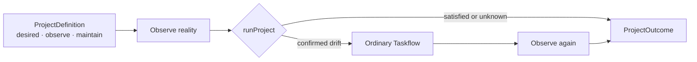

# CharterArc foundation

Status: pre-stable experimental release candidate, not GA.

## Decision

CharterArc starts from the released Taskflow runtime. It is a thin project loop,
not a replacement execution system:

```text
ProjectDefinition + observed reality → zero or one ordinary Taskflow Run → Outcome
```

Taskflow keeps all phase, DAG, gate, retry, approval, loop, host, and execution
semantics. CharterArc owns only the long-lived declaration and the decision to
attempt maintenance when current evidence confirms drift.



The dependency direction is one-way:

```text
CharterArc → taskflow-core
Hosts      → CharterArc + taskflow-core
```

`taskflow-core` never imports CharterArc. CharterArc never imports a host SDK,
MCP server, daemon, or alternative scheduler.

## Minimal declaration

```ts
defineProject({
  desired: "main is releasable",
  observe: ({ cwd, signal }) => observeReality(cwd, signal),
  maintain,
});
```

`maintain` is an ordinary Taskflow value, including one compiled from `.tf.ts`.
Its existing `name` is the only project identity; a duplicate
`ProjectDefinition.name` had no independent routing or persistence semantics
and was deleted while the package was still private.
The runtime captures the observer function and a detached maintenance Taskflow
before observation. It also captures the Taskflow runtime binding so observe,
execute, and re-observe use the same project root. The observer returns only a
three-state result plus an optional human-readable summary:

- `satisfied`: the checked invariant currently holds;
- `drifted`: evidence is sufficient to authorize the declared maintenance Run;
- `unknown`: evidence is insufficient, so mutation is forbidden.

After a Run, CharterArc calls the same observer again. The final status
describes reality, while `run.ok` describes the attempt; neither is used as a
causal claim about the other.

Taskflow's own validation and execution semantics remain unchanged. In
particular, CharterArc does not promote Taskflow's advisory built-in verifier
findings into a stricter dialect. Callers that need a blocking policy can use
the existing Taskflow verifier seam.

## Evidence that changed the design

| Experiment | Observation | Resulting subtraction or boundary |
|---|---|---|
| README phase catalog | Reporting only one missing phase caused a wrong edit | Keep complete evidence in `summary`; add no planner or new data model |
| Real detached Taskflow worktree | A writer promised a repair without editing | Tighten the existing phase prompt and thinking level; keep a read-only gate |
| Fresh packed consumer | Development exports referenced unpublished source | Fix package exports; add no runtime factory |
| Real Hilo regression fixture | A failed command alone could not distinguish drift from infrastructure failure | Domain observer proves the fixed baseline and known sentinel; add no Git abstraction |
| All retained declarations | Each project bound one observer, and every top-level project name merely duplicated `maintain.name` | Keep the observer in `ProjectDefinition`; delete registry, fan-out, source plumbing, and the second identity |

The experiments also found no retained use for `changedPaths`, a one-field
snapshot wrapper, a second error string, output freezing, a model planner, or a
second scheduler. A named observer registry and its array aggregation were also
deleted.

## Self-dogfood protocol

The repository root is now a real CharterArc consumer:

```bash
pnpm run dogfood:charterarc
```

`charterarc.project.ts` is the current executable hypothesis, not a backlog or
knowledge ledger. Its finite observer runs fixed scoped typecheck and test
commands. A recognized TypeScript diagnostic or failing test is `drifted`;
missing tools, wrong repository identity, aborts, empty test runs, and
unclassified command failures are `unknown` and cannot authorize mutation. A
healthy project returns `satisfied` without starting an Agent.

This adds the following constraint to the active project goal:

> Each iteration turns one real unmet case into a retained acceptance test and
> uses the root ProjectDefinition's observe → ordinary Taskflow → re-observe
> path for the repair. No proven drift means no modification.

The primary agent now acts under the delegated decision contract in
[`charterarc-autonomous-goal.md`](./charterarc-autonomous-goal.md): it selects
the next real problem, binds acceptance, and retains or rejects the result.
CharterArc only executes the declared attempt. Each iteration may run at most one existing
Taskflow; it must not add a Goal/Rule/Outcome/Knowledge store, planner,
scheduler, daemon, registry, second IR, phase kind, or self-only runtime API.
When a slice becomes satisfied, its durable invariant belongs in an ordinary
regression test; the rolling declaration is replaced for the next slice rather
than accumulating historical rules.

All self-dogfood model phases are bound to the existing Grok Build runner.
There is no fallback to Codex, Claude, OpenCode, or Pi. A healthy observation
still invokes no model. The checked-in `.grok/sandbox.toml` defines a
workspace-write profile for repair and a read-only profile for review; the
dogfood command selects them by default. Operator-provided
`PI_TASKFLOW_GROK_MUTATING_SANDBOX_PROFILE` and
`PI_TASKFLOW_GROK_READONLY_SANDBOX_PROFILE` values still override those
defaults. A drifted run fails closed when Grok or the selected custom profile
is unavailable.

The bootstrap first returned `satisfied` with no Run. The next retained
acceptance test then exposed a real false-green: a nested Node test inherited
`NODE_TEST_CONTEXT` and exited successfully without executing its fixture.
CharterArc observed `drifted`, ran one ordinary repair → review Taskflow, removed
that inherited marker only for the child check, and re-observed `satisfied`.
The regression remains in the normal CharterArc suite. This is the first actual
self-modification; it required no self-only runtime path.

A second adversarial review found that inherited `NODE_OPTIONS=--test-only`
could still filter the suite and that a review gate's BLOCK could be hidden by
an independently satisfied post-observation. Three failing acceptance tests
were added first. A second ordinary Taskflow removed the inherited filter,
rejected zero-test success, and made the dogfood command require both observed
reality and a non-failed Run. It again completed as
`drifted → one Run → satisfied`; the following healthy run was a no-op.

After self-evolution was locked to Grok, the first live Grok cycle exposed that
the otherwise-safe runner could not start without operator-global sandbox
setup. Grok's project-local custom profiles closed that bootstrap gap without
adding a CharterArc option or host dependency. A failing acceptance test then
drove one Grok repair → Grok review Run to default the two profile names while
preserving explicit operator overrides.

That live Run exposed a second concrete side effect: `pnpm run` inside Grok's
workspace sandbox selected a project-local pnpm store, rebuilt `node_modules`,
and wrote roughly 707 MB into the worktree. The generated store was moved to
Trash and the normal global-store links were restored. A retained acceptance
test now forbids package-manager commands in both maintenance prompts; repair
and review execute the same direct Node/TypeScript commands as the observer.
The Grok-only repair → review Run returned to `satisfied` with 30 acceptance
tests, and future healthy checks remain zero-model no-ops.

The next live Grok Run exposed a smaller observability loss: current Grok
terminal events reported tokens, turns, and USD cost, but the Taskflow runner
discarded them and CharterArc had no way to expose the ordinary Run's totals.
Failure-first tests retained both boundaries. The Grok parser now records
well-formed spend, and `ProjectOutcome.run` passes through Taskflow's aggregated
usage plus its accounting mode. A live
`runProject → Taskflow → grokSubagentRunner` smoke produced nonzero token and
USD evidence. Because older or incomplete Grok events can still omit spend,
the runner remains `unavailable` for budget admission: a zero or absent field
is unknown, never proof of a free Run.

A later subtraction trial exposed a more important dogfood failure. The first
Grok repair changed the new acceptance test back to the old required
`ProjectDefinition.name`, and its reviewer passed the title/behavior
contradiction. The first response configured `packages/charterarc/test` as a
relative sandbox `read_only` directory. A later live probe proved that setting
did not stop an absolute-path Grok edit, so it is no longer treated as a safety
boundary. The running parent now hashes acceptance plus the governing Project,
launcher, sandbox, Goal, and metrics files before and after the bounded Run and
forces reported `ok: false` on any change. This detects and rejects tampering;
it does not claim to prevent the write. With primary verification enforcing
that boundary, exact type and runtime tests rejected both a required and an
optional compatibility alias. Grok then removed the duplicate identity from
the definition, declarations, and `runProject`; the ordinary Taskflow's
`maintain.name` now supplies the existing identity.

This was not a one-shot autonomy success. Four Grok-only Runs all reported
`satisfied`, but source-level review rejected or narrowed the first three:
test rewrite, optional alias, then a direct-`runProject` key-stripping bypass.
The fourth closed the exact type and runtime contract. Grok reported 64 turns,
314,663 input tokens, 35,568 output tokens, 2,106,240 cache-read tokens, and
$1.474606 across those four attempts. Those are observed values, not a
complete-accounting guarantee. The result is evidence for a narrower claim:
CharterArc can make controlled attempts cheaply enough to inspect, but it does
not replace the acceptance boundary or product judgment.

The two retained consumers then exposed one more repeated seam: both declared
the same `args.charterarc` schema even though `runProject` always supplies that
runtime argument and existing Taskflow interpolation already accepts it. One
Grok-only Run removed both declarations without changing Taskflow or
CharterArc. The phase-docs repair test still proves `{args.charterarc}` reaches
the ordinary flow, including under the self-flow's strict interpolation mode.
Grok reported 12 turns and $0.3346944 for this subtraction.

## External adoption probe: cli-lab

The first independent consumer used the real `cli-lab` monorepo rather than a
fixture. Its active main worktree contained unrelated in-progress changes, so
the probe used an isolated worktree at the current committed HEAD and did not
touch that WIP. The project declaration reused the repository's authoritative
`uv run cli-lab doctor` and `smoke all` commands.

The clean checkout produced two distinct observations:

1. `doctor` passed, while `smoke all` failed because `mcp-cli` dependencies
   were not installed. CharterArc returned `unknown` and started no model;
   dependency, service, and authentication failures were not treated as source
   mutation authority.
2. After installing the existing frozen `mcp-cli` lockfile, the same declaration
   returned `satisfied`, again with no model Run.

The consumer ran against locally packed `charterarc`, `taskflow-core`, and
`taskflow-hosts` artifacts, so the default package path—not workspace source
resolution—was exercised. A focused classifier test retains the rule that
only tracked registry/package diagnostics can authorize repair; mixed
environment failures remain `unknown`.

The initial probe was not retained at that point. It is now deliberately kept
on `codex/charterarc-cli-lab-consumer` at commit `88371ea`. Before retention,
the acceptance directory was configured as Grok `read_only`—a setting later
shown not to enforce the intended relative path—the review gate lost shell
authority, and one confirmed adoption drift required the runner to fail closed
when an attempted Taskflow Run failed or blocked. One Grok-only Run
reached `drifted -> satisfied`, reported 12 turns and $0.2094324, and changed
only the runner's exit check. Independent verification passed 5/5 consumer
tests, `uv run cli-lab doctor`, and all eight registered CLI smoke commands; the
next invocation returned `satisfied` with no Run.

The retained branch still uses local private packages and is not portable to a
fresh clone. This is local adoption evidence, not a package-delivery or GA claim.

## Private packed-consumer gate

The external probe also exposed a narrower release-engineering gap: its local
tarballs worked, but the repository's packed-consumer gate covered only the
nine public Taskflow packages. A retained private-package check now builds,
packs, installs, and executes `charterarc` with its packed `taskflow-core`
dependency in a clean npm consumer. It exercises both the zero-Run satisfied
path and a confirmed-drift ordinary Taskflow Run. CharterArc remains private
and stays outside `RELEASE_PACKAGE_NAMES`; this adds evidence without creating
a public compatibility promise.

The dogfood required three Grok-only attempts and exposed why source-shaped
acceptance is insufficient:

1. Grok added the smoke, root command, and CI wiring. The live smoke passed, but
   running pnpm against the repository from its sandbox created a 763 MB local
   store.
2. Grok moved the store path under a temporary root and all 35 source-level
   checks passed. The actual command then disproved the fix: pnpm 11 rejected
   `--store-dir` in that position and tried to relink the repository install.
3. Grok moved packing into a disposable copied workspace and supplied the
   temporary store through pnpm's environment. The real
   `pnpm run test:pack-charterarc` then passed without creating `.pnpm-store`
   or changing the repository install graph.

The three Runs reported 48 turns, 253,499 input tokens, 30,258 output tokens,
1,944,960 cache-read tokens, and $1.272034. The first implementation also left
a later 57 MB partial store while being disproved; both generated stores were
moved to Trash, and the repository install was rebuilt offline from the normal
global pnpm store. The lesson is retained in executable isolation rather than
another CharterArc concept: a Grok PASS and green static contract are proposals;
the consumer command is the authority for package usability.

## External adoption probe: overstory

The second independent consumer used a clean worktree of the real `overstory`
monorepo and its existing `npm run verify` contract. The repository required a
normal build before the Pi workspace could resolve the core package; the first
Grok repair completed the entrypoint, but the review correctly blocked the
unbuilt checkout instead of claiming adoption success. After the authoritative
build and verify commands passed, a second cycle exposed that a successful
healthy no-op was silent. Grok added the complete JSON `ProjectOutcome` output,
but the outer acceptance process reached its own 120-second deadline while the
old review gate was still running, so that interrupted review was not counted
as a PASS.

A later real invocation observed the default 30-second project deadline return
`unknown` under load. Acceptance then required an explicit 120-second observer
deadline. One bounded Grok repair -> review Taskflow returned
`drifted -> satisfied`, `run.ok: true`, 12 turns, and $0.2848728. Independent
checks then passed all 274 core tests, 28 Pi tests, and 4 consumer tests; the
next project invocation returned `satisfied` with no Run.

This is retained local evidence, not portable or active adoption. The private CharterArc
package is installed from local tarballs, so a fresh clone cannot reproduce the
consumer until there is a deliberate package-delivery decision. The branch is
therefore candidate evidence for M2, not proof of M2, public compatibility, or
a GA claim.

## External adoption probe: llm-arena

A third independent consumer used a clean worktree of the real `llm-arena`
repository rather than another fixture. The declaration bound the project's
existing verification contract and the same private packed-consumer path used by
overstory. Drift was real source and adoption debt, not environment noise.

Closing that debt took three bounded Grok-only Runs. Across those Runs Grok
reported 45 turns and $0.8414336. Independent checks then passed the consumer's
own suite; the next project invocation returned `satisfied` with no Run.

At that point the probe was the second retained external branch (with overstory).
Those branches copy a short Grok bootstrap each.
Extracting that bootstrap into a shared helper or CLI would add a `taskflow-hosts` dependency
to CharterArc's public surface and does not reduce the consumer-specific `observe` judgment
that still belongs in each project's declaration. Keep the framework unchanged until
package delivery makes those branches portable or a third retained consumer proves the
duplication cost is worse than a deliberate seam.

## Review capability correction

The self-consumer, cli-lab probe, and overstory probe all repeated one semantic
mistake: their review gate requested `bash` to rerun checks. The Grok runner
correctly treats any shell as mutating, so those nominal reviews selected the
workspace-write profile rather than the read-only profile. Mechanical checks
already run in the repair phase and again in the post-run observer / primary
audit; the model review does not need a shell.

Overstory now retains a consumer test proving its review argv selects the
custom read-only profile, denies mutators, and disables subagents. CharterArc
then dogfooded the same correction: a new failing acceptance test required the
self-review gate to drop `bash` and the duplicate commands. One Grok-only
repair -> review Run changed only `charterarc.project.ts`, returned
`drifted -> satisfied`, 9 turns, and $0.2798776. The next self invocation was a
zero-model no-op, and direct argv evidence selected `charterarc-self-review`.
The transition review still used the old write-capable profile because the
running DAG was captured before repair; its diff and 35 tests were audited
independently, and subsequent reviews are now fail-closed read-only.

Multiple consumers now repeat the Grok bootstrap, and three retained external
branches exist locally, but none is portable while CharterArc is private. The
third branch did not change the causal seam: each consumer still needs its own
`observe` judgment, while the repeated runner remains short. Do not add a host
factory, CLI, or third public runtime function. Reconsider that seam only after
package delivery makes retained consumers reproducible on a fresh clone or
measured runner maintenance exceeds the cost of a deliberate seam; until then
the duplication is cheaper than a new abstraction.

## Adoption burden and private release candidate

After all three external governance migrations, the retained consumer trees
contain 1,237 checked-in CharterArc lines: 695 in Project declarations, 262 in
consumer acceptance, 208 in host runners, 45 in local package manifests, and 27
in Grok sandboxes. Declarations plus acceptance are 957/1,237 lines (77.4%);
runners alone are 208/1,237 (16.8%), and all runner/package/sandbox plumbing
together is 280/1,237 (22.6%). A runner helper
would optimize the smaller part while leaving the domain-specific `observe`
classification—the part that safely separates `drifted` from `unknown`—inside
every project. The helper/CLI route is now eligible for a measured subtraction,
but remains unaccepted until its total surface is smaller.

The shared blocker is package delivery instead: all three branches keep local
dependencies untracked, while `charterarc` remains private and outside
`RELEASE_PACKAGE_NAMES`. The existing private packed-consumer smoke covered only
`taskflow-core + charterarc` with a mock runtime, even though every retained
consumer injects `taskflow-hosts/grok`.

One Grok-only self-maintenance Run added the real three-package install and a
healthy Grok bootstrap, then reported 34 turns and $0.8091664. The primary
narrowed that result after the read-only reviewer exposed a dirty-worktree false
green: the standalone command packed `taskflow-hosts` without rebuilding it. A
second bounded Run added the missing build filter, reported 12 turns and
$0.3045456, and was accepted. Independent verification passed 37/37, rebuilt
all three packages, installed their tarballs in a fresh consumer, and still
passed with `PI_TASKFLOW_GROK_BIN` pointing to a nonexistent binary—direct
evidence that the healthy path made no model call. No repository-local pnpm
store remained.

This is a private release candidate, not a release. `charterarc` is still
`private: true`, remains outside the nine-package release list, and adds no
runtime function or host dependency. The already published `taskflow-core` and
`taskflow-hosts` 0.2.6 packages satisfy its current dependency boundary; making
CharterArc public is a separate compatibility and publication decision.

## Fail-closed outcome subtraction

The retained self runner plus all three external runners repeated the same
success rule: observed reality had to be `satisfied`, and any attempted
Taskflow Run also had to be successful. This duplication was not cosmetic. An
earlier cli-lab adoption cycle had already shown that checking only observed
reality could hide a failed or blocked maintenance attempt.

The primary bound the behavior matrix in the acceptance directory first. A
later live probe showed that the directory's relative `read_only` setting was
not an enforcement boundary, so the evidence rests on independent diff and
acceptance verification rather than that setting. The self Project then observed seven missing-property
TypeScript diagnostics, executed one ordinary Grok repair -> read-only review
Taskflow, and re-observed `satisfied`. The accepted result adds one required
`ProjectOutcome.ok` boolean while preserving `status` as a statement about
reality. `ok` is true only when the latest observation is satisfied and any
attempted Run succeeded. The self runner deleted its local helper and now exits
directly on that one fail-closed result.

Independent verification passed 37/37 CharterArc checks, rebuilt and installed
`taskflow-core + taskflow-hosts + charterarc` as packed artifacts, and exercised
both healthy and drift paths. With `PI_TASKFLOW_GROK_BIN` set to a nonexistent
binary, the healthy self invocation still returned `satisfied`, `ok: true`, and
no `run`. The Run reported 17 turns, 127,955 input tokens, 7,728 output tokens,
566,528 cache-read tokens, and $0.4722364. No new authoring field, function,
phase, host, or control plane was added.

The next consumer evidence is migration, not another framework abstraction:
each retained external runner should consume the packed `outcome.ok` contract
through its own CharterArc cycle and delete its local two-part predicate.

### First external subtraction: overstory

The overstory Project then observed its retained runner reconstructing the same
two-part success rule. Its one Grok repair and read-only review Run changed only
`.charterarc/run.mjs`: two local lines became `if (!outcome.ok)`. The Project
declaration and immutable acceptance were updated by the primary first, so the
model could neither weaken the rule nor replace it with another helper.

Independent verification passed 274 core tests, 28 Pi tests, and all four
consumer acceptance tests. A direct invocation with `PI_TASKFLOW_GROK_BIN`
pointing to a nonexistent executable returned `satisfied`, `ok: true`, and no
`run`. This is the intended net-complexity result: CharterArc added one public
result field once, while the first external consumer deleted its private
semantic copy and added no authoring concept.

The initial drift proof also exposed a test-authority mistake. The test called
the real root entrypoint while the repository was drifted, so the proof command
itself triggered the one maintenance Run and its pre-repair assertion left the
enclosing suite red. The primary did not trigger another maintenance Run. After
independent verification, the healthy-entrypoint probe was pinned to a missing
Grok binary. It can still prove the zero-Run path, but a future acceptance test
can no longer silently acquire live model authority. The nested process did not
retain its usage JSON, so that Run's turns, tokens, and cost remain unknown.

### Second external subtraction: llm-arena

The llm-arena Project independently observed the same duplicated success rule.
The primary bound a static contract that required direct `outcome.ok` use and
rejected any `runOk`, `status + run`, or alternate-host fallback. Taskflow's
zero-token verifier accepted the existing two-phase Flow with only its
intentional terminal-gate warning. One Grok repair plus read-only review Run
then changed only `.charterarc/run.mjs`, replacing the local reconstruction
with `if (!outcome.ok)`.

The Run re-observed `satisfied`, reported 10 turns, 68,205 input tokens, 2,979
output tokens, 175,104 cache-read tokens, and $0.2068152. The primary separately
verified 43/43 Python adversarial cases, Web lint with zero errors and the two
pre-existing warnings, the production build, and all five consumer acceptance
tests. With the Grok binary forced to a nonexistent path, the real entrypoint
still returned `satisfied`, `ok: true`, and no `run`.

Two independent external consumers have now deleted their private copy of the
same semantic rule while adding no authoring concept. This supports retaining
`ProjectOutcome.ok`; it does not justify a migration helper, a new Project
field, or publication.

### Third external subtraction: cli-lab

The cli-lab Project observed the last retained external copy of the old success
predicate. Before authorizing mutation, the primary verified the clean consumer
worktree and separated it from the canonical main worktree's unrelated user
changes. The current repository baseline listed eight registered CLIs, passed
`cli-lab doctor`, resolved the default profile, and passed every registered CLI
smoke. Missing optional credentials remained environment facts, never drift.

The primary then bound direct `outcome.ok` acceptance and rejected any local
`runOk`, `status + run`, or alternate-host reconstruction. Taskflow's zero-token
verifier accepted the unchanged repair-to-read-only-review Flow with only its
intentional terminal-gate warning. One Grok Run changed only
`.charterarc/run.mjs` to `if (!outcome.ok) process.exitCode = 1`, re-observed
`satisfied`, and reported 11 turns, 70,419 input tokens, 2,539 output tokens,
222,080 cache-read tokens, and $0.2226960.

Independent verification passed doctor, default-profile resolution, all eight
CLI smokes, and all five consumer acceptance tests. With the Grok binary forced
to a nonexistent path, the real entrypoint still returned `satisfied`,
`ok: true`, and no `run`. All three retained external consumers have now
deleted their private success rule while adding no authoring concept. This is
strong cross-project evidence for retaining the one result field, but it does
not establish the four-week or comparative-value claim required for release.

## First external governance migration: overstory

The self-consumer's governance correction exposed the same false safety claim
in all three retained external branches: each sandbox listed relative
`read_only` paths even though the live probe had already shown that this does
not prevent absolute-path edits. Overstory was migrated first, without a Grok
Run. Its parent launcher now snapshots the sandbox, launcher, and acceptance
tree before and after `runProject` and forces the reported result to `ok: false`
when they differ. Its observer treats a missing guard or a reintroduced
relative `read_only` declaration as `unknown`, so governance drift cannot grant
model mutation authority.

The first acceptance invocation exposed one brittle local coupling: the
observer still searched the launcher source for `outcome`, while the guarded
launcher now prints the final `reported` value. That started one ordinary
Taskflow attempt, which failed before any Grok call or mutation because the
binary was deliberately invalid. The primary corrected the observer and did
not invoke Taskflow again. Independent verification passed all four consumer
acceptance tests, the 274 core tests and 28 Pi tests behind `npm run verify`,
and a direct invalid-binary healthy invocation returned `satisfied`, `ok: true`,
and no `run`.

This migration removes an unenforced prevention claim and retains a narrower
post-Run detector; it does not make CharterArc a security boundary. It also
adds 45 net lines to the overstory launcher. That cost is real evidence against
pretending the current consumer bootstrap is already minimal. Do not extract a
public helper after one migration: apply the same correction to another
retained consumer, then compare the repeated burden with the helper surface it
would replace.

## Second external governance migration: llm-arena

llm-arena repeated the same contradiction. The primary first changed its
observer so a missing parent guard or relative `read_only` declaration is
`unknown`; the red acceptance invocation therefore exited before Taskflow and
could not call Grok. The parent launcher then gained the same pre/post snapshot
over its sandbox, launcher, and acceptance tree, while the unenforced relative
setting was removed.

Independent verification passed 43/43 Python adversarial cases, Web lint with
only the two pre-existing warnings, the production build, all six consumer
acceptance tests, and a direct invalid-binary healthy invocation returning
`satisfied`, `ok: true`, and no `run`. No Taskflow or Grok Run occurred, no
product source changed, and no public concept was added.

The second migration again added 45 net lines to the launcher. Repetition has
now crossed the minimum evidence threshold for evaluating a shared seam, but it
does not prove that a helper would be smaller: a helper must also receive file
scope, preserve independent acceptance authority, and avoid pulling Grok host
policy into CharterArc. Migrate cli-lab once under the same local contract,
then compare the exact removable duplication with the central API and tests it
would require. If the helper does not reduce the total judgment surface, reject
it and keep the explicit launchers.

## Third external governance migration: cli-lab

cli-lab completed the same primary-owned correction. Its observer first made a
missing guard or relative `read_only` declaration `unknown`, and the red
acceptance invocation exited before Taskflow. The launcher then gained the
pre/post sandbox, launcher, and acceptance snapshot, while its false prevention
claim was removed. The project-level `desired` sentence did not grow: the
governance mechanism remains execution policy rather than part of the project
outcome authors must describe.

Independent verification used the current canonical cli-lab surface: `list`
reported eight registered CLIs, doctor passed every repository and package
check, the default profile resolved, and all eight smoke commands passed.
Missing optional credentials remained visible environment state rather than
source drift. All six consumer acceptance tests passed, and a direct invocation
with an invalid Grok binary returned `satisfied`, `ok: true`, and no `run`.
There was no Taskflow or Grok Run and no product-source change.

The migration added 44 net launcher lines and 103 net CharterArc lines overall.
Across the three governance corrections, the launchers gained 134 net lines and
the full consumer trees gained 287. That is now concrete repeated friction, not
a hypothetical preference for elegance. It justifies the next comparison; it
does not by itself authorize a third public runtime function, governance option,
or host-specific dependency.

## Governance seam decision

Decision: **retain the local guards**.

The three governance migrations added 134 net launcher lines of repeated
pre/post snapshot and fail-closed reporting. That is enough friction to force
a comparison; it is not enough to authorize extraction. The comparison is:

1. Existing Taskflow workspace seams do not delete those lines. A phase with
   `cwd: "worktree"` isolates the agent in a throwaway worktree and is
   fail-open when allocation degrades to a temp dir; teardown is discard of
   the isolated tree, not a post-`runProject` check that parent launcher,
   sandbox, and acceptance sources stayed immutable. `taskflow_reconcile_workspace`
   advances resolve-only workspace generation after inspection; it does not restore
   files or compare protected-file content and membership before and after a Run.
   Neither seam replaces the consumer-owned guard without a new CharterArc
   authoring concept (file scope, when to force `ok: false`, what counts as
   governance vs product drift).

2. The 134 net launcher lines are an upper bound on removable consumer lines,
   not a claimed helper saving: each launcher still needs to call `runProject`,
   bind its host, report the outcome, and exit fail-closed. A smallest
   host-neutral candidate would add path-scope configuration, snapshot equality,
   result rewriting, central implementation, and central tests. Its net line
   count remains unmeasured until there is a concrete patch. Consumer authoring
   would remain because each project must still name its protected scope and make
   a missing guard `unknown`. The candidate therefore fails the required judgment-
   surface test even before asking whether its code total is smaller.

Therefore extraction is rejected. Keep the explicit local guards. Return to
naturally occurring maintenance; do not invent migrations to justify a helper.

This decision was produced by the root CharterArc Project itself: the primary
bound this section as immutable acceptance, one Grok-only repair -> read-only
review Taskflow changed the evidence document, and the post-run observer passed
40/40 tests. The primary retained the decision but removed Grok's unsupported
claim that total code was already known not to shrink.

Reconsider when: a concrete patch shows both total lines and author-facing
judgment surface strictly smaller across the retained consumers, without a new
public runtime function or host-specific dependency in CharterArc. Another
consumer is relevant only if it changes that concrete comparison.

## Self-rule promotion evidence

The governance-seam cycle exposed a concrete review failure: Grok's read-only
reviewer accepted a quantitative code-size claim for which no helper patch had
been built. The primary narrowed that claim to `unmeasured`, then bound the
lesson in immutable acceptance: future self-review must BLOCK factual or
quantitative claims unsupported by visible evidence and must mark the value
unmeasured rather than infer it.

The root Project observed `39/40` and ran one Grok-only repair -> read-only
review Taskflow. Grok made the minimal three-line prompt change in
`charterarc.project.ts`; the post-run observer reached `40/40`. The parent still
returned `ok: false` because the Project declaration is itself a governed file
and its digest changed during the Run. That is the intended no-silent-learning
boundary: a Run may propose its next Rule, but it cannot approve that Rule in
the same attempt.

Under the delegated Goal, the primary independently inspected the two-file
diff, retained the immutable test, and explicitly promoted the Project change
as the next revision. Typecheck, 40/40 tests, the real three-package packed
consumer, and a missing-Grok healthy invocation then passed; the healthy call
started no Run. This required no promotion API, Rule store, or second control
plane: the ordinary diff and commit remain the authorization boundary. Because
the attempted Run correctly failed governance, this accepted revision receives
no M4 cycle credit.

## Adoption liveness audit

A fresh zero-model observation ran each retained external Project directly.
Overstory, llm-arena, and cli-lab all returned `satisfied`, but branch topology
showed why those green results cannot yet support the longitudinal claim. Their
consumer branches are respectively 4, 3, and 3 integration-only commits ahead
of local `main`, with zero commits from `main` missing; none has a remote, and
none of the three `main` trees contains a CharterArc declaration. No ordinary
post-adoption project change has passed through these Projects.

The branches remain valid integration and adoption-burden experiments. They are
not active external adoption, do not prove that a project chose CharterArc
because it was simpler than the prior workflow, and do not start the four-week
window. Metrics now distinguish `3/3` retained local experiments from `0/3`
active adoptions. The eleven prior cycles remain candidate engineering evidence,
but cannot establish M4 until M2 becomes true. Repeating healthy observers on
frozen branches would add no evidence and must not trigger a Grok Run.

## Adoption promotion-readiness audit

A deterministic follow-up audited the exact three consumer branch diffs,
their `.charterarc/package.json` manifests, ignored files, the official npm
registry, and the central release pipeline. The integration code contains no
checked-in absolute path, `file:`, `link:`, workspace, or tarball dependency.
Each consumer instead declares the same exact public-looking dependency set:
`charterarc@0.2.6`, `taskflow-core@0.2.6`, and `taskflow-hosts@0.2.6`.

That manifest is not reproducible from a fresh clone. `taskflow-core@0.2.6`
and `taskflow-hosts@0.2.6` resolve from npm, but an explicit read from
`registry.npmjs.org` returned `E404` for `charterarc@0.2.6`. None of the
consumer branches tracks a `.charterarc` lockfile, and all three successful
local observations load an ignored `.charterarc/node_modules`. In the central
repository, the package remains `private: true`, is absent from
`RELEASE_PACKAGE_NAMES`, and is absent from the publish workflow. The packed
consumer smoke proves that the artifact itself can be built and installed; it
does not provide that artifact to a fresh consumer checkout.

The promotion decision is therefore narrowed, not green: the branch code is a
valid local integration candidate, but none of the three branches is currently
merge-ready as a portable adoption. A merge would preserve a manifest whose
declared package does not exist. No Grok Run was warranted because model work
cannot change that external fact.

## Private-artifact clean-checkout probe

The next reversible probe separated artifact availability from consumer code.
The central deterministic packer built `taskflow-core`, `taskflow-hosts`, and
`charterarc`, repeated each pack to check byte integrity, and installed those
three local tarballs into archive-only checkouts of every consumer branch. Each
checkout began without either root or `.charterarc` `node_modules`; project
dependencies were then restored from the checked lockfiles or `uv.lock`.

llm-arena passed all 6/6 consumer checks and cli-lab passed all 6/6. Overstory's
first clean checkout returned `unknown`, not `drifted`: its Pi workspace imports
the core package through `dist` exports, but the root `verify` script typechecked
before any build had materialized those exports. The same checkout passed its
full 274 core plus 28 Pi verification after an explicit build, proving the
cause without authorizing a model from ambiguous infrastructure evidence.

The primary then bound one immutable rule: clean-install verification must
build workspace exports before typecheck. The overstory Project observed that
single declared drift and ran one ordinary Grok repair followed by Grok
read-only review. Grok changed only the root `package.json` verify order; the
post-run observer returned `satisfied` and `ok: true`. Independent acceptance
passed 5/5, and a second archive-only checkout installed both the locked project
dependencies and the three private tarballs before passing the same 5/5 healthy
no-Run checks. The retained consumer revision is `bef77f9`.

This removes a hidden consumer-code blocker without changing CharterArc. All
three declarations can now run from clean checkouts when the exact private
artifact is supplied. They still lack a durable artifact location and an active
keep/merge decision, so M2 remains `0/3` and the four-week window remains
unstarted. The probe adds no installer, registry, API, phase, or public concept.

The user then authorized the narrower experimental route: before M4,
CharterArc may use a semver prerelease on npm's `experimental` dist-tag with no
stable compatibility promise. CharterArc stays outside the stable nine-package
release. After an explicit execution checklist, tag
`charterarc-v0.2.7-experimental.0` published one deterministic artifact with
SLSA provenance. A replay rebuilt the tag, matched registry integrity, verified
the repository, workflow, ref, release commit, and npm owner, and then passed
the complete packed smoke and CharterArc acceptance.

The first publish exposed a registry constraint rather than a product rule:
the public npm registry requires package metadata to retain `latest` and
rejected its removal with HTTP 400, even though publication explicitly used
`--tag experimental`. The workflow now accepts `latest` equal to this version
only while it is the sole published version; it never sets or moves `latest`.
Consumers pin the exact prerelease or `@experimental`, and no stable
compatibility promise exists.

Fresh archive-only checkouts of all three consumer commits then installed the
exact artifact directly from `registry.npmjs.org` with matching integrity and
passed 7/7 acceptance apiece. Overstory and llm-arena were fast-forwarded to
their consumer commits on clean `main` branches and repeated 7/7 plus direct
healthy, missing-Grok zero-Run observations. cli-lab's archive passed, but its
dirty user worktree was intentionally not merged. This establishes 2/3
activation and removes the distribution blocker; it does not establish active
adoption until all three are retained and later ordinary project changes pass
through their Projects. M2 and the four-week window therefore remain at zero.

## Declarative multi-Flow reset

The North-Star reset removed the old single-Flow compatibility form rather than
layering another planner over it. Commit `badbba02` now accepts one exact
authoring shape: desired promises and ordinary Taskflows share route keys, an
optional Module may narrow the same pair, and an explicit observation snapshot
selects at most one route. The runtime binds selection, desired text, and the
snapshot into `args.charterarc`, statically verifies the selected Taskflow, runs
it through the existing engine, and observes again. It adds no phase, runner,
scheduler, daemon, registry, or second IR.

The self declaration demonstrated two different live routes. A checked
typecheck failure selected `maintain-charterarc-types`; after that Run,
re-observation exposed a distinct test failure without switching plans inside
the completed Run. A later invocation selected
`maintain-charterarc-tests`. Both Grok reviews passed. Two further Runs removed
the compatibility alias and hardened malformed observation handling. One
earlier Grok process stopped making progress and was interrupted; it is not
counted as a successful attempt. Independent verification passed 47/47
CharterArc tests, typecheck, the packed consumer, all 2,080 repository tests,
and a healthy invocation with the Grok binary forced missing.

All three retained consumer branches then migrated without a model Run:

- overstory `6fb2077`: entrypoint and verification Flows;
- llm-arena `7fc6bda`: entrypoint, Python, web-lint, and web-build Flows;
- cli-lab `50806e6`: registry and package-doctor Flows.

Each declaration points to `charterarc@0.2.7-experimental.0`. The original
deterministic local-tarball gate passed from archive-only checkouts with no
pre-existing root or CharterArc dependencies; the later public-registry gate
repeated 7/7 for all three against the exact npm artifact. Overstory and
llm-arena now retain those declarations on `main`; cli-lab remains isolated on
its consumer branch to protect unrelated user WIP. M2 is still 0/3 because no
post-activation ordinary project change has passed through these Projects, and
the four-week window has not started.

The migrations remove model-side prompt branching by choosing a narrower Flow
before execution, but they do not remove the consumer-specific observation
judgment. Their declarations grew by 20, 29, and 26 net lines respectively.
The cli-lab correction removed an unreachable entrypoint route: its real doctor
evidence now deterministically distinguishes registry drift from package drift,
while entrypoint incompleteness remains non-authorizing `unknown`. The three
acceptance suites drive the actual observer classifiers through both routes;
static Flow-map presence alone is no longer treated as route evidence.

## Plain Taskflow paired baseline

The product difference now has an executable counterfactual rather than an
architectural slogan. `packages/charterarc/test/fixtures/plain-taskflow-baseline.ts`
is a deliberately favorable plain-Taskflow dispatcher: it imports only the
Taskflow runtime at execution time, reuses CharterArc declaration types, and
omits CharterArc's declaration validation, cloning, and freezing. Its 215
physical lines still have to normalize evidence, enforce observer timeout and
abort, short-circuit healthy and unknown states, select a Project or Module
route, statically verify the selected Flow, bind inputs, construct and execute a
RunState, capture failure, observe again, and combine the final outcome
fail-closed. Those are semantic responsibilities, not a claim that 215 lines is
a mathematical lower bound.

The paired test sends both implementations through the same two routes and
asserts identical selection, bound tasks, Run result, and post-Run observation.
Each side makes exactly two identical model calls: one repair Agent and the same
JSON-contract review gate. Deterministic reconciliation adds no reviewer Agent,
approval phase, or human decision. The favorable baseline also runs the actual
healthy observers from overstory, llm-arena, and cli-lab and starts zero Runs.

As a literal copy comparison, the dispatcher would occupy 645 lines across
three repositories, while the route-aware consumer declaration deltas total 75
net lines: 570 fewer handwritten lines. That arithmetic is reproducible but not
universal. A team can compress the code or build a shared helper; doing so would
recreate the Project/reconciliation boundary being evaluated and must be
measured as a competing abstraction. The durable conclusion is narrower:
CharterArc centralizes the generic orchestration responsibilities while leaving
the irreducible domain observer and route map in each repository, with no extra
model or human review step.

This passes the local product-difference and handwritten-glue condition. It
does not prove active adoption. The prerelease is public and two clean consumer
mains retain it, while cli-lab remains pending; none has yet processed a later
ordinary project change. M2 remains `0/3`, and the four-week window has not
started. A shared observer or repository adapter remains rejected until
repeated retained consumers expose the same removable domain judgment.

Add a public concept only when multiple retained consumers cannot remain simple
with `Project / optional Module / Flow-map + Taskflow`.

Until then, goals, knowledge ledgers, daemons, registries, ProjectIR, new phase
kinds, and generic repository adapters stay outside the kernel.
