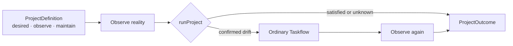

# CharterArc foundation

Status: private implementation experiment, not GA.

## Decision

CharterArc starts from the released Taskflow runtime. It is a thin project loop,
not a replacement execution system:

```text
ProjectDefinition + observed reality → zero or one ordinary Taskflow Run → Outcome
```

Taskflow keeps all phase, DAG, gate, retry, approval, loop, host, and execution
semantics. CharterArc owns only the long-lived declaration and the decision to
attempt maintenance when current evidence confirms drift.



The dependency direction is one-way:

```text
CharterArc → taskflow-core
Hosts      → CharterArc + taskflow-core
```

`taskflow-core` never imports CharterArc. CharterArc never imports a host SDK,
MCP server, daemon, or alternative scheduler.

## Minimal declaration

```ts
defineProject({
  desired: "main is releasable",
  observe: ({ cwd, signal }) => observeReality(cwd, signal),
  maintain,
});
```

`maintain` is an ordinary Taskflow value, including one compiled from `.tf.ts`.
Its existing `name` is the only project identity; a duplicate
`ProjectDefinition.name` had no independent routing or persistence semantics
and was deleted while the package was still private.
The runtime captures the observer function and a detached maintenance Taskflow
before observation. It also captures the Taskflow runtime binding so observe,
execute, and re-observe use the same project root. The observer returns only a
three-state result plus an optional human-readable summary:

- `satisfied`: the checked invariant currently holds;
- `drifted`: evidence is sufficient to authorize the declared maintenance Run;
- `unknown`: evidence is insufficient, so mutation is forbidden.

After a Run, CharterArc calls the same observer again. The final status
describes reality, while `run.ok` describes the attempt; neither is used as a
causal claim about the other.

Taskflow's own validation and execution semantics remain unchanged. In
particular, CharterArc does not promote Taskflow's advisory built-in verifier
findings into a stricter dialect. Callers that need a blocking policy can use
the existing Taskflow verifier seam.

## Evidence that changed the design

| Experiment | Observation | Resulting subtraction or boundary |
|---|---|---|
| README phase catalog | Reporting only one missing phase caused a wrong edit | Keep complete evidence in `summary`; add no planner or new data model |
| Real detached Taskflow worktree | A writer promised a repair without editing | Tighten the existing phase prompt and thinking level; keep a read-only gate |
| Fresh packed consumer | Development exports referenced unpublished source | Fix package exports; add no runtime factory |
| Real Hilo regression fixture | A failed command alone could not distinguish drift from infrastructure failure | Domain observer proves the fixed baseline and known sentinel; add no Git abstraction |
| All retained declarations | Each project bound one observer, and every top-level project name merely duplicated `maintain.name` | Keep the observer in `ProjectDefinition`; delete registry, fan-out, source plumbing, and the second identity |

The experiments also found no retained use for `changedPaths`, a one-field
snapshot wrapper, a second error string, output freezing, a model planner, or a
second scheduler. A named observer registry and its array aggregation were also
deleted.

## Self-dogfood protocol

The repository root is now a real CharterArc consumer:

```bash
pnpm run dogfood:charterarc
```

`charterarc.project.ts` is the current executable hypothesis, not a backlog or
knowledge ledger. Its finite observer runs fixed scoped typecheck and test
commands. A recognized TypeScript diagnostic or failing test is `drifted`;
missing tools, wrong repository identity, aborts, empty test runs, and
unclassified command failures are `unknown` and cannot authorize mutation. A
healthy project returns `satisfied` without starting an Agent.

This adds the following constraint to the active project goal:

> Each iteration turns one real unmet case into a retained acceptance test and
> uses the root ProjectDefinition's observe → ordinary Taskflow → re-observe
> path for the repair. No proven drift means no modification.

The primary agent now acts under the delegated decision contract in
[`charterarc-autonomous-goal.md`](./charterarc-autonomous-goal.md): it selects
the next real problem, binds acceptance, and retains or rejects the result.
CharterArc only executes the declared attempt. Each iteration may run at most one existing
Taskflow; it must not add a Goal/Rule/Outcome/Knowledge store, planner,
scheduler, daemon, registry, second IR, phase kind, or self-only runtime API.
When a slice becomes satisfied, its durable invariant belongs in an ordinary
regression test; the rolling declaration is replaced for the next slice rather
than accumulating historical rules.

All self-dogfood model phases are bound to the existing Grok Build runner.
There is no fallback to Codex, Claude, OpenCode, or Pi. A healthy observation
still invokes no model. The checked-in `.grok/sandbox.toml` defines a
workspace-write profile for repair and a read-only profile for review; the
dogfood command selects them by default. Operator-provided
`PI_TASKFLOW_GROK_MUTATING_SANDBOX_PROFILE` and
`PI_TASKFLOW_GROK_READONLY_SANDBOX_PROFILE` values still override those
defaults. A drifted run fails closed when Grok or the selected custom profile
is unavailable.

The bootstrap first returned `satisfied` with no Run. The next retained
acceptance test then exposed a real false-green: a nested Node test inherited
`NODE_TEST_CONTEXT` and exited successfully without executing its fixture.
CharterArc observed `drifted`, ran one ordinary repair → review Taskflow, removed
that inherited marker only for the child check, and re-observed `satisfied`.
The regression remains in the normal CharterArc suite. This is the first actual
self-modification; it required no self-only runtime path.

A second adversarial review found that inherited `NODE_OPTIONS=--test-only`
could still filter the suite and that a review gate's BLOCK could be hidden by
an independently satisfied post-observation. Three failing acceptance tests
were added first. A second ordinary Taskflow removed the inherited filter,
rejected zero-test success, and made the dogfood command require both observed
reality and a non-failed Run. It again completed as
`drifted → one Run → satisfied`; the following healthy run was a no-op.

After self-evolution was locked to Grok, the first live Grok cycle exposed that
the otherwise-safe runner could not start without operator-global sandbox
setup. Grok's project-local custom profiles closed that bootstrap gap without
adding a CharterArc option or host dependency. A failing acceptance test then
drove one Grok repair → Grok review Run to default the two profile names while
preserving explicit operator overrides.

That live Run exposed a second concrete side effect: `pnpm run` inside Grok's
workspace sandbox selected a project-local pnpm store, rebuilt `node_modules`,
and wrote roughly 707 MB into the worktree. The generated store was moved to
Trash and the normal global-store links were restored. A retained acceptance
test now forbids package-manager commands in both maintenance prompts; repair
and review execute the same direct Node/TypeScript commands as the observer.
The Grok-only repair → review Run returned to `satisfied` with 30 acceptance
tests, and future healthy checks remain zero-model no-ops.

The next live Grok Run exposed a smaller observability loss: current Grok
terminal events reported tokens, turns, and USD cost, but the Taskflow runner
discarded them and CharterArc had no way to expose the ordinary Run's totals.
Failure-first tests retained both boundaries. The Grok parser now records
well-formed spend, and `ProjectOutcome.run` passes through Taskflow's aggregated
usage plus its accounting mode. A live
`runProject → Taskflow → grokSubagentRunner` smoke produced nonzero token and
USD evidence. Because older or incomplete Grok events can still omit spend,
the runner remains `unavailable` for budget admission: a zero or absent field
is unknown, never proof of a free Run.

A later subtraction trial exposed a more important dogfood failure. The first
Grok repair changed the new acceptance test back to the old required
`ProjectDefinition.name`, and its reviewer passed the title/behavior
contradiction. The repair sandbox now makes `packages/charterarc/test`
read-only, and both repair and review treat any acceptance rewrite as a block.
With that boundary fixed, exact type and runtime tests rejected both a required
and an optional compatibility alias. Grok then removed the duplicate identity
from the definition, declarations, and `runProject`; the ordinary Taskflow's
`maintain.name` now supplies the existing identity.

This was not a one-shot autonomy success. Four Grok-only Runs all reported
`satisfied`, but source-level review rejected or narrowed the first three:
test rewrite, optional alias, then a direct-`runProject` key-stripping bypass.
The fourth closed the exact type and runtime contract. Grok reported 64 turns,
314,663 input tokens, 35,568 output tokens, 2,106,240 cache-read tokens, and
$1.474606 across those four attempts. Those are observed values, not a
complete-accounting guarantee. The result is evidence for a narrower claim:
CharterArc can make controlled attempts cheaply enough to inspect, but it does
not replace the acceptance boundary or product judgment.

The two retained consumers then exposed one more repeated seam: both declared
the same `args.charterarc` schema even though `runProject` always supplies that
runtime argument and existing Taskflow interpolation already accepts it. One
Grok-only Run removed both declarations without changing Taskflow or
CharterArc. The phase-docs repair test still proves `{args.charterarc}` reaches
the ordinary flow, including under the self-flow's strict interpolation mode.
Grok reported 12 turns and $0.3346944 for this subtraction.

## External adoption probe: cli-lab

The first independent consumer used the real `cli-lab` monorepo rather than a
fixture. Its active main worktree contained unrelated in-progress changes, so
the probe used an isolated worktree at the current committed HEAD and did not
touch that WIP. The project declaration reused the repository's authoritative
`uv run cli-lab doctor` and `smoke all` commands.

The clean checkout produced two distinct observations:

1. `doctor` passed, while `smoke all` failed because `mcp-cli` dependencies
   were not installed. CharterArc returned `unknown` and started no model;
   dependency, service, and authentication failures were not treated as source
   mutation authority.
2. After installing the existing frozen `mcp-cli` lockfile, the same declaration
   returned `satisfied`, again with no model Run.

The consumer ran against locally packed `charterarc`, `taskflow-core`, and
`taskflow-hosts` artifacts, so the default package path—not workspace source
resolution—was exercised. A focused classifier test retains the rule that
only tracked registry/package diagnostics can authorize repair; mixed
environment failures remain `unknown`.

This probe is not yet a retained downstream adoption. CharterArc is still
private, so the isolated branch requires local tarball installation, and its
generic Grok bootstrap is another 23-line runner. One external consumer is not
enough evidence to add a CLI, host factory, or new public helper. Keep the
framework unchanged until a second retained consumer repeats that exact
bootstrap cost or this consumer is deliberately adopted.

## Private packed-consumer gate

The external probe also exposed a narrower release-engineering gap: its local
tarballs worked, but the repository's packed-consumer gate covered only the
nine public Taskflow packages. A retained private-package check now builds,
packs, installs, and executes `charterarc` with its packed `taskflow-core`
dependency in a clean npm consumer. It exercises both the zero-Run satisfied
path and a confirmed-drift ordinary Taskflow Run. CharterArc remains private
and stays outside `RELEASE_PACKAGE_NAMES`; this adds evidence without creating
a public compatibility promise.

The dogfood required three Grok-only attempts and exposed why source-shaped
acceptance is insufficient:

1. Grok added the smoke, root command, and CI wiring. The live smoke passed, but
   running pnpm against the repository from its sandbox created a 763 MB local
   store.
2. Grok moved the store path under a temporary root and all 35 source-level
   checks passed. The actual command then disproved the fix: pnpm 11 rejected
   `--store-dir` in that position and tried to relink the repository install.
3. Grok moved packing into a disposable copied workspace and supplied the
   temporary store through pnpm's environment. The real
   `pnpm run test:pack-charterarc` then passed without creating `.pnpm-store`
   or changing the repository install graph.

The three Runs reported 48 turns, 253,499 input tokens, 30,258 output tokens,
1,944,960 cache-read tokens, and $1.272034. The first implementation also left
a later 57 MB partial store while being disproved; both generated stores were
moved to Trash, and the repository install was rebuilt offline from the normal
global pnpm store. The lesson is retained in executable isolation rather than
another CharterArc concept: a Grok PASS and green static contract are proposals;
the consumer command is the authority for package usability.

## External adoption probe: overstory

The second independent consumer used a clean worktree of the real `overstory`
monorepo and its existing `npm run verify` contract. The repository required a
normal build before the Pi workspace could resolve the core package; the first
Grok repair completed the entrypoint, but the review correctly blocked the
unbuilt checkout instead of claiming adoption success. After the authoritative
build and verify commands passed, a second cycle exposed that a successful
healthy no-op was silent. Grok added the complete JSON `ProjectOutcome` output,
but the outer acceptance process reached its own 120-second deadline while the
old review gate was still running, so that interrupted review was not counted
as a PASS.

A later real invocation observed the default 30-second project deadline return
`unknown` under load. Acceptance then required an explicit 120-second observer
deadline. One bounded Grok repair -> review Taskflow returned
`drifted -> satisfied`, `run.ok: true`, 12 turns, and $0.2848728. Independent
checks then passed all 274 core tests, 28 Pi tests, and 4 consumer tests; the
next project invocation returned `satisfied` with no Run.

This is retained local evidence, not portable adoption. The private CharterArc
package is installed from local tarballs, so a fresh clone cannot reproduce the
consumer until there is a deliberate package-delivery decision. The branch is
therefore evidence for M2, not a public compatibility or GA claim.

## Review capability correction

The self-consumer, cli-lab probe, and overstory probe all repeated one semantic
mistake: their review gate requested `bash` to rerun checks. The Grok runner
correctly treats any shell as mutating, so those nominal reviews selected the
workspace-write profile rather than the read-only profile. Mechanical checks
already run in the repair phase and again in the post-run observer / primary
audit; the model review does not need a shell.

Overstory now retains a consumer test proving its review argv selects the
custom read-only profile, denies mutators, and disables subagents. CharterArc
then dogfooded the same correction: a new failing acceptance test required the
self-review gate to drop `bash` and the duplicate commands. One Grok-only
repair -> review Run changed only `charterarc.project.ts`, returned
`drifted -> satisfied`, 9 turns, and $0.2798776. The next self invocation was a
zero-model no-op, and direct argv evidence selected `charterarc-self-review`.
The transition review still used the old write-capable profile because the
running DAG was captured before repair; its diff and 35 tests were audited
independently, and subsequent reviews are now fail-closed read-only.

Three consumers now repeat the Grok bootstrap, but only one external branch is
locally retained and none is portable while CharterArc is private. Do not add a
host factory, CLI, or third public runtime function yet. Reconsider that seam
only after another retained consumer proves the same bootstrap cost survives
package delivery; until then the duplication is cheaper than a new abstraction.

## Next evidence

Use the next naturally occurring external maintenance need. Retain its
CharterArc declaration only if that project wants to run it again. Add a public
concept only when multiple retained consumers cannot remain simple with
`ProjectDefinition + Taskflow`.

Until then, goals, knowledge ledgers, daemons, registries, ProjectIR, new phase
kinds, and generic repository adapters stay outside the kernel.
